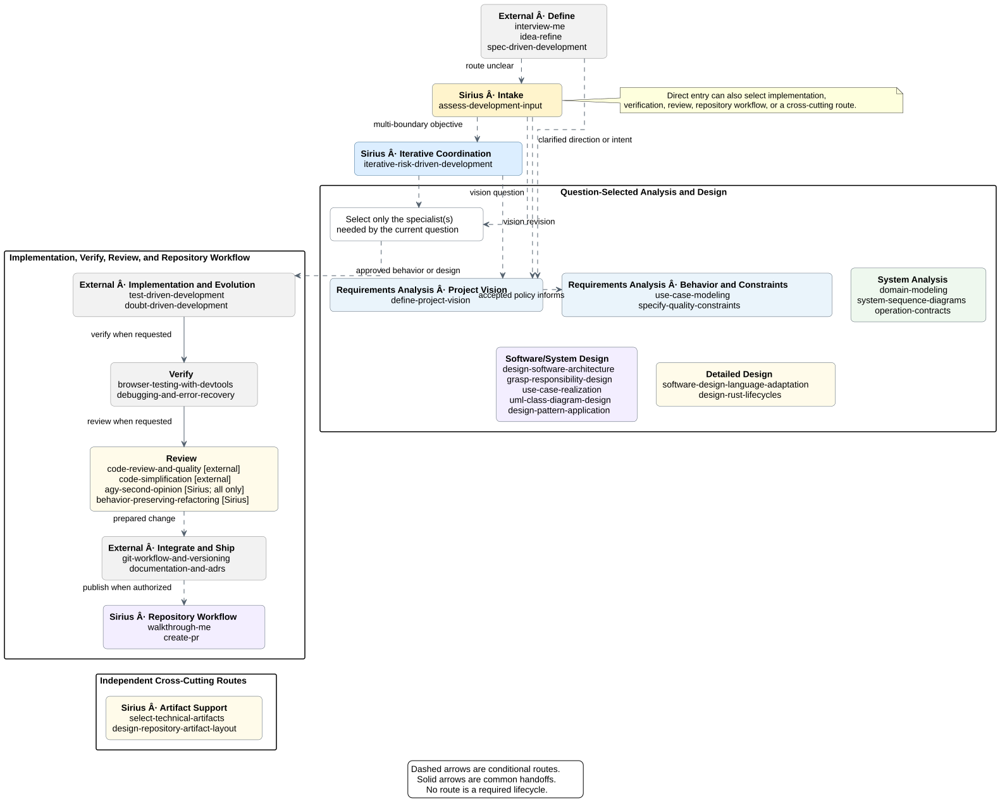

# sirius-skills

`sirius-skills` is a curated collection of development-input assessment,
technical-artifact selection, software architecture and detailed design,
architecture decision documentation, repository artifact layout, interactive
code-change comprehension, repository workflow, iterative implementation, and
evolution skills.
Skills are independently deployable; profiles provide convenient installations
without turning the catalog into a mandatory lifecycle.

## Install

Install the two generic repository workflow skills into a target project by
default:

```bash
just install ~/Projects/sirius-say
```

Install a named profile into the same target project:

```bash
just install ~/Projects/sirius-say iterative-design
just install ~/Projects/sirius-say reverse-engineering
just install ~/Projects/sirius-say all
```

The target project must exist. The default command refreshes shared references
and creates source links under `<target-project>/.agents/skills/`. Changes in
this repository's `skills/` directory are therefore available in the target
without a global reinstall. `just install-local` is an explicit alias with the
same target-project and optional-profile parameters.

Available profiles are defined in [`skill-sets/`](skill-sets/):

| Profile | Purpose |
|---|---|
| `workflow` | Interactive change walkthroughs and pull-request publication |
| `iterative-design` | Entry routing, technical-artifact selection, software architecture design, architecture decision documentation, artifact layout design, question-driven iterations, support-envelope and boundary-sensitive refactoring gates, native responsibility and optional object design, language adaptation, tested implementation, and scoped commits |
| `applying-uml-and-patterns` | Compatibility alias for `iterative-design` |
| `reverse-engineering` | Compatibility profile for technical-artifact selection, artifact placement, and recorded-decision discovery; it does not perform system recovery |
| `all` | Every active Sirius skill in the catalog, plus all pinned external add-ons |

Remove the default or a named profile later:

```bash
just uninstall ~/Projects/sirius-say
just uninstall ~/Projects/sirius-say iterative-design
```

`just uninstall-local` is an explicit alias for the default removal.
Uninstallation removes only target-project links that still point into this
checkout.

Use the explicit global commands when the skills must be available outside
this project:

```bash
just install-global
just install-global iterative-design
just uninstall-global
just uninstall-global iterative-design
```

The `install-packaged` and `uninstall-packaged` compatibility aliases retain
the global behavior and accept the same optional profile. Global installation
uses `npx --yes skills` so the CLI can bootstrap noninteractively for GitHub
Copilot, Codex, Antigravity, and Antigravity CLI. The upstream CLI stores the
shared global skills in `~/.agents/skills`, while Antigravity CLI discovers
global skills in `~/.gemini/config/skills`. Global installation therefore
creates a per-skill compatibility link in the Antigravity directory without
replacing unrelated entries. Global uninstallation and retired-skill cleanup
remove only links that still point to their expected canonical installation.

`just install <target-project> all` also installs the pinned skills listed in
[`catalog/external-skill-sets/`](catalog/external-skill-sets/): 11 add-ons from
Addy Osmani's `agent-skills`, OpenAI's `skill-creator`, and HumanLayer's
`show-me`. They remain external to the Sirius catalog and are not installed by
other profiles. The external install uses the target project's scope for
`just install <target-project> all` and global scope for
`just install-global all`. The matching uninstall command removes the same
external names. Local removal requires each target `skills-lock.json` entry to
match its upstream repository, so a same-named skill from another source is
preserved.

A successful global installation also records its skill names in host-local
state at `$XDG_STATE_HOME/sirius-skills/managed-skills.txt`, or
`~/.local/state/sirius-skills/managed-skills.txt` when `XDG_STATE_HOME` is not
set. Local source links do not use this global ownership state.

## Skill lifecycle and retired installations

A deprecated skill remains in the active catalog and profiles until users have
migration guidance. Once retired, its name is removed from those active
surfaces and appended to the [retirement ledger](catalog/retired-skills.tsv).
The ledger records retired local skills recovered from Git history and later
catalog retirements. External skills installed alongside Sirius are excluded.

Every local install and uninstall first removes retired links that still point
into this checkout. Run that cleanup directly with:

```bash
just prune-retired-local ~/Projects/sirius-say
```

Every global install and uninstall first prunes installed names that are both
in the retirement ledger and in this computer's Sirius ownership state. Run
that safe global cleanup directly with:

```bash
just prune-retired
```

Installations made before ownership state existed cannot be attributed safely:
`npx skills` currently reports their names and paths but no source repository.
The safe command reports matching unowned names without deleting them. After
checking that those names are old Sirius copies rather than same-named skills
from another project, remove them explicitly:

```bash
just prune-retired-legacy
```

The legacy command removes matching global skills by name, so review its
candidates first. Each computer must run updated repository tooling at least
once; one computer cannot remove installations on another computer.

## Catalog and workflow tracks

The [Skill Catalog](catalog/skills.md) describes every skill's responsibility
and boundary. Common compositions are documented as workflow tracks:

- [Repository Workflow](catalog/tracks/repository-workflow.md)
- [Reverse Engineering](catalog/tracks/reverse-engineering.md), for
  compatibility and migration guidance after recovery-skill retirement
- [Iterative Analysis and Design](catalog/tracks/iterative-analysis-design.md)
- [Implementation and Evolution](catalog/tracks/implementation-evolution.md)
- [Client to Code](catalog/tracks/client-to-code.md), from externally validated
  stakeholder input to bounded analysis and implementation

[](catalog/skill-relationships.md)

The [Skill Relationships](catalog/skill-relationships.md) views summarize
normal handoffs and optional feedback paths. The README image renders the
overview; the embedded PlantUML remains its canonical source. Select the
smallest set of skills that addresses the current risk or outcome.

The [subagent review-fix loop](docs/subagent-review-fix-loop.md) shows how a
controller in Pi or Antigravity CLI starts read-only review agents, sends only
merge-required findings to a fixer, starts a fresh review after each fix, and
preserves human control of publication and merge actions. Its PlantUML diagrams
show the role boundaries and iterative handoffs.

Use `assess-development-input` at task intake when the correct owner is unclear,
several skills appear plausible, or an existing input may not be ready. It
routes the first material question to one Sirius skill, external add-on,
repository-native process, or responsible prerequisite without imposing a
lifecycle or executing the handoff. Use `iterative-risk-driven-development`
only after the initial route is known and one approved objective requires
coordinated specialist work.

Use `design-software-architecture` when approved behavior, constraints, and
measurable quality scenarios require decisions about major components, data
owners, interfaces, trust or failure boundaries, deployment, or architecture
trade-offs. Select only the views needed for the current question. Leave
internal responsibility, language, and resource-lifecycle design to their
existing specialists.

Use `select-technical-artifacts` when the primary question is whether technical
knowledge should become a standalone artifact, update or embed in an existing
owner, remain with implementation, be deferred, or be omitted. It applies the
value, ownership, and lifecycle gate and normally returns a read-only minimal
artifact set.

Use `design-repository-artifact-layout` after a justified artifact needs a
canonical home or migration. It preserves coherent local conventions,
separates artifact lifecycles, and recommends the smallest structure with
obvious canonical paths. Recommendations are read-only unless repository
changes are explicitly authorized.

For upstream intent and idea refinement, optionally compose Addy Osmani's
[`interview-me`](https://github.com/addyosmani/agent-skills/blob/5a1b82d6445d1e2f0abeea1072851419a50c0e5c/skills/interview-me/SKILL.md)
and
[`idea-refine`](https://github.com/addyosmani/agent-skills/blob/5a1b82d6445d1e2f0abeea1072851419a50c0e5c/skills/idea-refine/SKILL.md).
`interview-me` confirms what one requester actually wants; `idea-refine`
explores alternatives and produces a confirmed candidate-direction one-pager.
Choose one candidate-direction artifact. Use `docs/ideas/` for an idea
one-pager from `idea-refine`. Use a feature path only when local governance
defines it. Do not create a new proposal artifact. The result remains candidate
input, not organizational approval. Use `assess-development-input` only when
its next Sirius owner is unclear. `just install <target-project> all` or
`just install-global all` provides these two skills as external add-ons; they
are not Sirius catalog entries or named-profile members.

With the `all` installation, use OpenAI's external
[`skill-creator`](https://github.com/openai/skills/blob/49f948faa9258a0c61caceaf225e179651397431/skills/.system/skill-creator/SKILL.md)
when creating or updating a reusable Codex-compatible skill package. It guides
example discovery, resource selection, initialization, concise instruction
writing, script testing, validation, and iteration. It does not make the new
skill part of the Sirius catalog or authorize changes outside the requested
package.

`author-software-proposal` is retired. Existing legacy proposal artifacts
remain valid at their migrated paths. Use `idea-refine` for new candidate
directions. Route unevidenced current-system claims to a responsible external
recovery process, project- or independently sponsored initiative-level scope
and feasibility to `inception`, unresolved stakeholder
authority to the responsible
external process, approved actor goals and scenario flow to `use-case-modeling`,
non-trivial state effects to `operation-contracts`, and placement questions to
`design-repository-artifact-layout`.

`stakeholder-requirements-elicitation`,
`requirements-synthesis-validation`, and `implementation-slice-briefing` are
retired. Existing evidence records, requirements briefs, and implementation
briefs remain valid at their recorded revisions. Gather and validate stakeholder
knowledge through the responsible external process. Use
`assess-development-input` when externally produced material needs a Sirius
readiness decision or entry point. Hand approved behavior or design directly to
the narrowest active analysis skill or repository-native implementation process
with its authority, non-goals, uncertainty, verification, and stop conditions
intact.

`behavior-driven-specification` is retired. Existing behavior specifications
and scenario sets remain valid at their recorded revisions. Keep new approved
examples and boundary cases with their canonical requirement, use case,
contract, or executable test. Use `assess-development-input` when their
readiness or next Sirius owner is unclear. When approved examples already
provide an independent oracle, follow repository-native implementation and
verification guidance.

`test-driven-implementation` is retired. Existing behavior-slice evidence
remains valid at its recorded revision. With the `all` installation, use the
external `test-driven-development` add-on for new logic, bug fixes, and behavior
changes. Use external `browser-testing-with-devtools` when browser behavior
needs real runtime, DOM, console, network, performance, or visual evidence. Use
external `debugging-and-error-recovery` when tests fail, builds break, behavior
does not match expectations, or another unexpected error needs systematic
root-cause analysis. Use `iterative-risk-driven-development` when implementation
needs coordinated analysis, design, verification, or iteration commits.
Otherwise, implement the bounded behavior through the consuming repository's
own workflow.

With the `all` installation, use external `doubt-driven-development` to subject
a non-trivial in-flight claim to fresh-context adversarial review. It can expose
unstated assumptions, hidden coupling, missing environment variation, or an
incomplete contract before the claim stands. Treat those findings as a trigger
to stop for evidence or authority when needed; the skill does not recover an
undocumented current design by itself.

`reverse-engineer-software-system`, `survey-existing-system`,
`recover-system-behavior`, `reconstruct-software-architecture`, and
`reconcile-recovered-design` are retired. Existing surveys, recovered behavior
and architecture, reconciliation records, and fixed-revision evidence remain
valid. Use a responsible external process when current-system behavior or
architecture needs new evidence. Use `assess-development-input` when material
that depends on current-system claims needs a Sirius readiness decision. The
`reverse-engineering` compatibility profile now installs only
`select-technical-artifacts` and `design-repository-artifact-layout` for
artifact disposition and placement.

Use `walkthrough-me` when a reader needs a paced, read-only tour of a pull
request, commit, commit range, branch diff, or staged, unstaged, or selected
untracked worktree changes. It keeps local change sources distinct and groups
the selected diff into a few logical sections. It explains one section with
concise code locators and
waits for explicit confirmation before advancing. It establishes understanding
without approving, committing, or replacing formal code review.

With the `all` installation, use HumanLayer's external
[`show-me`](https://github.com/humanlayer/skills/blob/3c2629142c5d437428269b1b722b08c0b87f574d/plugins/show-me/skills/show-me/SKILL.md)
when the current topic needs a concise visual explanation. It selects the
smallest useful pseudocode, call tree, component or file tree, Mermaid diagram,
diff, code shape, or focused HTML artifact. It complements `walkthrough-me` but
does not replace the walkthrough's revision binding, pacing, or user
checkpoints.

`simplify` is retired. With the `all` installation, use external
`code-review-and-quality` for formal review. Route readability and
local-complexity findings to external `code-simplification`. Route findings
about established responsibility, dependency, variation, or configuration
ownership to `behavior-preserving-refactoring`. Route material boundary
findings to `iterative-risk-driven-development`. A direct, independently
bounded structural request may enter its owner without first passing through
review.

`commit` is retired. With the `all` installation, use the external
`git-workflow-and-versioning` add-on for standalone commits, branches, worktrees,
releases, and semantic versioning. Otherwise, follow repository instructions
directly: review the state and diffs, run proportional checks, stage only
intended paths, and create a message that follows local conventions.
`iterative-risk-driven-development` retains its authorized, scoped commit step
for work executed as an iteration.

`record-architecture-decision` is retired. Existing ADRs and decision
inventories remain valid at their recorded revisions. With the `all`
installation, use external `documentation-and-adrs` for significant technical
decisions and durable documentation. Preserve repository ADR conventions,
identifier rules, authority, status, history, and supersession. For other
profiles, follow repository-native ADR guidance. Keep local pattern and
responsibility choices in their owning design artifacts unless they need an
independent architecture-decision lifecycle.

The [repository structure and skill-relationship comparison](catalog/agent-skill-repository-structures.md)
uses PlantUML views to show how two related projects organize skill authoring,
orchestration, distribution, runtime support, verification, and workflow
handoffs.

## Repository conventions

`create-pr` follows explicit repository-specific title, identifier, and tracker
rules from the nearest applicable `AGENTS.md`. Standalone Git commits must also
follow the nearest applicable repository instructions directly. Shared skills
remain generic; consuming repositories own their local conventions in
`AGENTS.md`.

`governance-update` is retired. When repeated examples reveal a durable policy
gap, directly ask the agent to update the nearest applicable `AGENTS.md` with
the narrowest enforceable rule. Avoid duplicating guidance or codifying a
one-off incident.

## Design artifacts and sources

The iterative-design collection uses
`iterative-risk-driven-development` for approved, risk-sized objectives. It
selects requirements, analysis, native responsibility, design, language,
implementation, verification, and optional Rust lifecycle specialists from the
current question and implementation forces. It rechecks the canonical owner,
revision, lifecycle status, and authority of material intent when enabling
evidence gains reuse or a new consumer. Code, tests, observations, and
historical iteration records remain evidence until an owning requirements or
design specialist validates their intended status. When behavior varies by
identity, type, version, platform, provider, capability, or operating mode, the
support-envelope gate distinguishes one variant, a family, a closed catalog,
pattern-matched support, and dynamically extensible support. It checks sibling
and fallback paths, cross-mode capability sources, explicit exclusions,
representative coverage, and the parent completion boundary without guessing
or requiring a standalone matrix. For boundary-sensitive refactorings, the
coordinator retains the system boundary, representative vertical scenario,
native responsibilities, ownership consequences, verification ownership, and
parent completion boundary before implementation. It evolves canonical
artifacts and executes the work. When the user requests one commit per
iteration, it continues by default until the requested work is complete.

Selected use cases, domain models, system sequence diagrams, contracts,
realizations, design class diagrams, and language-specific designs remain
durable knowledge refined across iterations. The collection preserves
established repository layouts and applies an artifact-selection budget before
creating a standalone document. The budget prefers executable evidence and
existing canonical artifacts, and requires new files to demonstrate value,
distinct ownership, and an independent lifecycle. A narrow iteration can rely
on canonical changes and its commit instead of creating a separate iteration
record. Artifact selection and its detailed budget live in
`select-technical-artifacts`; repository-placement guidance lives in
`design-repository-artifact-layout`; Markdown frontmatter guidance remains a
reference owned by `iterative-risk-driven-development`, and artifact prose
uses STE-style.

When a justified standalone artifact lacks a clear home or the repository has
no usable placement guide, artifact-layout design derives the smallest home
from local evidence. Missing guidance does not require a layout document,
generic taxonomy, or empty directory tree.

The optional analysis and object-design skills distill workflows from Craig
Larman's *Applying UML and Patterns*. GRASP responsibility design also accepts
language-native modules, functions, tasks, adapters, resource handles, and
composition roots without forcing class-shaped owners. General language
adaptation covers Rust, Python, TypeScript, C#, and C++, while Rust lifecycle
design realizes established system behavior and responsibilities through
ownership-driven preparation, resource transfer, rollback, cancellation,
supervision, and fallible cleanup. A local seam can complete an iteration, but
it remains an enabling result until a representative end-to-end flow proves the
parent outcome. See the [Source Catalog](catalog/sources.md) for provenance.

## Validation

Validate skill structure, profile membership, shared references, catalogs, and
collection-specific contracts. This also runs the free deterministic routing
evals:

```bash
just validate
pytest -q
```

Run only the routing evals while authoring skill descriptions or eval cases:

```bash
just eval-routing
```

See [Skill Evals](evals/README.md) for the case format, current pilot coverage,
and the boundary between deterministic routing checks and model-executed
behavioral evals. Behavioral execution, its optional non-gating semantic judge,
and judge calibration are opt-in and never run as part of normal validation.

## Repository layout

- `skills/*/SKILL.md`: deployable agent workflows
- `skill-sets/*.txt`: canonical installation profiles
- `catalog/external-skill-sets/`: source-specific pinned membership for external add-ons
- `catalog/skills.md`: skill responsibilities and boundaries
- `catalog/skill-relationships.svg`: README overview rendered from the
  canonical embedded PlantUML
- `catalog/retired-skills.tsv`: append-only retired-name tombstones with Git
  evidence revisions
- `catalog/agent-skill-repository-structures.md`: comparative PlantUML views of
  related skill repositories and their documented workflow handoffs
- `catalog/tracks/*.md`: optional workflow compositions
- `catalog/sources.md`: intellectual and repository provenance
- `evals/`: deterministic routing cases and opt-in behavioral evaluation data
- `docs/shared/`: canonical references copied into self-contained skills
- `docs/ideas/`: candidate-direction documents, implementation rationale, and
  historical iteration records
- `scripts/validate_skills.sh`: catalog and collection validation
- `src/sirius_skills/commands/sync_shared_references.py`: packaging helper
- `src/sirius_skills/commands/manage_installed_skills.py`: host ownership,
  Antigravity compatibility links, and retired-installation reconciliation

## Consolidation history

The iterative software design collection was consolidated into this repository
with its Git history preserved. Sirius's former spec-driven development runtime
and planning artifacts are not part of the active distribution; the annotated
tag `pre-consolidation-2026-08-04` preserves the repository immediately before
this consolidation.
