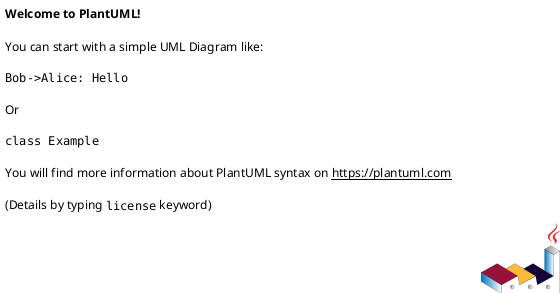

### Basic Structure
All PlantUML diagrams must begin with `@startuml` and end with `@enduml`.



### Participants & Actors
*   `actor User`
*   `participant "LoginService" as LS`
*   Other components: `boundary`, `control`, `entity`, `database`, `collections`, `queue`

### Message Arrows (Sequence Diagrams)
Arrows show the direction of interaction.

*   `User -> LS : login(username, password)` (Solid arrow)
*   `LS --> User : success/failure` (Dotted arrow)
*   `->x` : Lost message
*   `->>` : Thin drawing
*   `--o` : Dotted arrow with circle head
*   `<-` : Bidirectional arrow
*   You can use `\` or `/` instead of `<` or `>` for partial arrow heads.

### Common Diagram Elements

#### Use Case Diagrams
*   `actor Admin`
*   `usecase "Add Product" as UC1`
*   `Admin --> UC1`

#### Class Diagrams
*   Define classes with attributes and methods.
*   `class Product { +id: int +name: string +getPrice(): float }`
*   **Relationships:**
    *   `A -- B` : Association
    *   `A <|-- B` : Inheritance (Specialization)
    *   `A <|.. B` : Implementation (Realization of an interface)
    *   `A *-- B` : Composition (Part cannot exist without the whole)
    *   `A o-- B` : Aggregation (Part can exist independently)
    *   `A ..> B` : Dependency
*   `hide empty members` : Hides empty attributes or methods.

#### Activity Diagrams
*   `start`
*   `:Action;`
*   `if (Condition?) then (yes)`
*   `else (no)`
*   `endif`
*   `stop`

#### Component Diagrams
*   `component "UI"`
*   `component "API"`
*   `UI --> API : calls REST endpoints`

### Styling and Customization
*   **Multiline Text:** Use `[ ]` for multiline text in components.
    ```plantuml
    node mynode [
        several lines
        ====
        of
        text
    ]
    ```
*   **Notes:**
    ```plantuml
    note right of LS
        This is a note.
    end note
    ```
*   **Skin Parameters (`skinparam`):** Customize appearance (e.g., `BackgroundColor`, `BorderColor`, `FontColor`).
    ```plantuml
    skinparam node {
        BackgroundColor transparent
        BorderColor black
    }
    ```
*   **Sprites/Icons:** Include custom icons using `!include` or `!includeurl`.
    ```plantuml
    !include <font-awesome/common>
    FA_COGS(c1, work) #white
    ```
