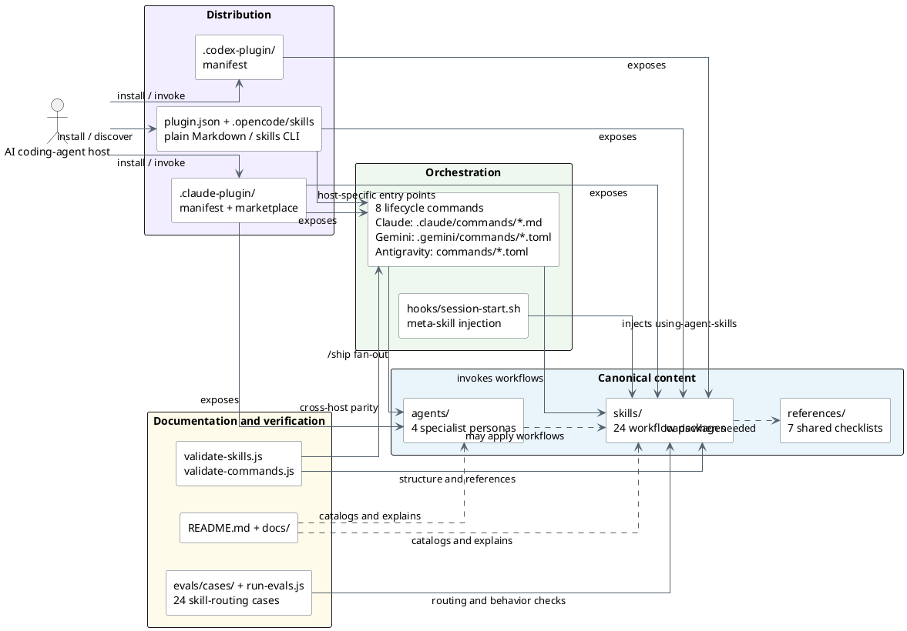
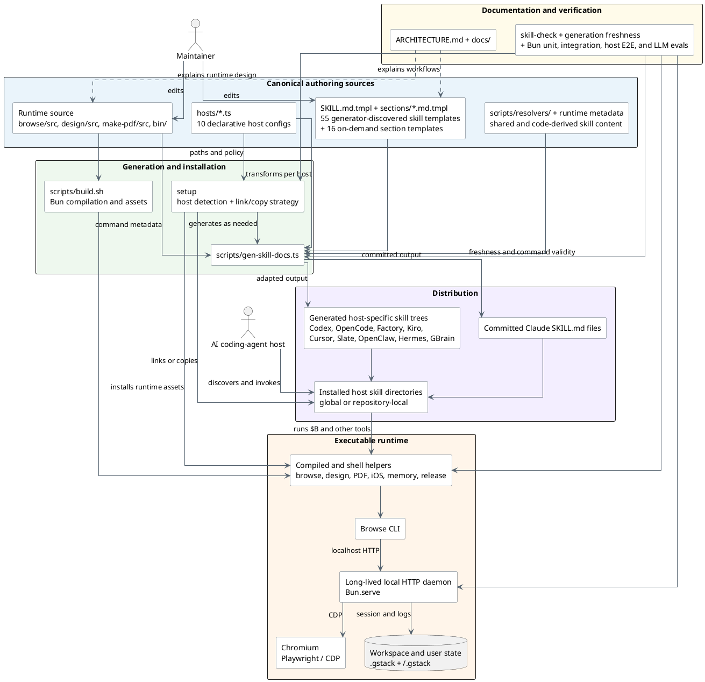
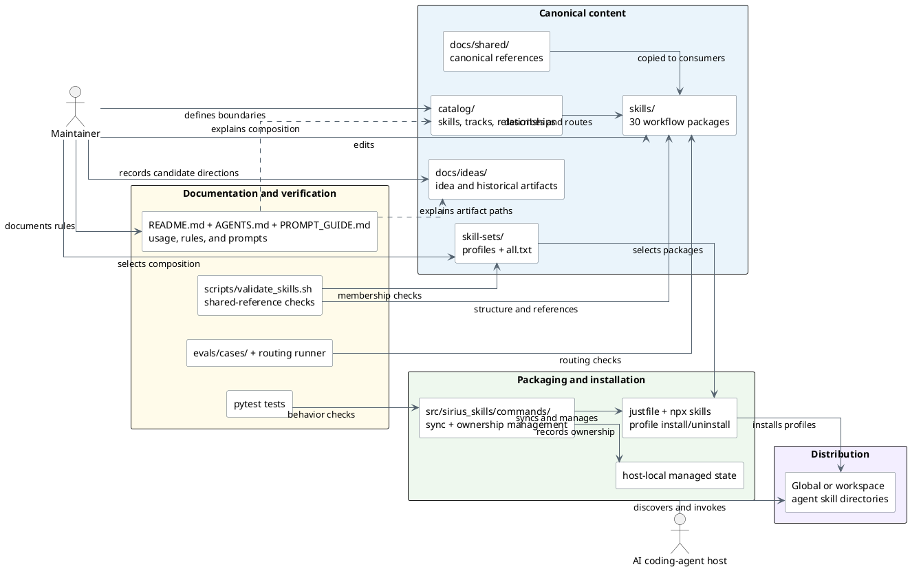
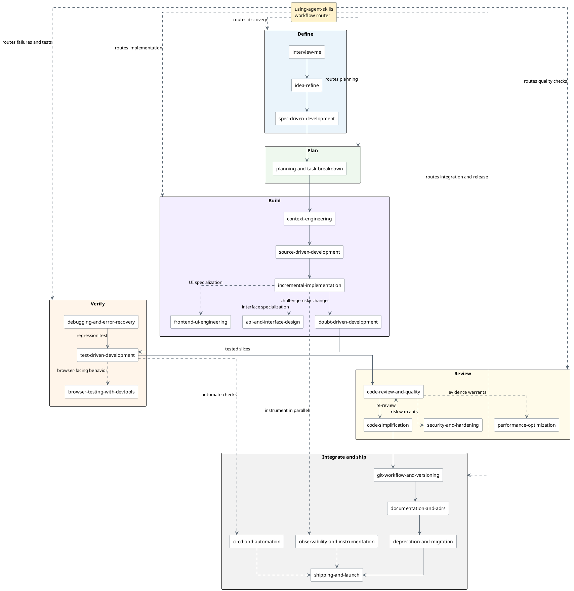
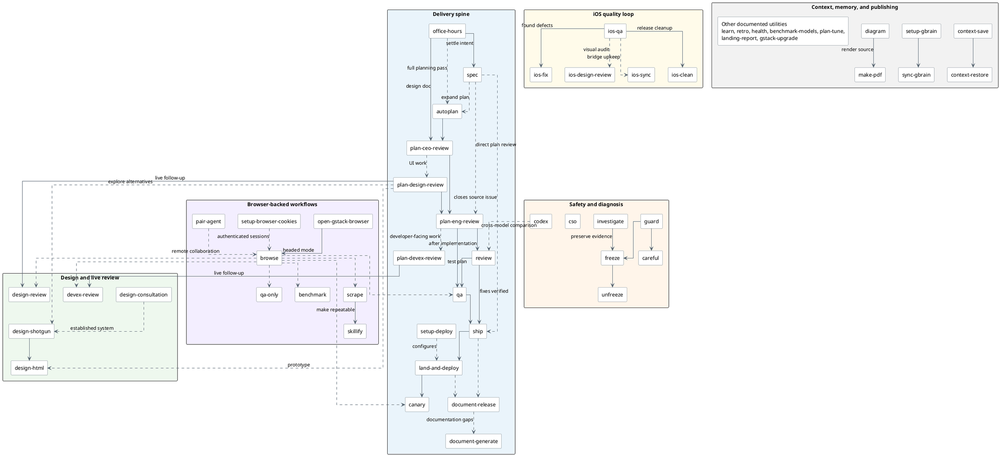
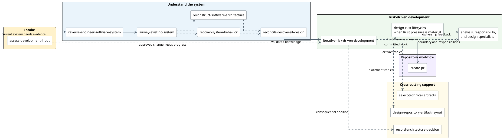

# Agent-Skill Repository Structure and Relationship Comparison

## At a glance

These repositories all distribute agent skills, but each repository plays a
different role:

- `addyosmani/agent-skills` is a hand-authored, multi-host content bundle. Its
  skills, commands, personas, hooks, and checklists are separate composable
  layers.
- `garrytan/gstack` is both a generated skill distribution and an executable
  product. Templates and host configuration produce skill documents that call
  browser, design, document, memory, and installation runtimes.
- `sirius-skills` is a profile-driven collection of independently deployable
  workflow skills. Its catalog, tracks, shared references, installers, and
  tests govern how the skills compose. It has no product runtime.

The same `SKILL.md` shape therefore hides different change surfaces. Addy's
structure emphasizes host adapters. gstack emphasizes generation and runtime
coupling. Sirius emphasizes catalog boundaries, profile ownership, and
risk-sized workflow composition.

## Question, scope, and notation

The architectural questions are: **How does each repository separate canonical
skill authoring, orchestration, distribution or runtime support, and
verification?** And: **How do its documented skills hand off work to one
another?** The diagrams use those common views so their differences are
comparable.

The source trees and documentation were inspected read-only at the revisions in
the frontmatter. Each checkout was clean and its local `main` matched its local
`origin/main` tracking reference. No network fetch was performed, so “current”
means the local revision recorded here, not an assertion about the latest remote
commit.

In the three structural diagrams:

- a solid arrow is a direct generation, packaging, invocation, or runtime path;
- a dashed arrow is supporting content, policy, or an optional path;
- blue packages contain canonical authoring sources;
- green packages contain orchestration or transformation;
- purple packages contain distribution surfaces;
- orange packages contain executable runtime elements; and
- yellow packages contain documentation or verification surfaces.

## Addy Osmani's `agent-skills`

The canonical unit is a hand-authored skill directory. Host-specific commands
sit above the skill catalog, while specialist personas provide an independent
review role that commands such as `/ship` can fan out to. Plugin manifests and
plain-directory integrations expose the same underlying content to several
agent hosts.

## Garry Tan's `gstack`

The canonical skill prose lives in templates, not the committed generated
`SKILL.md` files. A generator combines those templates with shared resolvers,
runtime command metadata, and declarative host configuration. The installed
skills then call executable helpers; the persistent Chromium daemon is the
largest runtime collaboration but not the only compiled tool in the repository.

## Sirius skills

The canonical unit is an independently deployable `skills/<name>/` package.
Profiles select convenient combinations. The catalog and tracks define
responsibilities and handoffs. Shared references have one source under
`docs/shared/` and are copied into the packages that use them. Installation
uses the profiles and host-skill tooling; the package has no product runtime.

## Structural comparison

| Dimension | `addyosmani/agent-skills` | `garrytan/gstack` | `sirius-skills` |
|---|---|---|---|
| Canonical authoring unit | Hand-authored `skills/<name>/SKILL.md` package | `SKILL.md.tmpl` plus generated sections, resolvers, code metadata, and host configuration | Hand-authored `skills/<name>/SKILL.md` package plus profile, catalog, and track guidance |
| Primary organizing axis | Software-delivery phase, supplemented by personas and commands | Specialist workflow/tool at the repository root | Risk-sized questions, workflow tracks, and profile composition |
| Orchestration | Lifecycle commands select skills; `/ship` fans out to personas | Generated skill prose embeds shared preambles and tool instructions; skills invoke runtime helpers | Content-based intake, recovery and discovery tracks, and one risk-driven development coordinator |
| Cross-host strategy | Parallel command formats and several plugin/directory adapters over one skill catalog | Typed host configurations transform content, frontmatter, paths, tools, metadata, and installation behavior | Profiles install selected packages through `npx skills`; shared references are synchronized into consuming packages |
| Executable runtime | Light: validation/eval scripts, hooks, and one optional skill helper | Heavy: compiled TypeScript and shell tools, a persistent browser daemon, browser extension, local state, remote pairing, and other product subsystems | No product runtime; packaging, ownership, synchronization, and validation commands support the skill collection |
| Publication boundary | The active catalog is broadly distributed; command variants are kept in parity | Host configurations can include, skip, rewrite, or suppress skill content per host | `skill-sets/all.txt` and named profiles own active membership; host-local state records successful ownership |
| Checked verification surface | Skill schema/reference checks, command parity checks, deterministic routing cases, and optional behavioral evals | Generated-file freshness, skill command validation, unit/integration tests, host E2E tests, and LLM evaluation tiers | `just validate`, `pytest`, deterministic routing evals, catalog/profile checks, and managed-installation tests |
| Main extension seam | Add a skill, persona, reference, hook, or synchronized command adapter | Add or change a template, resolver, host config, runtime component, or test tier | Add a skill specialist, profile/catalog/track boundary, shared reference, packaging rule, or focused eval |

### Interpretation

The following conclusions are inferences from the structures above rather than
statements of project intent:

1. **Addy Osmani's repository favors explicit composition.** Skills, commands,
   personas, and references can evolve independently, while validators carry
   the cost of keeping mirrored host commands synchronized.
2. **gstack favors centralized adaptation.** Its generator and typed host
   configuration reduce manual host-by-host editing, but the generator, setup
   system, runtime assets, and tests form a much larger coupled change surface.
3. **Sirius favors profile-driven composition.** Its skills remain small and
   independently deployable, while the catalog, profiles, shared references,
   installation tooling, and verification surfaces keep the collection
   coherent. It has less runtime coupling than gstack and more catalog and
   packaging governance than Addy's bundle.

## Skill relationship views

These are workflow maps, not source-code dependency graphs. A solid arrow means
a documented normal sequence or handoff. A dashed arrow means an optional route,
a reusable discipline, or runtime support. The Addy Osmani view shows all 24
skills. The gstack view stays bounded to documented handoffs and names isolated
utilities without inventing relationships for them. The Sirius view shows its
intake, recovery, discovery, risk-driven development, and repository-workflow
boundaries without repeating every specialist edge.

### Addy Osmani: lifecycle router and delivery path

`using-agent-skills` is the catalog router. Its documented full-project path
provides the central spine; specializations and quality passes attach where the
task or risk calls for them. The shorter bug-fix path rejoins the spine at
test-driven development and review.

### Garry Tan: delivery spine and specialist clusters

gstack documents a delivery spine from product thinking through planning,
review, QA, shipping, deployment, and monitoring. `autoplan` orchestrates the
planning reviews. Browser-backed, design, safety, iOS, memory, and publishing
skills form reusable clusters around that spine.

### Sirius: intake to risk-driven delivery

Sirius uses content-based intake and a separate recovery track. A single
risk-driven coordinator selects the needed specialists, including native
responsibility design and the Rust lifecycle specialist when ownership or
resource semantics create material pressure. For boundary-sensitive
refactorings, the coordinator retains the system boundary, representative
vertical oracle, responsibility assignment, ownership consequences,
verification ownership, and parent completion boundary. The same coordinator
owns implementation, verification, continuous iteration, and
one-commit-per-iteration execution.

## Skill-relationship comparison

| Dimension | `addyosmani/agent-skills` | `garrytan/gstack` | `sirius-skills` |
|---|---|---|---|
| Primary router | `using-agent-skills` selects a lifecycle skill | `autoplan` sequences planning reviewers; several other skills orchestrate specialist clusters | `assess-development-input` routes by content; tracks and the risk-driven coordinator manage handoffs |
| Main delivery shape | A mostly linear define-plan-build-verify-review-ship spine with optional specializations | A product-delivery spine surrounded by tool-backed design, browser, safety, deployment, and platform loops | Intake, recovery, risk-driven development, and repository workflow; each risk-sized iteration can continue until the requested work is complete |
| Reuse mechanism | Phase-specific skills are composed by commands and selected when risk warrants | Skills invoke other skills and shared executable runtimes; plan artifacts are handed to later skills | Skills link to narrow specialists, profiles compose packages, and shared references are packaged into consuming skills |
| Feedback loops | Debugging returns to regression testing; simplification returns to review | Live design/DevEx review follows planning; QA and canary feed fixes back before or after shipping | Recovery reconciliation, ownership-to-responsibility feedback, parent-outcome checks, design/implementation feedback, and continuous iteration return evidence to canonical artifacts |
| Relationship authority | Explicit routing and example sequences in the meta-skill and command docs | README sprint model plus orchestration encoded in generated skill templates | Catalog, workflow tracks, skill boundaries, and profile membership |
| Coverage choice here | All 24 skills | Documented connected workflows plus named independent utilities; not an exhaustive catalog | All 26 active skills, with bounded tracks and profile-driven installation |

## Evidence and limits

| Repository | Primary structural and relationship evidence | Claim status |
|---|---|---|
| `addyosmani/agent-skills` | [`README.md` project structure](https://github.com/addyosmani/agent-skills/blob/98967c45a42b88d6b8fb3a88b7ff6273920763d6/README.md#L323-L359), [`using-agent-skills` router](https://github.com/addyosmani/agent-skills/blob/98967c45a42b88d6b8fb3a88b7ff6273920763d6/skills/using-agent-skills/SKILL.md), [`AGENTS.md` composition rules](https://github.com/addyosmani/agent-skills/blob/98967c45a42b88d6b8fb3a88b7ff6273920763d6/AGENTS.md), [Claude plugin manifest](https://github.com/addyosmani/agent-skills/blob/98967c45a42b88d6b8fb3a88b7ff6273920763d6/.claude-plugin/plugin.json), [command validator](https://github.com/addyosmani/agent-skills/blob/98967c45a42b88d6b8fb3a88b7ff6273920763d6/scripts/validate-commands.js), and [eval runner](https://github.com/addyosmani/agent-skills/blob/98967c45a42b88d6b8fb3a88b7ff6273920763d6/scripts/run-evals.js) | Structural and relationship claims corroborated, high confidence, current at recorded revision |
| `garrytan/gstack` | [`ARCHITECTURE.md`](https://github.com/garrytan/gstack/blob/7c9df1c568a9ea745508f679a329332b2c338063/ARCHITECTURE.md), [`README.md` sprint model](https://github.com/garrytan/gstack/blob/7c9df1c568a9ea745508f679a329332b2c338063/README.md), [`autoplan` template](https://github.com/garrytan/gstack/blob/7c9df1c568a9ea745508f679a329332b2c338063/autoplan/SKILL.md.tmpl), [skill generator](https://github.com/garrytan/gstack/blob/7c9df1c568a9ea745508f679a329332b2c338063/scripts/gen-skill-docs.ts), [host registry](https://github.com/garrytan/gstack/blob/7c9df1c568a9ea745508f679a329332b2c338063/hosts/index.ts), and [host configuration contract](https://github.com/garrytan/gstack/blob/7c9df1c568a9ea745508f679a329332b2c338063/scripts/host-config.ts) | Structural claims high confidence; relationship view bounded to explicit handoffs and support paths, current at recorded revision |
| `sirius-skills` | [`README.md`](../README.md), [`AGENTS.md`](../AGENTS.md), [`catalog/skills.md`](skills.md), [`catalog/skill-relationships.md`](skill-relationships.md), [`skill-sets/all.txt`](../skill-sets/all.txt), [`scripts/validate_skills.sh`](../scripts/validate_skills.sh), [`src/sirius_skills/commands/`](../src/sirius_skills/commands/), and [`tests/`](../tests/) | Structural and relationship claims corroborated, high confidence, current at recorded revision `1420ab1` |

This compares repository modules, distribution boundaries, and documented
workflow relationships; it does not claim observed runtime behavior. No
installer, agent host, browser daemon, paid evaluation, or external service was
executed. Generated, dependency, vendor, build-output, and runtime-state trees
were excluded except where their existence defines an architectural boundary.
