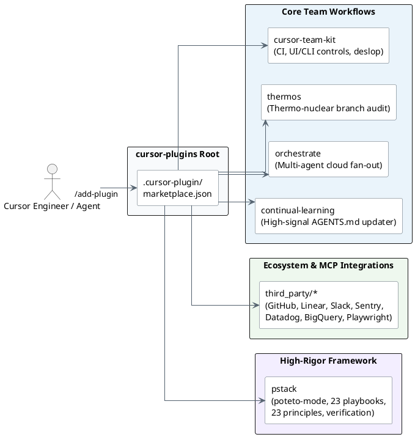
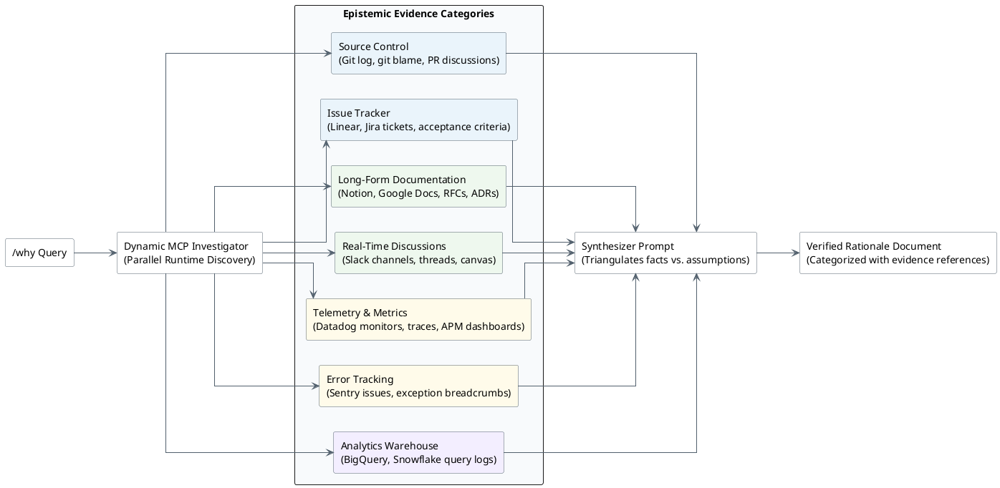
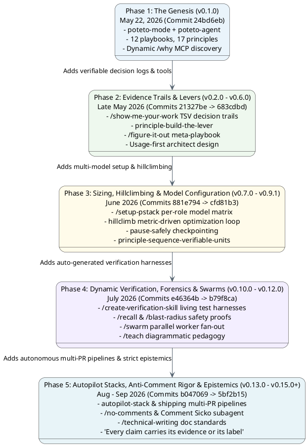
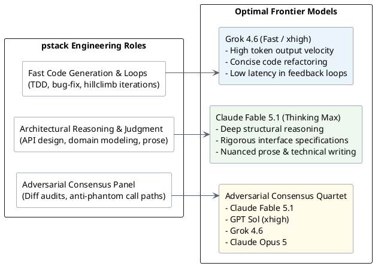

# pstack Architecture & Evolutionary Analysis

## At a glance

`pstack` is an opinionated, high-rigor engineering framework authored by Lauren Tan ([`@poteto`](https://x.com/poteto), React Core Team member and Cursor engineer), distributed as a primary plugin within the [`cursor-plugins`](https://github.com/cursor/cursor-plugins) marketplace repository.

Unlike conventional coding-agent harnesses that optimize for raw lines of code (LOC) and throughput, `pstack` is explicitly designed around the thesis: **"If you want to go fast, go deep first."** It addresses the failure mode of agentic "code slop" by formalizing **Fearless Parallelism**—the premise that engineers can only reliably parallelize autonomous agents when single-agent execution is constrained by mathematically sound domain modeling, empirical verification, usage-first design, and adversarial multi-model review.

As of September 2026 (`v0.15.0+`), `pstack` has evolved from an initial workflow router into a comprehensive engineering operating system consisting of:
- **1 Entry Mode Router & Subagent**: `/poteto-mode` (sticky turn-persistent router) and `poteto-agent`.
- **23 Specialized Playbooks**: Deterministic, phased engineering workflows covering forensics, refactoring, feature slicing, hillclimbing, and multi-PR stack automation.
- **23 Standalone First Principles**: Invariant architectural and verification heuristics that prevent agent drift and enforce structural encoding over prose comments.
- **Dynamic MCP Epistemic Engine**: The `/why` discovery system that probes running MCP servers at execution time across seven evidence categories.
- **Autonomous Multi-Model Routing**: Dynamic assignment of specialized frontier models (Grok 4.6 for speed and code generation; Claude Fable 5.1 for deep reasoning, judgment, and prose; GPT Sol xhigh and Opus 5 for adversarial critique panels).

---

## 1. Ecosystem Context: `cursor-plugins`

The parent repository at `~/Github/cursor-plugins` was initialized on **January 22, 2026** by Cursor engineers (Eric Zakariasson, Sam Sokolin, Erik Nilsson) to serve as the unified marketplace and runtime container for Cursor agent extensions.

Within this repository:
1. **Core Team Workflows**: Provide foundational CLI and UI harness capabilities (`cursor-team-kit`), cloud agent fan-out (`orchestrate`), and memory updates (`continual-learning`).
2. **Third-Party MCP Integrations**: Provide standard tool wrappers for external platforms.
3. **`pstack`**: Sits as a self-contained, high-rigor engineering methodology that orchestrates these capabilities without locking users into brittle vendor dependencies.

---

## 2. Core Architecture of `pstack`

`pstack` enforces a strict separation between **task intent**, **workflow execution**, **invariants**, and **model capabilities**.

```plantuml
@startuml pstack-operational-architecture
top to bottom direction

skinparam backgroundColor #FFFFFF
skinparam shadowing false
skinparam packageStyle rectangle
skinparam componentStyle rectangle
skinparam linetype ortho
skinparam defaultFontName Arial
skinparam ArrowColor #52606D
skinparam component {
  BackgroundColor #FFFFFF
  BorderColor #52606D
}

package "Entry Layer" #EAF4FB {
  component "Task Prompt / Request" as userPrompt
  component "Router: /poteto-mode\n(Sticky Mode across turns)" as potetoMode
  component "Subagent: poteto-agent\n(Full-context execution wrapper)" as potetoAgent
}

package "Workflow Layer: 23 Playbooks" #EEF8EE {
  component "Forensics & Investigation\n(investigation, runtime/trace forensics)" as pbForensics
  component "Execution & Refactoring\n(feature, bug-fix, refactoring, prototype)" as pbExecution
  component "Optimization\n(perf-issue, hillclimb metric loops)" as pbOptimization
  component "Autopilot & Shipping\n(autopilot-stack, shipping, babysit, opening-a-pr)" as pbAutopilot
  component "Meta & Slicing\n(figure-it-out, multi-phase-plan, pause-safely)" as pbMeta
}

package "Invariant Layer: 23 First Principles" #FFFBEA {
  component "Core Invariants\n(laziness-protocol, build-the-lever,\nfoundational-thinking, attack-the-premise)" as pCore
  component "Architecture Invariants\n(model-the-domain, boundary-discipline,\ntype-system-discipline, make-operations-idempotent)" as pArch
  component "Verification Invariants\n(prove-it-works, fix-root-causes,\nsequence-verifiable-units, test-behavior-not-impl)" as pVerif
  component "Meta & Delegation\n(encode-lessons-in-structure, guard-the-context)" as pDelegation
}

package "Verification & Guardrail Tools" #F3EEFF {
  component "Living Verification Suites\n(/create-verification-skill,\n/maintain-verification-skill)" as verifSkills
  component "Evidence & Decision Trails\n(/show-me-your-work TSV log,\n/blast-radius empirical proof)" as auditTrails
  component "Comment Sicko & /no-comments\n(Anti-comment rot & type encoding)" as commentSicko
}

package "Multi-Model Execution Matrix (/setup-pstack)" #F1F5F9 {
  component "Grok 4.6 (Fast / xhigh)\nCode generation, TDD, hillclimb" as modelGrok
  component "Claude Fable 5.1 (Thinking Max)\nArchitecture, judgment, prose" as modelFable
  component "Consensus Review Panel\nFable + Sol xhigh + Grok + Opus 5" as modelPanel
}

userPrompt --> potetoMode
userPrompt --> potetoAgent
potetoMode --> pbForensics
potetoMode --> pbExecution
potetoMode --> pbOptimization
potetoMode --> pbAutopilot
potetoMode --> pbMeta

pbForensics ..> pCore : governed by
pbExecution ..> pArch : governed by
pbOptimization ..> pVerif : governed by
pbAutopilot ..> pDelegation : governed by

pbExecution --> modelGrok : fast code loops
pbMeta --> modelFable : deep analysis
pbExecution --> verifSkills : verify behavior
pbExecution --> auditTrails : log decisions
pbAutopilot --> commentSicko : strip slop comments
pbAutopilot --> modelPanel : adversarial audit
@enduml
```

### The Three Operational Pillars

1. **Deterministic Sizing & Routing**: The `/poteto-mode` command parses the request, matches it against the 23 playbooks, and immediately generates a todo checklist containing the verbatim steps of that playbook. It remains "sticky" across turns until explicitly dismissed.
2. **Build the Lever**: Whenever work involves non-trivial execution, migrations, or data audits, the agent is forbidden from editing by hand. Instead, it must write a script, codemod, generator, or subagent instruction file. The script is the verifiable artifact that reviewers audit and re-run.
3. **Usage-First Architecture**: When creating APIs or modifying boundaries (`/architect`), the agent must define the caller's usage pattern as the binding specification before writing internal implementations.

---

## 3. Dynamic MCP Discovery: The `/why` Epistemic Engine

A distinctive architectural innovation in `pstack` is its zero-configuration approach to institutional context. Rather than hardcoding connections to project trackers, `pstack`'s `/why` skill probes available MCP servers at runtime and maps their tools into seven distinct epistemic categories.

---

## 4. Chronological Evolution of `pstack`

Tracing git commits across `cursor-plugins` reveals five clear evolutionary phases:

### Phase 1: The Genesis (`v0.1.0` — May 22, 2026)
* **Initial Drop (Commit `24bd6eb`)**: Authored by Lauren Tan (`lauren@anysphere.co`).
* **Initial Capabilities**: Introduced `poteto-mode` with 12 foundational playbooks (`investigation`, `bug-fix`, `perf-issue`, `feature`, `prototype`, `visual-parity`, `autonomous-run`, `multi-phase-plan`, `opening-a-pr`, etc.).
* **17 First Principles**: Encapsulated senior engineering heuristics (`laziness-protocol`, `foundational-thinking`, `boundary-discipline`, `type-system-discipline`, `prove-it-works`, `fix-root-causes`).
* **Dynamic Epistemics**: Shipped `/why` with zero hardcoded service dependencies, querying active MCP servers on demand.

### Phase 2: Evidence Trails & "Build the Lever" (`v0.2.0` – `v0.6.0` — Late May 2026)
* **Auditable Decision Logging**: Added `/show-me-your-work` (`35f3392`, `11ecc12`). Logs all agent hypotheses and choices to a committable TSV file, hardened against spreadsheet formula injection, followed by cross-model review of the trail (`47f3df8`).
* **Meta-Playbook Engine**: Added `/figure-it-out` (`35f3392`) to dynamically synthesize custom, auditable playbooks when a problem does not match pre-packaged flows.
* **The "Build the Lever" Invariant**: Added `principle-build-the-lever` (`7b1c32e`, `65f4dac`, `ba7781c`), prohibiting manual line edits for non-trivial migrations or refactorings in favor of runnable scripts.
* **Binary Search Bug Fixing**: Upgraded the `bug-fix` playbook with binary-search hypothesis loops, synthetic reproductions, and `/loop` integration (`8d7ca26`).
* **Usage-First Design**: Updated `/architect` (`0fe5b8a`) to mandate specifying caller usage before implementing internal abstractions.

### Phase 3: Sizing, Hillclimbing & Model Configuration (`v0.7.0` – `v0.9.1` — June 2026)
* **Per-Role Model Configuration**: Introduced `/setup-pstack` (`6605d7a`), allowing users to configure which LLM executes which role (fast composer vs. deep reasoning vs. review panels).
* **The Hillclimb Engine**: Added the `hillclimb` playbook (`b64f02a`, `cfd81b3`) for empirical, metric-driven optimization loops against an established baseline, committing exactly one unit per verified win.
* **Suspension Checkpoints**: Added `pause-safely` (`2f3a47e`) to cleanly checkpoint in-flight context, uncommitted diffs, and open tasks when work must be paused.
* **Work De-risking**: Added `principle-sequence-verifiable-units` (`27daaa3`), requiring work to be partitioned into small steps that each end in an objectively verifiable state.

### Phase 4: Dynamic Verification, Forensics & Swarms (`v0.10.0` – `v0.12.0` — July 2026)
* **Living Verification Suites**: Added `/create-verification-skill` and `/maintain-verification-skill` (`e42d29f`, `6714489`, `4483dcd`). Agents generate repository-local verification scripts and feature maps, ensuring that behavioral claims are grounded in executable tests rather than markdown assertions.
* **Safety & Blast Radius**: Added `/blast-radius` (`e46364b`) to empirically trace affected call-sites and `/recall` (`e46364b`) to rebuild task context from past conversation history.
* **Parallel Swarms**: Added `/swarm` (`b79f8ca`), enabling parallel fan-out across multiple repository packages with unified reporting.
* **Step-by-Step Pedagogy**: Added `/teach` (`8f008c4`), weaving `how` and `why` into diagrammatic, progressive explanations.
* **Specialized Routing**: Composer slots routed to Grok 4.5 (`dc2fae6`), complex reasoning to Claude Fable 5 (`9b80b53`), and multi-model panels to Fable, Sol, Grok, and Opus 5 (`e1007b1`, `d45ad02`).

### Phase 5: Autopilot Stacks, Anti-Comment Rigor & Epistemics (`v0.13.0` – `v0.15.0+` — August – September 2026)
* **Autonomous Multi-PR Pipelines**: Added `autopilot-full`, `autopilot-stack`, and `shipping` (`b047069`, `99559f2`) to autonomously rebase, resolve CI, and land stacked pull requests bottom-up.
* **Anti-Comment Rot ("Comment Sicko")**: Added `/no-comments` and the `Comment Sicko` subagent (`b047069`). Enforces stripping superficial AI explanations, requiring constraints to be expressed via types, assertions, or lint rules (`principle-encode-lessons-in-structure`).
* **Writing Standards**: Added `/technical-writing` (`b047069`) based on Diátaxis, Simplified Technical English, and Google Developer style, and `/bro` (`99559f2`) for plain-language translation.
* **Epistemic Strictness**: Standardized the core doctrine: *"Every claim carries its evidence or its label"* (`f8abedd`). Upgraded `/setup-pstack` with reasoning budget gates (`max`, `xhigh`, `high`, `medium`) (`5bf2b15`).

---

## 5. Complete Inventory: 23 Playbooks & 23 Principles

### The 23 Playbooks

| Category | Playbook | Purpose |
|---|---|---|
| **Analysis & Forensics** | `investigation` | Read-only analysis of codebases, architectures, and historical decisions. |
| | `runtime-forensics` | Diagnoses live symptoms (memory leaks, CPU spikes, UI glitches) via instrumentation. |
| | `trace-forensics` | Analyzes captured profiling artifacts (cpuprofile, heap snapshot, spindump). |
| **Execution & Fixes** | `bug-fix` | Reproduces defects via synthetic repros, binary-searches hypotheses, and fixes root causes. |
| | `feature` | Slices and builds new capabilities grounded in named data shapes and usage-first APIs. |
| | `refactoring` | Behavior-preserving structural changes with pre-PR commit shaping. |
| | `prototype` | Rapid throwaway sketches to resolve empirical forks without blocking humans. |
| | `visual-parity` | Pixel-level UI equivalence validation against design baselines. |
| **Optimization** | `perf-issue` | Traces measured performance bottlenecks and optimizes against baselines. |
| | `hillclimb` | Sustained, iterative optimization of a target metric with single-win commits. |
| **Autopilot & Shipping** | `autopilot-full` | Fully autonomous multi-PR execution with root verification. |
| | `autopilot-stack` | Builds and verifies a linear base-branch stack for operator review. |
| | `autonomous-run` | Long-running task execution with strict non-blocking and termination criteria. |
| | `shipping` | Bottom-up landing of contiguous verified stacks via GitHub or local remotes. |
| | `babysit` | Drives PRs to merge readiness (conflict resolution, CI flakes, review comments). |
| | `opening-a-pr` | Packages clean, ordered commits with conventional titles and briefing bodies. |
| **Session Control** | `session-pickup` | Resumes or takes over in-flight work from prior agents. |
| | `pause-safely` | Suspends work cleanly by recording diffs, tasks, and state checkpoints. |
| | `multi-phase-plan` | Coordinates complex initiatives spanning stacked PRs or phases. |
| | `worktree-cleanup` | Reclaims disk space by safely pruning merged worktrees and simulators. |
| **Meta & Evaluation** | `authoring-a-skill` | Standardized authoring and formatting of `SKILL.md` packages. |
| | `eval` | Blinded behavioral evaluation of skill and prompt modifications. |
| | `orchestrate` | Multi-day fleet coordination across parallel subagents. |

### The 23 First Principles

| Group | Principle | Architectural Invariant |
|---|---|---|
| **Core** | `laziness-protocol` | Bias toward deletion and the smallest diff that solves the problem. |
| | `foundational-thinking` | Get core data structures right first so downstream code becomes obvious. |
| | `redesign-from-first-principles` | Redesign as if the requirement was an assumption from day one, not bolted on. |
| | `attack-the-premise` | When multiple fixes fail the same gate, audit shared assumptions instead of retrying. |
| | `subtract-before-you-add` | Purge dead weight, redundant validators, and stubs before adding new logic. |
| | `minimize-reader-load` | Collapse single-caller wrappers and shrink mutable scope. |
| | `outcome-oriented-execution` | Converge on target architecture; do not preserve temporary compatibility layers. |
| | `experience-first` | Prioritize user ergonomics and polish over implementation convenience. |
| | `exhaust-the-design-space` | Build 2–3 competing prototypes side by side before committing to a design. |
| | `build-the-lever` | Build scripts, codemods, or subagent skills rather than editing by hand. |
| **Architecture** | `model-the-domain` | Encode domain logic in cohesive structures rather than scattered conditionals. |
| | `boundary-discipline` | Validate input strictly at boundaries; trust internal types; keep domain logic pure. |
| | `type-system-discipline` | Make illegal states unrepresentable; brand primitives; refuse to lie to the compiler. |
| | `make-operations-idempotent` | Converge to identical end-states regardless of partial prior runs. |
| | `migrate-callers-then-delete-legacy-apis` | Migrate callers and delete deprecated APIs in the same wave. |
| | `separate-before-serializing-shared-state` | Eliminate shared state before applying locks or serialization mechanisms. |
| **Verification** | `prove-it-works` | Verify against running artifacts and runtime values, never proxies or compilation alone. |
| | `fix-root-causes` | Trace symptoms to source; reject nil-checks that merely suppress crashes. |
| | `sequence-verifiable-units` | Break multi-step work into small units ending in an independently verifiable state. |
| | `test-behavior-not-implementation` | Assert observed outcomes against literal expectations; avoid synthetic mock testing. |
| **Delegation** | `guard-the-context-window` | Delegate bulk data crunching to subagents; retain only concise summaries in main chat. |
| | `never-block-on-the-human` | Proceed autonomously with sketches; reserve blocks for irreversible mutations. |
| **Meta** | `encode-lessons-in-structure` | Encode rules as lints, type constraints, or tests rather than markdown instructions. |

---

## 6. Multi-Model Routing Matrix

`pstack` implements heterogeneous multi-model routing via `/setup-pstack`, mapping each model family to its specialized cognitive profile:

---

## 7. Comparative Takeaways for Sirius Skills

When comparing `pstack` to the Sirius skills catalog (`sirius-skills`) and Addy Osmani's `agent-skills`:

1. **Invariants over Instructions**: `pstack` relies heavily on 23 standalone first-principles that act as invariant guards. This mirrors the SEMAT / Essence philosophy in `thinker`, where progress is measured by objective state transitions on core Alphas rather than document ceremony.
2. **Generative Verification**: Rather than assuming a repository has adequate test coverage, `pstack`'s `create-verification-skill` dynamically authors repository-specific test harnesses and feature maps.
3. **Anti-Slop Mechanisms**: The pairing of `Comment Sicko`, `no-comments`, and `encode-lessons-in-structure` systematically eliminates redundant explanatory comments and forces models to encode domain invariants into compile-time types and automated lints.
4. **Epistemic Labeling**: Enforcing that *"Every claim carries its evidence or its label"* prevents confirmation bias and speculative assertions during root-cause investigations.
