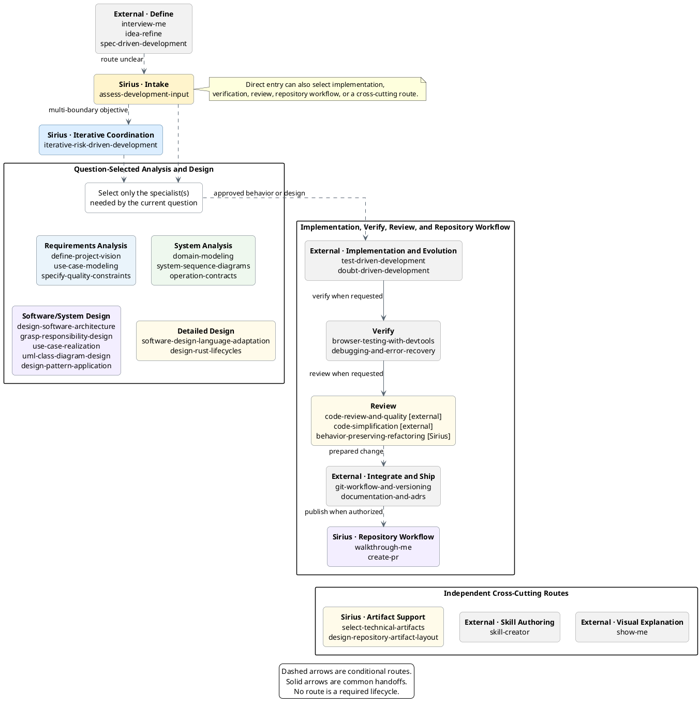
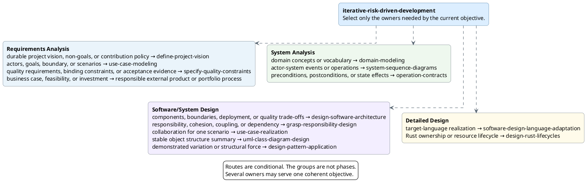
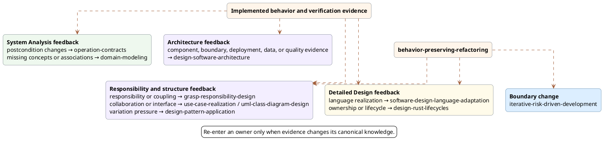

# Skill Relationships

Use this guide to choose a workflow track and understand normal handoffs.
Each skill is independently deployable. Follow only the path needed to reduce
current risk or complete the current behavior slice.

## Overview

This overview groups all 20 deployable Sirius skills and 13 external add-ons by
responsibility. It uses group-level routes to keep the map readable. The
detailed diagrams below preserve conditional specialist routing and feedback.
Solid arrows show common handoffs. Dashed arrows show conditional routing or
support. Neither arrow style requires a fixed sequence.



The gray nodes belong to pinned Addy Osmani, OpenAI, and HumanLayer external
collections. They are not part of the Sirius catalog or named profiles.
`just install <target-project> all` or `just install-global all` installs the
13 curated add-ons; other profiles do not. The diagram shows one optional
composition. `interview-me` confirms one requester's intent.
`idea-refine` turns that intent into a focused, user-confirmed candidate
one-pager. It can prepare a candidate direction or business-case hypothesis,
but it cannot approve an investment decision. `define-project-vision` guides
sufficiently grounded input toward an authority-approved project acceptance policy.
`spec-driven-development` turns a confirmed direction into a human-reviewed
implementation specification. Skip any step whose input is already sufficiently
clear.

Use `idea-refine` for a candidate direction or business-case hypothesis. Save
the confirmed one-pager in `docs/ideas/` or a feature path defined by local
governance. Use one canonical idea document for each candidate direction. Do not
create a second document for a direction that already has one. Requester
confirmation is not organizational approval. Use `define-project-vision` when
the project needs a durable vision, non-goals, or accept-or-resist policy. Route
a business case, feasibility commitment, or investment decision to the
responsible external product or portfolio process. Use the dashed edge to
`assess-development-input` only when the artifact's next Sirius owner is
unclear.

Use `spec-driven-development` when a confirmed direction needs an
implementation-ready specification before Sirius intake and execution. Skip it
when the existing development input already defines the required behavior and
constraints.

Use `test-driven-development` with the `all` installation when implementing new
logic, fixing a bug, or changing behavior. Otherwise, use the consuming
repository's implementation and verification workflow.

Use `browser-testing-with-devtools` with the `all` installation when browser
behavior needs real runtime, DOM, console, network, performance, or visual
evidence. Use `debugging-and-error-recovery` with the `all` installation when
tests fail, builds break, behavior does not match expectations, or another
unexpected error needs systematic root-cause analysis. Add a regression test
through `test-driven-development` after the fix when the all installation is
available.

Use `doubt-driven-development` with the `all` installation when a non-trivial
in-flight decision or claim needs fresh-context adversarial review. It can
expose an incomplete contract or missing current-system evidence, but it does
not recover undocumented design. Return those gaps to
`assess-development-input` or the responsible external process.

Use `code-review-and-quality` with the `all` installation for formal review.
Route readability and local-complexity findings to `code-simplification`,
established structural ownership findings to
`behavior-preserving-refactoring`, and material boundary findings to iterative
design. A bounded structural request may enter
`behavior-preserving-refactoring` directly.

Use `documentation-and-adrs` with the `all` installation when a significant
technical decision or durable engineering context needs documentation. Preserve
repository-local ADR conventions, identifier rules, authority, status, and
history. Otherwise, follow repository-native documentation and ADR guidance.

Use `git-workflow-and-versioning` when prepared work needs standalone commit,
branch, worktree, release, or semantic-version guidance. Selection does not
authorize a commit, push, tag, or release.

Use OpenAI's `skill-creator` when concrete examples must become a new or updated
Codex-compatible skill package with justified resources and validation. Use
HumanLayer's `show-me` when the current topic needs the smallest useful visual
explanation. `show-me` can complement `walkthrough-me`, but it does not own a
revision-fixed, checkpointed change tour.

The groups in this diagram help readers navigate the skill collection. They
are not installation profiles or lifecycle gates. The detailed diagrams show
the conditional choices and feedback that this overview omits. The diagram does
not connect cross-cutting support to every consumer. Select it for a specific
artifact-selection or artifact-placement need. It is not a
required workflow stage. Repository-native implementation remains the fallback
when external `test-driven-development` is unavailable or unnecessary; it is
prose guidance, not a deployable diagram node. Language adaptation and Rust
lifecycle design remain in Iterative Analysis and Design because they produce
implementation-facing design.

## Choose a track

- Use **Assess Development Input** when an incoming task or artifact has no
  clear owner, several routes appear plausible, or readiness and authority are
  uncertain.
- Use external `interview-me`, `idea-refine`, or `spec-driven-development`
  before Sirius when requester intent, a candidate direction, or an
  implementation specification needs interactive refinement.
- Use external `skill-creator` when creating or updating a reusable
  Codex-compatible skill package.
- Use external `show-me` when the current topic needs a concise visual
  explanation rather than a paced, revision-bound change tour.
- Start with **Iterative Analysis and Design** when an approved change needs a
  bounded behavior, analysis, design, language, or implementation iteration,
  or when a complex refactoring moves a system, test, responsibility, runtime,
  resource, or verification boundary. Within that route:
  - use **Requirements Analysis** for project vision, actors, goals, scenarios, measurable quality requirements, and binding constraints;
  - use **System Analysis** for domain concepts, system events, and state
    effects;
  - use **Software/System Design** for major components, architecture
    boundaries, deployment and quality trade-offs, responsibilities,
    collaborations, software structure, and justified patterns; and
  - use **Detailed Design** for target-language and runtime realization.
- Start with **Implementation and Evolution** when the behavior is sufficiently
  bounded. With the `all` installation, use external
  `test-driven-development` for behavior implementation.
- Use **Verify** after implementation when browser runtime evidence or
  systematic failure recovery is needed. With the `all` installation, use
  external `browser-testing-with-devtools` or
  `debugging-and-error-recovery` as applicable.
- Use **Review** after verification or when a bounded structural change is
  already identified. Route clarity findings to external
  `code-simplification`, established structural ownership findings to
  `behavior-preserving-refactoring`, and boundary findings to iterative design.
- Use **Repository Workflow** for a paced tour of a pull request, commit,
  branch, or local change, or after verification and authorization for
  pull-request publication.
- Use `select-technical-artifacts` across tracks when candidate knowledge needs
  a disposition: `create`, `update`, `embed`, `keep-with-implementation`,
  `omit`, or `defer`.
- Use `design-repository-artifact-layout` across tracks when justified durable
  artifacts need canonical homes, lifecycle separation, or migration.
- With the `all` installation, use external `documentation-and-adrs` when one
  consequential architecture choice needs a proposed, accepted, or superseding
  ADR. Otherwise, follow repository-native ADR guidance.

## Development routing

`assess-development-input` owns operational entry routing. Use it when an
incoming task or artifact has no clear owner, when several skills appear
plausible, or when readiness and authority may block progress. It selects one
initial Sirius skill, external add-on, repository-native process, or responsible
prerequisite from the first material question. It does not impose a lifecycle,
rewrite source material, execute the handoff, or replace specialist selection
inside an active iteration. The diagrams in this document visualize that
routing; they are not its executable owner.

A common cross-repository path uses the external
[`interview-me`](https://github.com/addyosmani/agent-skills/blob/5a1b82d6445d1e2f0abeea1072851419a50c0e5c/skills/interview-me/SKILL.md),
[`idea-refine`](https://github.com/addyosmani/agent-skills/blob/5a1b82d6445d1e2f0abeea1072851419a50c0e5c/skills/idea-refine/SKILL.md),
and
[`spec-driven-development`](https://github.com/addyosmani/agent-skills/blob/5a1b82d6445d1e2f0abeea1072851419a50c0e5c/skills/spec-driven-development/SKILL.md):

```text
interview-me, when intent is unclear
  → idea-refine, when the direction needs exploration
  → spec-driven-development, when an implementation specification is needed
  → assess-development-input, only when the next Sirius owner is unclear
```

These handoffs depend on output meaning, not shared runtime state. Confirmed
intent can feed idea refinement. A confirmed direction can feed specification.
The resulting problem, assumptions, scope, non-goals, constraints, success
criteria, and open questions become candidate input to the narrowest Sirius
owner. Preserve the stated review and approval authority at every handoff.

Clarifying one requester's intent does not replace a responsible stakeholder
process when several roles, evidence sources, conflicts, or decision authorities
matter. Treat missing stakeholder evidence, validation, or approval as an
external prerequisite. Route current-system claims that lack evidence to a
responsible external recovery process. Use external `idea-refine` for a
candidate direction or business-case hypothesis. Route durable project vision,
non-goals, or contribution-acceptance policy to `define-project-vision`. Route
a business case, feasibility commitment, or investment decision to the
responsible external product or portfolio process. Route approved actor goals
and scenario flow to use-case modeling, measurable quality requirements and binding
constraints to `specify-quality-constraints`, non-trivial state effects to
operation contracts, and a bounded approved oracle to external
`test-driven-development` when the `all` installation is available; otherwise,
use repository-native implementation. Route browser runtime evidence to external
`browser-testing-with-devtools` and unexpected test, build, or behavior failures
to external `debugging-and-error-recovery` when available; otherwise, use
repository-native verification and debugging. Route one independently
consequential proposed, accepted, or superseding architecture choice to external
`documentation-and-adrs` when available or to repository-native ADR guidance.

## External current-system recovery

The five Sirius recovery skills are retired. Existing fixed-revision recovery
artifacts remain valid. Use a responsible external process when current
behavior, architecture, deployment, state, or constraints need new evidence.
`assess-development-input` returns that external prerequisite when an incoming
task or artifact depends on unsupported current-system claims.

Read the [Reverse Engineering track](tracks/reverse-engineering.md) for
compatibility-profile behavior, evidence safeguards, artifact disposition, and
migration guidance.

## Iterative analysis and design

After initial routing, `iterative-risk-driven-development` executes one or more
approved, risk-sized objectives. It selects the smallest in-iteration
specialists for the current question, evolves canonical artifacts, validates
each iteration, and creates at most one authorized commit per iteration. When
the user requests one commit per iteration, it continues by default until the
requested work is complete.

Before each objective, it confirms the current canonical owner, revision,
lifecycle status, and authority for material intent. Code, tests, observations,
and historical iteration records remain evidence. Reuse, a new consumer, or a
stretched approval boundary triggers a fresh readiness and artifact-promotion
check before implementation continues.

When behavior depends on identity, type, version, platform, provider,
capability, operating mode, or another material variation axis, the coordinator
applies its support-envelope gate. It fixes the approved support population,
checks sibling and fallback paths, compares capability sources across modes,
keeps exclusions and representative coverage explicit, and does not claim a
broad parent outcome from one observed variant. Missing scope authority returns
to the responsible requirements or external owner. Missing current-system
evidence stops for a responsible external recovery process, while material
cross-component capability ownership routes to `design-software-architecture`.

The coordinator's **In-Iteration Routing** tree owns specialist selection after
entry. It can select requirements analysis, system analysis, software/system
design, detailed design, implementation, and verification methods without
requiring a complete object-design chain. The diagram below visualizes those
conditional handoffs.

For a boundary-sensitive refactoring, it retains the system boundary,
representative
vertical scenario, native responsibility assignment, ownership consequences,
verification ownership, and parent completion boundary before implementation.
It preserves established canonical paths and delegates material placement or
migration decisions to `design-repository-artifact-layout`. The diagram below
focuses on analysis and design selection. Implementation handoffs appear in the
next section.

`behavior-driven-specification` is retired. Existing scenario artifacts remain
valid at their recorded revisions. Keep new observable examples with their use
cases, operation contracts, or executable tests instead of creating a separate
BDD artifact by default.



The groups classify knowledge ownership, not mandatory phases. Requirements
Analysis defines approved scope and observable scenarios. System Analysis
models domain vocabulary, system events, and state effects. Software/System
Design defines the smallest sufficient major architecture, then assigns
technology-neutral responsibilities, collaborations, structure, and variation.
Detailed Design maps that intent into target-language and runtime semantics.
Architecture views remain question-driven and optional; the group does not
require a complete C4, UML, deployment, or ADR set.

A local backend, constructor, settings seam, or lifecycle handle can complete
one iteration without completing its parent feature. Retain the representative
end-to-end oracle and report the seam as an enabling result until that vertical
flow succeeds.

Read the
[Iterative Analysis and Design track](tracks/iterative-analysis-design.md) for
artifact boundaries, the support-envelope and boundary-sensitive refactoring
gates, and the iteration rule.

## Implementation and repository workflow

Start implementation from an independent oracle. Examples include an approved
use case, operation contract, realization, design class diagram, acceptance
example, invariant, defect report, reconciled change, or implementation brief.
Use the read-only walkthrough path when understanding a pull request, commit,
branch, or local change. Start effectful repository workflow only after
verification and user authorization for its next effect.

`test-driven-implementation` is retired. Existing behavior-slice evidence
remains valid. With the `all` installation, use external
`test-driven-development` for new behavior. Otherwise, apply the consuming
repository's implementation and verification guidance. Use
`iterative-risk-driven-development` when that work still needs Sirius analysis,
design, verification, or iteration coordination.

```plantuml
@startuml implementation-repository-skill-relationships
top to bottom direction

skinparam backgroundColor #FFFFFF
skinparam shadowing false
skinparam packageStyle rectangle
skinparam linetype ortho
skinparam defaultFontName Arial
skinparam defaultTextAlignment left
skinparam ArrowColor #52606D
skinparam nodesep 30
skinparam ranksep 40
hide stereotype
skinparam rectangle {
  BackgroundColor #FFFFFF
  BorderColor #52606D
  RoundCorner 12
}
skinparam rectangle<<input>> {
  BackgroundColor #F2F2F2
  BorderColor #888888
}

rectangle selected <<input>> [
**Selected direct task or prepared change**
Enter the narrowest owner whose conditions are satisfied.
]

rectangle implementation #FFF5EA [
**Implementation and Evolution**
approved independent oracle → test-driven-development [external]
or repository-native implementation and verification
non-trivial in-flight claim → doubt-driven-development [external]
]

rectangle review #FFFBEA [
**Review**
completed change → code-review-and-quality [external] or repository-native review
routine clarity → code-simplification [external] or repository-native cleanup
established structural ownership → behavior-preserving-refactoring [Sirius]
material boundary change → iterative-risk-driven-development [Sirius]
]

rectangle integrate #F2F2F2 [
**Integrate and Ship**
Git, branch, worktree, release, or version guidance
→ git-workflow-and-versioning [external] or repository-native Git workflow
consequential decision or durable context
→ documentation-and-adrs [external] or repository-native documentation
]

rectangle repository #F3EEFF [
**Repository Workflow**
revision-fixed or snapshot-fixed change tour → walkthrough-me [Sirius]
committed work ready for pull-request publication → create-pr [Sirius]
]

selected ..> implementation
selected ..> review
selected ..> integrate
selected ..> repository

implementation -[hidden]right-> review
implementation -[hidden]down-> integrate
integrate -[hidden]right-> repository

legend bottom
  External add-ons require the all installation.
  Each route is conditional and separately authorized.
endlegend
@enduml
```



`walkthrough-me` establishes paced comprehension of the selected change. It
does not provide the independent review or reader decision shown as its
optional next step. With the `all` installation, use `test-driven-development`
for behavior implementation, `browser-testing-with-devtools` for browser
runtime evidence, `debugging-and-error-recovery` for systematic failure
recovery, `doubt-driven-development` for in-flight adversarial review of
non-trivial claims, and `code-review-and-quality` for formal review. Doubt
findings can expose missing contracts or evidence; they do not recover
undocumented design. Route readability and local-complexity findings to
`code-simplification`.
Route findings about established responsibility, dependency, variation, or
configuration ownership to `behavior-preserving-refactoring`. Route material
boundary findings back to iterative design. A bounded structural request may
enter `behavior-preserving-refactoring` directly; review is not a lifecycle
gate. Use `documentation-and-adrs` for significant decisions or durable
engineering context and `git-workflow-and-versioning` for standalone commit or
version guidance. Otherwise, follow repository guidance directly. None of
these optional handoffs authorizes a later commit, push, or pull-request
publication.

Read the
[Implementation and Evolution](tracks/implementation-evolution.md) and
[Repository Workflow](tracks/repository-workflow.md) tracks for entry
conditions, safety rules, and authority boundaries.

## Feedback and re-entry

The forward diagrams collapse feedback into a few dashed arrows and prose.
This section shows only the paths where later evidence can refine earlier design
knowledge or restart design work. A feedback edge is conditional. Follow it only
when the named trigger changes knowledge owned by the target skill.



The group-level feedback nodes keep the diagram readable. Implementation
evidence can refine architecture, collaboration, structure, language
adaptation, or Rust lifecycle design. Boundary-changing refactoring returns
through iterative coordination before architecture changes.

Apply these rules:

- Contract feedback changes the domain model only when a postcondition exposes
  missing domain vocabulary.
- Implementation and refactoring update design artifacts only when durable
  postconditions, responsibilities, collaborations, interfaces, or dependency
  direction change.

## Cross-cutting skills

The table lists cross-cutting skills instead of connecting each one to every
consumer. This keeps the diagrams readable. It does not change where the skills
apply.

| Skill | Use with | Selection trigger |
|---|---|---|
| `select-technical-artifacts` | Candidate directions, externally recovered knowledge, iterative analysis and design, implementation evidence, architecture decisions, and durable repository documentation | Use when candidate knowledge needs a disposition: `create`, `update`, `embed`, `keep-with-implementation`, `omit`, or `defer`, or when a proposed artifact set needs minimization |
| `design-repository-artifact-layout` | Candidate directions, externally recovered knowledge, iterative analysis and design, implementation evidence, architecture decisions, and durable repository documentation | Use when a justified artifact lacks a canonical home, artifact lifecycles conflict, or migration must preserve links, IDs, indexes, and history |
| External `skill-creator` | New or existing Codex-compatible skill packages | Use when concrete examples must become concise instructions and only the reusable scripts, references, assets, and metadata that the package needs |
| External `show-me` | Any current discussion that benefits from a visual explanation | Use when a small pseudocode, tree, diagram, diff, code-shape sketch, or focused HTML artifact communicates the point better than prose |

## External stakeholder input

`stakeholder-requirements-elicitation`,
`requirements-synthesis-validation`, and `implementation-slice-briefing` are
retired. Sirius now enters this path after the responsible external process has
gathered evidence and validated the needed decisions.

`assess-development-input` can assess externally produced requirements-shaped
material and select one Sirius entry point. It cannot gather stakeholder
evidence, validate requirements, or invent a missing handoff. When those gaps
block progress, it returns an external prerequisite.

The [Client to Code track](tracks/client-to-code.md) documents the active route
from externally validated input to analysis and implementation. The
[client-discovery idea](../docs/ideas/client-discovery-skills.md) preserves the
retired skill-family rationale and implementation history.

The [workflow tracks](tracks/) define when to select each skill.
