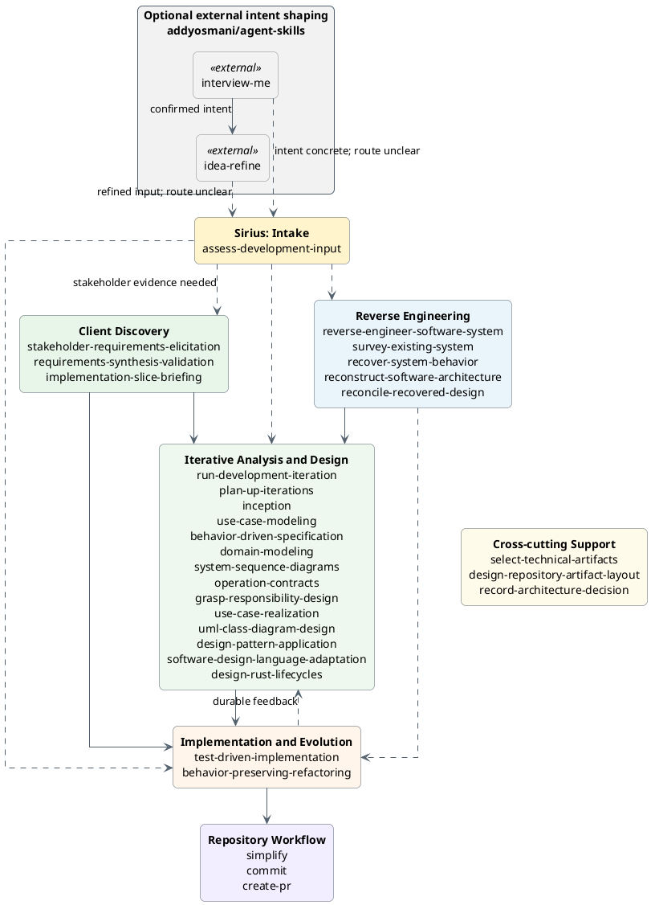
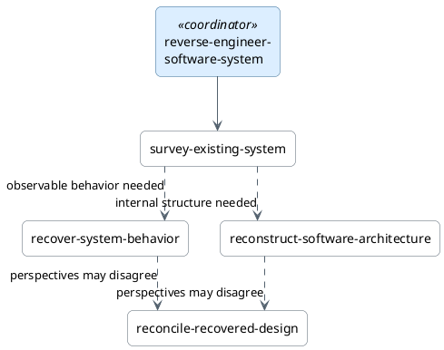
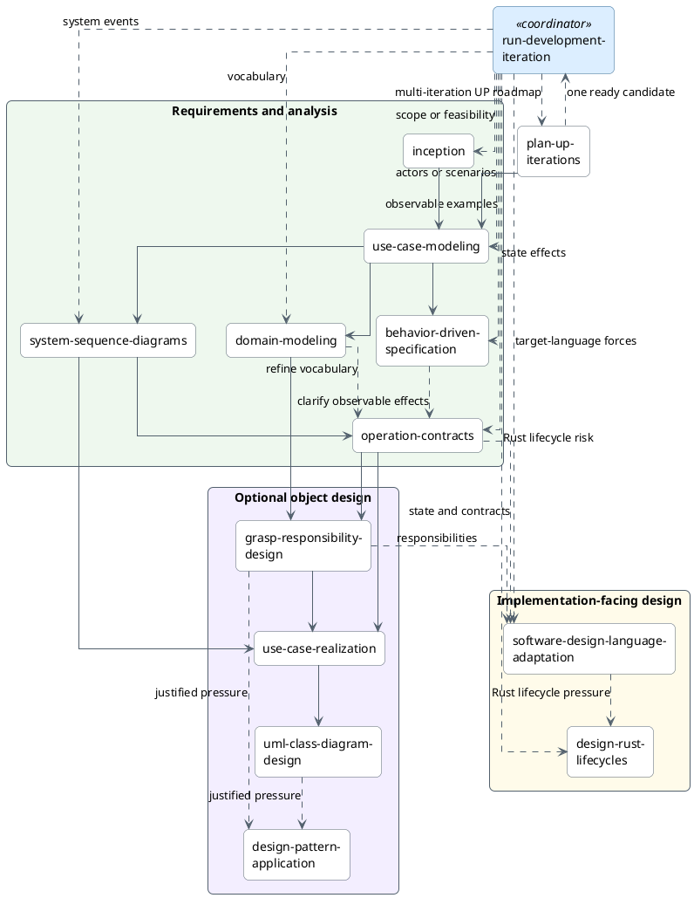
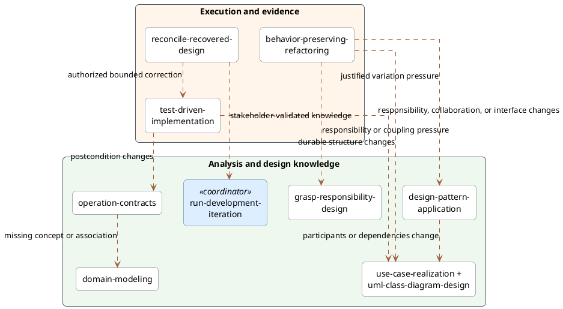

```plantuml
@startuml implementation-repository-skill-relationships
top to bottom direction

skinparam backgroundColor #FFFFFF
skinparam shadowing false
skinparam packageStyle rectangle
skinparam linetype ortho
skinparam defaultFontName Arial
skinparam ArrowColor #52606D
skinparam rectangle {
  BackgroundColor #FFFFFF
  BorderColor #52606D
  RoundCorner 12
}
skinparam rectangle<<input>> {
  BackgroundColor #F2F2F2
  BorderColor #888888
}
rectangle "Approved behavior or design input" as oracle <<input>>

package "Implementation and Evolution" #FFF5EA {
  rectangle "test-driven-\nimplementation" as implementation
  rectangle "behavior-preserving-refactoring" as refactoring
}

package "Repository Workflow" #F3EEFF {
  rectangle "simplify" as simplify
  rectangle "commit" as commit
  rectangle "create-pr" as createpr
}

oracle --> implementation
implementation --> refactoring : green baseline
implementation ..> simplify : optional cleanup
refactoring ..> simplify : optional cleanup
simplify --> commit
commit --> createpr
@enduml
```

# Skill Relationships

Use this guide to choose a workflow track and understand normal handoffs.
Each skill is independently deployable. Follow only the path needed to reduce
current risk or complete the current behavior slice.

## Overview

This diagram groups all 31 deployable Sirius skills by responsibility. It also
shows two optional external skills for shaping intent. The diagram shows only
the main movement between groups. Use the detailed diagrams below for
conditional routes. Solid arrows show normal handoffs. They do not require a
fixed sequence. Dashed arrows show optional routing, support, or feedback.



The gray nodes belong to Addy Osmani's external `agent-skills` collection. They
are not part of the Sirius catalog or installation profiles. The diagram shows
one optional composition. `interview-me` confirms one requester's intent.
`idea-refine` turns that intent into a focused, user-confirmed candidate
one-pager. Skip `interview-me` when intent is concrete. Skip `idea-refine` when
the direction is already focused.

Use `idea-refine` for a candidate direction. Save the confirmed
one-pager in `docs/ideas/` or a feature path defined by local governance. Do not
create a new proposal artifact. Preserve existing legacy proposals at their
historical paths. Requester confirmation is not organizational approval. Use
the dashed edge to `assess-development-input` only when the artifact's next
Sirius owner is unclear.

The Sirius groups are navigation aids. They are not installation profiles or
lifecycle gates. The detailed diagrams show the conditional choices and
feedback that this overview omits. The diagram does not connect cross-cutting
support to every consumer. Select it for a specific artifact-selection,
artifact-placement, or decision-recording need. It is not a required workflow
stage. Language adaptation and Rust lifecycle design remain
in Iterative Analysis and Design because they produce implementation-facing
design.

## Choose a track

- Use **Assess Development Input** when requirements-shaped material exists but
  its readiness or Sirius entry point is unclear.
- Use external `interview-me` or `idea-refine` before Sirius when requester
  intent or a candidate direction needs interactive refinement.
- Start with **Client Discovery** when stakeholder evidence must be gathered,
  synthesized, and validated before a coding handoff.
- Start with **Reverse Engineering** when you must understand an existing
  system.
- Start with **Iterative Analysis and Design** when an approved change needs a
  bounded behavior, analysis, design, language, or implementation iteration.
- Start with **Implementation and Evolution** when the behavior or structural
  change is sufficiently bounded.
- Use **Repository Workflow** after verification and authorization for cleanup,
  recording, or publication.
- Use `select-technical-artifacts` across tracks when candidate knowledge needs
  a disposition: `create`, `update`, `embed`, `keep-with-implementation`,
  `omit`, or `defer`.
- Use `design-repository-artifact-layout` across tracks when justified durable
  artifacts need canonical homes, lifecycle separation, or migration.
- Use `record-architecture-decision` across tracks when one consequential
  architecture choice needs a proposed, accepted, or superseding ADR, or when
  you must find the governing recorded decisions.

## External development inputs

`assess-development-input` is an optional, content-based gateway. It accepts
intent statements, specifications, proposals, BDD scenarios, story maps,
brainstorm notes, and similar material. It does not depend on the tool or method
that produced the material. It selects the narrowest skill that owns the first
material gap. If no Sirius skill can responsibly proceed, it reports an
external prerequisite. The assessment does not rewrite the source or execute
the selected skill.

A common cross-repository path uses the external
[`interview-me`](https://github.com/addyosmani/agent-skills/blob/5a1b82d6445d1e2f0abeea1072851419a50c0e5c/skills/interview-me/SKILL.md)
and
[`idea-refine`](https://github.com/addyosmani/agent-skills/blob/5a1b82d6445d1e2f0abeea1072851419a50c0e5c/skills/idea-refine/SKILL.md):

```text
interview-me, when intent is unclear
  → idea-refine, when the direction needs exploration
  → assess-development-input, only when the next owner is unclear
```

These handoffs depend on output meaning, not shared runtime state. Confirmed
intent can feed idea refinement. The confirmed problem, direction, assumptions,
MVP scope, non-goals, and open questions then become candidate input to the
narrowest Sirius owner.

Clarifying one requester's intent does not replace client discovery when several
stakeholder roles, evidence sources, conflicts, or decision authorities matter.
Route current-system claims to recovery. Route scope and feasibility to
inception. Route stakeholder authority to client discovery. Route acceptance
behavior to behavior-driven specification. Route one independently
consequential proposed, accepted, or superseding architecture choice to
`record-architecture-decision`.

## Reverse engineering

`reverse-engineer-software-system` coordinates recovery. Use
`survey-existing-system` to create the first map. Select behavior recovery and
architecture reconstruction only when the decision needs them. Use
reconciliation when recovered evidence may disagree with tests, observations,
documentation, decisions, or history. Stop when the original decision has
enough evidence.



Read the [Reverse Engineering track](tracks/reverse-engineering.md) for
evidence rules, stopping conditions, and selection examples.

## Iterative analysis and design

`run-development-iteration` executes one approved, risk-sized objective. It
stops after validation and one authorized commit. It selects the smallest
specialists that answer the current question.

`plan-up-iterations` plans at least two explicitly UP-framed candidates. The
plan includes risks, exit evidence, and use-case-driven dependencies. It does
not execute candidates. One separately authorized candidate goes to
`run-development-iteration`, which rechecks the current baseline. Both skills
preserve established canonical paths. They delegate material placement or
migration decisions to `design-repository-artifact-layout`.



Read the
[Iterative Analysis and Design track](tracks/iterative-analysis-design.md) for
artifact boundaries and the iteration rule.

## Implementation and repository workflow

Start implementation from an independent oracle. Examples include an approved
use case, operation contract, realization, design class diagram, acceptance
example, invariant, defect report, reconciled change, or implementation brief.
Start repository workflow only after verification and user authorization for
its next effect.



Read the
[Implementation and Evolution](tracks/implementation-evolution.md) and
[Repository Workflow](tracks/repository-workflow.md) tracks for entry
conditions, safety rules, and authority boundaries.

## Feedback and re-entry

The forward diagrams collapse feedback into a few dashed arrows and prose.
This section shows only the paths where later evidence can refine earlier design
knowledge or restart design work. A feedback edge is conditional. Follow it only
when the named trigger changes knowledge owned by the target skill.



The combined `use-case-realization + uml-class-diagram-design` node keeps the
diagram readable. Implementation and refactoring can refine either view.
Apply these rules:

- Contract feedback changes the domain model only when a postcondition exposes
  missing domain vocabulary.
- Implementation and refactoring update design artifacts only when durable
  postconditions, responsibilities, collaborations, interfaces, or dependency
  direction change.
- Reconciliation recommends the authoritative next action first. It does not
  automatically turn current code into intended design or authorize a change.

## Cross-cutting skills

The table lists cross-cutting skills instead of connecting each one to every
consumer. This keeps the diagrams readable. It does not change where the skills
apply.

| Skill | Use with | Selection trigger |
|---|---|---|
| `select-technical-artifacts` | Candidate directions, reverse engineering, iterative analysis and design, implementation evidence, architecture decisions, and durable repository documentation | Use when candidate knowledge needs a disposition: `create`, `update`, `embed`, `keep-with-implementation`, `omit`, or `defer`, or when a proposed artifact set needs minimization |
| `design-repository-artifact-layout` | Candidate directions, reverse engineering, iterative analysis and design, implementation evidence, architecture decisions, and durable repository documentation | Use when a justified artifact lacks a canonical home, artifact lifecycles conflict, or migration must preserve links, IDs, indexes, and history |
| `record-architecture-decision` | Approved requirements, architecture and language design, consequential pattern or responsibility choices, implementation discoveries, and reconciliation | Use when you must find governing ADRs, or when one bounded, cross-cutting, or expensive-to-reverse architecture choice needs proposed review, accepted history, or linked supersession |

## Client discovery upstream path

All three skills in this optional client-discovery handoff are deployable:

```text
stakeholder-requirements-elicitation
  → requirements-synthesis-validation
  → inception, use-case modeling, behavior-driven-specification when examples
    are needed, and selected analysis/design
  → implementation-slice-briefing
  → test-driven-implementation
```

`assess-development-input` provides a smaller, method-independent entry point
when requirements-shaped material already exists. It can assess outputs from
these skills or any other external discovery and specification method. It
cannot gather stakeholder evidence, validate requirements, or prepare an
implementation brief for them.

The [Client to Code track](tracks/client-to-code.md) is the active handoff
guide. The
[client-discovery proposal](../docs/proposals/client-discovery-skills.md)
records the skill-family rationale and implementation history.

The [workflow tracks](tracks/) define when to select each skill.
