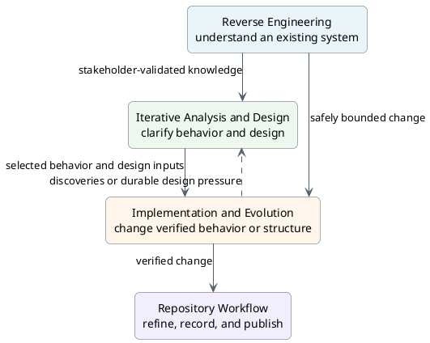
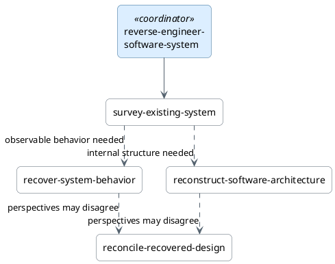
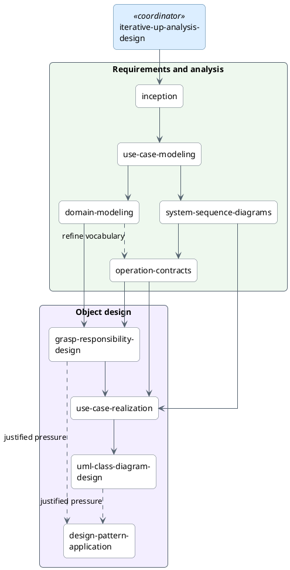

# Skill Relationships

Use this guide to choose a workflow track and understand its normal handoffs.
The skills remain independently deployable: follow only the path needed to
reduce the current risk or complete the current behavior slice.

## Choose a track

- Start with **Reverse Engineering** when an existing system must be understood.
- Start with **Iterative Analysis and Design** when intended behavior, scope, or
  object design is not yet clear.
- Start with **Implementation and Evolution** when the behavior or structural
  change is already sufficiently bounded.
- Use **Repository Workflow** after a change is verified and authorized for
  cleanup, recording, or publication.

Solid arrows show a normal handoff, not a mandatory waterfall. Dashed arrows
show an optional alternative or feedback path.



## Reverse engineering

`reverse-engineer-software-system` coordinates the recovery effort.
`survey-existing-system` establishes the first map; behavior recovery and
architecture reconstruction are selected only when the decision needs them.
Reconciliation is useful when recovered evidence may disagree with tests,
observations, documentation, decisions, or history. Stop as soon as the
original decision has enough evidence.



See the [Reverse Engineering track](tracks/reverse-engineering.md) for evidence
rules, stopping conditions, and selection examples.

## Iterative analysis and design

`iterative-up-analysis-design` coordinates risk-driven iterations. The diagram
shows artifact dependencies, not a requirement to create every artifact.
Choose only the analysis and design work needed for the selected risk and
behavior slice.



See the
[Iterative Analysis and Design track](tracks/iterative-analysis-design.md) for
artifact boundaries and the iteration rule.

## Implementation and repository workflow

Implementation begins from an independent oracle: for example, an approved use
case, operation contract, realization, design class diagram, acceptance
example, invariant, defect report, reconciled change, or implementation brief.
The repository workflow begins only after the change is verified and the user
has authorized its next effect.

```plantuml
@startuml implementation-repository-skill-relationships
top to bottom direction

skinparam backgroundColor #FFFFFF
skinparam shadowing false
skinparam packageStyle rectangle
skinparam linetype ortho
skinparam defaultFontName Arial
skinparam ArrowColor #52606D
skinparam rectangle {
  BackgroundColor #FFFFFF
  BorderColor #52606D
  RoundCorner 12
}
skinparam rectangle<<input>> {
  BackgroundColor #F2F2F2
  BorderColor #888888
}
skinparam rectangle<<support>> {
  BackgroundColor #FFF4CC
  BorderColor #A66B00
}

rectangle "Approved behavior or design input" as oracle <<input>>

package "Implementation and Evolution" #FFF5EA {
  rectangle "test-driven-\nimplementation" as implementation
  rectangle "behavior-preserving-refactoring" as refactoring
}

package "Repository Workflow" #F3EEFF {
  rectangle "simplify" as simplify
  rectangle "commit" as commit
  rectangle "create-pr" as createpr
  rectangle "governance-update" as governance <<support>>
}

oracle --> implementation
implementation --> refactoring : green baseline
implementation ..> simplify : optional cleanup
refactoring ..> simplify : optional cleanup
simplify --> commit
commit --> createpr
simplify ..> governance : repeated drift
@enduml
```



See the
[Implementation and Evolution](tracks/implementation-evolution.md) and
[Repository Workflow](tracks/repository-workflow.md) tracks for their entry
conditions, safety rules, and authority boundaries. When refactoring exposes a
durable design pressure, return to `grasp-responsibility-design` or
`design-pattern-application`.

## Cross-cutting skills

Cross-cutting skills are listed instead of connected to every consumer. This
keeps the diagrams readable without changing where they apply.

| Skill | Use with | Selection trigger |
|---|---|---|
| `software-design-language-adaptation` | `grasp-responsibility-design`, `use-case-realization`, `uml-class-diagram-design`, `design-pattern-application`, and `test-driven-implementation` | Language-specific ownership, errors, concurrency, lifecycle, or interface conventions affect the design |
| `rewrite-technical-artifacts` | Recovered artifacts, iterative-design artifacts, behavior-slice evidence, and refactoring records | The knowledge is sound but its reading order or progressive disclosure needs improvement |

## Proposed upstream path

Three client-discovery skills are proposed but not deployable from this
repository. Their intended handoff remains:

```text
stakeholder-requirements-elicitation
  → requirements-synthesis-validation
  → inception, use-case modeling, and selected analysis/design
  → implementation-slice-briefing
  → test-driven-implementation
```

The [Client to Code track](tracks/client-to-code.md) and
[client-discovery proposal](../docs/proposals/client-discovery-skills.md) are
the authoritative sources for this future path.

The [workflow tracks](tracks/) remain the authoritative descriptions of when
to select each skill.
