# Skill Relationships

The diagram below summarizes the documented workflow tracks and the most
important handoffs between skills. It is a composition guide, not a mandatory
waterfall: choose the smallest set of skills that reduces the current risk or
supports the current behavior slice.

Solid arrows show a normal handoff or sequencing relationship. Dashed arrows
show an optional supporting skill, feedback loop, or proposed skill that is not
currently deployable from this repository.

```plantuml
@startuml skill-relationships
left to right direction

skinparam backgroundColor #FFFFFF
skinparam shadowing false
skinparam packageStyle rectangle
skinparam linetype ortho
skinparam defaultFontName Arial
skinparam defaultTextAlignment center
skinparam ArrowColor #52606D
skinparam ArrowThickness 1
skinparam rectangle {
  BackgroundColor #FFFFFF
  BorderColor #52606D
  RoundCorner 12
}
skinparam rectangle<<coordinator>> {
  BackgroundColor #DCEEFF
  BorderColor #2F6690
}
skinparam rectangle<<support>> {
  BackgroundColor #FFF4CC
  BorderColor #A66B00
}
skinparam rectangle<<proposed>> {
  BackgroundColor #F2F2F2
  BorderColor #888888
  FontColor #666666
}

package "Client to Code (proposed)" #F7F7F7 {
  rectangle "stakeholder-requirements-\nelicitation" as stakeholder <<proposed>>
  rectangle "requirements-synthesis-\nvalidation" as synthesis <<proposed>>
  rectangle "implementation-slice-\nbriefing" as briefing <<proposed>>
}

package "Reverse Engineering" #EAF4FB {
  rectangle "reverse-engineer-\nsoftware-system" as reverse <<coordinator>>
  rectangle "survey-existing-system" as survey
  rectangle "recover-system-behavior" as behavior
  rectangle "reconstruct-software-\narchitecture" as architecture
  rectangle "reconcile-recovered-\ndesign" as reconcile
}

package "Iterative Analysis & Design" #EEF8EE {
  rectangle "iterative-up-analysis-\ndesign" as iterative <<coordinator>>
  rectangle "inception" as inception
  rectangle "use-case-modeling" as usecases
  rectangle "domain-modeling" as domain
  rectangle "system-sequence-\ndiagrams" as ssd
  rectangle "operation-contracts" as contracts
  rectangle "grasp-responsibility-\ndesign" as grasp
  rectangle "use-case-realization" as realization
  rectangle "uml-class-diagram-\ndesign" as classdiagram
  rectangle "design-pattern-\napplication" as patterns
}

package "Implementation & Evolution" #FFF5EA {
  rectangle "test-driven-\nimplementation" as implementation
  rectangle "behavior-preserving-\nrefactoring" as refactoring
}

package "Cross-cutting" #FFFBEA {
  rectangle "software-design-language-\nadaptation" as language <<support>>
  rectangle "rewrite-technical-\nartifacts" as rewrite <<support>>
}

' Proposed client-to-code path
stakeholder ..> synthesis
synthesis ..> inception
iterative ..> briefing
usecases ..> briefing
briefing ..> implementation

' Reverse-engineering path
reverse --> survey
reverse --> behavior
reverse --> architecture
reverse --> reconcile
survey --> behavior
survey --> architecture
behavior --> reconcile
architecture --> reconcile

' Forward analysis and design path
iterative --> inception
inception --> usecases
usecases --> domain
usecases --> ssd
ssd --> contracts
domain ..> contracts : refine vocabulary
domain --> grasp
contracts --> grasp
ssd --> realization
contracts --> realization
grasp --> realization
realization --> classdiagram
grasp --> patterns
classdiagram ..> patterns

' Implementation and evolution path
usecases ..> implementation : approved behavior
contracts ..> implementation : executable oracle
realization ..> implementation
classdiagram ..> implementation
implementation --> refactoring : green baseline
refactoring ..> grasp : design pressure
refactoring ..> patterns : design pressure

' Cross-track handoffs and feedback
reconcile ..> iterative : validated knowledge
reconcile ..> implementation : bounded change
language ..> grasp
language ..> realization
language ..> classdiagram
language ..> patterns
language ..> implementation
reconcile ..> rewrite
iterative ..> rewrite
implementation ..> rewrite
refactoring ..> rewrite

legend right
  |= Notation |= Meaning |
  | --> | normal handoff or sequence |
  | ..> | optional support, feedback, or proposed path |
  | blue node | coordinator skill |
  | yellow node | cross-cutting support skill |
  | gray node | proposed skill; no deployable directory yet |
endlegend
@enduml
```

The [workflow tracks](tracks/) remain the authoritative descriptions of when
to select each skill. The proposed client-to-code nodes are included to make
the upstream gap visible; they are not entries in `skill-sets/all.txt`.
