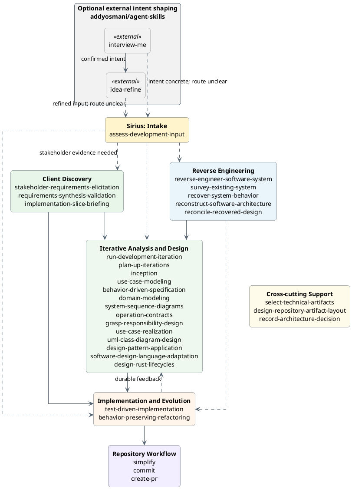
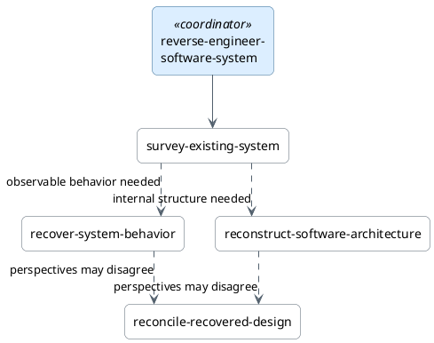
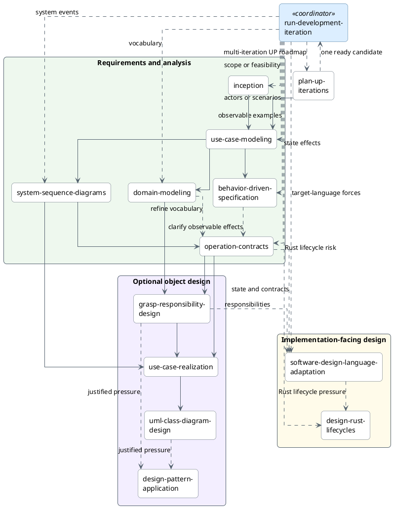
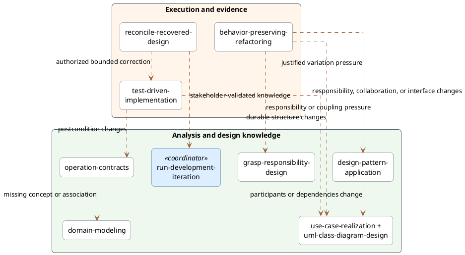

# Skill Relationships

Use this guide to choose a workflow track and understand its normal handoffs.
The skills remain independently deployable: follow only the path needed to
reduce the current risk or complete the current behavior slice.

## Bird's-eye view

This view groups all 31 deployable Sirius skills by responsibility and shows
two optional external intent-shaping skills at the boundary. It shows only the
main movement between groups so readers can locate a starting point before
using the detailed views below. Solid arrows are normal handoffs, not a
mandatory waterfall. Dashed arrows are optional routing, support, or feedback.



The gray nodes belong to Addy Osmani's external `agent-skills` collection, not
the Sirius catalog or installation profiles. They make one optional composition
visible: `interview-me` confirms one requester's actual intent and `idea-refine`
turns that intent into a focused, user-confirmed candidate-direction one-pager.
If intent is already concrete, `interview-me` can be skipped; if the direction
is already focused, `idea-refine` can be skipped.

The one-pager may use an established `docs/ideas/`, `docs/proposals/`, or feature
path; creating both an idea and proposal for the same direction adds no
independent owner or lifecycle. Requester confirmation is not organizational
approval. The dashed edge to `assess-development-input` applies only when the
artifact's next Sirius owner remains unclear.

The Sirius groups are navigation aids, not installation profiles or lifecycle
gates. The diagrams that follow show the internal choices and conditional
feedback that this overview deliberately collapses. Cross-cutting support is
left unconnected because it is selected for a specific artifact-selection,
artifact-placement, decision-recording, or readability need, not as a required
workflow stage. Language adaptation and Rust lifecycle design remain in
Iterative Analysis and Design because they produce implementation-facing
design.

## Choose a track

- Use **Assess Development Input** when requirements-shaped material already
  exists but its readiness or correct Sirius entry point is unclear.
- Use external `interview-me` or `idea-refine` before Sirius when requester
  intent or a candidate direction still needs interactive refinement.
- Start with **Client Discovery** when stakeholder evidence must be gathered,
  synthesized, and validated before a coding handoff can be prepared.
- Start with **Reverse Engineering** when an existing system must be understood.
- Start with **Iterative Analysis and Design** when an approved change needs a
  bounded behavior, analysis, design, language, or implementation iteration.
- Start with **Implementation and Evolution** when the behavior or structural
  change is already sufficiently bounded.
- Use **Repository Workflow** after a change is verified and authorized for
  cleanup, recording, or publication.
- Use `select-technical-artifacts` across tracks when candidate knowledge needs
  a create, update, embed, keep-with-implementation, omit, or defer disposition.
- Use `design-repository-artifact-layout` across tracks when justified durable
  artifacts need canonical homes, lifecycle separation, or migration.
- Use `record-architecture-decision` across tracks when one consequential
  architecture choice needs a proposed, accepted, or superseding ADR, or when
  the governing recorded decisions must be found.

## External development inputs

`assess-development-input` is an optional content-based gateway. It accepts
intent statements, specifications, proposals, BDD scenarios, story maps,
brainstorm notes, and similar material without depending on the tool or method
that produced them. It selects the narrowest skill that owns the first material
gap, or reports an external prerequisite when no Sirius skill can responsibly
proceed. The assessment neither rewrites the source nor executes the selected
skill.

A common cross-repository path uses Addy Osmani's
[`interview-me`](https://github.com/addyosmani/agent-skills/blob/5a1b82d6445d1e2f0abeea1072851419a50c0e5c/skills/interview-me/SKILL.md)
and
[`idea-refine`](https://github.com/addyosmani/agent-skills/blob/5a1b82d6445d1e2f0abeea1072851419a50c0e5c/skills/idea-refine/SKILL.md):

```text
interview-me, when intent is unclear
  → idea-refine, when the direction needs exploration
  → assess-development-input, only when the next owner is unclear
```

The handoffs depend on output meaning, not shared runtime state. A confirmed
intent can feed idea refinement; its confirmed problem, direction, assumptions,
MVP scope, non-goals, and open questions then become candidate input to the
narrowest Sirius owner. Clarifying one requester's intent does not replace
client discovery when several stakeholder roles, evidence sources, conflicts,
or decision authorities matter. Current-system claims route to recovery; scope
and feasibility to inception; stakeholder authority to client discovery;
acceptance behavior to behavior-driven specification; and one independently
consequential proposed, accepted, or superseding architecture choice to
`record-architecture-decision`.

## Reverse engineering

`reverse-engineer-software-system` coordinates the recovery effort.
`survey-existing-system` establishes the first map; behavior recovery and
architecture reconstruction are selected only when the decision needs them.
Reconciliation is useful when recovered evidence may disagree with tests,
observations, documentation, decisions, or history. Stop as soon as the
original decision has enough evidence.



See the [Reverse Engineering track](tracks/reverse-engineering.md) for evidence
rules, stopping conditions, and selection examples.

## Iterative analysis and design

`run-development-iteration` executes one approved, risk-sized objective and
stops after validation and one authorized commit. It routes to the smallest
specialists that answer the current question. `plan-up-iterations`
plans at least two explicitly UP-framed candidates with risks, exit evidence,
and use-case-driven dependencies, but executes none. One separately authorized
candidate hands off to `run-development-iteration`, which rechecks its current
baseline. Both preserve established canonical paths and delegate a material
placement or migration decision to `design-repository-artifact-layout`.



See the
[Iterative Analysis and Design track](tracks/iterative-analysis-design.md) for
artifact boundaries and the iteration rule.

## Implementation and repository workflow

Implementation begins from an independent oracle: for example, an approved use
case, operation contract, realization, design class diagram, acceptance
example, invariant, defect report, reconciled change, or implementation brief.
The repository workflow begins only after the change is verified and the user
has authorized its next effect.

```plantuml
@startuml implementation-repository-skill-relationships
top to bottom direction

skinparam backgroundColor #FFFFFF
skinparam shadowing false
skinparam packageStyle rectangle
skinparam linetype ortho
skinparam defaultFontName Arial
skinparam ArrowColor #52606D
skinparam rectangle {
  BackgroundColor #FFFFFF
  BorderColor #52606D
  RoundCorner 12
}
skinparam rectangle<<input>> {
  BackgroundColor #F2F2F2
  BorderColor #888888
}
rectangle "Approved behavior or design input" as oracle <<input>>

package "Implementation and Evolution" #FFF5EA {
  rectangle "test-driven-\nimplementation" as implementation
  rectangle "behavior-preserving-refactoring" as refactoring
}

package "Repository Workflow" #F3EEFF {
  rectangle "simplify" as simplify
  rectangle "commit" as commit
  rectangle "create-pr" as createpr
}

oracle --> implementation
implementation --> refactoring : green baseline
implementation ..> simplify : optional cleanup
refactoring ..> simplify : optional cleanup
simplify --> commit
commit --> createpr
@enduml
```



See the
[Implementation and Evolution](tracks/implementation-evolution.md) and
[Repository Workflow](tracks/repository-workflow.md) tracks for their entry
conditions, safety rules, and authority boundaries.

## Feedback and re-entry

The forward diagrams stay small by collapsing feedback into a few dashed
arrows and prose. This view expands only the paths where later evidence can
refine earlier design knowledge or restart design work. A feedback edge is
conditional: follow it only when the named trigger changes knowledge owned by
the target skill.



The combined `use-case-realization + uml-class-diagram-design` node keeps the
view readable; implementation and refactoring can refine either or both. In
particular:

- contract feedback changes the domain model only when a postcondition exposes
  missing domain vocabulary;
- implementation and refactoring update design artifacts only when durable
  postconditions, responsibilities, collaborations, interfaces, or dependency
  direction changed;
- reconciliation recommends the authoritative next action first—it does not
  automatically turn current code into intended design or authorize a change;
  and

## Cross-cutting skills

Cross-cutting skills are listed instead of connected to every consumer. This
keeps the diagrams readable without changing where they apply.

| Skill | Use with | Selection trigger |
|---|---|---|
| `select-technical-artifacts` | Candidate directions, reverse engineering, iterative analysis and design, implementation evidence, architecture decisions, and durable repository documentation | Candidate knowledge needs a create, update, embed, keep-with-implementation, omit, or defer disposition, or a proposed artifact set needs minimization |
| `design-repository-artifact-layout` | Candidate directions, reverse engineering, iterative analysis and design, implementation evidence, architecture decisions, and durable repository documentation | A justified artifact lacks a canonical home, artifact lifecycles conflict, or repository migration must preserve links, IDs, indexes, and history |
| `record-architecture-decision` | Approved requirements, architecture and language design, consequential pattern or responsibility choices, implementation discoveries, and reconciliation | Governing ADRs must be found, or one bounded, cross-cutting, or expensive-to-reverse architecture choice needs proposed review, an accepted historical record, or linked supersession |

## Client discovery upstream path

All three client-discovery skills in this optional handoff are deployable:

```text
stakeholder-requirements-elicitation
  → requirements-synthesis-validation
  → inception, use-case modeling, behavior-driven-specification when examples
    are needed, and selected analysis/design
  → implementation-slice-briefing
  → test-driven-implementation
```

The `assess-development-input` skill provides a smaller, method-independent
entry point when requirements-shaped material already exists. It can assess
outputs from these skills or any other external discovery and specification
method, but it cannot gather stakeholder evidence, validate requirements, or
prepare an implementation brief on their behalf.

The [Client to Code track](tracks/client-to-code.md) is the active handoff
guide. The
[client-discovery proposal](../docs/proposals/client-discovery-skills.md)
records the skill-family rationale and implementation history.

The [workflow tracks](tracks/) remain the authoritative descriptions of when
to select each skill.
