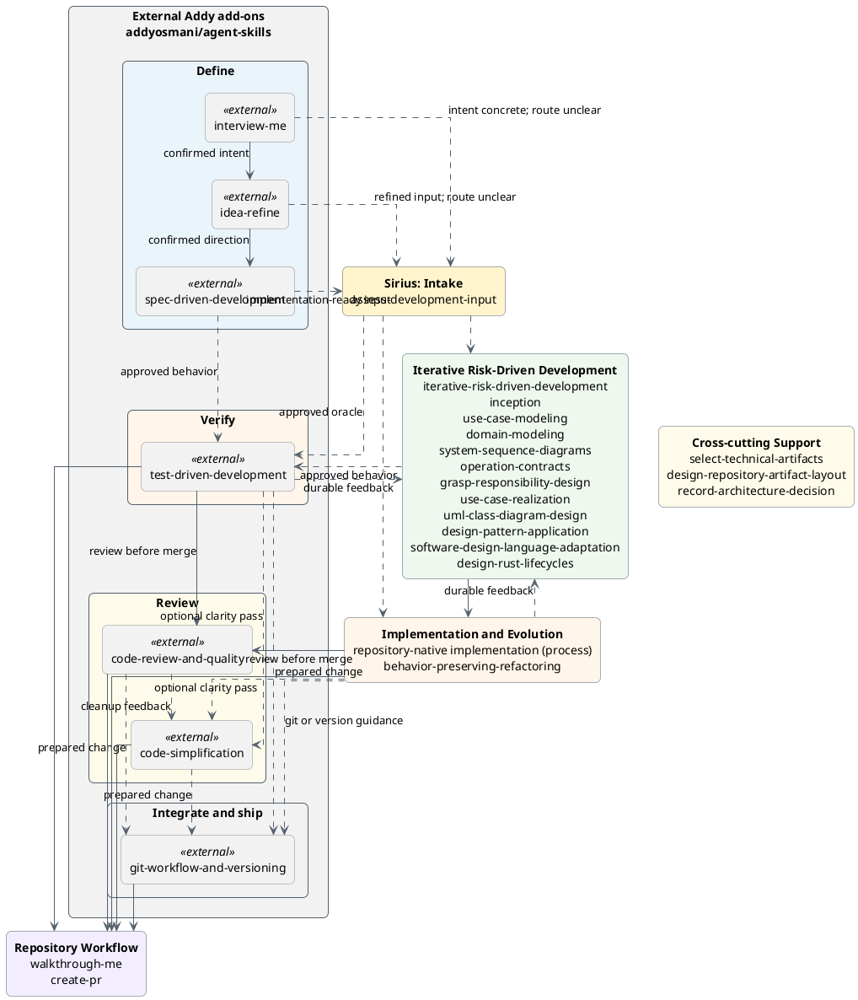
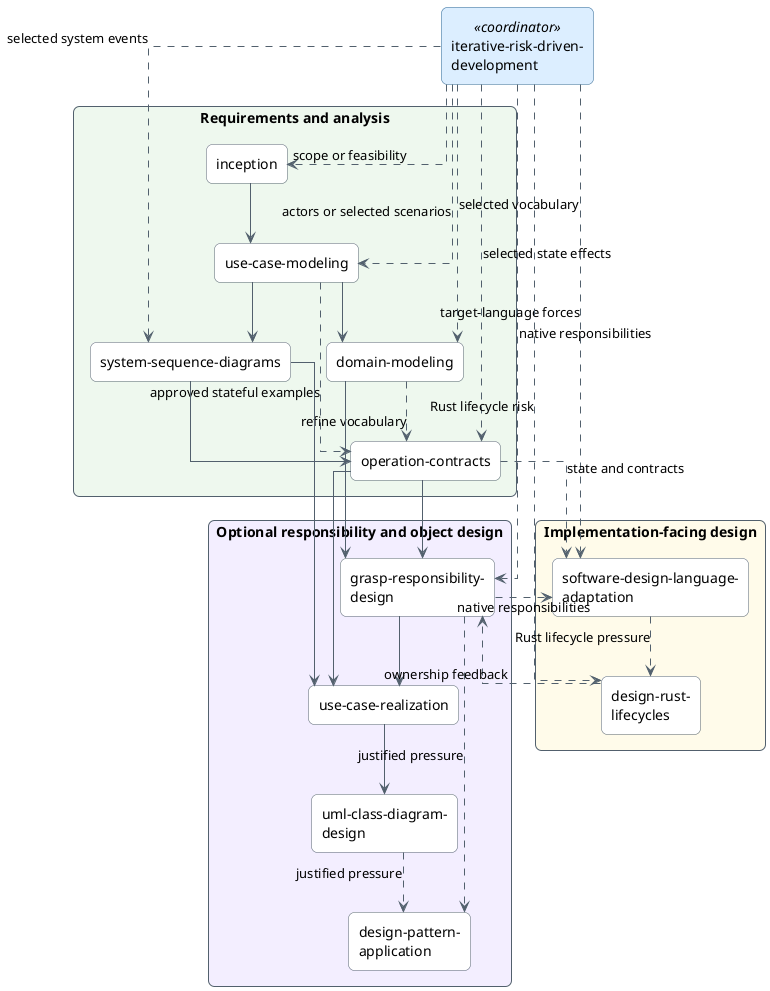
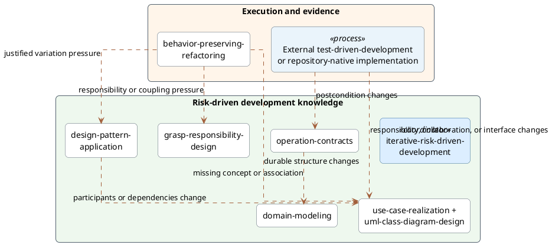

# Skill Relationships

Use this guide to choose a workflow track and understand normal handoffs.
Each skill is independently deployable. Follow only the path needed to reduce
current risk or complete the current behavior slice.

## Overview

This diagram groups all 19 deployable Sirius skills by responsibility. It also
shows seven external Addy add-ons. The diagram shows only the main movement
between groups. Use the detailed diagrams below for conditional routes. Solid
arrows show normal handoffs. They do not require a fixed sequence. Dashed
arrows show optional routing, support, or feedback.



The gray nodes belong to Addy Osmani's external `agent-skills` collection. They
are not part of the Sirius catalog or named profiles.
`just install <target-project> all` or `just install-global all` installs the
seven curated add-ons; other profiles do not. The diagram shows one optional
composition. `interview-me` confirms one requester's intent.
`idea-refine` turns that intent into a focused, user-confirmed candidate
one-pager. `spec-driven-development` turns a confirmed direction into a
human-reviewed implementation specification. Skip any step whose input is
already sufficiently clear.

Use `idea-refine` for a candidate direction. Save the confirmed
one-pager in `docs/ideas/` or a feature path defined by local governance. Use
one canonical idea document for each candidate direction. Do not create a second
document for a direction that already has one. Requester confirmation is not
organizational approval. Use the dashed edge to `assess-development-input` only
when the artifact's next Sirius owner is unclear.

Use `spec-driven-development` when a confirmed direction needs an
implementation-ready specification before Sirius intake and execution. Skip it
when the existing development input already defines the required behavior and
constraints.

Use `test-driven-development` with the `all` installation when implementing new
logic, fixing a bug, or changing behavior. Otherwise, use the consuming
repository's implementation and verification workflow.

Use `git-workflow-and-versioning` when prepared work needs standalone commit,
branch, worktree, release, or semantic-version guidance. Selection does not
authorize a commit, push, tag, or release.

The groups in this diagram help readers navigate the skill collection. They
are not installation profiles or lifecycle gates. The detailed diagrams show
the conditional choices and feedback that this overview omits. The diagram does
not connect cross-cutting support to every consumer. Select it for a specific
artifact-selection, artifact-placement, or decision-recording need. It is not a
required workflow stage. The repository-native implementation labels are
process markers, not deployable Sirius skills. Language adaptation and Rust
lifecycle design remain in Iterative Analysis and Design because they produce
implementation-facing design.

## Choose a track

- Use **Assess Development Input** when requirements-shaped material exists but
  its readiness or Sirius entry point is unclear.
- Use external `interview-me`, `idea-refine`, or `spec-driven-development`
  before Sirius when requester intent, a candidate direction, or an
  implementation specification needs interactive refinement.
- Start with **Iterative Analysis and Design** when an approved change needs a
  bounded behavior, analysis, design, language, or implementation iteration,
  or when a complex refactoring moves a system, test, responsibility, runtime,
  resource, or verification boundary.
- Start with **Implementation and Evolution** when the behavior or local
  structural change is sufficiently bounded. With the `all` installation, use
  external `test-driven-development` for behavior implementation.
- Use **Repository Workflow** for a paced tour of a pull request, commit,
  branch, or local change, or after verification and authorization for
  pull-request publication.
- Use `select-technical-artifacts` across tracks when candidate knowledge needs
  a disposition: `create`, `update`, `embed`, `keep-with-implementation`,
  `omit`, or `defer`.
- Use `design-repository-artifact-layout` across tracks when justified durable
  artifacts need canonical homes, lifecycle separation, or migration.
- Use `record-architecture-decision` across tracks when one consequential
  architecture choice needs a proposed, accepted, or superseding ADR, or when
  you must find the governing recorded decisions.

## External development inputs

`assess-development-input` is an optional, content-based gateway. It accepts
intent statements, specifications, proposals, BDD scenarios, story maps,
brainstorm notes, and similar material. It does not depend on the tool or method
that produced the material. It selects the narrowest skill that owns the first
material gap. If no Sirius skill can responsibly proceed, it reports an
external prerequisite. The assessment does not rewrite the source or execute
the selected skill.

A common cross-repository path uses the external
[`interview-me`](https://github.com/addyosmani/agent-skills/blob/5a1b82d6445d1e2f0abeea1072851419a50c0e5c/skills/interview-me/SKILL.md),
[`idea-refine`](https://github.com/addyosmani/agent-skills/blob/5a1b82d6445d1e2f0abeea1072851419a50c0e5c/skills/idea-refine/SKILL.md),
and
[`spec-driven-development`](https://github.com/addyosmani/agent-skills/blob/5a1b82d6445d1e2f0abeea1072851419a50c0e5c/skills/spec-driven-development/SKILL.md):

```text
interview-me, when intent is unclear
  → idea-refine, when the direction needs exploration
  → spec-driven-development, when an implementation specification is needed
  → assess-development-input, only when the next Sirius owner is unclear
```

These handoffs depend on output meaning, not shared runtime state. Confirmed
intent can feed idea refinement. A confirmed direction can feed specification.
The resulting problem, assumptions, scope, non-goals, constraints, success
criteria, and open questions become candidate input to the narrowest Sirius
owner. Preserve the stated review and approval authority at every handoff.

Clarifying one requester's intent does not replace a responsible stakeholder
process when several roles, evidence sources, conflicts, or decision authorities
matter. Treat missing stakeholder evidence, validation, or approval as an
external prerequisite. Route current-system claims that lack evidence to a
responsible external recovery process. Route scope and feasibility to
inception. Route approved actor goals and scenario flow to use-case modeling,
non-trivial state effects to operation contracts, and a bounded approved oracle
to external `test-driven-development` when the `all` installation is available;
otherwise, use repository-native implementation. Route one independently
consequential proposed, accepted, or superseding architecture choice to
`record-architecture-decision`.

## External current-system recovery

The five Sirius recovery skills are retired. Existing fixed-revision recovery
artifacts remain valid. Use a responsible external process when current
behavior, architecture, deployment, state, or constraints need new evidence.
`assess-development-input` returns that external prerequisite when
requirements-shaped input depends on unsupported current-system claims.

Read the [Reverse Engineering track](tracks/reverse-engineering.md) for
compatibility-profile behavior, evidence safeguards, artifact disposition, and
migration guidance.

## Iterative analysis and design

`iterative-risk-driven-development` executes one or more approved, risk-sized
objectives. It selects the smallest specialists for the current question,
evolves canonical artifacts, validates each iteration, and creates at most one
authorized commit per iteration. When the user requests one commit per
iteration, it continues by default until the requested work is complete.

Before each objective, it confirms the current canonical owner, revision,
lifecycle status, and authority for material intent. Code, tests, observations,
and historical iteration records remain evidence. Reuse, a new consumer, or a
stretched approval boundary triggers a fresh readiness and artifact-promotion
check before implementation continues.

The coordinator can select requirements, analysis, native responsibility,
optional object-design, implementation, verification, and Rust lifecycle
methods. It does not require a complete object-design chain. For a
boundary-sensitive refactoring, it retains the system boundary, representative
vertical scenario, native responsibility assignment, ownership consequences,
verification ownership, and parent completion boundary before implementation.
It preserves established canonical paths and delegates material placement or
migration decisions to `design-repository-artifact-layout`. The diagram below
focuses on analysis and design selection. Implementation handoffs appear in the
next section.

`behavior-driven-specification` is retired. Existing scenario artifacts remain
valid at their recorded revisions. Keep new observable examples with their use
cases, operation contracts, or executable tests instead of creating a separate
BDD artifact by default.



A local backend, constructor, settings seam, or lifecycle handle can complete
one iteration without completing its parent feature. Retain the representative
end-to-end oracle and report the seam as an enabling result until that vertical
flow succeeds.

Read the
[Iterative Analysis and Design track](tracks/iterative-analysis-design.md) for
artifact boundaries, the boundary-sensitive refactoring gate, and the iteration
rule.

## Implementation and repository workflow

Start implementation from an independent oracle. Examples include an approved
use case, operation contract, realization, design class diagram, acceptance
example, invariant, defect report, reconciled change, or implementation brief.
Use the read-only walkthrough path when understanding a pull request, commit,
branch, or local change. Start effectful repository workflow only after
verification and user authorization for its next effect.

`test-driven-implementation` is retired. Existing behavior-slice evidence
remains valid. With the `all` installation, use external
`test-driven-development` for new behavior. Otherwise, apply the consuming
repository's implementation and verification guidance. Use
`iterative-risk-driven-development` when that work still needs Sirius analysis,
design, verification, or iteration coordination.

```plantuml
@startuml implementation-repository-skill-relationships
top to bottom direction

skinparam backgroundColor #FFFFFF
skinparam shadowing false
skinparam packageStyle rectangle
skinparam linetype ortho
skinparam defaultFontName Arial
skinparam ArrowColor #52606D
skinparam rectangle {
  BackgroundColor #FFFFFF
  BorderColor #52606D
  RoundCorner 12
}
skinparam rectangle<<input>> {
  BackgroundColor #F2F2F2
  BorderColor #888888
}
skinparam rectangle<<external>> {
  BackgroundColor #F2F2F2
  BorderColor #888888
}
skinparam rectangle<<process>> {
  BackgroundColor #EAF4FB
  BorderColor #52606D
}
rectangle "Approved behavior or design input" as oracle <<input>>
rectangle "PR, commit, branch,\nor local change" as incoming <<input>>
rectangle "Independent review or\nreader decision" as readerNext <<input>>

package "Implementation and Evolution" #FFF5EA {
  rectangle "Repository-native behavior\nimplementation" as implementation <<process>>
  rectangle "behavior-preserving-refactoring" as refactoring
}

package "External Addy add-ons" #F2F2F2 {
  rectangle "test-driven-\ndevelopment" as addyTdd <<external>>
  rectangle "code-review-and-\nquality" as addyReview <<external>>
  rectangle "code-simplification" as addySimplify <<external>>
  rectangle "git-workflow-and-\nversioning" as addyGit <<external>>
}

package "Repository Workflow" #F3EEFF {
  rectangle "walkthrough-me" as walkthrough
  rectangle "create-pr" as createpr
}

oracle --> implementation
oracle ..> addyTdd : all profile
implementation --> refactoring : green baseline
addyTdd ..> refactoring : optional larger cleanup
implementation ..> addyReview : review requested
addyTdd ..> addyReview : review requested
refactoring ..> addyReview : review requested
implementation ..> addySimplify : optional clarity pass
addyTdd ..> addySimplify : optional clarity pass
refactoring ..> addySimplify : optional clarity pass
addyReview ..> addySimplify : cleanup feedback
implementation ..> addyGit : prepared change
addyTdd ..> addyGit : prepared change
refactoring ..> addyGit : prepared change
addyReview ..> addyGit : prepared change
addySimplify ..> addyGit : prepared change
implementation ..> createpr : already committed
addyTdd ..> createpr : already committed
refactoring ..> createpr : already committed
addyReview ..> createpr : reviewed, committed work
addySimplify ..> createpr : verified, committed work
addyGit ..> createpr : committed work
incoming --> walkthrough
walkthrough ..> readerNext : context only
@enduml
```



`walkthrough-me` establishes paced comprehension of the selected change. It
does not provide the independent review or reader decision shown as its
optional next step. With the `all` installation, use `test-driven-development`
for behavior implementation, `code-review-and-quality` for formal review,
`code-simplification` for an optional verified clarity pass, and
`git-workflow-and-versioning` for standalone commit or version guidance.
Otherwise, follow repository guidance directly. None of these optional handoffs
authorizes a later commit, push, or pull-request publication.

Read the
[Implementation and Evolution](tracks/implementation-evolution.md) and
[Repository Workflow](tracks/repository-workflow.md) tracks for entry
conditions, safety rules, and authority boundaries.

## Feedback and re-entry

The forward diagrams collapse feedback into a few dashed arrows and prose.
This section shows only the paths where later evidence can refine earlier design
knowledge or restart design work. A feedback edge is conditional. Follow it only
when the named trigger changes knowledge owned by the target skill.



The combined `use-case-realization + uml-class-diagram-design` node keeps the
diagram readable. Implementation and refactoring can refine either view.
Apply these rules:

- Contract feedback changes the domain model only when a postcondition exposes
  missing domain vocabulary.
- Implementation and refactoring update design artifacts only when durable
  postconditions, responsibilities, collaborations, interfaces, or dependency
  direction change.

## Cross-cutting skills

The table lists cross-cutting skills instead of connecting each one to every
consumer. This keeps the diagrams readable. It does not change where the skills
apply.

| Skill | Use with | Selection trigger |
|---|---|---|
| `select-technical-artifacts` | Candidate directions, externally recovered knowledge, iterative analysis and design, implementation evidence, architecture decisions, and durable repository documentation | Use when candidate knowledge needs a disposition: `create`, `update`, `embed`, `keep-with-implementation`, `omit`, or `defer`, or when a proposed artifact set needs minimization |
| `design-repository-artifact-layout` | Candidate directions, externally recovered knowledge, iterative analysis and design, implementation evidence, architecture decisions, and durable repository documentation | Use when a justified artifact lacks a canonical home, artifact lifecycles conflict, or migration must preserve links, IDs, indexes, and history |
| `record-architecture-decision` | Approved requirements, architecture and language design, consequential pattern or responsibility choices, implementation discoveries, and reconciliation | Use when you must find governing ADRs, or when one bounded, cross-cutting, or expensive-to-reverse architecture choice needs proposed review, accepted history, or linked supersession |

## External stakeholder input

`stakeholder-requirements-elicitation`,
`requirements-synthesis-validation`, and `implementation-slice-briefing` are
retired. Sirius now enters this path after the responsible external process has
gathered evidence and validated the needed decisions.

`assess-development-input` can assess externally produced requirements-shaped
material and select one Sirius entry point. It cannot gather stakeholder
evidence, validate requirements, or invent a missing handoff. When those gaps
block progress, it returns an external prerequisite.

The [Client to Code track](tracks/client-to-code.md) documents the active route
from externally validated input to analysis and implementation. The
[client-discovery idea](../docs/ideas/client-discovery-skills.md) preserves the
retired skill-family rationale and implementation history.

The [workflow tracks](tracks/) define when to select each skill.
