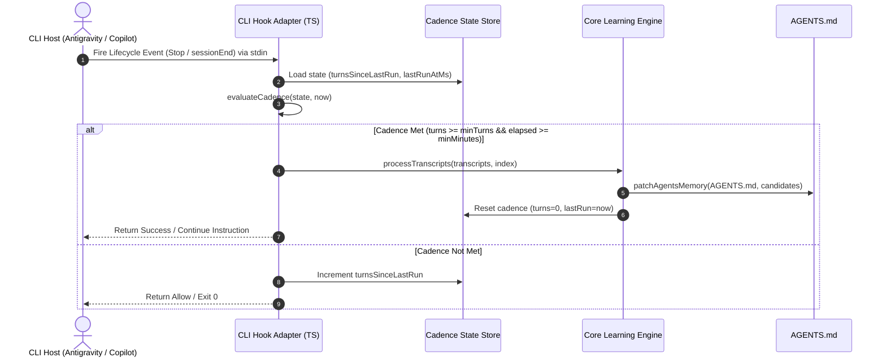

# Specification: Multi-Harness Continual Learning Plugin

## Overview

The Continual Learning Plugin monitors agent conversation lifecycles and incrementally incorporates user corrections and durable workspace invariants into `AGENTS.md`. It executes across both **Antigravity CLI** and **Copilot CLI** using a shared TypeScript core.

Governing Decision: [ADR-001: Multi-Harness Continual Learning Plugin Architecture](../../decisions/adr-001-continual-learning-multi-harness-plugin.md)

---

## 1. Domain Model & Ubiquitous Language

- **Cadence State**: Persistent metadata tracking the number of completed turns, the timestamp of the last learning run, and active trial mode parameters.
- **Transcript Index**: A mapping of transcript paths to their last-analyzed file modification timestamps (`mtime`).
- **Learning Trigger**: An event emitted during agent termination indicating whether memory extraction should execute.
- **In-Place Memory Patch**: A surgical update to `AGENTS.md` modifying or adding bulleted rules without disturbing headings, structure, or unrelated content.

---

## 2. Example Mapping (Normative Business Rules)

### Rule 1: Cadence Gating
Learning runs only when the session turn count and elapsed time exceed configured thresholds, preventing excessive overhead on short interactions.

* **Example 1.1 (Insufficient Turns)**:
  * **Given**: Default minimum turns = 10, minimum minutes = 120. Current turns since last run = 4, elapsed minutes = 150.
  * **When**: The Stop hook evaluates cadence.
  * **Then**: The hook records the new turns, updates state, and does **not** trigger learning.
* **Example 1.2 (Cadence Met)**:
  * **Given**: Turns since last run = 12, elapsed minutes = 130.
  * **When**: The Stop hook evaluates cadence.
  * **Then**: The hook triggers the memory update flow, resets `turnsSinceLastRun` to 0, and records `lastRunAtMs = now()`.
* **Example 1.3 (Trial Mode Active)**:
  * **Given**: `TRIAL_MODE = true`, trial min turns = 3, trial min minutes = 15. Elapsed minutes = 20, turns = 4.
  * **When**: The Stop hook evaluates cadence within the 24-hour trial duration window.
  * **Then**: The trial thresholds govern and learning triggers.
* **Example 1.4 (Trial Mode Expired)**:
  * **Given**: Trial started 25 hours ago (> 24-hour trial duration).
  * **When**: Cadence is evaluated.
  * **Then**: Cadence automatically reverts to default thresholds (10 turns, 120 minutes).

### Rule 2: Incremental Transcript Processing
Only transcripts created or modified after the last indexed run are evaluated.

* **Example 2.1 (Unmodified Transcript Skipped)**:
  * **Given**: Transcript `transcript-123.jsonl` has `mtime` = 1000, and `continual-learning-index.json` records `mtime` = 1000.
  * **When**: Indexer inspects available transcripts.
  * **Then**: `transcript-123.jsonl` is excluded from processing.
* **Example 2.2 (New or Modified Transcript Included)**:
  * **Given**: Transcript `transcript-456.jsonl` has `mtime` = 2500, and is unindexed or indexed at `mtime` = 1500.
  * **When**: Indexer inspects available transcripts.
  * **Then**: `transcript-456.jsonl` is marked for analysis and its index entry updated to 2500 upon completion.
* **Example 2.3 (Stale Index Cleanup)**:
  * **Given**: Indexed file `transcript-old.jsonl` no longer exists on disk.
  * **When**: Index synchronization runs.
  * **Then**: `transcript-old.jsonl` is pruned from `continual-learning-index.json`.

### Rule 3: Surgical In-Place `AGENTS.md` Updates
Memory updates must never rewrite or discard unrelated project sections.

* **Example 3.1 (Matching Bullet Updated In-Place)**:
  * **Given**: `AGENTS.md` contains `- Always use tabs for indentation in YAML`. Transcript records user correction: *"Never use tabs in YAML, strictly use 2 spaces"*.
  * **When**: Memory updater writes the change.
  * **Then**: The existing bullet is replaced in-place with `- Always use 2 spaces for indentation in YAML`. Surrounding text remains byte-identical.
* **Example 3.2 (New Invariant Appended to Category)**:
  * **Given**: A new durable fact is discovered, and existing categories include `## Core Rules`.
  * **When**: Memory updater writes the change.
  * **Then**: The new bullet is appended directly to `## Core Rules` without adding redundant headings.
* **Example 3.3 (Zero-Change No-Op)**:
  * **Given**: Transcripts contain only transient conversation without durable rules or corrections.
  * **When**: Memory updater executes.
  * **Then**: `AGENTS.md` is untouched, returning `"No high-signal memory updates"`.

### Rule 4: Antigravity CLI Lifecycle Hook Contract
The Stop hook must communicate via standard Antigravity protojson contracts over stdin/stdout.

* **Example 4.1 (Clean Stop on Ineligible Cadence)**:
  * **Given**: Antigravity fires `Stop` with `AntigravityStopHookInput` on `stdin`. Cadence check returns false.
  * **When**: `antigravity-hook.ts` completes.
  * **Then**: `stdout` outputs `{"decision": "allow"}` with exit code 0.
* **Example 4.2 (Followup Trigger on Eligible Cadence)**:
  * **Given**: Antigravity fires `Stop`, cadence check returns true.
  * **When**: `antigravity-hook.ts` completes.
  * **Then**: `stdout` outputs `{"decision": "continue", "reason": "Trigger continual-learning skill..."}`.

### Rule 5: Copilot CLI Lifecycle Hook Contract
Copilot CLI discovers `sessionEnd` in `com.github.copilot/hooks/hooks.json`.

* **Example 5.1 (Copilot Session Completion)**:
  * **Given**: Copilot CLI fires `sessionEnd`.
  * **When**: `copilot-hook.ts` executes.
  * **Then**: The script queries the active workspace, evaluates cadence against `.copilot/state/continual-learning.json`, updates transcripts, and exits with 0.

---

## 3. System Sequence Diagram (SSD)

---

## 4. Operation Contracts

### Contract: `evaluateCadence`
* **Inputs**:
  - `state: ContinuousLearningState`
  - `config: CadenceConfig`
  - `currentMs: number`
* **Preconditions**:
  - `state` is loaded from persistent JSON or initialized with zero values.
* **Postconditions**:
  - Returns `shouldRun: boolean`.
  - Computes `isTrialActive`: `true` if `trialMode && (currentMs - trialStartedAtMs < trialDurationMs)`.
  - Selects effective `minTurns` and `minMinutes`.
  - `shouldRun == true` iff `turnsSinceLastRun >= effectiveMinTurns` AND `(currentMs - lastRunAtMs) >= effectiveMinMinutesMs`.

### Contract: `patchAgentsMemory`
* **Inputs**:
  - `agentsPath: string`
  - `bulletsToUpdate: Array<{ targetPattern: RegExp, replacement: string }>`
  - `bulletsToAdd: string[]`
* **Preconditions**:
  - `agentsPath` points to an existing, readable file.
* **Postconditions**:
  - Every matching bullet in `bulletsToUpdate` is substituted in place.
  - New bullets in `bulletsToAdd` are inserted under the appropriate section heading without duplicating existing entries.
  - File is written atomically with preserved line endings.
