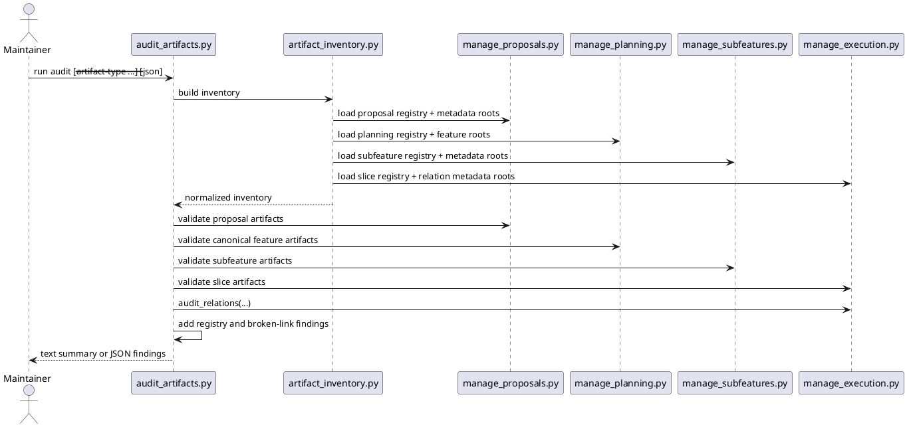

# Implementation Plan: Build the cross-artifact audit command

**Slice**: `aat-cross-artifact-audit`  
**Date**: 2026-04-11  
**Status**: Reviewed for close-slice  
**Spec**: `brief.md`

## 1. Summary

CAM-01 adds a reusable, read-only audit capability for the repository's durable
workflow artifacts. The slice should introduce a shared artifact inventory
helper under `skills/audit-artifacts/`, reuse the existing owner-script
validators for proposals, features, subfeatures, and slices, add cross-artifact
registry/link checks, and ship a user-facing `audit-artifacts` skill plus
installation/docs wiring.

## 2. Technical Context

- Current system context:
  - proposal validation already exists in
    `skills/propose/scripts/manage_proposals.py`
  - feature and subfeature planning validation already exist in
    `skills/guide-planning/scripts/manage_planning.py` and
    `skills/add-subfeature/scripts/manage_subfeatures.py`
  - slice validation and relation auditing already exist in
    `skills/guide-execution/scripts/manage_execution.py`
  - no repo-wide capability currently inventories those artifact layers together
- Target modules / files:
  - `skills/audit-artifacts/SKILL.md`
  - `skills/audit-artifacts/scripts/artifact_inventory.py`
  - `skills/audit-artifacts/scripts/audit_artifacts.py`
  - `skills/audit-artifacts/tests/test_audit_artifacts.py`
  - `README.md`
  - `Makefile`
- Constraints:
  - keep the audit read-only
  - do not duplicate artifact-specific validation logic already owned elsewhere
  - keep the shared inventory output generic enough for later trace/report/repair
    work
  - surface metadata read failures as findings instead of crashing the entire
    audit
- Assumptions:
  - planning and execution config continue to resolve roots through the existing
    owner scripts
  - later subfeatures can import the shared inventory helper from
    `skills/audit-artifacts/scripts/`
- Out of scope:
  - repairing or resyncing registries
  - age-threshold stale policies
  - archival semantics

## 3. Planning Gates

### Architecture / Constraints

- Decision: implement one shared inventory helper plus one audit CLI that wraps
  existing validators and adds cross-artifact checks.
- Result: PASS
- Notes: this keeps the shared model reusable while preserving ownership of
  artifact-specific lifecycle rules in the current scripts.

### Risk / Compliance

- Decision: keep the audit read-only and convert invalid metadata into explicit
  findings.
- Result: PASS
- Notes: the main risk is accidentally coupling the audit to repair behavior or
  failing closed on the first malformed artifact.

### Testability

- Decision: cover clean inventory loading, registry drift, broken proposal or
  subfeature links, relation audit passthrough, and output rendering in a new
  targeted test module, then run the full repo suite.
- Result: PASS
- Notes: every requirement maps to direct fixture-driven assertions and the repo
  already uses `pytest -q`.

## 4. Requirement Traceability

| Requirement | Implementation Steps | Validation |
| --- | --- | --- |
| FR-001 | S001, S004, S006 | V001, V005 |
| FR-002 | S002, S004 | V001, V002 |
| FR-003 | S001, S003, S004 | V001, V002 |
| FR-004 | S003, S004 | V002, V003 |
| FR-005 | S004, S005 | V003, V004 |
| FR-006 | S004, S006 | V001, V005 |

## 5. Execution Plan

### Packet P01: Build the shared artifact inventory

- Scope: add a helper that resolves configured roots, reads registry rows, scans
  on-disk artifact folders, and classifies planning nodes as features or
  subfeatures.
- Target files:
  - `skills/audit-artifacts/scripts/artifact_inventory.py`
  - `skills/audit-artifacts/tests/test_audit_artifacts.py`
- Dependencies: existing proposal/planning/execution owner scripts
- Steps:
  - [x] S001 Load proposal, planning, subfeature, and execution owner modules and
        resolve the active artifact roots from existing config/runtime helpers.
  - [x] S002 Enumerate registry rows and on-disk artifact directories for
        proposals, features, subfeatures, and slices with one normalized
        inventory shape.
  - [x] S003 Record registry-vs-disk mismatch signals and link targets needed by
        the later audit pass.
- Validation:
  - [x] V001 `pytest -q skills/audit-artifacts/tests/test_audit_artifacts.py -k inventory`
- Definition of Done: the slice has a reusable inventory helper that can power
  audit findings without adding a second persistent state model.
- Rollback / Mitigation: keep the helper read-only and local to the new skill so
  reverting it does not disturb existing owner scripts.

### Packet P02: Add the audit engine and outputs

- Scope: create the audit command that delegates owner validation, adds
  cross-artifact checks, reuses slice relation auditing, and renders both human
  and JSON output.
- Target files:
  - `skills/audit-artifacts/scripts/audit_artifacts.py`
  - `skills/audit-artifacts/tests/test_audit_artifacts.py`
- Dependencies: P01
- Steps:
  - [x] S004 Normalize delegated validation results and metadata read failures
        into one finding model with artifact type, category, code, severity, and
        message.
  - [x] S005 Add cross-artifact checks for missing proposal target/promoted
        features, missing subfeature parents, planning/subfeature registry drift,
        and delegated slice relation issues via `audit_relations(...)`.
  - [x] S006 Render grouped human-readable summaries plus `--json` output from
        the same finding set, and use explicit exit codes for clean vs findings
        vs runtime failure.
- Validation:
  - [x] V002 `pytest -q skills/audit-artifacts/tests/test_audit_artifacts.py -k drift`
  - [x] V003 `pytest -q skills/audit-artifacts/tests/test_audit_artifacts.py -k relation`
  - [x] V004 `pytest -q skills/audit-artifacts/tests/test_audit_artifacts.py -k output`
- Definition of Done: maintainers can run one command and get coherent audit
  findings across all supported artifact layers.
- Rollback / Mitigation: keep the audit output derived entirely from in-memory
  findings so later repair/report work can change independently.

### Packet P03: Ship the skill and repo wiring

- Scope: add the user-facing skill definition and make the managed install/docs
  surfaces aware of it.
- Target files:
  - `skills/audit-artifacts/SKILL.md`
  - `README.md`
  - `Makefile`
- Dependencies: P02
- Steps:
  - [x] S007 Author `skills/audit-artifacts/SKILL.md` with audit usage, output
        modes, and guardrails that keep it read-only.
  - [x] S008 Add `audit-artifacts` to the managed skill set and top-level skill
        listing so installation and repo guidance stay aligned.
- Validation:
  - [x] V005 `pytest -q`
- Definition of Done: the new capability is installed, documented, and validated
  as part of the repo-managed skill set.
- Rollback / Mitigation: keep docs and install changes localized to the new
  skill so the rest of the workflow remains unaffected if reverted.

## 6. Supporting Notes

### Detailed Design Diagrams (PlantUML)

- Diagram purpose: show how one audit run combines inventory loading, delegated
  validation, graph checks, and rendering without mutating repo artifacts.
- Diagram type: sequence

### Research Decisions

- Decision: keep the shared helper inside `skills/audit-artifacts/` for the first
  version.
- Rationale: the helper is introduced by this slice, and later subfeatures can
  import it without requiring a separate generic module before the shared shape
  stabilizes.
- Alternative considered: add a repo-wide shared package immediately; rejected
  for now because the output shape can settle through the first audit slice
  before becoming a broader internal contract.

### Data Model Notes

- **Artifact inventory row**
  - Fields / relationships:
    - `artifact_type`
    - `artifact_id`
    - `path`
    - `source` (`registry` / `disk`)
    - `metadata_status` when available
    - link targets such as `target_feature`, `promoted_feature`, or
      `parent_feature_slug`
  - Validation rules:
    - registry and disk views must remain comparable by stable artifact ID and
      normalized relative path

- **Finding**
  - Fields / relationships:
    - `artifact_type`
    - `artifact_id`
    - `path`
    - `category`
    - `code`
    - `severity`
    - `message`
  - Validation rules:
    - one finding must describe one actionable issue
    - the same underlying issue should not be emitted twice from one source

### Interface Notes

- Interface: `python3 skills/audit-artifacts/scripts/audit_artifacts.py`
- Inputs / outputs:
  - input: optional repeated `--artifact-type` filters and optional `--json`
  - output: grouped text summary by default, structured JSON when requested
- Error states / compatibility notes:
  - runtime/config usage failures should exit distinctly from "findings present"
  - owner-script metadata parse failures should become findings, not uncaught
    tracebacks
  - the command must not rewrite registries or metadata

### Verification Scenarios

- Happy path:
  - a clean fixture repo returns no findings and a success exit status
- Edge cases:
  - a promoted proposal points to a missing feature
  - a subfeature registry row points to a missing folder
  - a slice relation target is missing or lacks a reciprocal relation
- Regression checks:
  - human-readable and JSON output describe the same findings
  - `pytest -q` remains green

## 7. Delivery Notes

- Sequencing rationale: stabilize the shared inventory model first, then build
  the audit engine on top, then expose the user-facing skill and install/docs
  wiring.
- Risks to monitor: duplicated findings from registry and validator passes, or
  accidental coupling of read-only audit code to later repair behavior.
- Handoff notes for implementation: keep the finding model generic, keep the
  audit read-only, and prefer importing existing owner helpers over copying
  validation logic.

## 8. Execution Review Outcome

- Outcome: ready for `close-slice`
- Review classification:
  - brief-to-implementation gap: none
  - intent-to-brief gap: none
  - follow-up outside the active slice: none
- Durable artifact note:
  - CAM-01 adds `skills/audit-artifacts/` as a read-only cross-artifact audit
    capability with a reusable inventory helper, delegated owner validation,
    registry/link checks, and human/JSON output surfaces.
- Validation evidence:
  - `pytest -q skills/audit-artifacts/tests/test_audit_artifacts.py`
  - `pytest -q`
