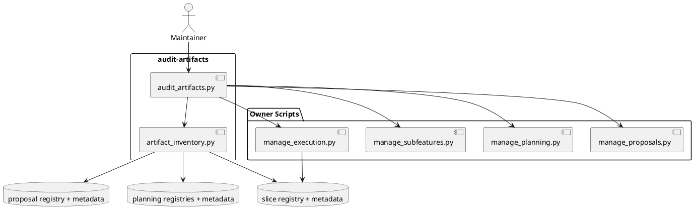

# System Design: Audit Artifacts

## Design summary

`audit-artifacts` adds one read-only cross-artifact audit capability for the
repository's durable workflow packets. The design introduces a scope-aware
artifact inventory helper that enumerates proposals, canonical features,
subfeatures, and execution slices from the existing registry and metadata files,
then combines delegated per-artifact validation with cross-artifact link and
registry-drift checks.

The first version is intentionally conservative:

- reuse existing validators where they already encode artifact-state rules
- add only read-only graph checks on top
- emit structured findings instead of mutating artifacts directly

## Goals and non-goals

### Goals

- Audit proposals, features, subfeatures, and slices in one pass.
- Reuse `manage_proposals.py`, `manage_planning.py`,
  `manage_subfeatures.py`, and `manage_execution.py` as the source of truth for
  artifact-specific rules.
- Detect registry drift, missing required files, invalid metadata packets, and
  broken cross-artifact links.
- Produce machine-usable findings that later `report-artifacts` and
  `repair-artifacts` work can reuse.

### Non-goals

- Write or repair registries as part of the audit run.
- Introduce age-based stale policies that depend on project-specific thresholds.
- Replace slice relation auditing already owned by `manage_execution.py`.
- Invent a second persistent state store for artifact health.

## Architecture

### 1. Scope-aware artifact inventory

The audit capability should resolve artifact roots from the same repository
configuration already used elsewhere:

- proposal root from `skills/propose/scripts/manage_proposals.py`
- planning root from `skills/guide-planning/scripts/manage_planning.py`
- slice root from `skills/guide-execution/scripts/manage_execution.py`

The inventory helper should collect two complementary views:

1. registry rows from the existing machine-readable registries
2. on-disk artifact directories discovered under those roots

That dual view lets the audit surface both:

- registry entries pointing to missing paths
- orphan artifact directories missing from registries

The next revision should add one more distinction inside slice inventory:

- **active execution slices** that are still expected to exist on disk
- **retained historical slices** that have already been summarized into
  planning-layer docs and may no longer have a backing directory

Planning artifacts should be classified as:

- **feature** when `.planning-meta.json` exists without `.subfeature-meta.json`
- **subfeature** when `.subfeature-meta.json` exists

### 2. Delegated artifact validation

Artifact-specific lifecycle validation should stay in the existing owner scripts.
The audit layer should call those validators and normalize their output into a
shared finding shape:

- proposals -> `validate_proposal(...)`
- features -> `validate_feature(...)`
- subfeatures -> `validate_subfeature_state(...)`
- slices -> `validate_slice(...)`

Invalid JSON or other metadata read failures should become explicit findings for
that artifact instead of terminating the entire audit.

### 3. Cross-artifact graph checks

On top of delegated validators, the audit should add repo-wide consistency
checks that no single workflow helper can see in isolation:

- proposal `target_feature` or `promoted_feature` points to a missing canonical
  feature
- subfeature `parent_feature_slug` points to a missing or mismatched parent
  feature
- feature-local `subfeatures/registry.json` disagrees with the actual
  subfeature folders
- top-level planning registry disagrees with actual feature and subfeature
  planning folders
- execution slice relations have missing targets or missing reciprocal links via
  `audit_relations(...)`

Findings should distinguish:

- `validation` findings from delegated owner checks
- `registry_drift` findings from registry-vs-disk mismatches
- `broken_link` findings from missing parent/target references
- `relation` findings from slice relation audits

Archived slice pruning should not be reported as `missing_slice_directory` when
all of the following are true:

- the slice is no longer part of the active execution inventory
- the owning feature or subfeature retains the summarized history in
  `system-design.md`
- the remaining retained metadata marks the slice as intentionally summarized or
  pruned rather than accidentally missing

### 4. Read-only audit command

The first user-facing surface should be a dedicated skill and script:

```text
skills/audit-artifacts/
  SKILL.md
  scripts/audit_artifacts.py
  scripts/artifact_inventory.py
  tests/test_audit_artifacts.py
```

Recommended CLI shape:

```bash
python3 skills/audit-artifacts/scripts/audit_artifacts.py
python3 skills/audit-artifacts/scripts/audit_artifacts.py --artifact-type proposal --artifact-type slice
python3 skills/audit-artifacts/scripts/audit_artifacts.py --json
```

Default output should be a concise human-readable summary with findings grouped
by artifact type. `--json` should emit the same findings in a stable
machine-readable structure for later automation.

## Interfaces and dependencies

- **`artifact_inventory.py`**
  - resolves artifact roots through the existing owner scripts
  - enumerates registry rows and on-disk artifact folders
  - classifies planning artifacts into features and subfeatures

- **`audit_artifacts.py`**
  - invokes delegated validators
  - runs cross-artifact graph checks
  - renders human-readable or JSON output
  - exits non-zero when findings are present

- **Existing owner scripts**
  - remain the source of truth for artifact-specific metadata validation
  - are imported, not copied

## Data flow, state, and lifecycle

1. Resolve scope-aware roots for proposals, planning, and slices.
2. Build an in-memory artifact inventory from registry rows and on-disk folders.
3. Run delegated validators for each artifact that has a recognizable metadata
   packet.
4. Run cross-artifact checks across proposals, features, subfeatures, and slice
   relations.
5. Emit findings and summary counts.

The audit is read-only. It does not change lifecycle metadata, resync
registries, or update review state.

## Failure handling and operational constraints

- Missing or invalid metadata must be surfaced as findings, not hidden behind
  silent skips.
- The audit should continue collecting findings after an artifact-local failure
  so users get one coherent report.
- Missing registry files should be reported explicitly because later repair work
  depends on those findings.
- The first version should avoid time-threshold-based "stale" heuristics because
  those belong in project-local conventions or future reporting overlays.
- The audit must not force repositories to keep archived slice directories
  forever once planning-layer summaries have become the retained source of
  history.

## Risks, assumptions, and open questions

- Repositories with partially hand-managed artifact trees may produce orphan-dir
  findings that are warnings rather than hard errors.
- Future subfeatures will want to reuse the inventory helper, so its output
  shape should stay generic and not be audit-specific.
- If later repos want stricter stale-state rules, those should be added as
  configurable overlays rather than hardcoded age thresholds.
- If prune semantics rely only on deleted directories and no retained tombstone
  signal, the audit layer will not be able to tell intentional cleanup from
  accidental loss.

## Validation strategy

- Add unit tests for:
  - missing promoted-feature targets
  - planning or subfeature registry drift
  - slice relation findings delegated from `audit_relations(...)`
  - human-readable and JSON output summaries
- Validate the repository with `pytest -q`.

## Summary

`audit-artifacts` should become the shared read-only inspection layer for the
repo's workflow packets. It stays generic by reusing existing validators,
centralizes cross-artifact consistency checks in one place, and produces
structured findings that later trace, report, and repair flows can build on.

## PlantUML


