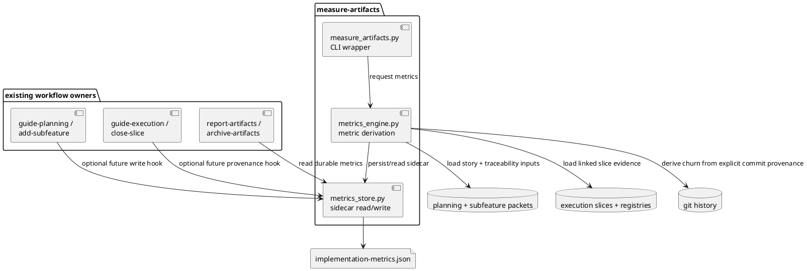
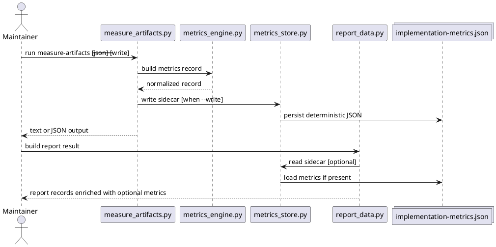
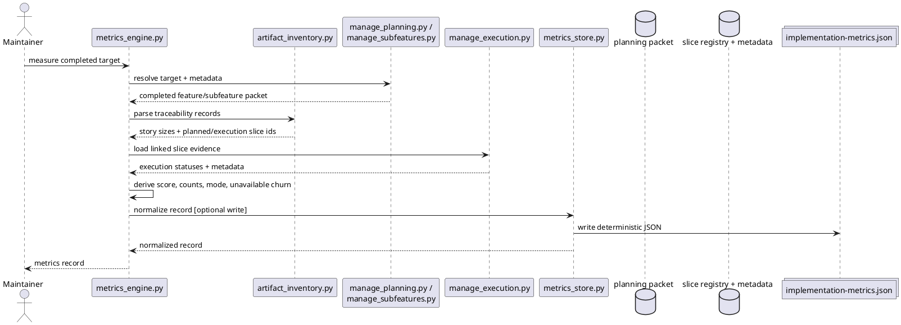

# System design: Measure Artifacts

## Design summary

`measure-artifacts` adds a reusable evidence layer for completed features and
subfeatures. The core design decision is to compute implementation metrics from
existing planning and execution artifacts, then persist the result in a
dedicated sidecar metrics file instead of overloading owner metadata such as
`.planning-meta.json`, `.subfeature-meta.json`, or `.slice-meta.json`.

This keeps lifecycle ownership intact while making implementation evidence
durable enough for later reporting, archival summaries, workflow calibration,
and eventual agent-level improvement of `guide-scope`, `guide-planning`, and
`guide-execution`.

The first version is intentionally conservative:

1. it records evidence but does not change workflow policy automatically
2. it prefers deterministic, durable inputs over agent memory or heuristics
3. it treats some metrics as unavailable rather than inventing low-confidence
   values
4. it keeps repository-specific decision thresholds out of the generic core

## Goals and non-goals

### Goals

- Compute durable implementation metrics for completed features and subfeatures.
- Reuse existing planning, subfeature, and execution artifacts as the main
  evidence sources.
- Persist metrics in a dedicated sidecar file that reporting and archival flows
  can reuse.
- Capture enough evidence to compare direct implementation with
  `guide-execution`-driven work later.
- Preserve generic-first behavior and avoid hardcoded workflow decisions.

### Non-goals

- Automatically deciding whether a repository must skip or require
  `guide-execution`.
- Silent self-modification of workflow skills.
- Replacing owner-managed lifecycle metadata with one monolithic metrics store.
- Treating raw code size as the only indicator of workflow quality.
- Requiring every repository to adopt custom thresholds or extra config before
  the feature is useful.

## Architecture

### Component model

The subfeature adds one new skill and one reusable evidence model on top of the
existing cross-artifact management layer.



### Major design choice

The durable evidence artifact is a new sidecar file named
`implementation-metrics.json` stored alongside the completed feature or
subfeature packet.

Why this is the preferred shape:

- planning and execution lifecycle owners keep ownership of their existing
  metadata
- consumers such as `report-artifacts` and `archive-artifacts` get one stable
  place to read evidence
- metrics can evolve without redefining status semantics in owner metadata
- low-confidence or partial metrics can be represented explicitly without
  implying lifecycle drift

## Interfaces and dependencies

### New skill surface

The future skill should live at:

```text
skills/measure-artifacts/
```

Expected wrapper behavior:

- resolve a completed feature or subfeature
- compute the requested evidence set
- optionally persist the result to `implementation-metrics.json`
- emit text or JSON for downstream consumers

Expected modes:

- **read-only compute mode** for preview and inspection
- **explicit write mode** to persist the sidecar artifact

Default behavior should stay conservative and avoid mutation unless the caller
asks for persistence explicitly.

### Metrics record shape

The sidecar file should store one normalized record per feature or subfeature.

Recommended shape:

```json
{
  "artifact_type": "feature",
  "artifact_id": "planning-workflow",
  "computed_at": "2026-04-18T01:00:00",
  "status": "implemented",
  "execution_mode": "guided",
  "story_size": {
    "weights": { "S": 1, "M": 3, "L": 5 },
    "sum_points": 8,
    "unsupported_sizes": []
  },
  "slices": {
    "planned_count": 3,
    "linked_slice_ids": ["SLICE-01", "SLICE-02", "SLICE-03"]
  },
  "implementation_churn": {
    "added_lines": 120,
    "deleted_lines": 45,
    "total_changed_lines": 165,
    "source_commit_shas": ["abc123", "def456"],
    "confidence": "high"
  },
  "workflow_outcomes": {
    "follow_up_fix_count": null,
    "review_findings_count": null,
    "planning_drift": null
  }
}
```

Key rules:

- `story_size.sum_points` uses the fixed mapping `S=1`, `M=3`, `L=5`
- `XL` is not accepted as a valid final metric input and should surface as an
  unsupported size requiring prior slice/story refinement
- low-confidence or unavailable values should stay explicit (`null` plus a
  confidence field), not be guessed silently

### Input dependencies

The design reuses existing durable artifacts in this order:

1. **Planning/subfeature packet**
   - `discover.md`
   - `system-design.md`
   - `slice-planning.md`
   - `slice-traceability.md`
   - `.planning-meta.json`
   - `.subfeature-meta.json` when the target is a subfeature
2. **Execution evidence**
   - `slices/registry.json`
   - linked slice folders and `.slice-meta.json`
3. **Git history**
   - only when explicit commit provenance is available for the target artifact

### Story-size source

The canonical source for story-size derivation should be
`slice-traceability.md`, because it already carries story-level decomposition
including story sizes in the current repo-native workflow.

For subfeatures, the engine should resolve story sizes from:

- subfeature-local traceability when present
- otherwise the subfeature metadata's `affected_story_ids` plus the parent
  feature's planning artifacts

If no durable story-size source exists, the metric should be marked unavailable
instead of parsed from ad hoc prose.

### Slice-count source

Slice count should be derived from the planned slice IDs listed in
`slice-traceability.md` or `slice-planning.md`.

The first version should distinguish:

- `planned_count`
- `linked_slice_ids`

It should avoid inventing a second lifecycle model for slice completion.

## Configuration surfaces and ownership

This subfeature should add no repository-wide configuration in the first
version.

### Existing typed owners to preserve

- `.skills/planning.json` continues to own planning layout
- `.skills/execution.json` continues to own slice layout and execution defaults
- owner metadata files continue to own lifecycle status

### New control surface policy

- metric derivation defaults should be fixed and documented
- persistence should be controlled by an explicit CLI/apply flag, not hidden
  behind implicit mutation
- repository-specific interpretation of the metrics belongs in higher-level
  reporting or future workflow-evaluation layers, not the measurement engine

### Explicit ownership boundary

`implementation-metrics.json` is owned by `measure-artifacts`. Other skills may
read it, but they should not mutate it directly.

## Data flow, state, and lifecycle

### Ownership scope

- **Metric computation engine**: per invocation
- **Metrics sidecar**: one file per completed feature or subfeature
- **Planning and execution artifacts**: existing durable sources of truth owned
  elsewhere

### Lifecycle model

1. The caller selects a completed feature or subfeature.
2. `measure-artifacts` loads its planning packet and any linked subfeature
   metadata.
3. The engine derives story-size and slice-count metrics from planning
   traceability.
4. The engine resolves linked execution slices and determines an
   `execution_mode` classification:
   - `guided` when slice-backed execution evidence exists
   - `direct` when the artifact is implemented without linked slices
   - `mixed` when both forms of evidence are present
   - `unknown` when durable evidence is insufficient
5. If explicit commit provenance exists, the engine derives implementation churn
   from Git diff stats; otherwise churn remains unavailable or partial.
6. The engine returns the metrics record.
7. In write mode, the sidecar file is updated deterministically.

### Execution-mode classification

The first version should record execution mode as a descriptive evidence field,
not as a normative decision:

- `guided`
- `direct`
- `mixed`
- `unknown`

This is the bridge from raw artifact evidence to later workflow calibration.

### Churn definition

The design chooses **diff churn** as the implementation line-count metric:

- `added_lines`
- `deleted_lines`
- `total_changed_lines = added + deleted`

Why churn is preferred over final LOC:

- it reflects work performed for the artifact more closely than end-state size
- it avoids conflating pre-existing file size with implementation effort
- it works for both additive and refactoring-heavy changes when commit
  provenance exists

### Provenance requirement

High-confidence churn metrics require explicit commit provenance. The first
version should not attempt weak guesswork from repository-wide date ranges or
branch heuristics.

Acceptable provenance sources can later include:

- execution slice metadata extended with commit SHAs
- explicit artifact-finalization input that records relevant commit SHAs

Without provenance, churn should remain `null` with confidence `unavailable`.

## Failure handling and operational constraints

### Error handling policy

- **Target artifact missing**: fail explicitly
- **Artifact not implemented/finalized yet**: fail explicitly or warn in
  read-only mode, depending on CLI intent
- **Traceability missing**: compute only the fields that remain high-confidence
- **Unsupported story size (`XL`)**: fail validation for size-score computation
- **Commit provenance missing**: record churn as unavailable instead of guessing
- **Sidecar write conflict or parse failure**: fail explicitly and preserve the
  prior sidecar file

### Operational constraints

- Measurement must stay reproducible from durable artifacts.
- The sidecar file must never become the owner of lifecycle status.
- Read-only consumers such as `report-artifacts` should be able to tolerate a
  missing metrics file gracefully.

## Alternatives considered

### 1. Store metrics directly in owner metadata

Rejected as the default because it expands the semantic surface of
`.planning-meta.json`, `.subfeature-meta.json`, and `.slice-meta.json` beyond
their current ownership role.

### 2. Compute metrics only on the fly with no persistence

Rejected because later reporting, archival, and workflow-improvement flows need
durable evidence that can be reused consistently.

### 3. Infer churn heuristically from time windows or changed files

Rejected because low-confidence inference would look precise while being
operationally brittle.

## Risks, assumptions, and open questions

### Risks

- Existing repositories may not yet record enough provenance to compute churn
  consistently.
- Markdown-table parsing for story sizes and slice counts can be brittle if
  traceability structure drifts.
- Repositories may over-interpret raw metrics without also tracking outcome
  signals such as review findings or follow-up fixes.

### Assumptions

- `slice-traceability.md` is the best available durable source for story-size
  and slice-count derivation.
- Repositories will accept explicit `null` / partial metrics when evidence is
  incomplete.
- A later feature can add richer outcome signals without replacing the sidecar
  format entirely.

### Open questions

1. Should `close-slice` or a future artifact-finalization skill be the owner of
   commit-provenance capture?
2. Is a shared repo-local workflow-state library the right place to host metric
   derivation once the logic grows beyond one skill?
3. Which outcome signals should become first-class in the initial sidecar:
   review findings, follow-up fixes, or planning drift?

## Validation strategy

- fixture-driven tests for:
  - story-size parsing and unsupported-size rejection
  - slice-count derivation
  - execution-mode classification
  - churn computation when explicit commit provenance is present
  - sidecar read/write stability
- integration tests covering feature and subfeature targets
- repository validation through `pytest -q`

## Summary

`measure-artifacts` should become the generic reusable evidence layer for
completed features and subfeatures. Its main contribution is not workflow
automation; it is durable, explicit measurement that later reporting,
archiving, and workflow-improvement capabilities can trust and reuse.

<!-- archived-slice-summaries:start -->
## Archived Slice Summaries

<!-- archived-slice-summary:mea-metrics-consumers:start -->
### `mea-metrics-consumers`: Wire measure-artifacts skill and reporting consumers

#### Work Item Summary

- **Work Item**: Expose the new metrics foundation through a user-facing `measure-artifacts` skill and let `report-artifacts` reuse persisted metrics when they exist
- **Source Story / Increment / Slice**: `CAM-06` / `I2` / `mea-metrics-consumers`
- **Requested Outcome**: As a maintainer, I want to run `measure-artifacts` directly for a completed feature or subfeature and see those persisted metrics appear in reporting output so workflow evidence becomes reusable instead of hidden behind internal helpers.
- **Why this matters**: The foundation slice creates the evidence model, but the capability is not yet usable or visible to maintainers until the CLI, skill definition, and first consumer are wired.
- **Independent Test**: Run the `measure-artifacts` and `report-artifacts` test modules and confirm the CLI emits text/JSON output, write mode persists the sidecar, and reporting includes the persisted metrics without mutating lifecycle ownership.

#### Detailed Design Summary

`mea-metrics-consumers` turns the foundation measurement engine into a usable repository capability. This slice should add the user-facing `measure-artifacts` skill and CLI, expose text/JSON plus explicit write mode, enrich `report-artifacts` with optional persisted metrics, and wire the new skill into repo install/docs surfaces.

#### Blueprint Figures


<!-- archived-slice-summary:mea-metrics-consumers:end -->

<!-- archived-slice-summary:mea-metrics-foundation:start -->
### `mea-metrics-foundation`: Build metrics record and sidecar engine

#### Work Item Summary

- **Work Item**: Establish the durable metrics record, derivation rules, and sidecar persistence model for `measure-artifacts`
- **Source Story / Increment / Slice**: `CAM-06` / `I1` / `mea-metrics-foundation`
- **Requested Outcome**: As a maintainer, I want completed features and subfeatures to produce a stable `implementation-metrics.json` record for story size, slice count, execution mode, and churn availability so later reporting can reuse high-confidence workflow evidence.
- **Why this matters**: The subfeature cannot compare guided and direct implementation or support later reporting unless the reusable evidence model exists first.
- **Independent Test**: Run `measure-artifacts` foundation tests against fixture planning and execution packets and confirm the computed sidecar content is deterministic, preserves unsupported or unavailable values explicitly, and writes the same normalized record on repeated runs.

#### Detailed Design Summary

`mea-metrics-foundation` establishes the reusable evidence model behind the future `measure-artifacts` capability. This slice should add the internal measurement modules under `skills/measure-artifacts/`, derive story-size, planned-slice, linked-slice, and execution-mode metrics from existing planning and execution artifacts, persist deterministic `implementation-metrics.json` sidecars, and ship fixture-driven tests that keep unavailable or unsupported inputs explicit.

#### Blueprint Figures


<!-- archived-slice-summary:mea-metrics-foundation:end -->

<!-- archived-slice-summaries:end -->
