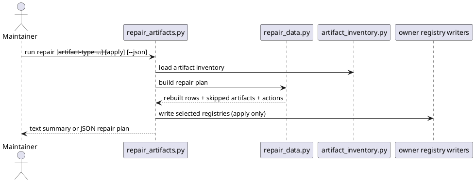

# Implementation Plan: Build the cross-artifact repair command

**Slice**: `rpr-registry-drift-repair`  
**Date**: 2026-04-11  
**Status**: Reviewed for close-slice  
**Spec**: `brief.md`

## 1. Summary

CAM-04 adds a conservative repair layer for the repo's active registries. The
slice should reuse shared artifact discovery, rebuild normalized rows from valid
metadata, preview registry repair plans by default, optionally write them
through the existing owner helpers, and ship a `repair-artifacts` skill and
CLI with text and JSON output.

## 2. Technical Context

- Current system context:
  - `skills/audit-artifacts/scripts/artifact_inventory.py` already inventories
    proposals, features, subfeatures, and slices
  - owner scripts already define the canonical active registry row shapes and
    README/JSON writers
  - no supported repo-wide repair command currently rebuilds those registries
- Target modules / files:
  - `skills/repair-artifacts/SKILL.md`
  - `skills/repair-artifacts/scripts/repair_data.py`
  - `skills/repair-artifacts/scripts/repair_artifacts.py`
  - `skills/repair-artifacts/tests/test_repair_artifacts.py`
  - `Makefile`
  - `README.md`
- Constraints:
  - default to dry-run
  - do not rewrite semantic planning content or malformed metadata
  - keep apply mode limited to derived registry/readme artifacts
- Assumptions:
  - valid metadata is sufficient to rebuild active registry rows
  - owner registry writers should remain the only formatting authority
- Out of scope:
  - semantic metadata correction
  - archive flows
  - silent force sync

## 3. Planning Gates

### Architecture / Constraints

- Decision: build one repair-plan helper that reconstructs registry rows from
  valid metadata and lets each owner script perform the actual writes.
- Result: PASS
- Notes: this keeps repair conservative and aligned with the current registry
  formats.

### Risk / Compliance

- Decision: malformed metadata becomes a skipped artifact and manual follow-up,
  not an inferred fix.
- Result: PASS
- Notes: the main risk is over-repairing ambiguous human intent.

### Testability

- Decision: cover dry-run planning, proposal/feature/subfeature/slice repair
  application, and skipped malformed metadata in a targeted test module, then
  run `pytest -q`.
- Result: PASS
- Notes: fixture-driven tests can corrupt registries safely and verify repaired
  outputs.

## 4. Requirement Traceability

| Requirement | Implementation Steps | Validation |
| --- | --- | --- |
| FR-001 | S001, S004, S007 | V001, V004 |
| FR-002 | S003, S004 | V001 |
| FR-003 | S001, S002, S005 | V002, V003 |
| FR-004 | S002, S005 | V002, V003 |
| FR-005 | S003, S004 | V001 |
| FR-006 | S005, S007 | V004 |

## 5. Execution Plan

### Packet P01: Build the repair plan model

- Scope: discover valid artifacts, rebuild normalized rows, and record skipped
  malformed metadata.
- Target files:
  - `skills/repair-artifacts/scripts/repair_data.py`
  - `skills/repair-artifacts/tests/test_repair_artifacts.py`
- Dependencies: `skills/audit-artifacts/scripts/artifact_inventory.py`
- Steps:
  - [x] S001 Discover proposal, feature, subfeature, and slice directories from
        the shared inventory.
  - [x] S002 Rebuild normalized active registry rows from valid metadata using
        owner-script row shapes.
  - [x] S003 Record skipped malformed metadata and planned write actions per
        artifact layer.
- Validation:
  - [x] V001 `pytest -q skills/repair-artifacts/tests/test_repair_artifacts.py -k dry_run`
- Definition of Done: one repair-plan model can preview all supported registry
  rebuilds from durable inputs.
- Rollback / Mitigation: keep the model read-only until apply mode is explicitly
  requested.

### Packet P02: Add the repair CLI and apply flow

- Scope: expose dry-run and apply modes plus text/JSON rendering.
- Target files:
  - `skills/repair-artifacts/scripts/repair_artifacts.py`
  - `skills/repair-artifacts/tests/test_repair_artifacts.py`
- Dependencies: P01
- Steps:
  - [x] S004 Render human-readable and JSON repair plans from one result shape.
  - [x] S005 On `--apply`, write rebuilt registries/readmes through the owner
        scripts' registry writers.
  - [x] S006 Keep apply mode limited to the selected active registry surfaces.
- Validation:
  - [x] V002 `pytest -q skills/repair-artifacts/tests/test_repair_artifacts.py -k apply`
  - [x] V003 `pytest -q skills/repair-artifacts/tests/test_repair_artifacts.py -k slice`
- Definition of Done: maintainers can preview and explicitly apply supported
  registry repairs from one command.
- Rollback / Mitigation: keep writes localized to the selected registry layers.

### Packet P03: Ship the skill and repo wiring

- Scope: add the user-facing skill definition and managed install/docs wiring.
- Target files:
  - `skills/repair-artifacts/SKILL.md`
  - `Makefile`
  - `README.md`
- Dependencies: P02
- Steps:
  - [x] S007 Author `skills/repair-artifacts/SKILL.md` with dry-run/apply usage
        and conservative guardrails.
  - [x] S008 Add `repair-artifacts` to the managed skill set and top-level repo
        guidance.
- Validation:
  - [x] V004 `pytest -q`
- Definition of Done: the repair capability is installed, documented, and
  validated in the managed skill set.
- Rollback / Mitigation: keep docs and install changes localized to the new
  skill.

## 6. Supporting Notes

### Detailed Design Diagrams (PlantUML)

- Diagram purpose: show how repair plans rebuild active registries from durable
  directories and valid metadata while keeping apply mode explicit.
- Diagram type: sequence

### Research Decisions

- Decision: keep malformed metadata out of rebuilt rows.
- Rationale: the repair tool should regenerate derived artifacts, not guess at
  semantic corrections.
- Alternative considered: force-normalize malformed metadata into default rows;
  rejected because it would hide real drift.

### Interface Notes

- Interface: `python3 skills/repair-artifacts/scripts/repair_artifacts.py`
- Inputs / outputs:
  - input: optional repeated `--artifact-type`, optional `--apply`, optional
    `--json`
  - output: dry-run repair plan by default, structured JSON when requested
- Error states / compatibility notes:
  - unreadable metadata should become skipped follow-up items
  - apply mode must only touch derived registry/readme artifacts

### Verification Scenarios

- Happy path:
  - preview a repair plan for broken registries and confirm the planned actions
- Edge cases:
  - apply repair for proposals/features/subfeatures/slices
  - skip malformed metadata without blocking repair of other layers
- Regression checks:
  - text and JSON output describe the same repair plan
  - `pytest -q` remains green

## 7. Delivery Notes

- Sequencing rationale: build the repair-plan model first, then add CLI/apply
  handling, then expose the user-facing skill and install/docs wiring.
- Risks to monitor: accidental writes beyond derived registries, or skipped
  malformed metadata not being visible enough to the maintainer.
- Handoff notes for implementation: keep dry-run first, keep writes narrow, and
  keep owner scripts in charge of registry formatting.

## 8. Execution Review Outcome

- Outcome: ready for `close-slice`
- Review classification:
  - brief-to-implementation gap: none
  - intent-to-brief gap: none
  - follow-up outside the active slice: none
- Durable artifact note:
  - CAM-04 adds `skills/repair-artifacts/` as a conservative dry-run/apply
    repair capability that rebuilds active registries/readmes from durable
    directories plus valid metadata while surfacing malformed metadata as manual
    follow-up.
- Validation evidence:
  - `pytest -q skills/repair-artifacts/tests/test_repair_artifacts.py`
  - `pytest -q`
