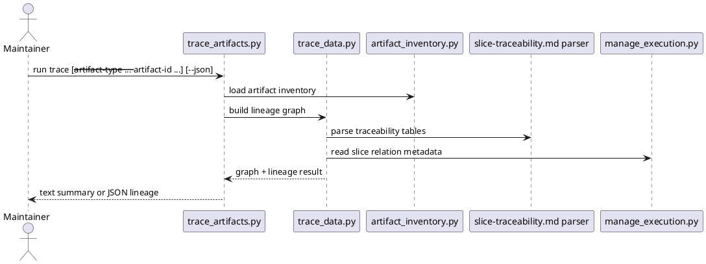

# Implementation Plan: Build the cross-artifact trace command

**Slice**: `tat-trace-artifact-lineage`  
**Date**: 2026-04-11  
**Status**: Reviewed for close-slice  
**Spec**: `brief.md`

## 1. Summary

CAM-02 adds a reusable lineage capability for the repo's durable workflow
artifacts. The slice should reuse the shared audit inventory, parse
`slice-traceability.md` files into a normalized relation shape, build a typed
lineage graph, and ship a `trace-artifacts` skill and CLI for targeted and
summary output.

## 2. Technical Context

- Current system context:
  - `skills/audit-artifacts/scripts/artifact_inventory.py` already inventories
    proposals, features, subfeatures, and slices
  - proposal metadata records `target_feature` and `promoted_feature`
  - subfeature metadata records `parent_feature_slug`
  - planning docs record planned and execution slice mappings in
    `slice-traceability.md`
  - slice metadata already records cross-slice relations
- Target modules / files:
  - `skills/trace-artifacts/SKILL.md`
  - `skills/trace-artifacts/scripts/trace_data.py`
  - `skills/trace-artifacts/scripts/trace_artifacts.py`
  - `skills/trace-artifacts/tests/test_trace_artifacts.py`
  - `Makefile`
  - `README.md`
- Constraints:
  - keep the trace read-only
  - reuse the shared inventory instead of duplicating discovery logic
  - parse traceability docs by named columns so current table variants still work
  - do not invent unsupported lineage edges
- Assumptions:
  - planned slices can be represented as typed graph nodes even though they are
    not directories
  - later reporting can reuse the same lineage graph helper
- Out of scope:
  - repair actions
  - archive actions
  - story-level graph nodes beyond traceability row context

## 3. Planning Gates

### Architecture / Constraints

- Decision: build one lineage graph helper on top of the shared inventory and
  traceability parser, then expose targeted and summary query modes through one
  CLI.
- Result: PASS
- Notes: this keeps trace as the read-only graph layer while preserving source
  ownership in the existing planning and execution surfaces.

### Risk / Compliance

- Decision: only create edges from durable repo signals and fail clearly for
  missing requested targets.
- Result: PASS
- Notes: the main risk is accidental inference from incomplete docs, so the
  parser and graph builder must stay source-aware.

### Testability

- Decision: cover proposal/feature lineage, subfeature/planned-slice lineage,
  execution-slice lineage, and JSON/text output in a targeted test module, then
  run the full repo suite.
- Result: PASS
- Notes: fixture-driven tests can build the needed planning docs and slice
  metadata without requiring live repository state.

## 4. Requirement Traceability

| Requirement | Implementation Steps | Validation |
| --- | --- | --- |
| FR-001 | S001, S004, S007 | V001, V004 |
| FR-002 | S001, S003, S004 | V001, V002 |
| FR-003 | S002, S003, S004 | V001, V002, V003 |
| FR-004 | S004, S005 | V003, V004 |
| FR-005 | S005 | V002 |
| FR-006 | S004, S007 | V004 |

## 5. Execution Plan

### Packet P01: Parse durable lineage inputs

- Scope: reuse the shared inventory and add a generic parser for
  `slice-traceability.md` rows.
- Target files:
  - `skills/trace-artifacts/scripts/trace_data.py`
  - `skills/trace-artifacts/tests/test_trace_artifacts.py`
- Dependencies: `skills/audit-artifacts/scripts/artifact_inventory.py`
- Steps:
  - [x] S001 Reuse the shared inventory helper to load proposals, features,
        subfeatures, and slices from their durable roots.
  - [x] S002 Parse `slice-traceability.md` tables by header names and normalize
        planned/execution slice mappings into a reusable row shape.
  - [x] S003 Collect metadata-backed lineage edges for proposals, subfeatures,
        planned slices, execution slices, and slice relations.
- Validation:
  - [x] V001 `pytest -q skills/trace-artifacts/tests/test_trace_artifacts.py -k lineage`
- Definition of Done: the slice has one reusable lineage-input layer built from
  inventory plus traceability parsing.
- Rollback / Mitigation: keep the parser tolerant of table variants and local to
  the new trace skill so the broader repo remains unaffected if reverted.

### Packet P02: Add the trace query CLI

- Scope: build targeted and summary query modes plus shared human/JSON output.
- Target files:
  - `skills/trace-artifacts/scripts/trace_artifacts.py`
  - `skills/trace-artifacts/tests/test_trace_artifacts.py`
- Dependencies: P01
- Steps:
  - [x] S004 Build a typed lineage graph and targeted query path for proposal,
        feature, subfeature, planned-slice, and execution-slice targets.
  - [x] S005 Add summary output for the discovered lineage graph and clear
        failures for missing requested targets.
  - [x] S006 Render text and JSON output from the same lineage result structure.
- Validation:
  - [x] V002 `pytest -q skills/trace-artifacts/tests/test_trace_artifacts.py -k targeted`
  - [x] V003 `pytest -q skills/trace-artifacts/tests/test_trace_artifacts.py -k output`
- Definition of Done: maintainers can trace one artifact or summarize the repo's
  lineage graph from one read-only command.
- Rollback / Mitigation: keep summary and targeted output derived from the same
  graph so future changes do not fork the data model.

### Packet P03: Ship the skill and repo wiring

- Scope: add the user-facing skill definition and managed install/docs wiring.
- Target files:
  - `skills/trace-artifacts/SKILL.md`
  - `Makefile`
  - `README.md`
- Dependencies: P02
- Steps:
  - [x] S007 Author `skills/trace-artifacts/SKILL.md` with targeted and summary
        usage plus read-only guardrails.
  - [x] S008 Add `trace-artifacts` to the managed skill set and top-level repo
        guidance.
- Validation:
  - [x] V004 `pytest -q`
- Definition of Done: the trace capability is installed, documented, and covered
  by the repo suite.
- Rollback / Mitigation: keep docs and install wiring localized to the new skill.

## 6. Supporting Notes

### Detailed Design Diagrams (PlantUML)

- Diagram purpose: show how trace combines shared inventory, traceability docs,
  and slice relations into one lineage graph.
- Diagram type: sequence

### Research Decisions

- Decision: keep planned slices as explicit graph nodes instead of treating them
  as plain annotations.
- Rationale: the feature's durable lineage explicitly includes planned slices,
  and later reporting will need that intermediate node type.
- Alternative considered: only link subfeatures directly to execution slices;
  rejected because it hides the planning-to-execution boundary.

### Interface Notes

- Interface: `python3 skills/trace-artifacts/scripts/trace_artifacts.py`
- Inputs / outputs:
  - input: optional `--artifact-type`, optional `--artifact-id`, optional `--json`
  - output: targeted lineage or summary lineage in text by default, JSON when
    requested
- Error states / compatibility notes:
  - missing requested targets must fail clearly
  - absent lineage links should return a minimal result instead of synthetic
    edges
  - trace remains read-only

### Verification Scenarios

- Happy path:
  - trace a proposal and confirm the linked feature lineage is returned
- Edge cases:
  - trace a subfeature and confirm planned/execution slice lineage comes from
    `slice-traceability.md`
  - request a missing target artifact and confirm the CLI fails clearly
- Regression checks:
  - summary and targeted output are derived from the same graph
  - `pytest -q` remains green

## 7. Delivery Notes

- Sequencing rationale: parse durable lineage inputs first, then build the query
  surface on top, then expose the user-facing skill and install/docs wiring.
- Risks to monitor: over-parsing traceability tables that do not contain the
  required columns, or creating lineage edges from unsupported assumptions.
- Handoff notes for implementation: keep graph nodes typed, keep the parser
  column-name driven, and keep the command read-only.

## 8. Execution Review Outcome

- Outcome: ready for `close-slice`
- Review classification:
  - brief-to-implementation gap: none
  - intent-to-brief gap: none
  - follow-up outside the active slice: none
- Durable artifact note:
  - CAM-02 adds `skills/trace-artifacts/` as a read-only lineage capability
    built on the shared inventory, a traceability-table parser, and a typed
    graph that powers both targeted and summary output.
- Validation evidence:
  - `pytest -q skills/trace-artifacts/tests/test_trace_artifacts.py`
  - `pytest -q`
