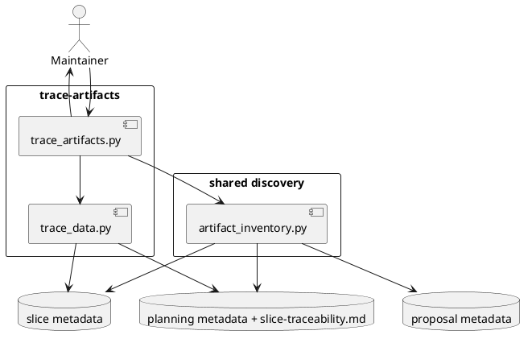

# System Design: Trace Artifacts

## Design summary

`trace-artifacts` adds a read-only lineage capability on top of the shared
artifact inventory introduced by `audit-artifacts`. The design builds a typed
relation graph from durable sources that already exist in the repo:

- proposal metadata links such as `target_feature` and `promoted_feature`
- feature and subfeature planning metadata
- subfeature parent relationships
- `slice-traceability.md` mappings for planned and execution slice IDs
- `.slice-meta.json` relation metadata for cross-slice lineage

The first version should answer targeted lineage questions and broader summary
questions without guessing links that the repo does not record durably.

## Goals and non-goals

### Goals

- Trace proposal -> feature -> subfeature -> planned slice -> execution slice
  lineage when the repo contains those signals.
- Reuse the shared artifact inventory helper rather than rebuilding artifact
  discovery a second time.
- Support both targeted lookups and broader lineage summaries.
- Keep the output reusable for later reporting work.

### Non-goals

- Invent lineage edges when the repo has no durable signal for them.
- Replace execution-owned slice relation semantics.
- Turn trace into a repair or mutation workflow.
- Require one repository-specific visualization format.

## Architecture

### 1. Shared inventory plus traceability parsing

The trace capability should start from
`skills/audit-artifacts/scripts/artifact_inventory.py` for artifact discovery,
then extend it with one new layer that parses planning traceability docs.

The key new parser should read `slice-traceability.md` tables generically enough
to tolerate the repo's current table variants. The parser only needs the durable
columns that matter for lineage:

- `Story ID`
- `Planned Slice IDs`
- `Execution Slice IDs` when present

### 2. Typed lineage graph

The trace layer should normalize discovered relationships into a graph with
typed nodes and edges.

Recommended node types:

- `proposal`
- `feature`
- `subfeature`
- `planned_slice`
- `slice`

Recommended edge types:

- `targets_feature`
- `promoted_to_feature`
- `subfeature_of`
- `plans_slice`
- `bootstrapped_as`
- execution-owned slice relation types such as `supersedes`

The graph should prefer one consistent internal shape so later reporting can
reuse it directly.

### 3. Query modes

The first user-facing command should support two query modes:

1. **Targeted lineage**
   - user supplies an artifact type and artifact ID
   - output returns the connected lineage component for that target

2. **Summary lineage**
   - no specific artifact supplied
   - output returns counts and grouped relationships discovered across the repo

Recommended CLI shape:

```bash
python3 skills/trace-artifacts/scripts/trace_artifacts.py
python3 skills/trace-artifacts/scripts/trace_artifacts.py --artifact-type proposal --artifact-id checkout-audit
python3 skills/trace-artifacts/scripts/trace_artifacts.py --artifact-type planned-slice --artifact-id CAM-01-cross-artifact-audit --json
```

### 4. Ownership boundaries

Trace must stay read-only and source-aware:

- proposal ownership remains in `manage_proposals.py`
- feature/subfeature ownership remains in planning metadata and traceability docs
- execution relation ownership remains in `manage_execution.py`

Trace should reveal those boundaries instead of hiding them behind a synthetic
"one true" lifecycle.

## Interfaces and dependencies

- **`artifact_inventory.py`**
  - inventories proposals, features, subfeatures, and slices
  - remains the shared artifact-discovery layer

- **`trace_data.py`**
  - parses `slice-traceability.md`
  - builds the typed lineage graph

- **`trace_artifacts.py`**
  - resolves targeted or summary queries
  - renders text or JSON output from the same graph

## Data flow, state, and lifecycle

1. Load the shared artifact inventory.
2. Parse feature and subfeature `slice-traceability.md` files where present.
3. Read durable metadata links from proposals, subfeatures, and slices.
4. Normalize those signals into graph edges.
5. Resolve a target artifact's connected lineage or a broader summary.
6. Emit text or JSON output without mutating repo state.

## Failure handling and operational constraints

- Missing traceability docs should not crash the trace command; they simply limit
  the lineage depth available for that artifact.
- Table parsing should be tolerant of extra columns, but strict about the named
  lineage columns it uses.
- Trace must not infer unsupported links from directory names alone when the
  metadata contradicts them.
- If a requested target artifact does not exist, the command should fail
  clearly.

## Risks, assumptions, and open questions

- Some historical planning packets may use older traceability table layouts, so
- the parser should be column-name driven rather than template-line-order driven.
- Planned slice IDs are durable planning objects but not directories, so they
  should be represented as typed graph nodes rather than assumed filesystem
  paths.
- Later reporting may want richer story-level lineage, but the first version can
  keep stories as row context instead of first-class graph nodes.

## Validation strategy

- Add targeted tests for:
  - proposal-to-feature lineage
  - subfeature-to-parent and planned-slice lineage
  - execution-slice lineage from `Execution Slice IDs`
  - JSON and text query output
- Validate the repository with `pytest -q`.

## Summary

`trace-artifacts` should become the repo's read-only lineage layer. It reuses
the shared audit inventory, adds a generic traceability parser for planning
docs, and exposes the durable connections between proposals, features,
subfeatures, planned slices, and execution slices.

## PlantUML


