# System Design: Cross-Artifact Management

## Overview

The cross-artifact management feature provides a read-mostly maintenance layer
across proposals, canonical features, durable subfeatures, and execution
slices. It does not replace the existing owners of those artifacts. Instead, it
reuses their registries, metadata, and validators to inspect, trace, report,
repair, archive, and measure the overall workflow graph.

The feature-level packet is intentionally lightweight because the concrete
behavior is implemented through finalized subfeatures:

- `audit-artifacts`
- `trace-artifacts`
- `report-artifacts`
- `repair-artifacts`
- `archive-artifacts`
- `measure-artifacts`

## Related Stories

- `CAM-01`: audit artifact health
- `CAM-02`: trace artifact lineage
- `CAM-03`: report artifact state
- `CAM-04`: repair artifact drift
- `CAM-05`: archive durable history safely
- `CAM-06`: measure workflow evidence

## Key Components

- **Proposal layer**: `docs/proposals/`, proposal registry, and proposal metadata
- **Planning layer**: `docs/features/`, feature registry, and `.planning-meta.json`
- **Subfeature layer**: `subfeatures/`, subfeature registries, and `.subfeature-meta.json`
- **Execution layer**: `slices/`, slice registry, and `.slice-meta.json`
- **Maintenance skills**:
  - `audit-artifacts` for validation and drift detection
  - `trace-artifacts` for lineage queries
  - `report-artifacts` for operational summaries
  - `repair-artifacts` for conservative derived-surface regeneration
  - `archive-artifacts` for archive candidate discovery and explicit archival
  - `measure-artifacts` for completed-work metrics and sidecar generation

## Interfaces and Responsibilities

- Existing owner helpers remain authoritative for lifecycle semantics and
  registry formats.
- Cross-artifact maintenance reads those authoritative surfaces instead of
  introducing a second state store.
- Repairs should stay limited to derived registries and README summaries unless
  a dedicated owner explicitly defines stronger mutation behavior.
- Historical retention remains non-destructive by default: planning artifacts,
  subfeature packets, and closed slice evidence stay durable unless an explicit
  archival flow prunes active runtime surfaces.

## Constraints and Tradeoffs

- Strength: one connected maintenance view improves artifact health without
  collapsing planning and execution ownership boundaries.
- Cost: semantic inconsistencies can still require manual follow-up because the
  maintenance layer should not guess missing planning intent.
- Strength: owner-script reuse keeps validation logic aligned with the actual
  lifecycle owners.
- Cost: when parent planning packets drift behind implemented child
  capabilities, audits may surface planning-shape inconsistencies that require
  documentation repair rather than code repair.

## Validation Strategy

- Use `python3 skills/audit-artifacts/scripts/audit_artifacts.py` for read-only
  artifact health inspection.
- Use `python3 skills/repair-artifacts/scripts/repair_artifacts.py` to preview
  whether derived registries or README tables have drifted from durable
  metadata.
- Validate finalized subfeature behavior in the corresponding skill test suites.
- Keep this parent packet structurally complete so feature-level validators can
  treat it as a canonical planning packet instead of an incomplete umbrella.

## PlantUML

```plantuml
@startuml
skinparam backgroundColor white

package "Workflow Artifact Owners" {
  [propose / manage_proposals]
  [guide-planning / manage_planning]
  [add-subfeature / manage_subfeatures]
  [guide-execution / manage_execution]
}

package "Cross-Artifact Maintenance" {
  [audit-artifacts]
  [trace-artifacts]
  [report-artifacts]
  [repair-artifacts]
  [archive-artifacts]
  [measure-artifacts]
}

database "proposal\nregistries + metadata" as ProposalData
database "feature\nregistries + metadata" as FeatureData
database "subfeature\nregistries + metadata" as SubfeatureData
database "slice\nregistries + metadata" as SliceData

[propose / manage_proposals] --> ProposalData
[guide-planning / manage_planning] --> FeatureData
[add-subfeature / manage_subfeatures] --> SubfeatureData
[guide-execution / manage_execution] --> SliceData

[audit-artifacts] --> ProposalData
[audit-artifacts] --> FeatureData
[audit-artifacts] --> SubfeatureData
[audit-artifacts] --> SliceData

[trace-artifacts] --> ProposalData
[trace-artifacts] --> FeatureData
[trace-artifacts] --> SubfeatureData
[trace-artifacts] --> SliceData

[report-artifacts] --> ProposalData
[report-artifacts] --> FeatureData
[report-artifacts] --> SubfeatureData
[report-artifacts] --> SliceData

[repair-artifacts] --> ProposalData
[repair-artifacts] --> FeatureData
[repair-artifacts] --> SubfeatureData
[repair-artifacts] --> SliceData

[archive-artifacts] --> FeatureData
[archive-artifacts] --> SubfeatureData
[archive-artifacts] --> SliceData

[measure-artifacts] --> FeatureData
[measure-artifacts] --> SubfeatureData
[measure-artifacts] --> SliceData
@enduml
```

