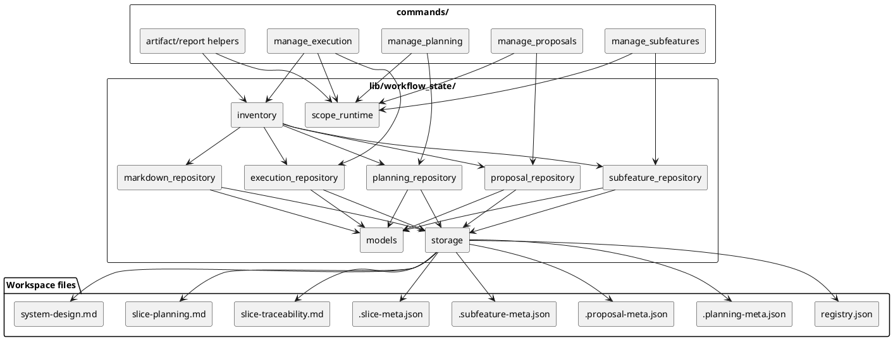
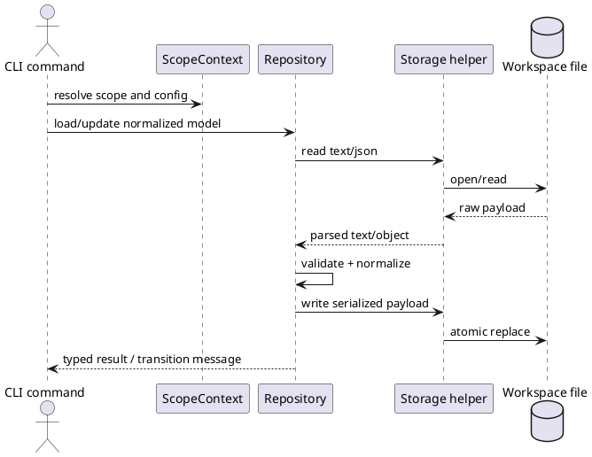

# System design: Data Access Layer Consolidation

## Design summary

This feature introduces a shared workspace data access layer under `src/sirius_skills/lib/` so command modules stop owning raw file I/O, parsing, and metadata normalization themselves. The design keeps the CLI surface stable, preserves existing workflow state transitions, and moves repository-specific data handling behind typed, reusable library boundaries.

The key decision is to make the library the only place that knows how to read, validate, normalize, and persist shared planning/proposal/artifact files. Commands remain orchestration layers.

## Related stories

- `DALC-01`: centralize workspace markdown reads and writes.
- `DALC-02`: validate metadata at the library boundary.
- `DALC-03`: make command/data coupling explicit through imports.
- `DALC-04`: guard against direct filesystem writes in command modules.

## Goals and non-goals

### Goals

- Concentrate workspace file formats and schema rules in one reusable library area.
- Reuse typed carriers instead of passing raw JSON blobs and file paths through commands.
- Keep current CLI commands, folder layout, and workflow state semantics intact.
- Make command-to-data coupling visible from imports and owned repository modules.

### Non-goals

- Change the layout of `docs/features/`, `docs/proposals/`, `slices/`, or registry files.
- Introduce a second persistence system or cache layer.
- Merge unrelated command behavior into a single manager.
- Add new configuration knobs for the DAL.

## Architecture

### Layering

1. **Command layer**
   - `manage_planning.py`, `manage_proposals.py`, `manage_subfeatures.py`, `manage_execution.py`, and artifact/report helpers remain the entrypoints.
   - They resolve scope, parse CLI arguments, and call repository APIs.
   - They no longer contain artifact-specific parsing, normalization, or direct workspace file writes.

2. **Repository layer**
   - Add domain-focused modules under `src/sirius_skills/lib/workflow_state/` for planning, proposal, subfeature, and markdown-backed artifact access.
   - These modules own read/write rules, schema validation, and normalization.
   - They return typed dataclasses or validated dictionaries rather than raw file payloads.

3. **Shared plumbing**
   - `scope_runtime.py` is relocated from `commands/` to `lib/workflow_state/` and continues to act as the boundary for scope resolution and config loading.
   - `workflow_state/models.py` continues to own shared typed records and should grow new metadata dataclasses as needed.
   - A low-level storage helper should centralize JSON/text loading, path resolution, and safe writes.

### Proposed module split

- `workflow_state/storage.py`: path-safe text/JSON load and write helpers, including atomic replacement for persisted files.
- `workflow_state/models.py`: normalized metadata and registry row dataclasses.
- `workflow_state/planning_repository.py`: `.planning-meta.json`, `registry.json`, and feature folder lifecycle.
- `workflow_state/proposal_repository.py`: `.proposal-meta.json`, proposal registry handling, and promotion handoff data.
- `workflow_state/markdown_repository.py`: shared markdown/table parsing for `slice-traceability.md`, `slice-planning.md`, and `system-design.md` summaries.
- `workflow_state/subfeature_repository.py`: `.subfeature-meta.json` lifecycle and parent-feature projection rules.
- `workflow_state/execution_repository.py`: `.slice-meta.json` lifecycle, slice registry JSON/markdown handling, and active/archived slice directory mapping.
- `workflow_state/scope_runtime.py`: scope context resolution and config loading (moved from `src/sirius_skills/commands/scope_runtime.py`).

The exact filename split can still be adjusted during breakdown, but the boundary must stay the same: commands depend on repositories, and repositories depend on storage/helpers.

## Interfaces and dependencies

### Command-to-repository contracts

- `manage-planning` should call planning repository methods for feature creation, status sync, metadata updates, and registry writes.
- `manage-proposals` should call proposal repository methods for proposal creation, promotion data, validation, and registry sync.
- `manage-subfeatures` should call subfeature repository methods for subfeature lifecycle and parent-feature projection.
- `inventory`, `traceability`, and artifact-reporting code should consume the markdown repository and shared models instead of parsing raw files inline.

### Shared typed inputs

- `ScopeContext` remains the typed owner of repo root, scope root, and resolved config paths.
- Repository methods should accept resolved scope context plus typed names/IDs, not raw environment or config values.
- Raw paths from CLI arguments must be normalized at the command edge before repository calls.

### Shared typed outputs

- Metadata loaders should return validated dataclasses or normalized records for:
  - feature planning metadata
  - proposal metadata
  - subfeature metadata
  - registry rows
  - traceability rows
- Writers should accept the same normalized objects and own serialization.

## Configuration surfaces and ownership

No new configuration surface is required.

- `.skills/planning.json` continues to own `planning_dir`, `proposal_dir`, and `design_diagram_mode`.
- `ScopeContext` remains the boundary where those raw config values become typed, resolved paths.
- The DAL must not introduce duplicate environment variables or CLI flags for the same values.
- Repository modules may read from `ScopeContext`, but they should not re-open config files or resolve scope independently.

## Data flow, state, and lifecycle

### Read flow

1. A command resolves scope through `scope_runtime`.
2. The command asks the relevant repository to load a feature/proposal/subfeature/markdown artifact.
3. The repository reads the file, validates shape, normalizes fields, and returns typed state.
4. The command applies business logic to the typed state.

### Write flow

1. The command computes the intended status or updated content.
2. The repository validates the new state before serialization.
3. The repository writes the updated artifact and any derived registry entry.
4. The command prints the transition message and exits with the existing command status conventions.

### Effective lifecycle model

- There is no long-lived in-memory cache.
- Each CLI invocation rereads current file state from disk.
- Repositories are stateless helpers, not shared mutable managers.
- File-backed registries remain the source of truth, with the library responsible for keeping JSON and markdown projections consistent.

## Failure handling and operational constraints

- Invalid JSON, malformed markdown tables, or missing required files should fail fast with a clear command error rather than being silently repaired during normal command execution.
- Repository writers should avoid partial-file corruption by writing atomically where practical.
- Validation errors should prevent persistence unless an explicit repair or force path is used.
- Direct workspace file edits inside command modules should be treated as a guardrail failure, not a normal fallback.
- There is no retry policy or reconnect logic because the feature is local filesystem based.

## Alternatives considered

1. **Keep file I/O in commands**
   - Rejected because it preserves duplicated parsing and hides coupling.

2. **Create one giant generic filesystem service**
   - Rejected because it would blur ownership between planning, proposal, subfeature, and markdown-specific behaviors.

3. **Add a separate config or data layer per command**
   - Rejected because it creates parallel control planes and makes the repo harder to reason about.

The chosen approach keeps one shared storage layer, then splits ownership by artifact family.

## Risks, assumptions, and open questions

### Risks

- The migration touches many command modules, so the refactor should be staged.
- Some markdown parsers are shared across features, so repository boundaries need to stay explicit.
- A broad data layer can become a new monolith if the module split is not kept disciplined.

### Assumptions

- Existing scope resolution and config loading remain the correct edge boundary.
- The first release of the DAL can reuse current file formats unchanged.
- Existing transition semantics in `workflow_state` stay authoritative.

### Resolved design decisions

- **Direct-file-access guardrail**: Implement a pytest-based repo test using AST (Abstract Syntax Tree) analysis. It will parse modules in `src/sirius_skills/commands/` using `ast.NodeVisitor` to flag calls to standard `open()`, `Path.write_text()`, `Path.read_text()`, and standard JSON imports (excluding allowed system/logging config).
- **Markdown serialization timing**: Centralize markdown and metadata serialization simultaneously during repository migration to ensure JSON registries and markdown readmes are updated atomically, preventing drift.
- **`inventory.py` parsing boundary**: Move all regex and raw parsing out of `inventory.py` into their respective repository modules. `inventory.py` will remain as a read-only aggregator that queries repositories.

## Validation strategy

- Add focused tests for each repository module that round-trip representative metadata and registry payloads, verifying exact serialization format (indentation, trailing newlines).
- Verify command behavior through existing CLI tests after the command modules are thinned.
- Add an AST-based guardrail test that scans files in `src/sirius_skills/commands/` to prevent direct workspace file I/O or raw filesystem access.
- Keep transition and validation tests green for planning/proposal/subfeature status changes.
- Confirm the new repositories preserve current path resolution and scope behavior under nested planning roots.

## Summary

This design keeps the CLI stable while making workspace data ownership explicit. Commands will orchestrate; repositories will parse, validate, and persist; `ScopeContext` will remain the raw-input boundary. That separation is what enables the later breakdown work to split the refactor into manageable slices without changing the user-facing workflow.
