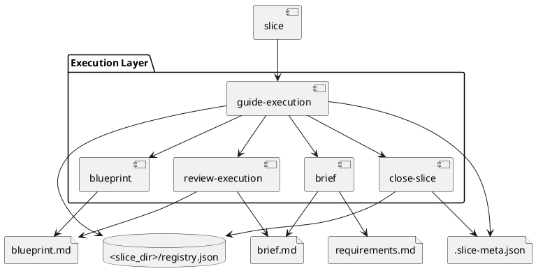

# System Design: Execution Workflow

## Overview

The execution workflow is a centralized slice system. `guide-execution` manages slice registry state and readiness transitions, while `brief`, `plan`, `review-execution`, and `close-slice` own the slice-scoped artifacts and review outcomes. Closed slices remain available for audit unless a separate maintenance workflow archives them later.

## Related Stories

- `EW-01`: bootstrap one slice per work item so execution stays slice-scoped and traceable
- `EW-02`: capture a brief and requirements checklist so implementation starts from testable intent
- `EW-03`: produce a concrete execution plan with gates and validation before coding
- `EW-04`: review, relate, and close slices non-destructively so execution history stays durable

## Key Components

- **Execution registry**: `<slice_dir>/README.md` and `registry.json`
- **Slice metadata**: `<slice_path>/.slice-meta.json`
- **Intent artifact**: `brief.md`
- **Execution artifact**: `blueprint.md`
- **Requirements checklist**: `checklists/requirements.md`

## Interfaces and Responsibilities

- `bootstrap_slice.py` can initialize `.skills/execution.json` and the slice registry before delegating to execution-layer tooling.
- `manage_execution.py add` still creates the slice folder and metadata entry once execution bootstrap prerequisites exist.
- `manage_execution.py set-status` can auto-advance `blueprint_ready` to `execution_ready` when `.skills/execution.json` enables `auto_start_implementation`, so the execution layer can continue directly into implementation.
- `brief` owns `brief.md` and `checklists/requirements.md`.
- `blueprint` owns `blueprint.md`, requirement traceability, and validation steps.
- `review-execution` compares implementation results with the brief and plan.
- `close-slice` updates closure metadata.

## Constraints and Tradeoffs

- Slice-scoped slices improve auditability but require stronger discipline to keep one work item per slice.
- Closure is non-destructive, which preserves execution context for later audit and optional maintenance workflows.
- Day-to-day execution context stays intentionally lightweight, reducing workflow overhead but requiring careful handoff discipline.

## Validation Strategy

- Use `skills/slice/tests/test_bootstrap_slice.py` for slice bootstrap behavior.
- Use `skills/guide-execution/tests/test_manage_execution.py` for execution lifecycle behavior.
- Use `skills/close-slice/tests/test_close_slice.py` for closure and relation behavior.
- Validate slices with `python3 skills/guide-execution/scripts/manage_execution.py validate-slice <slice-id>`.

## PlantUML

