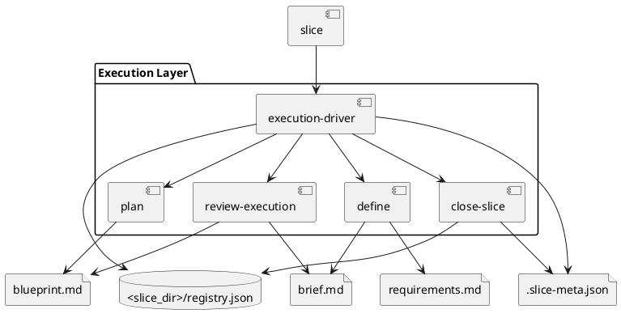

# System Design: Execution Workflow

## Overview

The execution workflow is a centralized slice system. `execution-driver` manages slice registry state and readiness transitions, while `define`, `plan`, `review-execution`, and `close-slice` own the slice-scoped artifacts and review outcomes.

## Key Components

- **Execution registry**: `<slice_dir>/README.md` and `registry.json`
- **Slice metadata**: `<slice_path>/.slice-meta.json`
- **Intent artifact**: `brief.md`
- **Execution artifact**: `blueprint.md`
- **Requirements checklist**: `checklists/requirements.md`
- **Closure publisher**: `close_slice.py` with optional project-local publish target

## Interfaces and Responsibilities

- `manage_execution.py init` initializes `.skills/execution.json` and the slice registry.
- `manage_execution.py add` creates a slice folder and metadata entry.
- `define` owns `brief.md` and `checklists/requirements.md`.
- `plan` owns `blueprint.md`, requirement traceability, and validation steps.
- `review-execution` compares implementation results with the brief and plan.
- `close-slice` updates metadata and optionally publishes closure summaries.

## Constraints and Tradeoffs

- Slice-scoped slices improve auditability but require stronger discipline to keep one work item per slice.
- Closure is non-destructive, which preserves history at the cost of leaving more retained artifacts in the repo.
- External tracker state is intentionally separate, reducing coupling but requiring careful handoff discipline.

## Validation Strategy

- Use `skills/execution-driver/tests/test_manage_execution.py` for slice lifecycle and registry behavior.
- Use `skills/close-slice/tests/test_close_slice.py` for publication and relation behavior.
- Validate slices with `python3 skills/execution-driver/scripts/manage_execution.py validate-slice <slice-id>`.

## PlantUML

