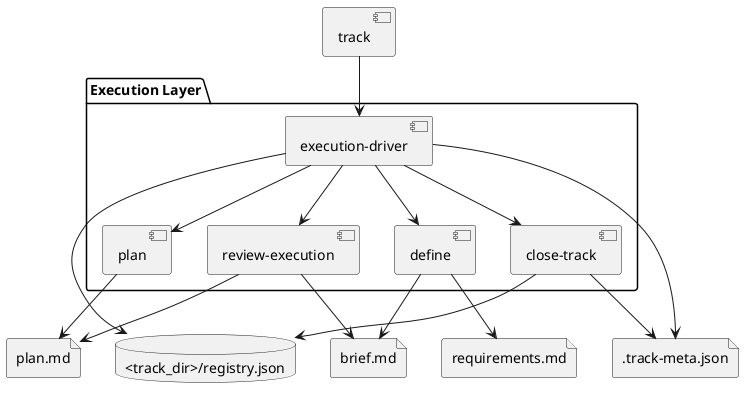

# System Design: Execution Workflow

## Overview

The execution workflow is a centralized track system. `execution-driver` manages track registry state and readiness transitions, while `define`, `plan`, `review-execution`, and `close-track` own the task-scoped artifacts and review outcomes.

## Key Components

- **Execution registry**: `<track_dir>/README.md` and `registry.json`
- **Track metadata**: `<track_path>/.track-meta.json`
- **Intent artifact**: `brief.md`
- **Execution artifact**: `plan.md`
- **Requirements checklist**: `checklists/requirements.md`
- **Closure publisher**: `close_track.py` with optional project-local publish target

## Interfaces and Responsibilities

- `manage_execution.py init` initializes `.skills/execution.json` and the track registry.
- `manage_execution.py add` creates a track folder and metadata entry.
- `define` owns `brief.md` and `checklists/requirements.md`.
- `plan` owns `plan.md`, requirement traceability, and validation steps.
- `review-execution` compares implementation results with the brief and plan.
- `close-track` updates metadata and optionally publishes closure summaries.

## Constraints and Tradeoffs

- Task-scoped tracks improve auditability but require stronger discipline to keep one work item per track.
- Closure is non-destructive, which preserves history at the cost of leaving more retained artifacts in the repo.
- External tracker state is intentionally separate, reducing coupling but requiring careful handoff discipline.

## Validation Strategy

- Use `skills/execution-driver/tests/test_manage_execution.py` for track lifecycle and registry behavior.
- Use `skills/close-track/tests/test_close_track.py` for publication and relation behavior.
- Validate tracks with `python3 skills/execution-driver/scripts/manage_execution.py validate-track <track-id>`.

## PlantUML

