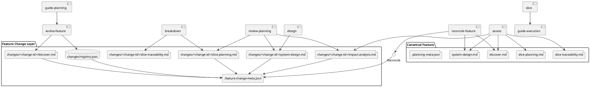
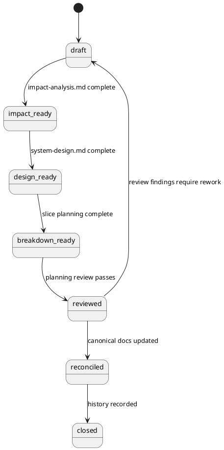

# System Design: Feature Evolution Workflow

## Overview

The feature evolution workflow adds a **feature-local change layer** on top of
the existing canonical feature planning model.

The canonical feature folder remains the long-lived source of truth:

```text
docs/features/<feature-slug>/
```

Changes to that feature are represented as explicit, reviewable **change
packets** under the feature:

```text
docs/features/<feature-slug>/changes/<change-id>/
```

This keeps the repository's current planning and execution boundaries intact:

- canonical feature docs remain durable
- change intent and impact are reviewable without overwriting the baseline
- execution still flows through slices
- reconciliation is explicit and cleans up temporary change artifacts once canonical docs are updated

The design deliberately borrows the discipline behind OpenSpec's change/archive
workflow without adopting its temporary-folder model as the primary source of
truth.

## Architectural Decisions

### 1. Canonical feature folders remain primary

`docs/features/<feature-slug>/` stays the canonical planning area for a feature.
It is never treated as temporary and is never archived away.

Reasoning:

- this matches the repository's existing planning model
- it avoids ambiguous source-of-truth handoffs
- it fits the current `guide-planning` workflow and registry layout

### 2. Feature evolution is represented as feature-local change packets

Each evolving feature gets a local change workspace:

```text
docs/features/<feature-slug>/changes/
```

Within that workspace, each change is isolated:

```text
docs/features/<feature-slug>/changes/<change-id>/
```

Reasoning:

- keeps evolution history close to the feature it amends
- avoids a competing top-level registry in the first iteration
- makes reconciliation targets obvious

### 3. Change packets use planning-style artifacts, not execution artifacts

A feature change packet is still **planning-scoped**, not slice-scoped.

Recommended artifact set for a change packet:

- `discover.md` for the changed intent and scope
- `impact-analysis.md` for affected artifacts, stories, and slice implications
- `system-design.md` for changed architecture or validation decisions
- optional `ui-design.md` when UX flow is materially affected
- `slice-planning.md` for new or amended execution-ready slices
- `slice-traceability.md` for feature-story to change-slice mapping
- `.feature-change-meta.json` for machine-readable state

Reasoning:

- preserves the repository's planning vocabulary
- avoids conflating feature changes with execution slices
- keeps room for reuse of existing planning authoring patterns

### 4. Change lifecycle is separate from canonical feature lifecycle

Canonical feature lifecycle and feature-change lifecycle should not share the
same metadata file or readiness states.

Canonical feature metadata remains:

- `<feature_path>/.planning-meta.json`

Change-specific metadata becomes:

- `<feature_path>/changes/<change-id>/.feature-change-meta.json`

Recommended change states:

- `draft`
- `impact_ready`
- `design_ready`
- `breakdown_ready`
- `reviewed`
- `reconciled`
- `closed`

Reasoning:

- a mature feature can remain canonical while multiple future changes are
  proposed or executed over time
- changing a feature should not force the canonical feature back to
  `discovery_pending`

### 5. Reconciliation is explicit and additive

Approved change packets do not silently replace canonical docs.

Instead, a reconciliation step:

1. updates canonical docs deliberately
2. records what changed and which change packet caused it
3. marks the canonical feature as `implemented` once reconciliation confirms execution-backed completion
4. removes the completed change packet after canonical reconciliation finishes
5. rewrites canonical artifacts directly instead of keeping durable backlinks

Reasoning:

- keeps canonical feature docs as the only long-term product specification
- matches the human-owned reconcile handoff
- avoids retained history that points at deleted temporary artifacts

## Key Components

- **Canonical feature folder**
  - `docs/features/<feature-slug>/`
  - owns the accepted baseline for discovery, design, and breakdown

- **Feature change registry**
  - `docs/features/<feature-slug>/changes/README.md`
  - `docs/features/<feature-slug>/changes/registry.json`
  - tracks active and closed change packets for one feature

- **Change packet**
  - `docs/features/<feature-slug>/changes/<change-id>/`
  - holds change-scoped planning artifacts and metadata

- **Change metadata**
  - `.feature-change-meta.json`
  - stores lifecycle state, timestamps, impacted artifacts, and reconciliation
    pointers

- **Impact analysis artifact**
  - `impact-analysis.md`
  - identifies affected stories, canonical docs, planned increments, slice IDs,
    and relation type such as additive, superseding, narrowing, or replacement

- **Reconciliation cleanup**
  - rewrites canonical docs directly
  - removes temporary execution slices and the completed change packet

## Interfaces and Responsibilities

### Proposed skill and tooling responsibilities

- **`guide-planning`**
  - remains the feature-level planning entrypoint
  - routes to the feature evolution workflow when the user is changing an
    existing feature rather than starting a new one

- **`evolve-feature`** (new)
  - resolves the target canonical feature
  - initializes `changes/` registry if missing
  - creates one change packet and `.feature-change-meta.json`
  - seeds `discover.md` for the change

- **`assess`** (new)
  - inspects canonical feature docs
  - identifies affected stories, requirements, increments, and slices
  - writes `impact-analysis.md`

- **`design`**
  - should be reusable for change packets after path resolution supports a
    change-scoped planning path
  - writes change-local `system-design.md`

- **`breakdown`**
  - should be reusable for change packets to produce change-local
    `slice-planning.md` and `slice-traceability.md`

- **`review-planning`**
  - reviews both the change delta and its reconciliation expectations
  - records readiness findings before slice bootstrap

- **`reconcile-feature`** (new)
  - updates canonical feature docs explicitly
  - restores the canonical feature to `implemented` after successful reconciliation
  - records backlinks to the closed change packet
  - keeps change-local `slice-planning.md` and `slice-traceability.md` in the
    retained packet instead of reconciling them into canonical breakdown docs
  - optionally appends to a feature-local change history section or file

- **`slice` / `guide-execution`**
  - remain unchanged as execution-layer entrypoints
  - consume only the reviewed, post-breakdown outputs

### MVP decisions confirmed during planning review

- Keep **`assess` as a separate skill** in the first iteration so its
  artifact has a clear owner and an independently reviewable validation path.
- Keep **change closure inside `reconcile-feature`** in the first iteration
  instead of creating a separate `close-feature-change` skill. This keeps the
  MVP skill set smaller while still allowing non-destructive history recording.
- Support **one active open change per canonical feature** in the first
  iteration. If another change is needed before the first closes, the workflow
  should stop and ask the user whether to continue the active change or defer the
  new one. Richer multi-change coordination is a follow-up capability.

### Proposed script responsibilities

- `skills/evolve-feature/scripts/manage_feature_changes.py`
  - initialize per-feature change registries
  - create and resolve active changes
  - enforce change-state transitions
  - validate required artifacts per change state

- `skills/reconcile-feature/scripts/reconcile_feature_change.py`
  - apply canonical updates using stable markers or deterministic file rewrites
  - record reconciliation metadata and backlinks

## Recommended Data Model

### Change registry row

Recommended fields in `changes/registry.json`:

- `change_id`
- `feature_slug`
- `status`
- `change_type`
- `updated_at`
- `path`

### Change metadata

Recommended fields in `.feature-change-meta.json`:

- `change_id`
- `feature_slug`
- `status`
- `created_at`
- `updated_at`
- `change_type`
- `summary`
- `affected_artifacts`
- `affected_story_ids`
- `affected_slice_ids`
- `active_change`
- `reconciled_at`
- `reconciled_files`
- `history_targets`

Recommended `change_type` values:

- `additive`
- `narrowing`
- `superseding`
- `replacement`

## Repository Layout

Recommended layout:

```text
docs/features/<feature-slug>/
├── discover.md
├── system-design.md
├── slice-planning.md
├── slice-traceability.md
├── .planning-meta.json
└── changes/
    ├── README.md
    ├── registry.json
    └── <change-id>/
        ├── discover.md
        ├── impact-analysis.md
        ├── system-design.md
        ├── slice-planning.md
        ├── slice-traceability.md
        └── .feature-change-meta.json
```

## Constraints and Tradeoffs

- Feature-local change folders are easier to reason about than a global
  `docs/feature-changes/` tree, but they may create deeper nesting.
- Reusing planning-style artifact names improves conceptual consistency, but it
  requires path-aware tooling so canonical and change-scoped artifacts do not
  get confused.
- Explicit reconciliation is safer than automatic merging, but it adds one more
  reviewable step before closure.
- Keeping change packets after reconciliation preserves history, but it requires
  clear change registries so stale packets do not become confusing clutter.

## Validation Strategy

- Add tests for `manage_feature_changes.py` to cover:
  - registry initialization
  - change creation
  - active change resolution
  - artifact-gated state transitions
  - validation of canonical feature targeting

- Add tests for reconciliation tooling to cover:
  - deterministic canonical file updates
  - backlink preservation
  - non-destructive retention of change packets
  - safe handling when expected canonical anchors are missing

- Add planning examples or fixture-style tests that show:
  - additive change against an existing feature
  - superseding change that replaces an older story path
  - narrowing change that invalidates only part of an older slice plan

- Validate one change packet with a command such as:

```bash
python3 skills/evolve-feature/scripts/manage_feature_changes.py validate \
  --feature "<feature-slug>" \
  --change "<change-id>"
```

## PlantUML




