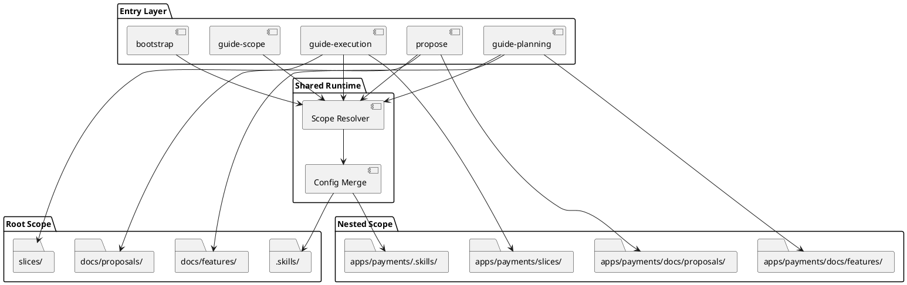
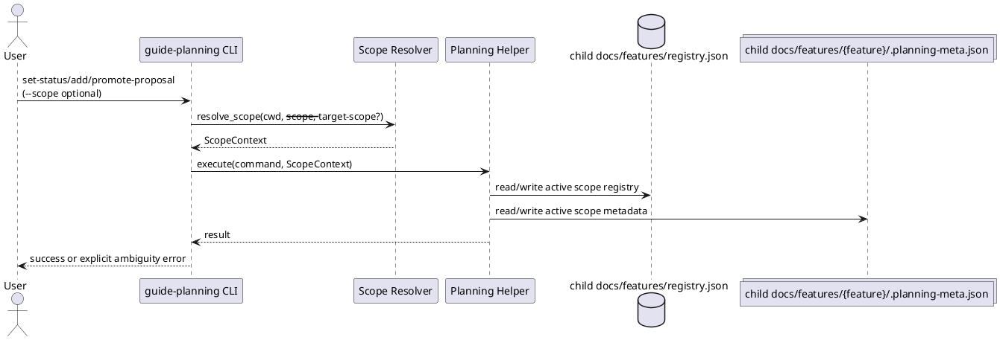
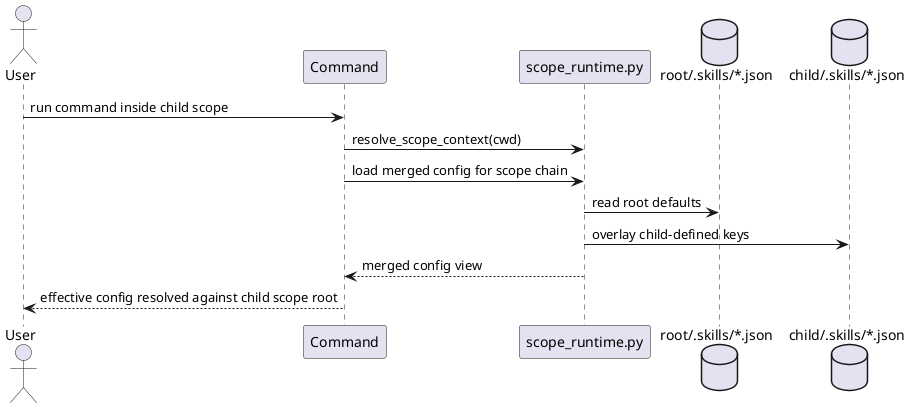
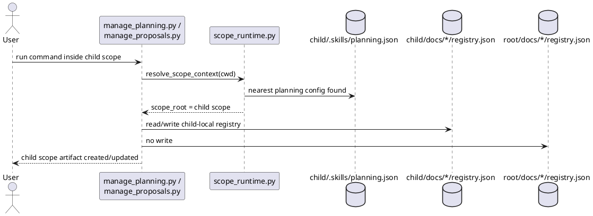
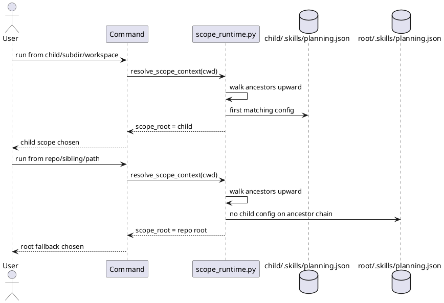
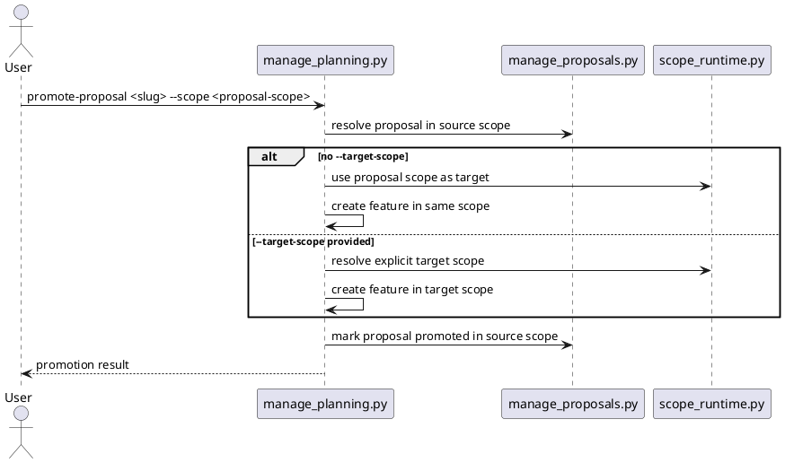
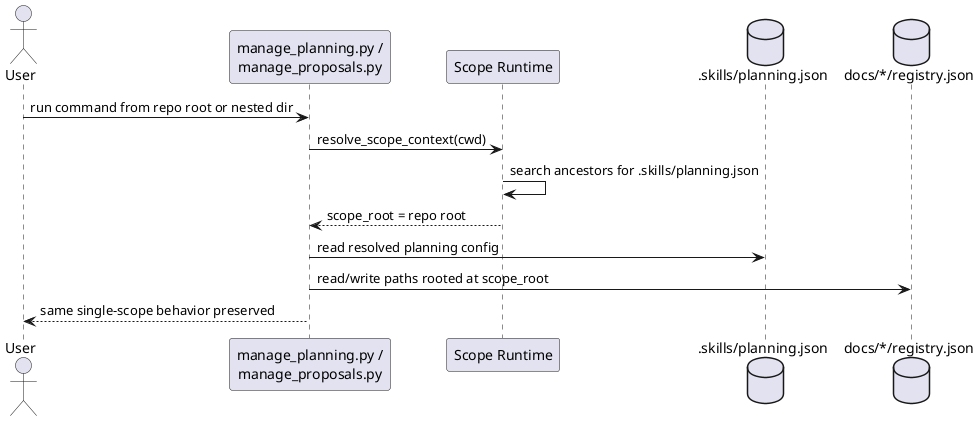
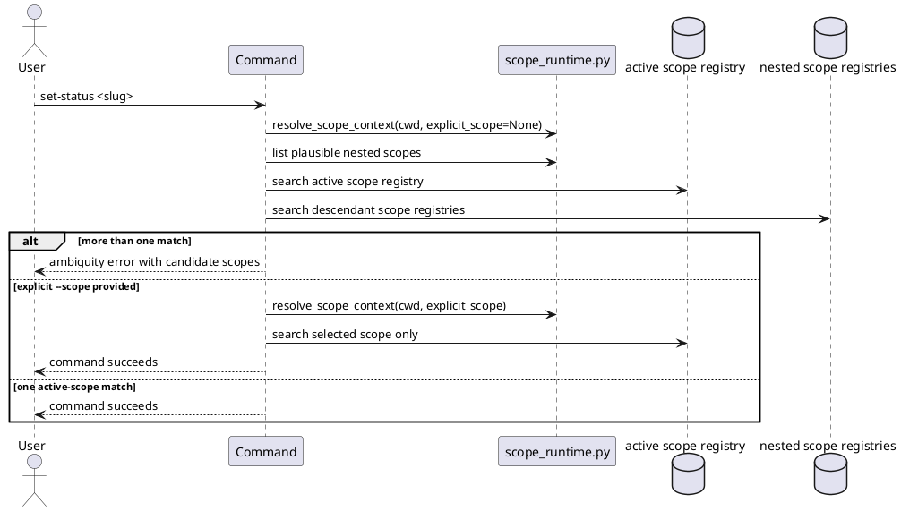
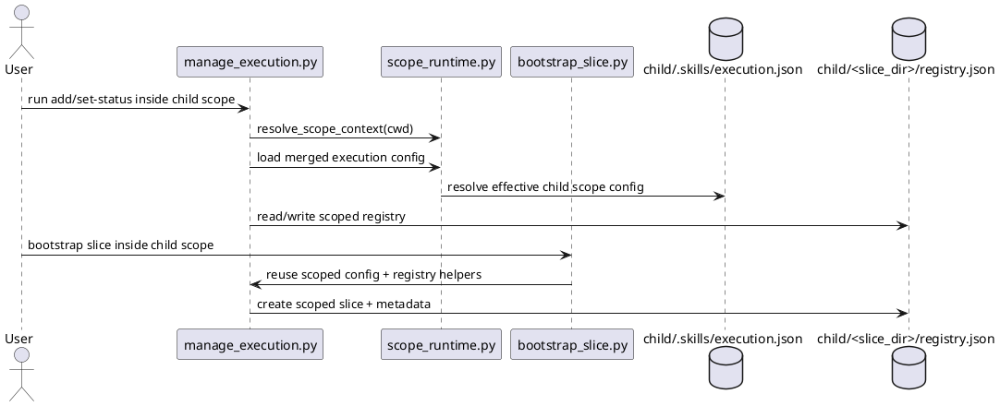

# System Design: Hierarchical Scope Support

## Overview

Hierarchical scope support adds a scope-resolution layer ahead of the existing
planning, proposal, and execution helpers.

The workflow itself does not change. `discover`, `design`, `breakdown`,
`review-planning`, `slice`, and `guide-execution` keep their current
responsibilities. The new behavior is that each operation first resolves the
correct **scope root**, then reads and writes planning artifacts relative to
that scope instead of assuming one repository-root workspace.

The design keeps the current single-project behavior as the compatibility
default while allowing nested subprojects to own local `.skills/`,
`docs/features/`, `docs/proposals/`, and execution settings.

## Related Stories

- `HSS-01`: repository-root fallback keeps umbrella planning available
- `HSS-02`: nested scopes own local planning and proposal artifacts
- `HSS-03`: nearest-scope resolution keeps writes in the correct project area
- `HSS-04`: ambiguous scope situations stop for explicit selection
- `HSS-05`: `guide-scope` provides one reusable scope-aware entry layer
- `HSS-06`: child scopes override parent `.skills` settings without breaking inherited defaults

## Architectural Decisions

### 1. Scope roots are explicit, with repository-root fallback

A directory becomes an explicit scope when it contains a `.skills/` directory.
The resolver walks upward from the current working directory, or from an
explicit user-provided path, and chooses the nearest enclosing explicit scope.

If no explicit scope is found, the repository root acts as an implicit fallback
scope using existing default paths. This preserves current single-project
behavior for repositories that do not define nested scopes.

### 2. One shared scope runtime resolves context before any workflow action

Introduce a reusable scope helper module used by planning, proposal, execution,
bootstrap, and slice bootstrap entrypoints.

That runtime should resolve a `ScopeContext` value before any registry lookup,
metadata read, or artifact write. `ScopeContext` should provide at least:

- `repo_root`
- `scope_root`
- `scope_chain` from root-most scope to active scope
- resolved planning config values such as `planning_dir`, `proposal_dir`, and
  `design_diagram_mode`
- resolved execution config values such as `slice_dir`
- resolved conventions config object
- resolution mode metadata, such as `explicit` vs `nearest`

This keeps scope logic out of feature-specific commands and makes downstream
helpers mostly path consumers rather than path discoverers.

### 3. Config inheritance is key-based, but paths resolve against the active scope

Each scope may define any subset of:

- `.skills/planning.json`
- `.skills/execution.json`
- `.skills/conventions.json`

Configuration is merged from outermost scope to innermost scope, with child keys
overriding parent keys. Unknown keys are preserved.

Relative directory values such as `planning_dir`, `proposal_dir`, and
`slice_dir` are interpreted relative to the **resolved active scope root**, not
relative to the process working directory and not relative to the file that
defined the inherited value. This preserves intuitive child-scope behavior when
default directory names are inherited.

### 4. Registries remain local to each scope

Each resolved scope owns its own planning and proposal registries:

- `<scope>/docs/features/README.md`
- `<scope>/docs/features/registry.json`
- `<scope>/docs/proposals/README.md`
- `<scope>/docs/proposals/registry.json`

No cross-scope merged registry is introduced. Ownership stays local, and
cross-scope discovery happens through scope selection rather than by flattening
all features and proposals into one global index.

### 5. Scope-aware CLI contracts are additive

Planning, proposal, execution, and slice bootstrap scripts gain an optional
`--scope` argument. When omitted, they resolve the nearest enclosing scope from
the current working directory.

Operations that can intentionally cross scope boundaries gain a second explicit
parameter. The main case is proposal promotion:

- `--scope` identifies where the proposal is stored
- `--target-scope` identifies where canonical feature planning should be created

If `--target-scope` is omitted, promotion stays in the proposal's own scope.
Cross-scope promotion must never happen implicitly.

### 6. `guide-scope` is a routing layer, not a duplicate workflow

Add a thin entry skill, `guide-scope`, to discover available scopes, resolve the
active scope, stop on ambiguity, and then hand off to `guide-planning`,
`guide-execution`, or `bootstrap`.

This keeps the existing workflow skills generic and reusable. Multi-scope
repositories can use `guide-scope` when ambiguity matters, while single-scope
repositories continue to work without a mandatory extra step.

## Key Components

- **Scope runtime**
  - shared helper that resolves the active scope and merged config view
- **Planning helpers**
  - `sirius manage-planning`
  - consume resolved planning paths instead of reading one repo-root config
- **Proposal helpers**
  - `sirius manage-proposals`
  - read and update proposal registries inside the resolved scope
- **Execution helpers**
  - `sirius manage-execution`
  - consume scope-local execution and conventions config
- **Bootstrap**
  - `sirius bootstrap`
  - initializes `.skills/` inside a selected scope while preserving existing
    keys
- **Scope entry skill**
  - `guide-scope`
  - presents ambiguity and passes resolved scope context into downstream skills

## Interfaces and Responsibilities

### Scope runtime interface

The shared scope layer should expose a small interface such as:

```text
resolve_scope(start_path, explicit_scope=None) -> ScopeContext
load_planning_config(scope_context) -> PlanningConfigView
load_execution_config(scope_context) -> ExecutionConfigView
load_conventions_config(scope_context) -> dict
```

Optional helpers may also normalize common artifact paths:

```text
feature_root(scope_context, feature_slug) -> Path
proposal_root(scope_context, proposal_slug) -> Path
slice_root(scope_context, slice_id) -> Path
```

### Planning and proposal integration

`manage_planning.py` and `manage_proposals.py` should stop owning config
discovery directly. They should either:

1. accept `ScopeContext` from a thin CLI wrapper, or
2. call the shared scope runtime first and then continue with existing logic.

Either way, registry helpers such as `get_registry_paths()` and
`proposal_dir_for_row()` must become scope-aware and must not read `.skills/`
from the current process directory implicitly.

### Bootstrap integration

`bootstrap.py` already accepts `--repo-root`. That should become the selected
scope root semantically, while keeping the current flag for compatibility.

An additive `--scope` alias is acceptable, but the important behavior is that
bootstrap can initialize nested `.skills/` directories without assuming the
repository root is the only valid target.

## Data and State Design

### ScopeContext

`ScopeContext` is transient runtime state, not registry state. It should not be
duplicated into execution-slice artifacts.

Suggested fields:

| Field | Purpose |
|---|---|
| `repo_root` | Canonical repository root |
| `scope_root` | Active scope directory |
| `scope_chain` | Ordered parent-to-child scope ancestry |
| `planning_dir` | Resolved feature-planning directory for this scope |
| `proposal_dir` | Resolved proposal directory for this scope |
| `slice_dir` | Resolved execution-slice directory for this scope |
| `design_diagram_mode` | Active design output mode |
| `conventions` | Effective naming and tracker conventions |
| `resolution_mode` | `nearest` or `explicit` |

### Metadata impact

Feature and proposal metadata should remain local to their scope-specific
folders. No global scope registry is required for the initial design.

For the first version, `.planning-meta.json` and `.proposal-meta.json` do not
need a mandatory `scope_path` field because local registries already disambiguate
ownership. Adding optional scope-identifying fields later remains possible if
cross-scope tooling needs stronger auditability.

## Routing and Error Handling

- If `--scope` points outside the repository, fail with a clear error.
- If a slug-only lookup is attempted where more than one scope is plausible, do
  not search the whole repository silently. Return candidate scope paths and
  require explicit selection.
- If a user requests cross-scope proposal promotion, require explicit
  `--target-scope`.
- If a nested scope exists but has no local config file for a given layer, use
  inherited values merged through the scope chain.
- If no explicit scope markers exist, use the repository root fallback and keep
  current behavior.

## Validation Strategy

- Add unit tests for scope resolution:
  - nearest enclosing scope selection
  - repository-root fallback when no explicit scope exists
  - explicit scope targeting
  - parent/child config inheritance
  - ambiguous lookup failures
- Extend planning and proposal tests to cover:
  - feature creation inside a nested scope
  - proposal creation inside a nested scope
  - same-scope proposal promotion
  - explicit cross-scope proposal promotion
- Extend execution tests to cover:
  - scope-local `execution.json` and `conventions.json`
  - slice bootstrap from nested scopes
- Keep existing single-scope tests passing unchanged to prove backward
  compatibility.

## Risks and Tradeoffs

- A shared scope runtime simplifies behavior, but it becomes foundational
  infrastructure that multiple skills depend on.
- Key-based inheritance is flexible, but it must stay easy to reason about or
  users may not know which scope actually supplied a value.
- Repository-root fallback preserves compatibility, but it can hide missing
  `.skills/` setup if error messages are vague.
- Cross-scope promotion is powerful, but it must remain explicit to prevent
  accidental writes into parent or sibling planning areas.

## PlantUML





<!-- archived-slice-summaries:start -->
## Archived Slice Summaries

<!-- archived-slice-summary:hss-config-inheritance:start -->
### `hss-config-inheritance`: Merge parent and child .skills config by scope

#### Work Item Summary

- **Work Item**: Merge parent and child `.skills` config values through the scope chain with child override precedence.
- **Source Story / Increment / Slice**: HSS-06 / I2 / hss-config-inheritance
- **Requested Outcome**: As a project adopter working with nested scopes, child scopes inherit parent planning, execution, and conventions config by default while still being able to override specific keys locally.
- **Why this matters**: Nested scopes are not practical if every child scope must repeat the full `.skills` configuration instead of inheriting generic defaults.
- **Independent Test**: Planning, proposal, bootstrap, and execution helpers read merged config from the scope chain, preserve unknown keys, and resolve inherited relative paths against the active scope root.

#### Detailed Design Summary

HSS-06 config inheritance adds a merged config view across the active scope chain. Parent scopes provide defaults for planning, execution, and conventions config, while child scopes override only the keys they define. Inherited relative paths still resolve against the active scope root.

#### Blueprint Figures


<!-- archived-slice-summary:hss-config-inheritance:end -->

<!-- archived-slice-summary:hss-guide-scope:start -->
### `hss-guide-scope`: Add one scope-aware entry skill

#### Work Item Summary

- **Work Item**: Add a `guide-scope` skill that resolves the active scope and routes work into planning, execution, or bootstrap without duplicating their ownership rules.
- **Source Story / Increment / Slice**: HSS-05 / I4 / hss-guide-scope
- **Requested Outcome**: As a maintainer working in a multi-scope repository, I can enter through one scope-aware skill that discovers the current scope, handles ambiguity, and then hands off cleanly to the correct downstream workflow skill.
- **Why this matters**: The scope runtime is now stable for planning and execution, so users need one documented entrypoint instead of remembering where scope matters across multiple workflows.
- **Independent Test**: The new `skills/guide-scope/SKILL.md` plus top-level docs explain when to use `guide-scope`, how it resolves scope, and how it hands off to `guide-planning`, `guide-execution`, or `bootstrap` without changing existing planning/execution behavior.

#### Detailed Design Summary

HSS-05 adds `guide-scope` as an optional scope-aware entry skill for multi-scope repositories. The implementation should stay thin: document how to resolve the active scope, stop on ambiguity, and hand off to `guide-planning`, `guide-execution`, or `bootstrap`, then align the top-level repo docs and managed skill installation list with that new entrypoint.
<!-- archived-slice-summary:hss-guide-scope:end -->

<!-- archived-slice-summary:hss-local-registries:start -->
### `hss-local-registries`: Keep planning and proposal registries local to each scope

#### Work Item Summary

- **Work Item**: Make each explicit scope own its own planning and proposal registries and metadata.
- **Source Story / Increment / Slice**: HSS-02 / I1 / hss-local-registries
- **Requested Outcome**: As a subproject owner, when a nested directory defines its own `.skills/`, planning and proposal helpers write features, proposals, and registry updates inside that scope instead of reusing the repository-root planning area.
- **Why this matters**: Hierarchical scope support only becomes useful once nested scopes can keep their own planning state independent from the repository root.
- **Independent Test**: Planning and proposal commands run against a nested explicit scope create and read local `docs/features/` and `docs/proposals/` registries without mutating the root scope registries.

#### Detailed Design Summary

HSS-02 hardens explicit child-scope ownership for planning and proposal artifacts. A nested scope that declares its own `.skills/planning.json` should create and update its own `docs/features/` and `docs/proposals/` registries and metadata without mutating the repository-root registries.

#### Blueprint Figures


<!-- archived-slice-summary:hss-local-registries:end -->

<!-- archived-slice-summary:hss-nearest-scope:start -->
### `hss-nearest-scope`: Default CLI operations to the nearest enclosing scope

#### Work Item Summary

- **Work Item**: Make planning and proposal helpers default to the nearest enclosing explicit scope from the current working directory.
- **Source Story / Increment / Slice**: HSS-03 / I1 / hss-nearest-scope
- **Requested Outcome**: As an agent operating from inside a subdirectory of a child scope, planning and proposal commands land in that child scope's local artifacts without requiring the user to run from the scope root.
- **Why this matters**: Local registries are only practical when commands keep working from ordinary nested working directories inside the selected scope.
- **Independent Test**: Running planning and proposal commands from a directory nested beneath a child scope writes to the nearest enclosing child scope registries while preserving root fallback outside that child scope.

#### Detailed Design Summary

HSS-03 proves that planning and proposal commands resolve the **nearest enclosing** explicit scope from the current working directory. Work run from a directory inside a child scope should use that child scope's registries, while work run elsewhere in the repository should still fall back to the repository root.

#### Blueprint Figures


<!-- archived-slice-summary:hss-nearest-scope:end -->

<!-- archived-slice-summary:hss-promotion-targeting:start -->
### `hss-promotion-targeting`: Support explicit cross-scope promotion targets

#### Work Item Summary

- **Work Item**: Allow proposal promotion to target a different canonical planning scope only when the user explicitly provides a target scope.
- **Source Story / Increment / Slice**: HSS-04 / I2 / hss-promotion-targeting
- **Requested Outcome**: As a planner promoting a proposal from one scope into canonical planning elsewhere, I can supply `--target-scope` for the feature destination, while same-scope promotion stays the default when no target scope is provided.
- **Why this matters**: Cross-scope promotion is powerful but unsafe if it can happen implicitly; the destination scope must be an explicit user choice.
- **Independent Test**: Proposal promotion creates canonical planning in the proposal scope by default, and only creates canonical planning in another scope when `--target-scope` is provided.

#### Detailed Design Summary

HSS-04 promotion targeting makes cross-scope proposal promotion explicit. The current promotion flow already defaults to creating canonical feature planning in the proposal’s own scope. This slice adds `--target-scope` so users can deliberately create canonical planning in another valid scope, while invalid target paths fail cleanly.

#### Blueprint Figures


<!-- archived-slice-summary:hss-promotion-targeting:end -->

<!-- archived-slice-summary:hss-root-fallback:start -->
### `hss-root-fallback`: Add scope runtime with root fallback

#### Work Item Summary

- **Work Item**: Introduce a scope-resolution baseline that preserves current repository-root planning behavior.
- **Source Story / Increment / Slice**: HSS-01 / I1 / hss-root-fallback
- **Requested Outcome**: As a repository maintainer, when a repository uses the current single-scope layout, planning and proposal helpers continue to operate against the repository root while a reusable scope runtime is introduced.
- **Why this matters**: The hierarchy-aware workflow needs a compatibility-safe foundation before nested scopes, ambiguity checks, and scoped execution can be layered on top.
- **Independent Test**: Root-scoped planning and proposal commands behave the same as today in a repository without nested local scopes, and the expected planning/proposal tests pass.

#### Detailed Design Summary

Introduce a shared scope-runtime helper that resolves the repository-root planning scope for the current single-scope workflow, then move planning and proposal config/registry path resolution onto that helper without changing the current command surface.

#### Blueprint Figures


<!-- archived-slice-summary:hss-root-fallback:end -->

<!-- archived-slice-summary:hss-scope-selection:start -->
### `hss-scope-selection`: Require explicit scope selection for ambiguous lookups

#### Work Item Summary

- **Work Item**: Detect ambiguous multi-scope feature and proposal lookups and require explicit scope selection.
- **Source Story / Increment / Slice**: HSS-04 / I2 / hss-scope-selection
- **Requested Outcome**: As a planner working in a repository with nested scopes, slug-only lookups stop with candidate scope information when more than one scope could match, and commands allow an explicit `--scope` to resolve the correct scope.
- **Why this matters**: Once multiple scopes can own local planning state, slug-only updates must fail safely instead of relying on an implicit or accidental scope choice.
- **Independent Test**: Ambiguous feature and proposal lookups fail with candidate scope paths, while `--scope` allows the same operations to complete against the intended scope.

#### Detailed Design Summary

HSS-04 adds safe ambiguity handling for multi-scope feature and proposal lookups. Slug-only selectors that could match more than one plausible scope must stop with candidate scope information, while an additive `--scope` flag lets the user explicitly choose the intended scope.

#### Blueprint Figures


<!-- archived-slice-summary:hss-scope-selection:end -->

<!-- archived-slice-summary:hss-scoped-execution:start -->
### `hss-scoped-execution`: Keep slices and execution registries local to the resolved scope

#### Work Item Summary

- **Work Item**: Apply the resolved execution scope to guide-execution and slice bootstrap so nested scopes manage their own slice registries and slice folders.
- **Source Story / Increment / Slice**: HSS-06 / I3 / hss-scoped-execution
- **Requested Outcome**: As a maintainer working inside a nested scope, execution commands and slice bootstrap use that scope's effective `execution.json`, `conventions.json`, and `slice_dir` instead of falling back to one repository-root execution area.
- **Why this matters**: Config inheritance alone is not enough if execution helpers still write slices and registry state into the repository-root `slices/` tree.
- **Independent Test**: Running guide-execution or bootstrap-slice from a child scope creates and updates slices in that child scope's resolved slice directory while root-scope behavior remains unchanged.

#### Detailed Design Summary

HSS-06 scoped execution moves execution runtime state onto the resolved scope. Guide-execution should stop reading and writing a single repository-root registry, and `bootstrap_slice.py` should bootstrap against the same scoped execution context. Parent config inheritance from hss-config-inheritance stays in place, but the new behavior change in this slice is where execution state is stored and resolved.

#### Blueprint Figures


<!-- archived-slice-summary:hss-scoped-execution:end -->

<!-- archived-slice-summaries:end -->
