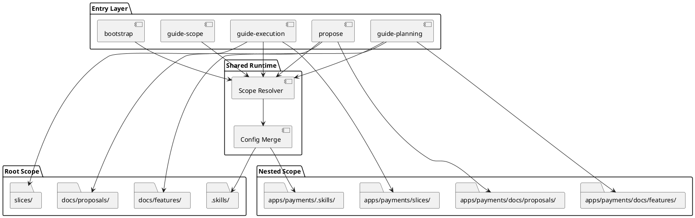

# System Design: Hierarchical Scope Support

## Overview

Hierarchical scope support adds a scope-resolution layer ahead of the existing
planning, proposal, and execution helpers.

The workflow itself does not change. `discover`, `design`, `breakdown`,
`review-planning`, `slice`, and `guide-execution` keep their current
responsibilities. The new behavior is that each operation first resolves the
correct **scope root**, then reads and writes planning artifacts relative to
that scope instead of assuming one repository-root workspace.

The design keeps the current single-project behavior as the compatibility
default while allowing nested subprojects to own local `.skills/`,
`docs/features/`, `docs/proposals/`, and execution settings.

## Related Stories

- `HSS-01`: repository-root fallback keeps umbrella planning available
- `HSS-02`: nested scopes own local planning and proposal artifacts
- `HSS-03`: nearest-scope resolution keeps writes in the correct project area
- `HSS-04`: ambiguous scope situations stop for explicit selection
- `HSS-05`: `guide-scope` provides one reusable scope-aware entry layer
- `HSS-06`: child scopes override parent `.skills` settings without breaking inherited defaults

## Architectural Decisions

### 1. Scope roots are explicit, with repository-root fallback

A directory becomes an explicit scope when it contains a `.skills/` directory.
The resolver walks upward from the current working directory, or from an
explicit user-provided path, and chooses the nearest enclosing explicit scope.

If no explicit scope is found, the repository root acts as an implicit fallback
scope using existing default paths. This preserves current single-project
behavior for repositories that do not define nested scopes.

### 2. One shared scope runtime resolves context before any workflow action

Introduce a reusable scope helper module used by planning, proposal, execution,
bootstrap, and slice bootstrap entrypoints.

That runtime should resolve a `ScopeContext` value before any registry lookup,
metadata read, or artifact write. `ScopeContext` should provide at least:

- `repo_root`
- `scope_root`
- `scope_chain` from root-most scope to active scope
- resolved planning config values such as `planning_dir`, `proposal_dir`, and
  `design_diagram_mode`
- resolved execution config values such as `slice_dir`
- resolved conventions config object
- resolution mode metadata, such as `explicit` vs `nearest`

This keeps scope logic out of feature-specific commands and makes downstream
helpers mostly path consumers rather than path discoverers.

### 3. Config inheritance is key-based, but paths resolve against the active scope

Each scope may define any subset of:

- `.skills/planning.json`
- `.skills/execution.json`
- `.skills/conventions.json`

Configuration is merged from outermost scope to innermost scope, with child keys
overriding parent keys. Unknown keys are preserved.

Relative directory values such as `planning_dir`, `proposal_dir`, and
`slice_dir` are interpreted relative to the **resolved active scope root**, not
relative to the process working directory and not relative to the file that
defined the inherited value. This preserves intuitive child-scope behavior when
default directory names are inherited.

### 4. Registries remain local to each scope

Each resolved scope owns its own planning and proposal registries:

- `<scope>/docs/features/README.md`
- `<scope>/docs/features/registry.json`
- `<scope>/docs/proposals/README.md`
- `<scope>/docs/proposals/registry.json`

No cross-scope merged registry is introduced. Ownership stays local, and
cross-scope discovery happens through scope selection rather than by flattening
all features and proposals into one global index.

### 5. Scope-aware CLI contracts are additive

Planning, proposal, execution, and slice bootstrap scripts gain an optional
`--scope` argument. When omitted, they resolve the nearest enclosing scope from
the current working directory.

Operations that can intentionally cross scope boundaries gain a second explicit
parameter. The main case is proposal promotion:

- `--scope` identifies where the proposal is stored
- `--target-scope` identifies where canonical feature planning should be created

If `--target-scope` is omitted, promotion stays in the proposal's own scope.
Cross-scope promotion must never happen implicitly.

### 6. `guide-scope` is a routing layer, not a duplicate workflow

Add a thin entry skill, `guide-scope`, to discover available scopes, resolve the
active scope, stop on ambiguity, and then hand off to `guide-planning`,
`guide-execution`, or `bootstrap`.

This keeps the existing workflow skills generic and reusable. Multi-scope
repositories can use `guide-scope` when ambiguity matters, while single-scope
repositories continue to work without a mandatory extra step.

## Key Components

- **Scope runtime**
  - shared helper that resolves the active scope and merged config view
- **Planning helpers**
  - `skills/guide-planning/scripts/manage_planning.py`
  - consume resolved planning paths instead of reading one repo-root config
- **Proposal helpers**
  - `skills/propose/scripts/manage_proposals.py`
  - read and update proposal registries inside the resolved scope
- **Execution helpers**
  - `skills/guide-execution/scripts/manage_execution.py`
  - consume scope-local execution and conventions config
- **Bootstrap**
  - `skills/bootstrap/scripts/bootstrap.py`
  - initializes `.skills/` inside a selected scope while preserving existing
    keys
- **Scope entry skill**
  - `guide-scope`
  - presents ambiguity and passes resolved scope context into downstream skills

## Interfaces and Responsibilities

### Scope runtime interface

The shared scope layer should expose a small interface such as:

```text
resolve_scope(start_path, explicit_scope=None) -> ScopeContext
load_planning_config(scope_context) -> PlanningConfigView
load_execution_config(scope_context) -> ExecutionConfigView
load_conventions_config(scope_context) -> dict
```

Optional helpers may also normalize common artifact paths:

```text
feature_root(scope_context, feature_slug) -> Path
proposal_root(scope_context, proposal_slug) -> Path
slice_root(scope_context, slice_id) -> Path
```

### Planning and proposal integration

`manage_planning.py` and `manage_proposals.py` should stop owning config
discovery directly. They should either:

1. accept `ScopeContext` from a thin CLI wrapper, or
2. call the shared scope runtime first and then continue with existing logic.

Either way, registry helpers such as `get_registry_paths()` and
`proposal_dir_for_row()` must become scope-aware and must not read `.skills/`
from the current process directory implicitly.

### Bootstrap integration

`bootstrap.py` already accepts `--repo-root`. That should become the selected
scope root semantically, while keeping the current flag for compatibility.

An additive `--scope` alias is acceptable, but the important behavior is that
bootstrap can initialize nested `.skills/` directories without assuming the
repository root is the only valid target.

## Data and State Design

### ScopeContext

`ScopeContext` is transient runtime state, not registry state. It should not be
duplicated into execution-slice artifacts.

Suggested fields:

| Field | Purpose |
|---|---|
| `repo_root` | Canonical repository root |
| `scope_root` | Active scope directory |
| `scope_chain` | Ordered parent-to-child scope ancestry |
| `planning_dir` | Resolved feature-planning directory for this scope |
| `proposal_dir` | Resolved proposal directory for this scope |
| `slice_dir` | Resolved execution-slice directory for this scope |
| `design_diagram_mode` | Active design output mode |
| `conventions` | Effective naming and tracker conventions |
| `resolution_mode` | `nearest` or `explicit` |

### Metadata impact

Feature and proposal metadata should remain local to their scope-specific
folders. No global scope registry is required for the initial design.

For the first version, `.planning-meta.json` and `.proposal-meta.json` do not
need a mandatory `scope_path` field because local registries already disambiguate
ownership. Adding optional scope-identifying fields later remains possible if
cross-scope tooling needs stronger auditability.

## Routing and Error Handling

- If `--scope` points outside the repository, fail with a clear error.
- If a slug-only lookup is attempted where more than one scope is plausible, do
  not search the whole repository silently. Return candidate scope paths and
  require explicit selection.
- If a user requests cross-scope proposal promotion, require explicit
  `--target-scope`.
- If a nested scope exists but has no local config file for a given layer, use
  inherited values merged through the scope chain.
- If no explicit scope markers exist, use the repository root fallback and keep
  current behavior.

## Validation Strategy

- Add unit tests for scope resolution:
  - nearest enclosing scope selection
  - repository-root fallback when no explicit scope exists
  - explicit scope targeting
  - parent/child config inheritance
  - ambiguous lookup failures
- Extend planning and proposal tests to cover:
  - feature creation inside a nested scope
  - proposal creation inside a nested scope
  - same-scope proposal promotion
  - explicit cross-scope proposal promotion
- Extend execution tests to cover:
  - scope-local `execution.json` and `conventions.json`
  - slice bootstrap from nested scopes
- Keep existing single-scope tests passing unchanged to prove backward
  compatibility.

## Risks and Tradeoffs

- A shared scope runtime simplifies behavior, but it becomes foundational
  infrastructure that multiple skills depend on.
- Key-based inheritance is flexible, but it must stay easy to reason about or
  users may not know which scope actually supplied a value.
- Repository-root fallback preserves compatibility, but it can hide missing
  `.skills/` setup if error messages are vague.
- Cross-scope promotion is powerful, but it must remain explicit to prevent
  accidental writes into parent or sibling planning areas.

## PlantUML



```plantuml
@startuml
actor User
participant "guide-planning CLI" as Planning
participant "Scope Resolver" as Scope
participant "Planning Helper" as Helper
database "child docs/features/registry.json" as Registry
file "child docs/features/<feature>/.planning-meta.json" as Meta

User -> Planning: set-status/add/promote-proposal\n(--scope optional)
Planning -> Scope: resolve_scope(cwd, --scope, --target-scope?)
Scope --> Planning: ScopeContext
Planning -> Helper: execute(command, ScopeContext)
Helper -> Registry: read/write active scope registry
Helper -> Meta: read/write active scope metadata
Helper --> Planning: result
Planning --> User: success or explicit ambiguity error
@enduml
```
