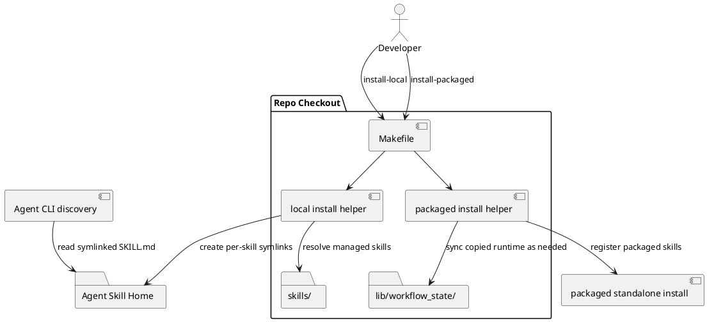

# System Design: Split Install Modes

## Design summary

This subfeature splits `sirius-skills` installation into two explicit modes:

- **source-linked local install**: expose repo skills directly through
  per-skill symlinks under the active agent skill home such as
  `~/.agents/skills/`
- **packaged install**: keep the current self-contained standalone skill
  packaging flow for agents or release boundaries that still require copied
  runtime files

The major design decision is to treat local development and CLI usage as a
source-linked workflow rather than as a packaged distribution workflow. That
removes ordinary local dependence on copied `workflow_state` runtime folders
and pushes parity concerns back to the places where copied artifacts still
exist.

## Goals and non-goals

### Goals

- Make repo-local usage run from checked-in skill sources.
- Preserve a deterministic packaged install path.
- Keep local-versus-packaged behavior explicit in repo commands and docs.
- Reduce the architectural importance of installed parity during normal local
  maintenance flows.

### Non-goals

- Remove packaged installs in the first rollout.
- Introduce agent-specific logic into every skill body.
- Add new user-facing `.skills/*.json` configuration for installation mode.

## Architecture

### Current architecture

```text
repo checkout
  -> sync shared runtime into selected skill folders
  -> npx skills add for every managed skill
  -> installed copied skill folders become runtime surface
```

### Target architecture

```text
repo checkout
  -> local install helper creates <skill-home>/<skill> symlinks
  -> agent CLI discovers repo skills directly through those symlinks

repo checkout
  -> packaged install helper syncs shared runtime
  -> packaged standalone skill install/export remains explicit
```

### Key structural decisions

#### 1. Per-skill symlinks instead of one namespace symlink

`sirius-skills` stores many peer skill directories under `skills/`, not one
top-level namespace skill that dispatches internally. The local install
helper should therefore create one symlink per managed skill:

```text
~/.agents/skills/audit-artifacts -> <repo>/skills/audit-artifacts
~/.agents/skills/guide-planning -> <repo>/skills/guide-planning
...
```

This matches direct skill discovery used by multiple CLIs without requiring the
repo to adopt a `superpowers`-style namespaced bundle.

#### 2. Install mode becomes an explicit boundary

The repo should distinguish:

- `install-local` / `uninstall-local`
- `install-packaged` / `uninstall-packaged`

During migration, `install` can remain as a compatibility alias. After the
local path is stable, the alias can move to the source-linked local mode and the
packaged path remains opt-in.

#### 3. Shared runtime sync stays only where copied artifacts still exist

`scripts/sync_shared_skill_runtime.py` is still valid for packaged standalone
maintenance skills, but it should no longer be part of the source-linked local
path. Source-linked local installs should resolve canonical repo runtime code
without copying it into installed skill folders first.

#### 4. Installed parity becomes packaging/release validation

Installed parity is still useful when:

- verifying packaged standalone skill copies
- validating exported bundles
- checking release/install artifacts outside the repo

Installed parity is not the primary safeguard for repo-local usage once
the runtime is source-linked by symlink.

## Interfaces and dependencies

- **`Makefile`**
  - owns user-facing install targets and migration aliases
  - can expose a `SKILLS_HOME` override for multi-CLI environments and tests
- **new local install helper**
  - creates and refreshes per-skill symlinks under the selected skill home
  - removes managed symlinks on uninstall
- **existing packaged install helper flow**
  - retains `npx skills add/remove` and shared-runtime sync
- **managed skill directories under `skills/`**
  - remain the canonical source for local use
- **`lib/workflow_state/`**
  - remains the canonical shared runtime source for repo-local development
- **maintenance/reporting skills**
  - should treat packaged parity as an explicit release/install concern rather
    than a default local runtime assumption

## Configuration surfaces and ownership

This design should avoid adding new repository planning/execution config files.

### Existing typed owners to preserve

- `.skills/planning.json`
- `.skills/execution.json`
- `.skills/conventions.json`

### New ownership rule

Installation mode is a **repo helper concern**, not a workflow-runtime config
surface. Any needed overrides should stay limited to helper parameters or
Makefile variables such as install roots for tests, not new durable repo config.

## Data flow, state, and lifecycle

### Source-linked local install flow

1. User runs `make install-local`.
2. Helper enumerates the managed skill set from the repo.
3. Helper ensures the chosen skill home exists.
4. Helper refreshes per-skill symlinks to repo `skills/<skill>/`.
5. The target agent CLI restarts or reloads and discovers skills directly from
   those links.

### Packaged install flow

1. User runs `make install-packaged`.
2. Shared runtime and references sync into packaged skill folders as needed.
3. Existing packaging/install command path registers standalone skill copies.
4. Optional packaged parity validation checks copied artifacts against repo
   expectations.

### Migration lifecycle

1. Add source-linked local install mode without removing the packaged path.
2. Rename the packaged path explicitly and document both modes.
3. Flip the default `install` alias only after docs and compatibility checks are
   in place.
4. Narrow parity/reporting defaults so local repo usage no longer depends on
   copied install assumptions.

## Failure handling and operational constraints

- Symlink creation must be idempotent and safe to rerun.
- Helpers must avoid deleting unrelated personal skills under the selected
  skill home.
- The local helper should fail clearly when an expected skill directory is
  missing in the repo.
- Windows compatibility may require junction handling or a documented fallback;
  the first rollout can scope initial implementation to supported local shells
  if the docs say so explicitly.
- Packaged install remains necessary until all supported agent environments can
  rely on direct repo-linked discovery.

## Alternatives considered

### Keep one `make install` path based on packaged skill copies

Rejected because it keeps local development coupled to copied runtime sync and
installed parity drift.

### Replace all current installs with one namespace symlink

Rejected for now because `sirius-skills` is organized as many peer skills, not
one umbrella runtime skill tree.

### Remove packaged install immediately

Rejected because the repo still supports broader agent packaging use cases and
needs a compatibility phase.

## Risks, assumptions, and open questions

- The repo must decide when the `install` alias flips to the source-linked
  local mode.
- Some existing maintenance output may still assume installed parity belongs in
  the default path and will need deliberate narrowing.
- Different agent CLIs may not share one skill-home path, so the helper design
  may need a generic home-selection abstraction rather than a single hardcoded
  location.
- This design assumes direct repo-linked local usage is the common contributor
  workflow and should therefore drive the default ergonomics.

## Validation strategy

- Add helper tests for local symlink creation and cleanup behavior.
- Verify local install/uninstall leaves unrelated skills untouched.
- Keep packaged install tests for shared-runtime sync and self-contained runtime
  imports.
- Update report/audit validation so packaged parity remains testable without
  treating it as the local default path.
- Review `README.md`, `AGENTS.md`, and install guidance in the same change.

## Summary

The migration should make local usage source-linked and simple while
keeping packaged standalone installs as an explicit secondary mode. That split
preserves compatibility and removes most day-to-day need for installed parity.

## PlantUML


