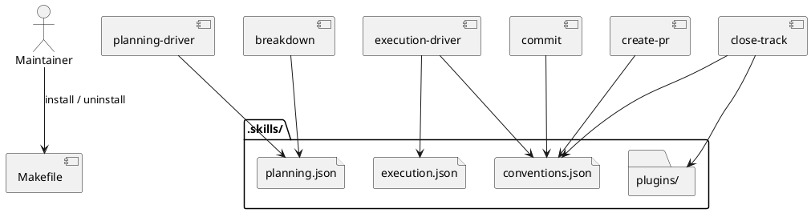

# System Design: Installation and Configuration

## Overview

Installation and configuration form the repository integration layer. The `Makefile` manages the installed skill set, while the `.skills/` directory provides separate configuration surfaces for planning layout, execution layout, and naming conventions. Project-local extensions live in `.skills/plugins/` and are only used when a specific skill explicitly opts in.

## Key Components

- **Managed install entrypoint**: `Makefile`
- **Planning layout config**: `.skills/planning.json`
- **Execution layout config**: `.skills/execution.json`
- **Conventions config**: `.skills/conventions.json`
- **Project-local extensions**: `.skills/plugins/`
- **Consumer skills**: planning-driver, execution-driver, commit, create-pr, close-track, breakdown

## Interfaces and Responsibilities

- `make install` registers the managed skill set.
- `make uninstall` removes only the managed skill names currently installed.
- `manage_planning.py` reads `planning.json` for `planning_dir`.
- `manage_execution.py` reads `execution.json` for `track_dir` and `preferred_workflow`.
- `manage_execution.py`, `commit`, `create-pr`, and `close-track` read `conventions.json` for naming and issue-link behavior.

## Constraints and Tradeoffs

- Separate config files keep ownership clear but require discipline to avoid overlap.
- Plugin behavior is explicit rather than automatic, which improves safety but reduces convenience.
- Makefile-based installation is predictable but requires updates whenever the managed skill set changes.

## Validation Strategy

- Use repository tests that exercise config readers in planning, execution, breakdown, and close-track flows.
- Review `README.md` and `AGENTS.md` whenever config semantics change.
- Verify `make install` / `make uninstall` continue to match the managed skill list.

## PlantUML

