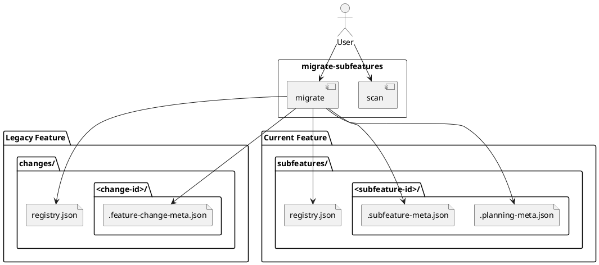

# System Design: Change To Subfeature Migration

## Overview

`migrate-subfeatures` converts legacy feature-local change packets into the
current durable subfeature layout.

### Legacy input

```text
docs/features/<feature-slug>/
  changes/
    README.md
    registry.json
    <change-id>/
      .feature-change-meta.json
      discover.md
      impact-analysis.md
      system-design.md
      slice-planning.md
      slice-traceability.md
```

### Target output

```text
docs/features/<feature-slug>/
  subfeatures/
    README.md
    registry.json
    <subfeature-id>/
      .planning-meta.json
      .subfeature-meta.json
      discover.md
      impact-analysis.md
      system-design.md
      slice-planning.md
      slice-traceability.md
```

The migration is structural and metadata-aware. It does **not** redesign the
planning contents; it rehomes and translates them into the new durable model.

## Architectural Decisions

### 1. Add a dedicated migration skill

The migration behavior should be exposed through a dedicated skill instead of
ad hoc shell instructions. This keeps the old-to-new conversion discoverable and
testable for repositories that still contain legacy change packets.

### 2. Support both inspection and execution

The script should support:

- `scan` to report legacy change packets and migration blockers
- `migrate` to perform the conversion
- `--dry-run` on `migrate` to preview writes safely

### 3. Support feature-scoped and repo-wide migration

The first version should allow:

- one selected feature via feature slug/path
- the whole planning tree via `--all`

This keeps the tool useful both for careful incremental cleanup and for one-shot
repo migrations.

### 4. Never overwrite existing subfeatures

If `docs/features/<feature>/subfeatures/<id>/` already exists, migration should
report a conflict and leave that legacy change packet untouched.

### 5. Map legacy states conservatively

Recommended state mapping:

| Legacy change status | New subfeature status |
| --- | --- |
| `draft` | `draft` |
| `discovery_ready` | `discovery_ready` |
| `design_ready` | `design_ready` |
| `breakdown_ready` | `breakdown_ready` |
| `reviewed` | `reviewed` |
| `reconciled` | `finalized` |
| `closed` | `finalized` |

`reconciled` and `closed` both represent already-completed legacy work, and the
new model no longer separates those states after migration.

## Data Conversion Rules

### Legacy metadata input

Expected source file: `.feature-change-meta.json`

Relevant fields:

- `change_id`
- `feature_slug`
- `status`
- `change_type`
- `summary`
- `affected_artifacts`
- `affected_story_ids`
- `affected_slice_ids`
- `review_note`
- `reconciled_at`
- `reconciled_files`
- `history_targets`

### New metadata output

Target file: `.subfeature-meta.json`

Mapped fields:

- `change_id` -> `subfeature_id`
- `feature_slug` -> `parent_feature_slug`
- `change_type` -> `subfeature_type`
- mapped legacy status -> `status`
- preserve `summary`, `affected_artifacts`, `affected_story_ids`,
  `affected_slice_ids`, and `review_note`
- `finalized_at` should use `reconciled_at` when present, otherwise `updated_at`
  for finalized legacy states

### Planning metadata

Each migrated subfeature must also get `.planning-meta.json` so the current
planning tools can resolve it. The planning status should be synchronized from
the migrated subfeature status using the same mapping used by
`add-subfeature`.

## Migration Flow

1. Resolve the planning scope and target features.
2. Discover legacy `changes/` folders.
3. Parse legacy registry rows and actual change directories.
4. For each candidate:
   - detect conflicts
   - compute target `subfeatures/<id>/` path
   - create the target planning folder and `.planning-meta.json`
   - move legacy planning artifacts into the target folder
   - write `.subfeature-meta.json`
   - update the feature-local subfeature registry
5. Remove legacy `changes/` bookkeeping when the directory is empty.
6. Resync the global planning registry.
7. Emit a machine-readable migration report.

## Interfaces and Responsibilities

- **`migrate-subfeatures`**
  - user-facing skill for repo migration
  - chooses between scan and write modes

- **`migrate_subfeatures.py`**
  - resolves features and planning scope
  - scans legacy change directories
  - migrates legacy metadata and paths
  - emits JSON migration results

- **`guide-planning/manage_planning.py`**
  - provides planning scope resolution
  - creates `.planning-meta.json` for migrated subfeatures
  - resyncs top-level planning registries

- **`add-subfeature/manage_subfeatures.py`**
  - provides the canonical subfeature metadata shape
  - writes subfeature registries
  - validates migrated subfeatures against the new lifecycle

## Validation Strategy

- Unit tests for scan-only detection and dry-run reporting.
- Unit tests for successful migration of a legacy feature with one change.
- Unit tests for conflict handling when the target subfeature already exists.
- Repository validation with `pytest -q`.

## PlantUML


