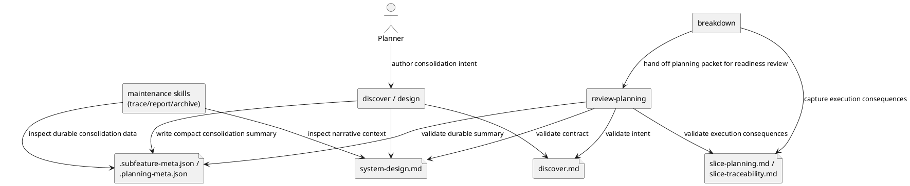

# System Design: Feature Consolidation And Reduction

## Design summary

`feature-consolidation-and-reduction` adds an explicit consolidation contract to
planning work that changes the planning workflow itself.

The design keeps consolidation decisions inside the existing planning model
instead of introducing a new lifecycle state or a standalone artifact type:

- human-readable intent lives in the existing planning docs
- concise machine-readable consolidation summaries live in existing metadata
  files
- `review-planning` becomes the enforcement point that blocks additive-only
  workflow growth when overlap already exists

This lets future planning capabilities explain what they simplify, narrow,
supersede, or remove while preserving the current feature/subfeature workflow.

## Related stories

- `FCR-01`: require each net-new planning capability to name what it
  supersedes, narrows, or removes
- `FCR-02`: flag additive-only expansion when a valid consolidation path exists
- `FCR-03`: record what becomes active, historical, archived, or superseded
- `FCR-04`: simplify the user-facing planning surface when new capabilities
  land

## Goals and non-goals

### Goals

- Make consolidation an explicit planning requirement for workflow-shaping
  capabilities.
- Reuse existing planning artifacts and metadata instead of inventing a new
  planning state or sidecar file.
- Give `review-planning` a concrete policy for rejecting redundant parallel
  planning surfaces.
- Preserve enough structured consolidation data that maintenance-oriented
  workflows can later report, trace, and archive historical items coherently.

### Non-goals

- Build a generic de-duplication engine that discovers overlap automatically.
- Auto-archive or delete historical artifacts as part of design or review.
- Push planning-layer consolidation state into execution-slice metadata.
- Require every repository feature to supply a consolidation target when the
  work is not itself evolving the planning workflow.

## Architecture

The design has four layers.

### 1. Consolidation declaration in planning docs

Every planning-workflow capability that materially changes the planning surface
must carry a durable consolidation declaration in its authored docs.

For this subfeature family, the declaration should answer:

- what existing capability, subfeature, artifact, or command surface is
  affected
- whether the new work is `additive`, `narrowing`, `superseding`, or
  `replacement`
- what becomes active, historical, or archival-eligible
- what user-facing simplification is expected
- why no valid consolidation target exists when the change is truly additive

The declaration should appear in:

- `discover.md` for initial intent and affected parent baseline
- `system-design.md` for the chosen technical contract
- `slice-planning.md` and `slice-traceability.md` only as downstream execution
  consequences, not as the primary policy record

### 2. Consolidation summary in existing metadata

The machine-readable summary should live in existing JSON metadata rather than a
new file.

Preferred ownership:

- subfeature-scoped work: `.subfeature-meta.json`
- canonical feature-scoped work with no child subfeature: `.planning-meta.json`

Recommended metadata extension:

```json
{
  "consolidation": {
    "disposition": "superseding",
    "targets": [
      {
        "kind": "subfeature",
        "ref": "planning-workflow/subfeatures/<subfeature-id>",
        "change": "supersedes"
      }
    ],
    "historical_artifacts": [
      "docs/features/.../discover.md"
    ],
    "surface_simplifications": [
      "route users through one canonical planning entrypoint"
    ],
    "justification": "Why this change reduces rather than duplicates workflow surface."
  }
}
```

This is intentionally compact. Long-form reasoning stays in the Markdown docs.

### 3. Review-time enforcement

`review-planning` becomes the policy gate.

The review pass should check:

- whether the planning packet declares a consolidation disposition
- whether claimed targets actually exist and are relevant
- whether additive work includes explicit justification when no valid
  consolidation target exists
- whether active-versus-historical artifact movement is recorded durably
- whether the proposed user-facing simplification is concrete enough to review

Blocking outcome:

- overlapping planning capability with no declared consolidation path
- declared simplification that leaves both old and new command surfaces active
  without justification
- missing or contradictory historical-artifact accounting across discovery,
  design, and impact docs

### 4. Downstream maintenance consumption

Maintenance-oriented workflows do not become owners of consolidation policy, but
they should be able to consume the durable result.

- `trace-artifacts` can show which planning capability superseded another
- `report-artifacts` can summarize active versus historical planning packets
- `archive-artifacts` can later use historical-artifact declarations as input
  to candidate reporting
- `breakdown` can carry superseded parent slice IDs into notes or dependencies
  before review, without turning execution slices into the planning source of
  truth

## Component diagram



## Interfaces and dependencies

### `add-subfeature`

No new lifecycle is needed, but the scaffolding should continue to expose
`subfeature_type` and make superseding or narrowing intent obvious in the
initial `discover.md` prompt.

### `discover`

For planning-workflow capabilities, discovery should record:

- consolidation disposition
- candidate targets
- expected artifact movement
- expected user-facing simplification

This is the first durable declaration, not the final enforcement point.

### `design`

`system-design.md` should translate the discovery intent into a stable contract:

- where consolidation data is stored
- which existing metadata carriers own the compact summary
- which review checks are blocking
- which downstream skills consume the result

### `review-planning`

This skill is the enforcement boundary. It should reject planning packets that
expand the planning workflow without a durable reduction story when a credible
target exists.

### `breakdown`

Breakdown should not restate the full consolidation policy. It should only
carry the execution consequences:

- new slices needed to implement the policy
- superseded or narrowed parent slice IDs kept in notes or dependencies
- validation steps that prove the old and new workflow surfaces are not both
  left active unintentionally

## Configuration surfaces and ownership

The design intentionally avoids new environment variables, CLI flags, or
repository-global config keys.

Ownership rules:

- `subfeature_type` remains the coarse change-shape signal
- authored Markdown docs remain the human-authoritative explanation
- `.subfeature-meta.json` or `.planning-meta.json` hold only the compact
  machine-readable consolidation summary
- planning registries remain indexes, not the source of detailed consolidation
  truth

This keeps raw workflow intent at the planning boundary and avoids creating
multiple control planes for the same decision.

## Data flow, state, and lifecycle

1. A planner creates or updates a planning-workflow capability.
2. `discover` records the initial consolidation declaration.
3. If the work is subfeature-scoped, discovery narrows that declaration against
   the parent baseline and affected stories/slices.
4. `design` records the durable ownership model and enforcement rules.
5. The metadata file stores the compact consolidation summary.
6. `breakdown` translates the design into execution-sized work and records the
   resulting slices and dependencies.
7. `review-planning` validates that the declaration, metadata, breakdown
   outputs, and claimed simplification are coherent.
8. Later maintenance workflows read the same durable summary to report or trace
   what became historical.

### Invariants

- Every workflow-shaping planning capability has exactly one explicit
  consolidation disposition.
- A capability may declare "no valid consolidation target" only with explicit
  justification.
- Historical-artifact movement is decided in planning artifacts, not inferred
  later from execution closure.
- Execution slices may reference superseded slices, but planning docs remain
  the canonical source of consolidation intent.

Planning state does not change:

`discovery_pending -> discovery_ready -> design_ready -> breakdown_ready ->
planning_reviewed`

This subfeature adds policy inside the existing lifecycle rather than adding a
new readiness state.

## Failure handling and operational constraints

- **Missing consolidation declaration**
  - `review-planning` should treat this as blocking for workflow-shaping
    planning capabilities.
- **Declared target does not exist**
  - Review should fail until the packet points to a real feature, subfeature,
    story, slice, artifact, or command surface.
- **Additive claim with obvious overlap**
  - Review should require an explicit justification or reroute the work toward
    narrowing/superseding semantics.
- **Historical artifacts named only in one doc**
  - Review should treat contradictions between discovery, impact, design, and
    metadata as blocking drift.
- **Old and new command surfaces both remain active**
  - Breakdown and later review should require explicit transition or retirement
    work instead of assuming cleanup will happen informally.

## Alternatives considered

### Add a standalone `consolidation.md` artifact

Rejected because it creates a new planning control surface for information that
already belongs in discovery, impact, design, and review.

### Keep consolidation as review-only guidance with no durable data

Rejected because later reporting, tracing, and archival workflows would still
have to reconstruct the decision from chat or commit history.

### Store all consolidation data only in registries

Rejected because registry rows are too shallow for the narrative reasoning, and
putting large structured payloads there would blur registry ownership.

## Risks, assumptions, and open questions

- The first rollout still needs a concrete rule for when a capability counts as
  "workflow-shaping" enough to require consolidation enforcement.
- The repo will need a small shared schema for consolidation summaries so
  `review-planning`, `trace-artifacts`, and `report-artifacts` do not each
  invent different field names.
- Some user-facing simplification claims may remain subjective; review guidance
  should prefer concrete before/after command or artifact paths.
- This design assumes existing planning metadata files are the right place for
  compact summaries; if many non-subfeature cases appear later, the repo may
  need a clearer feature-level carrier.

## Validation strategy

- Add tests around any shared consolidation-summary helpers or schema validators
  introduced for metadata parsing.
- Add `review-planning` coverage for:
  - missing consolidation declarations
  - additive claims with no justification despite overlap
  - contradictory active/historical artifact accounting
  - coherent superseding or narrowing packets
- Add `add-subfeature` and `discover` coverage so superseding and narrowing
  scaffolds prompt for consolidation targets explicitly.
- Add `breakdown` coverage ensuring superseded parent slice IDs remain in notes
  or dependencies rather than replacing the subfeature-local slice plan.
- Validate the planning packet with
  `sirius manage-planning sync-status \
  feature-consolidation-and-reduction --through design_ready`.

## Summary

The design introduces consolidation as a durable planning contract, not a new
planning state. Existing docs explain the change, existing metadata carries a
compact summary, `review-planning` enforces the rule, and downstream
maintenance/reporting flows consume the result without becoming new policy
owners.
