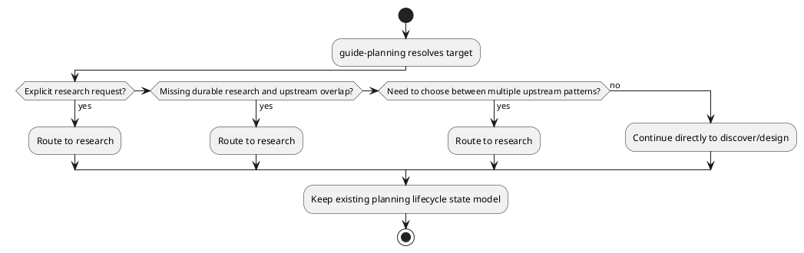

# Implementation Plan: Route research only when relevant

**Slice**: `rrs-relevance-routing`  
**Date**: 2026-04-21  
**Status**: Draft  
**Spec**: `brief.md`

## 1. Summary

This slice makes the new `research` skill conditional instead of ceremonial by
teaching `guide-planning` and `SKILLS_METHODOLOGY.md` when research should be
the next step and when planning should continue directly into `discover` or
`design`. The implementation stays doc-first: clarify routing thresholds, add
explicit skip cases, and keep the lifecycle unchanged.

## 2. Technical Context

- Current system context:
  - `skills/guide-planning/SKILL.md` is the planning-layer routing contract.
  - `SKILLS_METHODOLOGY.md` is the shared operational workflow guide for how the
    skills fit together.
  - The reviewed subfeature design already defines the research-routing
    threshold: explicit user request, missing durable research for overlapping
    checked-in references, or unresolved choice among upstream patterns.
  - The first slice already created `skills/research/`, so this slice only has
    to explain when that capability should be used.
- Target modules / files:
  - `skills/guide-planning/SKILL.md`
  - `SKILLS_METHODOLOGY.md`
  - `slices/rrs-relevance-routing-route-research-only-when-relevant/`
- Constraints:
  - keep the change limited to routing and methodology guidance
  - do not add a new planning readiness state
  - do not absorb downstream `discover`, `design`, or `review-planning`
    consumer behavior that belongs to later slices
  - keep the routing threshold concrete enough to avoid mandatory research for
    local-only work
- Assumptions:
  - maintainers use `guide-planning` as the canonical planning entrypoint
  - shared methodology should match `guide-planning` instead of inventing a
    second threshold
  - existing guide-planning tests are the relevant regression check even though
    this slice is mostly documentation and workflow guidance
- Out of scope:
  - code changes to `manage_planning.py`
  - downstream planning-doc consumption of `reference-research.md`
  - wiki synthesis behavior

## 3. Planning Gates

### Architecture / Constraints

- Decision: implement this slice as guidance updates in `guide-planning` and
  `SKILLS_METHODOLOGY.md`, anchored to the reviewed design contract.
- Result: PASS
- Notes: The behavior lives in workflow routing guidance rather than registry
  state or parser logic, so doc changes are the correct surface here.

### Risk / Compliance

- Decision: keep the threshold explicit, add skip examples, and state that
  `research` remains advisory within the existing planning lifecycle.
- Result: PASS
- Notes: The main risk is process creep; the docs should make "small repo-local
  edits skip research" obvious.

### Testability

- Decision: verify the repo still passes `skills/guide-planning` regression
  tests and manually inspect the updated guidance for aligned thresholds.
- Result: PASS
- Notes: The tests guard against accidental guide-planning tooling drift while
  the doc review covers the new routing contract itself.

## 4. Requirement Traceability

| Requirement | Implementation Steps | Validation |
| --- | --- | --- |
| FR-001 | S001, S003 | V001, V002 |
| FR-002 | S001, S003 | V001, V002 |
| FR-003 | S002, S003 | V001, V002 |
| FR-004 | S001, S002 | V001, V002 |
| FR-005 | S001, S002 | V001, V002 |

## 5. Execution Plan

### Packet P01: Update guide-planning routing guidance

- Scope: Clarify the planning entrypoint rules so `research` is invoked only
  when upstream comparison materially affects planning shape.
- Target files:
  - `skills/guide-planning/SKILL.md`
- Dependencies: none
- Steps:
  - [ ] S001 Add routing bullets that define when `guide-planning` should route
        to `research` and when it should skip that step.
  - [ ] S002 Explicitly state that `research` is advisory input to planning and
        does not add a new readiness state.
- Validation:
  - [ ] V001 Review the updated `guide-planning` guidance against the reviewed
        design contract and confirm the threshold matches.
- Definition of Done: `guide-planning` tells maintainers when research is
  relevant, when it is not, and how existing `reference-research.md` work
  affects that choice.
- Rollback / Mitigation: if the new wording starts to imply mandatory research
  for every overlap signal, narrow it back to the reviewed threshold and skip
  cases.

### Packet P02: Align shared methodology with the same threshold

- Scope: Keep the workflow guide consistent with `guide-planning` so the
  planning-layer story stays coherent.
- Target files:
  - `SKILLS_METHODOLOGY.md`
- Dependencies: P01
- Steps:
  - [ ] S003 Add `research` to the planning-layer narrative only where it helps
        explain the routing threshold and conditional handoff.
  - [ ] S004 Add one or more examples that show "route to research" versus
        "continue directly" behavior without preempting later consumer slices.
- Validation:
  - [ ] V002 Read the updated methodology alongside `guide-planning` and confirm
        they describe the same conditions and same lifecycle boundary.
- Definition of Done: maintainers reading either source see the same
  non-ceremonial research-routing rule.
- Rollback / Mitigation: if methodology starts to absorb downstream consumer or
  wiki behavior, trim it back to the routing threshold and leave later slices
  to describe those follow-on steps.

### Packet P03: Run guide-planning regression validation

- Scope: Confirm the routing-guidance slice did not disturb existing
  `guide-planning` tooling.
- Target files:
  - `skills/guide-planning/tests/test_manage_planning.py`
- Dependencies: P02
- Steps:
  - [ ] S005 Run the existing `guide-planning` pytest target after the doc
        changes land.
- Validation:
  - [ ] V003 Run `pytest -q skills/guide-planning/tests/test_manage_planning.py`
- Definition of Done: the planned slice validation passes after the routing-doc
  updates.
- Rollback / Mitigation: if unrelated failures appear, confirm whether they are
  baseline issues before expanding the slice beyond its guidance-only scope.

## 6. Supporting Notes

### Detailed Design Diagrams (PlantUML)

- Diagram purpose: show the planning-layer decision point that now decides
  whether `research` is necessary before direct planning work continues.
- Diagram type: activity

### Research Decisions

- Decision: keep this slice doc-first and treat `reference-research.md` as an
  input signal, not a new lifecycle checkpoint.
- Rationale: the reviewed design already defined the threshold, and later slices
  own consumer guidance and wiki synthesis.
- Alternative considered: add new routing fields or readiness state to planning
  metadata.

### Interface Notes

- Interface: `skills/guide-planning/SKILL.md`
- Inputs / outputs:
  - inputs: planning requests resolved through `guide-planning`
  - outputs: clearer routing guidance and consistent methodology wording
- Error states / compatibility notes:
  - avoid wording that implies mandatory research for every change
  - avoid wording that conflicts with the existing lifecycle states in
    `guide-planning`

### Verification Scenarios

- Happy path: the docs show that explicit research requests or unresolved
  upstream pattern choices route to `research`.
- Edge case: the docs show that small repo-local changes skip `research`.
- Regression checks: the `guide-planning` pytest suite still passes unchanged.

## 7. Delivery Notes

- Sequencing rationale: set the routing threshold before teaching downstream
  planning docs to consume `reference-research.md`.
- Risks to monitor:
  - introducing process-heavy wording that makes `research` feel mandatory
  - documenting consumer or wiki behavior too early
  - letting methodology drift from `guide-planning`
- Handoff notes for implementation:
  - keep edits constrained to `skills/guide-planning/SKILL.md` and
    `SKILLS_METHODOLOGY.md`
  - use the reviewed design bullets as the source of truth for the threshold
  - stop once the routing guidance is aligned and the existing tests pass
