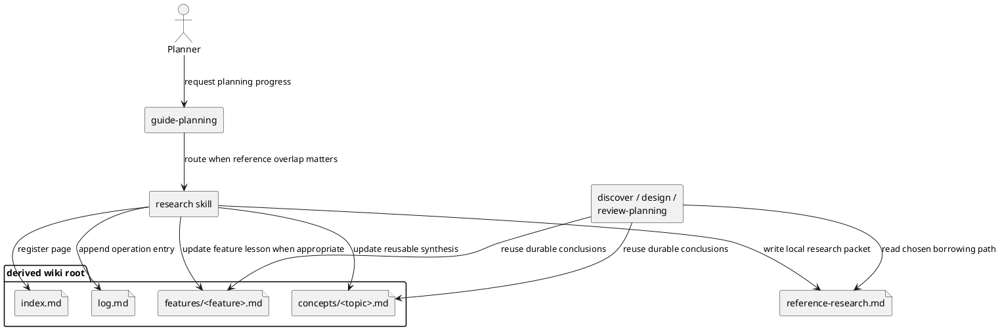

# System Design: Reference Research Synthesis

## Design summary

`reference-research-synthesis` adds an explicit planning-layer capability for
reference comparison and durable wiki synthesis without turning research into a
new lifecycle state.

The design introduces a dedicated `research` skill that produces one
feature-local or subfeature-local `reference-research.md` artifact and, when the
repository already has a bootstrapped wiki layer plus reusable conclusions,
updates the derived wiki root in place. `guide-planning` routes to `research`
when checked-in references materially affect feature shape, while `discover`,
`design`, and `review-planning` consume the resulting artifact instead of
duplicating long-form comparison inside their own docs.

## Related stories

- `RRS-01`: add an explicit reference-research step for relevant feature work
- `RRS-02`: write reusable conclusions into the repository wiki layer
- `RRS-03`: record the chosen borrowing path and tradeoffs durably
- `RRS-04`: require research only when it is materially relevant

## Goals and non-goals

### Goals

- Add a first-class planning skill for checked-in reference comparison.
- Keep feature-local borrowing decisions durable in the planning folder.
- Reuse the repository wiki layer for cross-feature conclusions instead of
  burying them in one planning packet.
- Preserve the current planning lifecycle states and ownership boundaries.

### Non-goals

- Add a new planning lifecycle state such as `research_ready`.
- Auto-bootstrap a wiki layer when one does not already exist.
- Turn the workflow into general internet research or broad web search.
- Replace `discover`, `design`, or `review-planning` as the main planning
  phases.

## Architecture

The capability has four durable parts:

1. **Routing**
   - `guide-planning` decides whether the current feature or subfeature needs
     research before discovery completion, before design, or before planning
     review.
   - The routing decision is based on whether upstream references materially
     affect the solution shape, not on a new metadata state.
2. **Feature-local research artifact**
   - `research` writes `<feature_path>/reference-research.md`.
   - The artifact captures the source inventory, comparison criteria, chosen
     borrowing path, rejected alternatives, and wiki follow-up status.
3. **Reusable wiki synthesis**
   - When a derived wiki root already exists and conclusions are reusable beyond
     the current feature, `research` adds or updates one focused wiki page plus
     the wiki `index.md` and `log.md`.
4. **Downstream consumption**
   - `discover`, `design`, and `review-planning` read
     `reference-research.md` when present and cite the chosen borrowing path
     rather than re-deriving it from raw references.

### Component diagram

## Interfaces and dependencies

### `guide-planning` routing contract

`guide-planning` should route to `research` when at least one of these is true:

- the user explicitly asks for reference-project research or wiki synthesis
- the target feature overlaps checked-in `references/` patterns and the planning
  folder has no durable research artifact yet
- discovery or design depends on choosing between multiple upstream patterns

`guide-planning` should not route to `research` for small repo-local edits whose
shape does not depend on external reference comparison.

### `research` skill contract

Inputs:

- canonical feature path or subfeature path
- optional narrowed question such as shell containment, routing behavior, or
  artifact ownership
- optional explicit reference paths when the default repo conventions are too
  broad

Required output:

- `<feature_path>/reference-research.md`

Optional outputs:

- updates to `<feature_path>/discover.md`
- updates to `<feature_path>/system-design.md`
- one or more wiki pages under the derived wiki root plus index/log maintenance

### `reference-research.md` contract

The local artifact should include:

- research scope and decision question
- sources reviewed and why they were selected
- comparison table or structured contrast between candidates
- chosen borrowing path
- explicit tradeoffs and lower-priority references
- whether a wiki update was written, skipped as non-reusable, or deferred
  because the wiki layer is absent

## Configuration surfaces and ownership

- Reuse `.skills/planning.json` field `planning_dir` to resolve the feature path
  and derive the wiki root as `<planning-parent>/wiki`.
- Reuse the existing bootstrap wiki layout instead of introducing a second wiki
  location or a skill-local override.
- Do not add new environment variables or repository-global flags for research.
- Keep any user-supplied reference narrowing in the prompt or artifact content,
  not in persistent config, unless a future repo has a stable need for
  repository-specific reference registries.

This keeps raw external inputs at the workflow boundary and converts them
immediately into durable repository artifacts.

## Data flow, state, and lifecycle

1. `guide-planning` resolves the target feature or subfeature.
2. `research` resolves `<feature_path>`, reads relevant references, and inspects
   existing planning docs.
3. `research` always writes or updates `reference-research.md`.
4. If the repository already has the derived wiki root and the conclusions are
   reusable, `research` updates the relevant wiki page plus `index.md` and
   `log.md`.
5. `discover`, `design`, or `review-planning` consume the artifact and cite the
   chosen borrowing path.
6. Planning metadata stays on the existing lifecycle:
   `discovery_pending -> discovery_ready -> design_ready -> breakdown_ready ->
   planning_reviewed`.

Research is therefore a **supporting planning pass**, not a new readiness state.

For subfeatures, `assess` still runs first so `impact-analysis.md` records the
affected parent baseline before `research` or subfeature-local design adds new
direction.

## Failure handling and operational constraints

- **No wiki layer present**
  - Do not auto-bootstrap the wiki.
  - Write the local research artifact and record that reusable synthesis is
    deferred until bootstrap creates the wiki layer.
- **References disagree**
  - Record the preferred source, why it won, and what was intentionally not
    copied from secondary references.
- **No meaningful external overlap**
  - `guide-planning` should skip `research` rather than producing ceremony-only
    artifacts.
- **Existing research artifact already present**
  - Update it in place when the new decision scope is additive or clarifying;
    avoid creating parallel local research files for the same feature packet.

## Alternatives considered

### Put all research directly in `discover.md`

Rejected because discovery framing and reusable cross-reference synthesis have
different audiences and reuse patterns. Keeping research separate makes it
easier for later design and review to cite one durable source.

### Update only the wiki and skip a local artifact

Rejected because feature-local borrowing decisions need a durable planning home,
and some repositories may not have a wiki layer yet.

### Add a new planning lifecycle state

Rejected because research is advisory input to discovery/design/review rather
than a readiness boundary with its own approval semantics.

## Risks, assumptions, and open questions

- The "when relevant" routing rule still depends on judgment; `guide-planning`
  examples and review guidance will need to make the threshold concrete.
- Repositories may differ on whether a conclusion belongs under a wiki concept
  page or a wiki feature/lesson page; the skill should prefer one focused page
  instead of scattering similar summaries.
- If a repository wants durable reference registries later, that should be a
  follow-on design instead of an ad hoc extension to this subfeature.

## Validation strategy

- Add tests for the new research helper or script covering:
  - local artifact generation
  - derived wiki-root resolution from `planning_dir`
  - wiki updates only when the wiki layer exists and reuse is warranted
  - stable handling of feature and subfeature targets
- Add `guide-planning` routing coverage for cases that should route to
  `research` versus direct `discover` or `design`.
- Review `discover`, `design`, `review-planning`, and `SKILLS_METHODOLOGY.md`
  so they consume the local research artifact consistently.
- Run `sirius manage-planning sync-status \
  docs/features/planning-workflow/subfeatures/reference-research-synthesis \
  --through design_ready` after the design artifact is written.

## Summary

The design keeps reference research explicit, durable, and reusable without
expanding the planning state machine. A dedicated `research` skill owns the
comparison and synthesis work, `reference-research.md` keeps feature-local
decisions reviewable, and the existing wiki layer carries only reusable
cross-feature knowledge.
