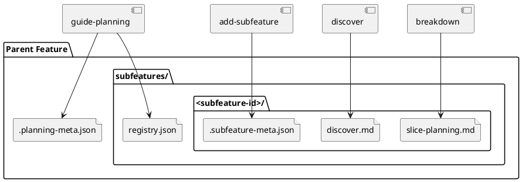

# System Design: Subfeature Workflow

## Overview

The subfeature workflow adds a durable nested planning layer under an existing
feature. Parent feature docs remain the baseline source of truth, while each
subfeature is a real child planning folder with its own planning artifacts and
metadata.

```text
docs/features/<feature-slug>/
  .planning-meta.json
  discover.md
  system-design.md
  slice-planning.md
  subfeatures/
    README.md
    registry.json
    <subfeature-id>/
      .planning-meta.json
      .subfeature-meta.json
      discover.md
      system-design.md
      slice-planning.md
      slice-traceability.md
```

This structure keeps planning durable and explicit:

- parent feature docs remain stable
- child planning happens in first-class nested folders
- execution still flows through slices
- feature-level cleanup happens later through explicit subfeature finalization

## Architectural Decisions

### 1. Parent feature folders remain primary

`docs/features/<feature-slug>/` stays the durable planning anchor for a parent
feature. Subfeatures extend that planning tree; they do not replace it.

### 2. Subfeatures are durable planning folders

Each child capability lives under:

```text
docs/features/<feature-slug>/subfeatures/<subfeature-id>/
```

The child folder is retained after implementation as durable planning history.

### 3. Subfeatures use planning artifacts, not execution artifacts

A subfeature is still planning-scoped. It can contain discovery, impact,
design, and breakdown artifacts, but execution work is still bootstrapped into
slices.

### 4. Parent and child state stay distinct

Parent feature readiness remains in `.planning-meta.json`. Each child subfeature
uses `.subfeature-meta.json` for parent-child metadata and lifecycle state.

Implemented lifecycle in code:

- `draft`
- `discovery_ready`
- `design_ready`
- `breakdown_ready`
- `reviewed`
- `finalized`

Planning metadata mirrors that lifecycle through the existing planning statuses.

### 5. Completion is explicit and non-destructive

Reviewed subfeatures stay durable after execution:

1. planned slices close individually through `close-slice`
2. the subfeature folder stays in place as durable planning history
3. closed execution slices stay available unless explicit archive maintenance is requested later
4. parent feature folders are not rewritten automatically as part of execution closure

## Key Components

- **Parent feature folder**
  - owns the accepted baseline planning artifacts

- **Subfeature registry**
  - `<feature_path>/subfeatures/README.md`
  - `<feature_path>/subfeatures/registry.json`
  - tracks child subfeatures for one parent feature

- **Subfeature folder**
  - `<feature_path>/subfeatures/<subfeature-id>/`
  - holds child planning artifacts and metadata

- **Subfeature metadata**
  - `.subfeature-meta.json`
  - stores parent slug, status, summary, parent story IDs, and affected artifact
    context

- **Finalization cleanup**
  - removes completed execution slices
  - advances the durable child planning folder to implemented/finalized

## Interfaces and Responsibilities

- **`guide-planning`**
  - resolves the active planning scope
  - syncs nested planning folders recursively so subfeatures appear in the
    planning registry

- **`add-subfeature`**
  - resolves the parent feature
  - initializes the local subfeature registry
  - creates a durable child planning folder and metadata

- **`design`**
  - authors subfeature-local design artifacts after discovery

- **`breakdown`**
  - authors subfeature-local `slice-planning.md` and
    `slice-traceability.md`

- **`review-planning`**
  - validates the child planning artifacts before slice bootstrap

## Data Model

### `subfeatures/registry.json`

Each row should capture:

- `subfeature_id`
- `parent_feature`
- `status`
- `subfeature_type`
- `summary`
- `updated_at`
- `path`

### `.subfeature-meta.json`

Recommended fields:

- `subfeature_id`
- `parent_feature`
- `status`
- `created_at`
- `updated_at`
- `subfeature_type`
- `summary`
- `affected_artifacts`
- `affected_story_ids`
- `affected_slice_ids`

## Validation Strategy

- `pytest -q skills/add-subfeature/tests/test_manage_subfeatures.py`
- `pytest -q skills/breakdown/tests/test_scaffold_breakdown.py`
- `pytest -q skills/guide-planning/tests/test_manage_planning.py`

## PlantUML


