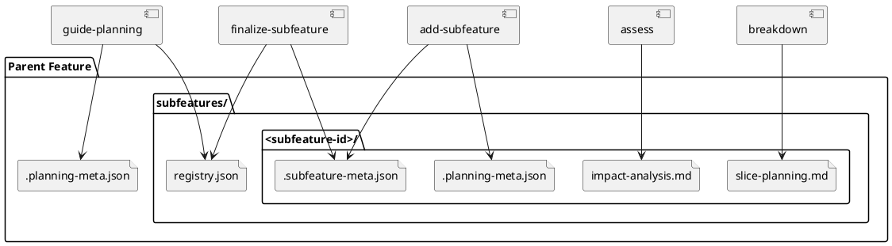

# System Design: Subfeature Workflow

## Overview

The subfeature workflow adds a durable nested planning layer under an existing
feature. Parent feature docs remain the baseline source of truth, while each
subfeature is a real child planning folder with its own planning artifacts and
metadata.

```text
docs/features/<feature-slug>/
  .planning-meta.json
  discover.md
  system-design.md
  slice-planning.md
  subfeatures/
    README.md
    registry.json
    <subfeature-id>/
      .planning-meta.json
      .subfeature-meta.json
      discover.md
      impact-analysis.md
      system-design.md
      slice-planning.md
      slice-traceability.md
```

This structure keeps planning durable and explicit:

- parent feature docs remain stable
- child planning happens in first-class nested folders
- execution still flows through slices
- feature-level cleanup happens later through explicit subfeature finalization

## Architectural Decisions

### 1. Parent feature folders remain primary

`docs/features/<feature-slug>/` stays the durable planning anchor for a parent
feature. Subfeatures extend that planning tree; they do not replace it.

### 2. Subfeatures are durable planning folders

Each child capability lives under:

```text
docs/features/<feature-slug>/subfeatures/<subfeature-id>/
```

The child folder is retained after implementation as durable planning history.

### 3. Subfeatures use planning artifacts, not execution artifacts

A subfeature is still planning-scoped. It can contain discovery, impact,
design, and breakdown artifacts, but execution work is still bootstrapped into
slices.

### 4. Parent and child state stay distinct

Parent feature readiness remains in `.planning-meta.json`. Each child subfeature
also has its own `.planning-meta.json`, plus `.subfeature-meta.json` for
parent-child and impact metadata.

Implemented lifecycle in code:

- `draft`
- `impact_ready`
- `design_ready`
- `breakdown_ready`
- `reviewed`
- `finalized`

Planning metadata mirrors that lifecycle through the existing planning statuses.

### 5. Finalization is explicit and non-destructive

`finalize-subfeature` is the human-requested feature-level cleanup step. It:

1. verifies the reviewed subfeature's planned slices are closed
2. removes the completed execution slices created for that subfeature
3. marks the subfeature implemented/finalized
4. keeps the durable subfeature folder in place

The workflow does not depend on deleting the child folder or rewriting the
parent feature folder automatically.

## Key Components

- **Parent feature folder**
  - owns the accepted baseline planning artifacts

- **Subfeature registry**
  - `<feature_path>/subfeatures/README.md`
  - `<feature_path>/subfeatures/registry.json`
  - tracks child subfeatures for one parent feature

- **Subfeature folder**
  - `<feature_path>/subfeatures/<subfeature-id>/`
  - holds child planning artifacts and metadata

- **Subfeature metadata**
  - `.subfeature-meta.json`
  - stores parent slug, status, impact summary, and affected artifact context

- **Impact analysis**
  - `impact-analysis.md`
  - captures affected parent artifacts, stories, and slices before design or
    breakdown continues

- **Finalization cleanup**
  - removes completed execution slices
  - advances the durable child planning folder to implemented/finalized

## Interfaces and Responsibilities

- **`guide-planning`**
  - resolves the active planning scope
  - syncs nested planning folders recursively so subfeatures appear in the
    planning registry

- **`add-subfeature`**
  - resolves the parent feature
  - initializes the local subfeature registry
  - creates a durable child planning folder and metadata

- **`assess`**
  - inspects the parent feature baseline
  - writes `impact-analysis.md` into the child subfeature folder

- **`design`**
  - authors subfeature-local design artifacts after impact review

- **`breakdown`**
  - authors subfeature-local `slice-planning.md` and
    `slice-traceability.md`

- **`review-planning`**
  - validates the child planning artifacts before slice bootstrap

- **`finalize-subfeature`**
  - checks reviewed-subfeature completion
  - removes completed execution slices
  - marks the durable subfeature implemented

## Data Model

### `subfeatures/registry.json`

Each row should capture:

- `subfeature_id`
- `parent_feature`
- `status`
- `subfeature_type`
- `summary`
- `updated_at`
- `path`

### `.subfeature-meta.json`

Recommended fields:

- `subfeature_id`
- `parent_feature`
- `status`
- `created_at`
- `updated_at`
- `subfeature_type`
- `summary`
- `affected_artifacts`
- `affected_story_ids`
- `affected_slice_ids`

## Validation Strategy

- `pytest -q skills/add-subfeature/tests/test_manage_subfeatures.py`
- `pytest -q skills/assess/tests/test_analyze_impact.py`
- `pytest -q skills/finalize-subfeature/tests/test_finalize_subfeature.py`
- `pytest -q skills/breakdown/tests/test_scaffold_breakdown.py`
- `pytest -q skills/guide-planning/tests/test_manage_planning.py`

## PlantUML


