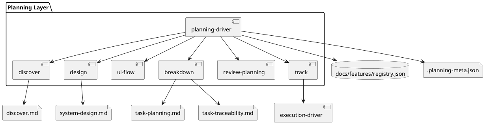

# System Design: Planning Workflow

## Overview

The planning workflow is a feature-scoped orchestration layer. `planning-driver` maintains the planning registry and readiness metadata, while authoring skills own individual artifacts. The planning layer hands off only when a feature has been decomposed into execution-ready slices.

## Key Components

- **Planning registry**: `docs/features/README.md` and `docs/features/registry.json`
- **Feature metadata**: `<feature_path>/.planning-meta.json`
- **Discovery authoring**: `discover.md`
- **Design authoring**: `system-design.md` and optional `ui-design.md`
- **Breakdown authoring**: `task-planning.md` and `task-traceability.md`
- **Planning review and handoff**: `review-planning` then `track`

## Interfaces and Responsibilities

- `manage_planning.py init` initializes the planning registry and config.
- `manage_planning.py add <feature-slug>` creates one feature folder and metadata entry.
- `manage_planning.py set-status` advances lifecycle state only when artifact gates are satisfied.
- `breakdown/scripts/scaffold_breakdown.py` provides deterministic breakdown templates.

## Constraints and Tradeoffs

- Artifact ownership stays separated by skill instead of centralizing all writing in `planning-driver`.
- Validation is mostly file-presence and non-empty-content based; semantic quality is enforced through skill guidance and review.
- Planning remains repository-first, so the tracker only receives execution-ready tasks after breakdown.

## Validation Strategy

- Use `skills/planning-driver/tests/test_manage_planning.py` for registry and state-gate behavior.
- Use `skills/breakdown/tests/test_scaffold_breakdown.py` for deterministic scaffold behavior.
- Validate each feature with `python3 skills/planning-driver/scripts/manage_planning.py validate-feature <feature-slug>`.

## PlantUML

