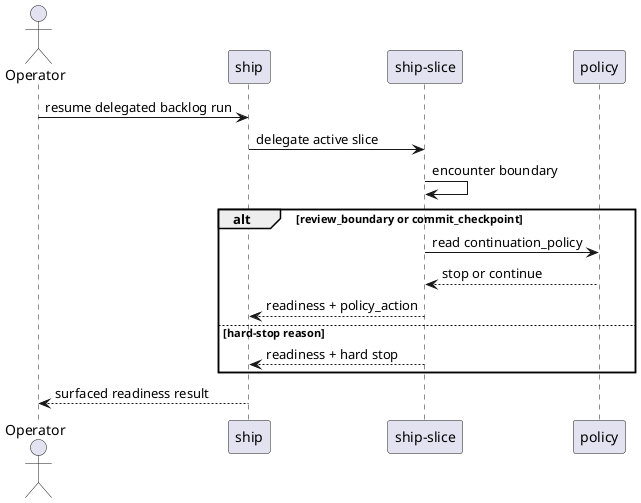

# System Design: Delegated Execution Stop Policies

## Goal

Let repositories choose whether delegated execution stops or continues at a
small set of deterministic boundaries, without weakening the existing hard-stop
guardrails.

## Design Summary

- Add one typed continuation-policy object under `accelerators.ship_slice` in
  `.skills/execution.json`.
- Limit the first rollout to `review_boundary` and `commit_checkpoint`.
- Keep approval, dirty-worktree safety, verification failure, and transition
  guardrail failures as hard stops outside the policy surface.
- Have both `ship-slice` and delegating `ship` surface the encountered boundary,
  chosen policy action, and policy source in readiness output.

## Configuration Ownership

The first rollout stays config-only:

```json
{
  "accelerators": {
    "ship_slice": {
      "continuation_policy": {
        "review_boundary": "stop",
        "commit_checkpoint": "stop"
      }
    }
  }
}
```

Policy values:

- `stop`
- `continue`

Rejected alternatives:

- one-off CLI overrides in the first rollout:
  they add another control plane before the durable config contract is proven.
- policy flags on `ship` and `ship-slice` separately:
  a single typed owner under `ship_slice` is enough for delegated execution.

## Policy Application Model

- `ship-slice` evaluates the stop reason it encounters.
- If the reason is policy-driven, it consults `continuation_policy`.
- `ship` reuses the delegate readiness output and does not reinterpret the stop
  reason independently.
- When policy says `continue`, the underlying owner still has to be available
  and eligible; policy does not skip required work that lacks a valid next step.



## Hard Stops

These remain non-policy boundaries:

- `approval_required`
- dirty-worktree ownership conflict
- verification failure
- missing required input
- transition guardrail failure

## Readiness Reporting

Extend readiness and stop-reason reporting with:

- `policy_action`: `stop` or `continue`
- `policy_source`: `config` or `default`

The boundary itself still appears in `blocked_by` and `stop_reason` so the
policy layer never hides what happened.

## Validation

- `pytest -q skills/ship/tests/test_ship.py`
- `pytest -q skills/ship-slice/tests/test_ship_slice.py`
- focused cases covering:
  - default stop behavior at review and commit boundaries
  - config-driven continuation at review boundary
  - config-driven continuation at commit checkpoint after terminal automation is
    available
  - hard-stop reasons that ignore policy settings
  - readiness output including both boundary and policy metadata
