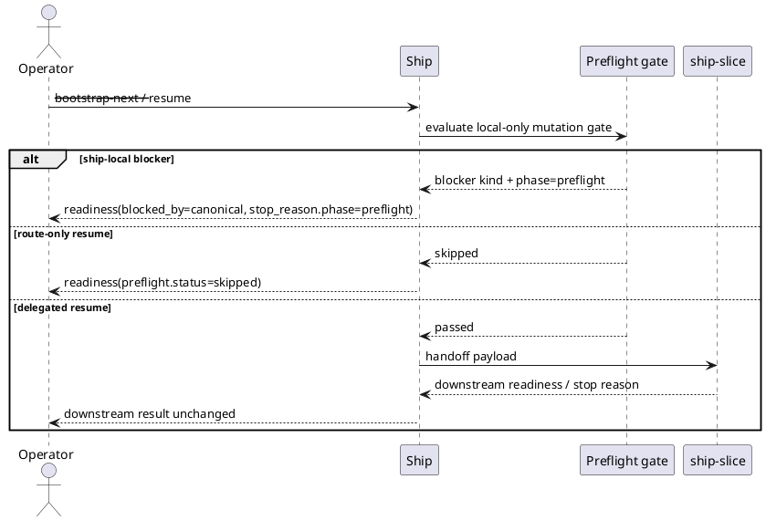

# Implementation Plan: Gate bootstrap and delegated resume with local-only preflight

**Slice**: `spi-mutation-gating`  
**Date**: 2026-04-24  
**Status**: Draft
**Spec**: `brief.md`

## 1. Summary

Promote the I1 preflight contract from descriptive metadata into an explicit
pre-mutation gate for `ship`. The implementation will keep the existing
approval and commit-checkpoint outcomes, but when local-only preflight is
active it will mark those stops as happening in the preflight phase before
bootstrap or delegated resume can mutate execution state.

## 2. Technical Context

- Current system context:
  - `skills/ship/scripts/ship.py` already computes preflight summaries and
    existing blocker codes for backlog, bootstrap, and resume paths.
  - Commit-checkpoint blocking already happens before next-slice bootstrap.
  - Approval blocking for delegated execution already happens before
    `ship-slice` delegation begins.
  - `ship-slice` owns continuation-policy and review-boundary behavior after
    delegation; this slice must not move that boundary.
- Target modules / files:
  - `skills/ship/scripts/ship.py`
  - `skills/ship/tests/test_ship.py`
  - `skills/ship-slice/tests/test_ship_slice.py`
- Constraints:
  - Preserve canonical blocker codes such as `approval_required` and
    `commit_checkpoint`.
  - Mark only pre-mutation ship-local stops as `phase=preflight`.
  - Keep route-only resume non-blocking.
  - Do not reclassify ship-slice review-boundary stops as preflight.
- Assumptions:
  - The I1 preflight summary is already correct for disabled/skipped/passed
    reporting.
  - Existing guardrails still apply even when preflight mode is `off`; this
    slice only annotates and sequences the local-only preflight path.
- Out of scope:
  - New blocker kinds
  - Remote freshness checks
  - Changes to ship-slice continuation policy or owner-chain semantics

## 3. Planning Gates

### Architecture / Constraints

- Decision: Add a small preflight-phase helper in `ship.py` that inspects the
  current result and annotates ship-local mutation blockers before delegation.
- Result: PASS
- Notes: This keeps the stop-phase logic in `ship`, where the mutation decision
  is made, without pushing ship-local semantics into `ship-slice`.

### Risk / Compliance

- Decision: Limit phase annotation to ship-local pre-mutation guardrails and
  leave downstream policy metadata untouched.
- Result: PASS
- Notes: This avoids rewriting review-boundary or commit/close behavior owned by
  `ship-slice`.

### Testability

- Decision: Expand ship tests for blocked bootstrap and delegated resume, then
  run ship-slice tests as regression coverage for downstream ownership.
- Result: PASS
- Notes: The change is output-shape heavy and fits the existing CLI JSON tests.

## 4. Requirement Traceability

| Requirement | Implementation Steps | Validation |
| --- | --- | --- |
| FR-001 | P01-S001, P01-S002 | P02-V001, P02-V002 |
| FR-002 | P01-S002, P01-S003 | P02-V001, P02-V003 |
| FR-003 | P01-S001, P02-S001 | P02-V001, P02-V002, P02-V003 |
| FR-004 | P01-S001, P01-S003, P02-S001 | P02-V002, P02-V003 |
| FR-005 | P01-S004, P02-S002 | P02-V001, P02-V003 |

## 5. Execution Plan

### Packet P01: Annotate ship-local preflight blocks

- Scope: Convert existing ship-local mutation blockers into explicit preflight
  phase metadata when local-only preflight is active.
- Target files:
  - `skills/ship/scripts/ship.py`
- Dependencies:
  - Existing I1 preflight summary helpers
  - Existing commit-checkpoint and approval-checkpoint result builders
- Steps:
  - [ ] P01-S001 Add a helper that decides whether a bootstrap/resume result is
        a ship-local pre-mutation preflight stop and, when it is, returns an
        annotated `stop_reason` with `phase=preflight`.
  - [ ] P01-S002 Apply that helper to commit-checkpoint and approval-checkpoint
        results for mutation-capable bootstrap/resume paths.
  - [ ] P01-S003 Ensure delegated resume keeps ship-local approval/commit
        preflight annotation, but leaves downstream ship-slice stop reasons
        untouched once delegation succeeds.
  - [ ] P01-S004 Keep route-only resume classified as skipped with no preflight
        stop annotation.
- Validation:
  - [ ] P01-V001 Ship JSON output still reports canonical blocker codes.
  - [ ] P01-V002 Blocked bootstrap-next reports `stop_reason.kind` unchanged and
        `stop_reason.phase=preflight`.
  - [ ] P01-V003 Blocked delegated resume reports `stop_reason.kind` unchanged
        and `stop_reason.phase=preflight`.
- Definition of Done:
  - Ship-local mutation blockers are clearly marked as preflight without changing
    ownership or blocker taxonomy.
- Rollback / Mitigation:
  - Keep the phase annotation helper local to `ship.py` so a revert restores the
    old readiness payload without touching registries or slice artifacts.

### Packet P02: Lock the gating contract with tests

- Scope: Cover the new preflight-phase behavior and protect ship-slice ownership
  boundaries from regression.
- Target files:
  - `skills/ship/tests/test_ship.py`
  - `skills/ship-slice/tests/test_ship_slice.py`
- Dependencies:
  - Packet P01 implementation
- Steps:
  - [ ] P02-S001 Add ship tests for blocked bootstrap-next and blocked delegated
        resume with local-only preflight, asserting canonical blocker codes plus
        `stop_reason.phase=preflight`.
  - [ ] P02-S002 Extend ship tests for route-only resume to assert it remains
        skipped and unblocked.
  - [ ] P02-S003 Run existing ship-slice tests unchanged to confirm downstream
        review-boundary behavior stays outside ship preflight.
- Validation:
  - [ ] P02-V001 `pytest -q skills/ship/tests/test_ship.py`
  - [ ] P02-V002 blocked bootstrap and delegated-resume payload assertions pass
  - [ ] P02-V003 `pytest -q skills/ship-slice/tests/test_ship_slice.py`
- Definition of Done:
  - The local-only gating contract is pinned by tests and downstream execution
    ownership still behaves as before.
- Rollback / Mitigation:
  - If a regression appears in ship-slice tests, remove any attempt to annotate
    delegated stop reasons after ship-slice takes ownership.

## 6. Supporting Notes

### Detailed Design Diagrams (PlantUML)

- Diagram purpose: Show where preflight phase annotation belongs relative to the
  existing ship and ship-slice boundaries.
- Diagram type: sequence

### Interface Notes

- Interface: `readiness.stop_reason`
- Inputs / outputs:
  - Inputs: existing blocker kind, requested command, local-only preflight mode,
    and whether ship is still before mutation
  - Outputs: same blocker kind plus optional `phase=preflight`
- Error states / compatibility notes:
  - No new blocker kinds are introduced.
  - Downstream ship-slice stop reasons remain authoritative after delegation.

### Verification Scenarios

- Happy path:
  - route-only resume still reports skipped preflight and no stop reason
- Edge case:
  - commit checkpoint before bootstrap-next reports `phase=preflight`
- Regression checks:
  - delegated review-boundary behavior from ship-slice remains unchanged

## 7. Delivery Notes

- Sequencing rationale: First annotate ship-local blocked results, then lock the
  contract with tests and regression coverage.
- Risks to monitor: Avoid tagging delegated ship-slice stop reasons as preflight
  after control has passed to a downstream owner.
- Handoff notes for implementation: After writing `blueprint.md`, advance the
  slice to `blueprint_ready` and continue directly into the ship readiness code
  and tests.
