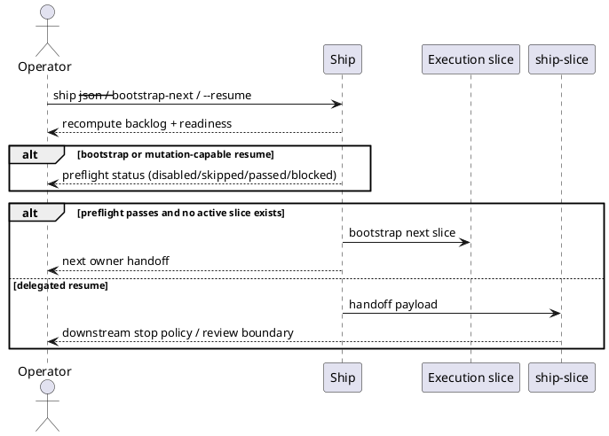

# Implementation Plan: Document rerun semantics and preflight behavior

**Slice**: `spi-operator-contracts`  
**Date**: 2026-04-24  
**Status**: Draft
**Spec**: `brief.md`

## 1. Summary

Align the operator-facing ship documentation with the contract now implemented
in code. The update will keep the ship skill, the two-step roadmap page, and
the throughput-acceleration feature wiki in sync around four core ideas:
read-only recomputation, guarded mutation, delegated side effects, and local-only
preflight timing.

## 2. Technical Context

- Current system context:
  - `skills/ship/scripts/ship.py` now emits `readiness.preflight` with typed
    modes, operation classification, and `stop_reason.phase=preflight` for
    ship-local blocked mutation paths.
  - `skills/ship/SKILL.md` still describes the backlog and execution routing
    slices, but does not yet explain the rerun contract or preflight timing.
  - `docs/wiki/concepts/two-step-autonomy-roadmap.md` and
    `docs/wiki/features/throughput-acceleration-workflow.md` still describe the
    accelerator flow at a higher level and need the new ship contract called out
    explicitly.
- Target modules / files:
  - `skills/ship/SKILL.md`
  - `docs/wiki/concepts/two-step-autonomy-roadmap.md`
  - `docs/wiki/features/throughput-acceleration-workflow.md`
- Constraints:
  - Docs must describe the shipped behavior, not speculative future modes.
  - Docs must preserve the boundary that `ship-slice` owns downstream stop
    policy after delegation.
  - The three artifacts should use the same operator vocabulary.
- Assumptions:
  - The I1 and I2 code changes are the source of truth for the contract.
  - No additional product-specific preflight modes are part of this slice.
- Out of scope:
  - New behavior changes in `ship.py`
  - Additional wiki pages or planning artifacts beyond the three target docs

## 3. Planning Gates

### Architecture / Constraints

- Decision: Update all three docs from the current `ship.py` contract rather
  than restating planning-phase design language verbatim.
- Result: PASS
- Notes: This keeps the documentation tied to shipped behavior instead of
  repeating outdated roadmap-only wording.

### Risk / Compliance

- Decision: Be explicit about what can mutate and what still blocks, so the docs
  do not overstate idempotency or hide approval/commit boundaries.
- Result: PASS
- Notes: The biggest risk here is misleading operators about safe reruns.

### Testability

- Decision: Use artifact review against the implementation and cross-check the
  three docs for consistent phrasing.
- Result: PASS
- Notes: This slice is docs-only, so correctness is measured by contract
  alignment rather than automated code assertions.

## 4. Requirement Traceability

| Requirement | Implementation Steps | Validation |
| --- | --- | --- |
| FR-001 | P01-S001, P01-S002 | P02-V001 |
| FR-002 | P01-S001, P01-S003 | P02-V001, P02-V002 |
| FR-003 | P01-S001, P01-S003 | P02-V001, P02-V002 |
| FR-004 | P01-S002, P01-S003 | P02-V001, P02-V003 |
| FR-005 | P01-S001, P01-S002, P01-S003 | P02-V001, P02-V002, P02-V003 |

## 5. Execution Plan

### Packet P01: Update the operator contract across all three docs

- Scope: Rewrite the relevant skill and wiki sections to reflect the shipped
  rerun/preflight contract using one consistent vocabulary.
- Target files:
  - `skills/ship/SKILL.md`
  - `docs/wiki/concepts/two-step-autonomy-roadmap.md`
  - `docs/wiki/features/throughput-acceleration-workflow.md`
- Dependencies:
  - Current `ship.py` readiness/preflight implementation
  - Current workflow-state and delegation boundaries
- Steps:
  - [ ] P01-S001 Update `skills/ship/SKILL.md` to describe read-only backlog
        recomputation, guarded mutation (`--bootstrap-next`, mutation-capable
        `--resume`), and delegated side effects.
  - [ ] P01-S002 Update the roadmap page so the two-step operator flow explains
        approval, reruns, and local-only preflight timing before mutation.
  - [ ] P01-S003 Update the throughput-acceleration feature wiki so its
        snapshot/reference-guided section reflects the shipped readiness and
        preflight contract rather than future-only ideas.
- Validation:
  - [ ] P01-V001 The three docs use consistent terms for recomputation,
        mutation, delegation, and preflight.
  - [ ] P01-V002 Docs state `accelerators.ship.preflight.mode` supports `off`
        and `local_only`.
  - [ ] P01-V003 Docs keep `ship-slice` as the downstream owner after
        delegation starts.
- Definition of Done:
  - Operators can read any of the three artifacts and understand the same ship
    contract without consulting implementation details.
- Rollback / Mitigation:
  - Keep updates local to the three target docs so wording can be tightened
    without affecting code or workflow metadata.

### Packet P02: Cross-artifact consistency review

- Scope: Validate that the updated docs match one another and the shipped code.
- Target files:
  - `skills/ship/SKILL.md`
  - `docs/wiki/concepts/two-step-autonomy-roadmap.md`
  - `docs/wiki/features/throughput-acceleration-workflow.md`
- Dependencies:
  - Packet P01 edits
- Steps:
  - [ ] P02-S001 Compare the final wording against current `ship.py`
        operation/preflight behavior.
  - [ ] P02-S002 Check the three docs for drift in terminology or unsupported
        claims.
- Validation:
  - [ ] P02-V001 Artifact review of `skills/ship/SKILL.md`
  - [ ] P02-V002 Artifact review of `docs/wiki/concepts/two-step-autonomy-roadmap.md`
  - [ ] P02-V003 Artifact review of `docs/wiki/features/throughput-acceleration-workflow.md`
- Definition of Done:
  - The operator contract is documented once and repeated consistently across the
    maintained docs layer.
- Rollback / Mitigation:
  - Prefer concise wording and source-linked claims to avoid introducing new doc
    drift.

## 6. Supporting Notes

### Detailed Design Diagrams (PlantUML)

- Diagram purpose: Show the operator-facing contract boundaries the docs need to
  explain.
- Diagram type: sequence

### Interface Notes

- Interface: operator-facing `ship` contract in docs
- Inputs / outputs:
  - Inputs: current `ship.py` readiness/preflight behavior and existing wiki/skill
    wording
  - Outputs: aligned prose describing reruns, preflight, and delegation
- Error states / compatibility notes:
  - Avoid promising blanket idempotency.
  - Avoid documenting unimplemented remote freshness checks as current behavior.

### Verification Scenarios

- Happy path:
  - docs show `ship --approve` then `ship --resume` as the two-step execution
    flow
- Edge case:
  - docs explain that local-only preflight can stop before mutation with
    canonical blocker codes
- Regression checks:
  - docs keep `ship-slice` as the owner of downstream review-boundary behavior

## 7. Delivery Notes

- Sequencing rationale: Update the ship skill first, then align the roadmap and
  feature wiki to the same contract language.
- Risks to monitor: The main risk is stale or overstated wording, not code
  behavior.
- Handoff notes for implementation: After `blueprint.md`, update the three docs,
  then do an artifact-level review for contract consistency before closing the
  slice.
