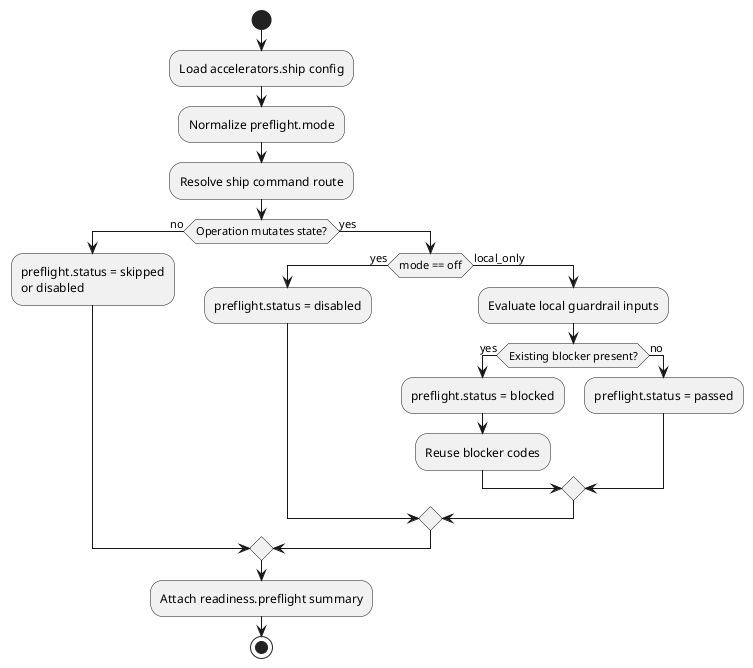

# Implementation Plan: Add typed ship preflight contract and readiness metadata

**Slice**: `spi-preflight-contract`  
**Date**: 2026-04-24  
**Status**: Draft
**Spec**: `brief.md`

## 1. Summary

Add the first slice of ship preflight support by extending the existing `ship`
readiness contract. The implementation will keep the current blocker codes and
owner routing intact, add typed config parsing under `accelerators.ship`, and
attach a nested `readiness.preflight` summary that explains whether preflight is
disabled, skipped, passed, or blocked for the resolved operation.

## 2. Technical Context

- Current system context:
  - `skills/ship/scripts/ship.py` already resolves backlog state, approval,
    commit-checkpoint, delegation, and handoff payloads.
  - `build_backlog_readiness(...)` and `build_bootstrap_readiness(...)` are the
    canonical places where `ship` shapes operator-facing readiness output.
  - `ship_accelerator_config(...)` already reads `accelerators.ship` from
    `.skills/execution.json`, so the new config should stay under that owner.
- Target modules / files:
  - `skills/ship/scripts/ship.py`
  - `skills/ship/tests/test_ship.py`
  - `.skills/execution.json`
- Constraints:
  - Preserve existing blocker codes, approval-gate semantics, commit-checkpoint
    semantics, and owner routing.
  - Keep the first rollout deterministic and local-only; no network or remote
    freshness checks.
  - Do not add CLI flags or environment variables.
- Assumptions:
  - Unset preflight config is equivalent to `off`.
  - For this slice, blocked preflight can reuse existing readiness reasons
    discovered from current guardrails without inventing new blocker kinds.
- Out of scope:
  - Enforcing preflight as a mutation gate on every eligible path.
  - Ship-slice policy changes.
  - Operator-facing documentation updates beyond code-adjacent config defaults.

## 3. Planning Gates

### Architecture / Constraints

- Decision: Add a small typed preflight layer inside `ship.py` that reads config,
  classifies the current operation, and annotates readiness output in one place.
- Result: PASS
- Notes: This keeps `ship` as the only owner of the new contract and avoids a
  second readiness model.

### Risk / Compliance

- Decision: Reuse existing blocker and stop-reason data instead of introducing a
  new taxonomy.
- Result: PASS
- Notes: The change is additive, local, and testable without external systems.

### Testability

- Decision: Cover config parsing and readiness payload shapes with focused
  `skills/ship/tests/test_ship.py` cases across `--json`, `--bootstrap-next`,
  and `--resume`.
- Result: PASS
- Notes: Existing CLI-style tests already exercise the relevant output shapes.

## 4. Requirement Traceability

| Requirement | Implementation Steps | Validation |
| --- | --- | --- |
| FR-001 | P01-S001, P01-S002 | P01-V001, P02-V001 |
| FR-002 | P01-S002 | P02-V001 |
| FR-003 | P01-S003, P01-S004 | P02-V002 |
| FR-004 | P01-S004, P02-S001 | P02-V002, P02-V003 |
| FR-005 | P01-S001, P02-S002 | P02-V001, P02-V003 |

## 5. Execution Plan

### Packet P01: Add typed config and operation classification

- Scope: Introduce the internal data needed to describe ship preflight without
  changing mutation behavior yet.
- Target files:
  - `skills/ship/scripts/ship.py`
  - `.skills/execution.json`
- Dependencies:
  - Existing `ship_accelerator_config(...)` config loading
  - Existing readiness builders
- Steps:
  - [ ] P01-S001 Extend the `accelerators.ship` config surface with a typed
        `preflight.mode` shape and keep `off` as the effective default.
  - [ ] P01-S002 Add a small parser/normalizer in `ship.py` for supported modes
        (`off`, `local_only`) with explicit errors for invalid values.
  - [ ] P01-S003 Add an internal operation classifier that can distinguish
        backlog-only output, route-only resume, bootstrap-next, and
        mutation-capable resume/delegation paths.
  - [ ] P01-S004 Add a helper that converts config plus operation class into a
        normalized preflight summary payload.
- Validation:
  - [ ] P01-V001 Config parsing tests for unset, `off`, `local_only`, and
        invalid values.
  - [ ] P01-V002 Classification tests for read-only JSON output, route-only
        resume, bootstrap-next, and delegated resume.
- Definition of Done:
  - `ship.py` can compute a deterministic preflight summary from current repo
    state and config without mutating behavior.
- Rollback / Mitigation:
  - Keep new helpers internal and additive so they can be removed without
    touching execution registries or planning state.

### Packet P02: Attach preflight metadata to readiness output

- Scope: Surface the new preflight summary through the existing ship readiness
  payloads used by operators and tests.
- Target files:
  - `skills/ship/scripts/ship.py`
  - `skills/ship/tests/test_ship.py`
- Dependencies:
  - Packet P01 helpers
  - Existing readiness builders and delegate-result passthrough
- Steps:
  - [ ] P02-S001 Attach `readiness.preflight` to backlog and bootstrap result
        payloads, preserving current blocker codes and stop-reason kinds.
  - [ ] P02-S002 Ensure the new summary is present for supported commands
        without requiring new CLI switches or env vars.
  - [ ] P02-S003 Add regression tests for disabled, skipped, passed, and
        existing-blocker cases in the ship CLI JSON output.
- Validation:
  - [ ] P02-V001 `pytest -q skills/ship/tests/test_ship.py`
  - [ ] P02-V002 Assert nested `readiness.preflight` fields for `ship --json`,
        `ship --bootstrap-next`, and `ship --resume`.
  - [ ] P02-V003 Assert canonical blocker codes remain unchanged when preflight
        metadata is present.
- Definition of Done:
  - Ship emits consistent nested preflight metadata across the active I1 command
    paths while keeping the current readiness contract stable.
- Rollback / Mitigation:
  - Keep the nested payload optional and derived so regressions can revert to
    the previous readiness shape without data migration.

## 6. Supporting Notes

### Detailed Design Diagrams (PlantUML)

- Diagram purpose: Show how config and operation resolution feed the nested
  preflight summary before any later mutation-gating logic is added.
- Diagram type: activity

### Interface Notes

- Interface: `readiness.preflight`
- Inputs / outputs:
  - Inputs: normalized mode, resolved operation class, existing readiness
    blockers and stop-reason context
  - Outputs: object with mode, operation, status, and optional blocking checks
- Error states / compatibility notes:
  - Invalid config should fail explicitly.
  - Existing `blocked_by` and `stop_reason.kind` remain the canonical contract.

### Verification Scenarios

- Happy path:
  - local-only mode on a mutation-capable path with no current blockers reports
    `status=passed`.
- Edge case:
  - route-only resume reports `status=skipped`.
- Regression checks:
  - unset config behaves like `off`
  - existing approval and commit-checkpoint blockers keep their current codes

## 7. Delivery Notes

- Sequencing rationale: Implement config and classification first, then wire the
  nested payload so tests can pin the contract cleanly.
- Risks to monitor: Avoid leaking later mutation-gating behavior into this slice
  or altering readiness reasons that downstream automation already expects.
- Handoff notes for implementation: After authoring `blueprint.md`, mark the
  slice `blueprint_ready`; repository config auto-starts implementation from
  there.
