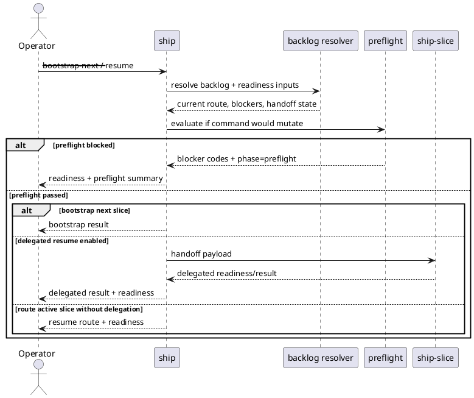

# System Design: Ship Preflight And Idempotency

## Design summary

This is a forward-looking subfeature design for the `ship` accelerator path.

The major design decision is to keep both concerns inside the existing
`ship` readiness contract:

- express rerun behavior as a typed operation contract instead of a blanket
  "ship is idempotent" claim
- add one optional local-only preflight owner under `accelerators.ship`
- surface preflight outcome through the existing `readiness` payload rather
  than introducing a parallel status plane

`ship-slice` remains the execution delegate. This packet only adds a mutation
gate in `ship` before bootstrap or delegated resume begins.

## Related stories

- `SPI-01`: explicit rerun contract for `ship`
- `SPI-02`: optional preflight before `--bootstrap-next` and `--resume`
- `SPI-03`: typed execution-config ownership for preflight behavior
- `SPI-04`: operator and reviewer docs for preflight plus rerun semantics
- Parent lineage: `TAW-02`, `TAW-03`

## Goals and non-goals

### Goals

- Make rerun semantics explicit without overstating what later delegated work
  may still mutate.
- Add a local-only preflight check that can stop before execution-state
  mutation on `ship --bootstrap-next` and `ship --resume`.
- Reuse existing readiness, stop-reason, approval-gate, and commit-checkpoint
  reporting.
- Keep configuration under the existing typed execution-config surface.

### Non-goals

- Introduce remote branch freshness or host-specific network checks in v1.
- Add new CLI flags, environment variables, or a standalone `ship-preflight`
  control plane.
- Move execution stop-policy logic out of `ship-slice`.
- Relax approval, commit-checkpoint, or dirty-worktree guardrails.

## Architecture

`ship` continues to resolve backlog state first. Preflight is a second-stage
evaluation that runs only on mutation-capable paths:

1. resolve backlog and existing guardrail state from planning/execution truth
2. determine the intended operation (`bootstrap_next`, `resume_route`,
   `delegate_resume`, `complete`, or blocked/non-mutating output)
3. if the selected command would mutate execution state or delegate into a
   mutation-capable executor, evaluate local preflight
4. if preflight blocks, return readiness with the existing blocker codes plus
   preflight context
5. otherwise continue with bootstrap or delegated execution

The design deliberately keeps preflight inside `ship` rather than teaching
`ship-slice` a second front-door contract. `ship-slice` still owns execution
boundary stop reasons after delegation begins.



### Rerun contract

The contract is phrased by operation class:

- Read-only recomputation:
  - plain backlog resolution and JSON output
  - active-slice routing when delegation is disabled
  - readiness, approval-gate, and commit-checkpoint recomputation
- Guarded mutation:
  - `--approve` rewrites the durable approval record from current planning
    truth
  - `--bootstrap-next` may create one mapped execution slice and write
    traceability only after readiness and preflight pass
  - `--resume` may bootstrap the next slice when no active mapping exists and
    the backlog is ready
- Delegated side effects:
  - when `delegate_to_ship_slice` is enabled, `ship --resume` may hand work to
    `ship-slice`, which can then mutate execution artifacts under its own
    contract

This means rerunning `ship` is deterministic with respect to current repo
artifacts, but it is not a promise that every command is side-effect free.

## Interfaces and dependencies

### Existing interfaces reused

- `sirius ship`
- `skills/ship/SKILL.md`
- `skills/ship/tests/test_ship.py`
- existing `workflow_runtime.build_accelerator_readiness(...)`
- existing approval-gate and commit-checkpoint helpers in `ship`
- existing delegated handoff contract to `ship-slice`

### New internal contract in `ship`

Add one local helper layer that:

- parses typed preflight config
- evaluates whether the selected command path is mutation-capable
- returns a preflight summary plus any blocking reason codes
- annotates `stop_reason` with preflight phase metadata when a local check
  stops progress before mutation

No new top-level command is required.

## Configuration surfaces and ownership

The first rollout extends the existing execution config owner under
`accelerators.ship`.

```json
{
  "accelerators": {
    "ship": {
      "delegate_to_ship_slice": true,
      "preflight": {
        "mode": "off"
      }
    }
  }
}
```

Supported v1 values:

- `off` (default)
- `local_only`

Ownership rules:

- raw config stays at `.skills/execution.json`
- `ship` parses the raw value once and converts it into typed local state
- future stronger modes, including remote freshness, must extend this same
  object instead of adding CLI flags or sibling globals

Rejected alternatives:

- `--preflight` CLI toggles:
  they would create another operator control plane for the same value.
- environment-variable overrides:
  they would bypass the repo-owned execution config.
- `accelerators.ship.remote_freshness` as a separate key:
  that splits one policy across multiple owners.

## Data flow, state, and lifecycle

### Preflight inputs

Preflight evaluates only local evidence already available to `ship`:

- backlog resolution outcome
- active execution-slice mapping
- approval-gate state
- commit-checkpoint state
- delegated handoff eligibility

### Preflight outputs

The existing `readiness` payload remains canonical and gains one nested field:

```json
{
  "readiness": {
    "can_proceed": false,
    "next_owner": "approval",
    "blocked_by": ["approval_required"],
    "stop_reason": {
      "kind": "approval_required",
      "phase": "preflight"
    },
    "preflight": {
      "mode": "local_only",
      "operation": "delegate_resume",
      "status": "blocked",
      "blocking_checks": ["approval_gate"]
    }
  }
}
```

Interpretation rules:

- `blocked_by` and `stop_reason.kind` still carry the canonical blocker codes
- `preflight` explains that those blockers were discovered before mutation
- when preflight is disabled or not applicable, `preflight.status` is
  `disabled` or `skipped`
- when preflight passes, `preflight.status` is `passed`

### Operation selection rules

- `ship <target>` and `ship --json`:
  backlog resolution only, no preflight evaluation required
- `ship --bootstrap-next`:
  always run preflight before creating a new execution slice
- `ship --resume`:
  run preflight after route resolution and before either
  bootstrapping a next slice or delegating to `ship-slice`
- `ship --approve`:
  stays outside preflight; approval is its own durable write contract

## Failure handling and operational constraints

- Multiple active mapped slices remain a hard error before preflight; that
  state is ambiguous rather than safely blockable.
- Preflight must not manufacture new blocker kinds when an existing readiness
  code already describes the problem.
- Delegated stop-policy behavior remains owned by `ship-slice`; `ship`
  preflight only blocks before delegation starts.
- If the selected `--resume` path is route-only and delegation is disabled,
  preflight may report `skipped` because no mutation-capable action is about
  to happen.
- Local-only mode must be deterministic and testable without network access.

## Alternatives considered

- Remote freshness in v1:
  rejected because it adds host-specific assumptions and drifts toward release
  tooling before the local contract is proven.
- Separate top-level `preflight` payload outside readiness:
  rejected because it would duplicate blocker semantics and split the operator
  dashboard.
- Blanket "idempotent" wording:
  rejected because bootstrap, approval writes, and delegated execution are not
  side-effect free.

## Risks, assumptions, and open questions

- Assumption: the current readiness payload is already the operator-facing
  machine-readable dashboard and should remain the single control plane.
- Assumption: v1 value comes from front-loading existing local guardrails, not
  from creating entirely new policy checks.
- Risk: if future remote freshness checks are added, they could bloat `ship`
  into product-specific policy unless they remain opt-in and under the same
  typed owner.
- Open follow-up, not a blocker for this packet:
  decide later whether a remote-aware mode belongs in this subfeature family
  or a separate child packet.

## Validation strategy

- `pytest -q skills/ship/tests/test_ship.py`
- Add focused cases for:
  - `--bootstrap-next` with preflight disabled, passed, and blocked
  - `--resume` with preflight skipped for route-only output
  - `--resume` blocked on approval before delegated execution
  - `--resume` blocked on commit checkpoint before next bootstrap
  - readiness output carrying nested `preflight` status and phase-marked
    stop-reason data
- Documentation review:
  - `skills/ship/SKILL.md`
  - `docs/wiki/concepts/two-step-autonomy-roadmap.md`
  - `docs/wiki/features/throughput-acceleration-workflow.md`

## Summary

This packet keeps `ship` simple: recompute from artifact truth, optionally run
one local preflight gate before mutation, then continue through existing
bootstrap or delegated execution owners. The result is a clearer rerun
contract and safer two-step execution UX without adding another workflow state
model.
