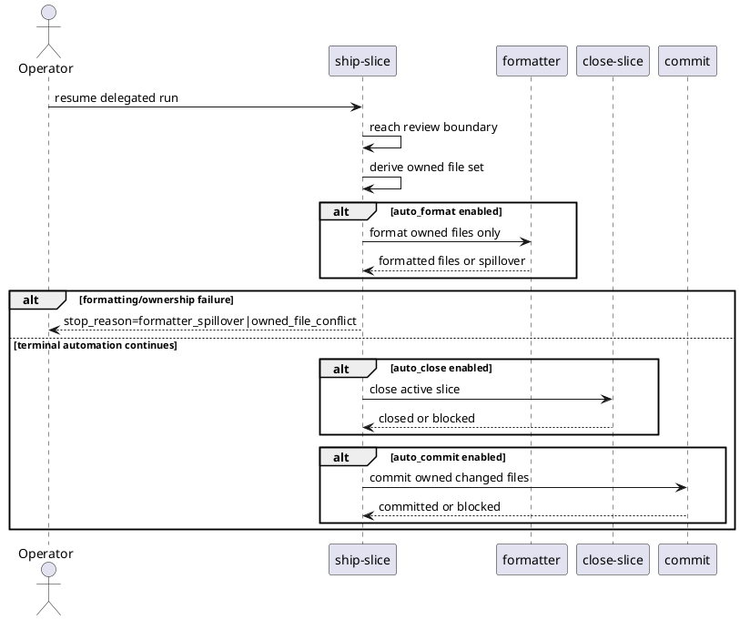

# System Design: Ship Slice Close Commit Controls

## Goal

Allow `ship-slice` to continue through optional formatting, slice closure, and
owned-file commit after review passes, while preserving existing owner
boundaries and deterministic stop behavior.

## Design Summary

- Add three typed execution-config controls under `accelerators.ship_slice`:
  `auto_format`, `auto_close`, and `auto_commit`.
- Require `auto_commit` to imply `auto_close`.
- Treat owned-file staging as an invariant, not a separate config toggle:
  delegated terminal automation stages only the files modified by the run.
- Run formatting before close/commit and stop if formatting spills outside the
  owned file set or touches a same-file conflict with pre-existing user edits.
- Delegate slice closure to `close-slice` and commit creation to the existing
  `commit` skill workflow instead of duplicating their rules inside
  `ship-slice`.

## Configuration Ownership

Keep the new controls inside `.skills/execution.json`:

```json
{
  "accelerators": {
    "ship_slice": {
      "auto_format": false,
      "auto_close": false,
      "auto_commit": false
    }
  }
}
```

Rejected alternatives:

- A separate `commit_only_owned_files` flag:
  this should be mandatory delegated-run behavior, not optional.
- A permissive `allow_formatter_spillover` flag:
  the first rollout should fail safely instead of normalizing formatter-driven
  expansion outside the owned file set.

## Terminal Flow

1. `ship-slice` reaches a clean review boundary.
2. Resolve the delegated run's owned file set from the run snapshot plus the
   current diff.
3. If `auto_format` is enabled, run formatter commands only against the owned
   file set.
4. Re-evaluate verification/dirty state after formatting.
5. If `auto_close` is enabled, call `close-slice`.
6. If `auto_commit` is enabled, call the existing `commit` owner while staging
   only owned changed files.



## Hard Stops And Partial Success

Hard stops even when automation is enabled:

- approval required
- verification failure
- transition guardrail failure
- same-file ownership conflict with pre-existing edits
- formatter spillover outside the owned file set
- commit-skill refusal or missing commit metadata

Partial success reporting must be explicit. When closure succeeds but commit
stops, readiness should retain the closed slice state and report `next_owner`
as `commit` with a deterministic stop reason.

## Validation

- `pytest -q skills/ship-slice/tests/test_ship_slice.py`
- `pytest -q skills/close-slice/tests/test_close_slice.py`
- focused delegated-run cases covering:
  - owned-file formatting only
  - formatter spillover stop
  - unrelated dirty worktree tolerated outside owned file set
  - same-file ownership conflict stop
  - auto-close then auto-commit happy path
  - close-applied / commit-blocked partial success
