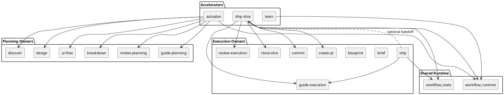
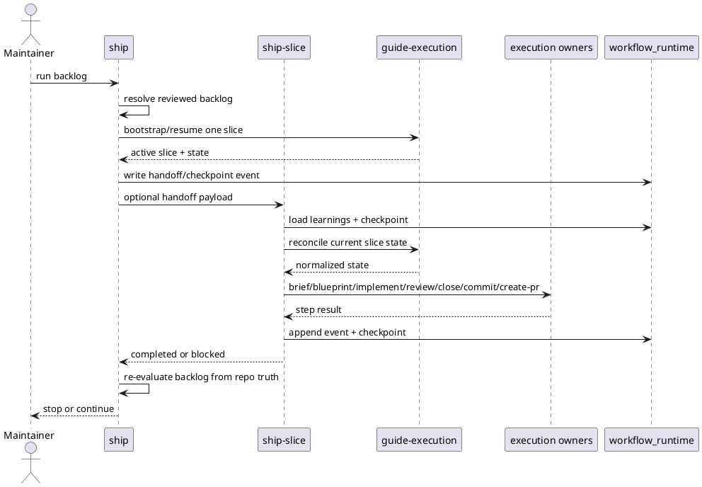

# System design: Throughput Acceleration Workflow

## Design summary

This is a forward-looking design for an optional accelerator layer on top of the
existing repo-native planning and execution workflow.

The major architectural decision is to preserve the current semantic owners and
add thin accelerator skills above them:

- `autoplan` compresses planning work through the existing planning layer.
- `ship` remains the backlog orchestrator for reviewed and committed work.
- `ship-slice` becomes the one-slice finisher for active execution slices.
- `learn` owns durable learning retrieval, promotion, pruning, and export.
- supplemental runtime support records checkpoints and event logs without
  replacing planning or execution artifacts as the source of truth.

This design keeps `guide-planning`, `guide-execution`, `ship`, `brief`,
`blueprint`, `review-execution`, `close-slice`, `commit`, and `create-pr` as
the owners of their existing semantics. `ship` does not later depend on
`ship-slice` for core backlog resolution. Instead, `ship-slice` depends on the
same execution artifacts and may optionally consume a machine-readable handoff
payload that `ship` emits in backlog mode.

## Related stories

- Story 1: Autoplan
- Story 2: Ship One Slice
- Story 3: Resume Interrupted Work
- Story 4: Reuse Prior Learnings

## Goals and non-goals

### Goals

- Reduce planning and execution handoff latency for maintainers who opt into an
  accelerated path.
- Preserve `docs/features/`, `docs/proposals/`, execution slice artifacts,
  registries, and metadata as the durable source of truth.
- Keep existing skill ownership boundaries intact while enabling higher-level
  orchestration.
- Make interrupted work resumable from explicit checkpoint context.
- Make repo-specific workflow learnings durable and reusable across sessions.

### Non-goals

- Collapse the workflow into one opaque autonomous skill.
- Replace the current planning or execution registry/state model.
- Add browser QA, deployment orchestration, or host-specific automation.
- Introduce hidden state that outranks checked-in planning or slice artifacts.
- Require repositories to adopt the accelerator layer in order to use the base
  workflow.

## Architecture

The accelerator layer is composed of three new skills plus one runtime package:

- `autoplan`
  - orchestrates `guide-planning`, `discover`, `design`, optional `ui-flow`,
    `breakdown`, and `review-planning`
  - stops at the existing approval boundary
- `ship`
  - remains the backlog resolver and slice selector
  - may optionally delegate one active slice to `ship-slice`
- `ship-slice`
  - drives one active slice from its current state through implementation,
    review, closure, commit, and optional PR preparation
- `learn`
  - owns retrieval, promotion, pruning, and export of workflow learnings
- `workflow_runtime`
  - shared support library for checkpoints, event logs, learnings storage, and
    optional handoff payload serialization

The shared runtime should live in a new top-level package, `lib/workflow_runtime/`,
instead of being folded into `lib/workflow_state/`. `workflow_state` remains the
library for durable planning and execution truth. `workflow_runtime` is
explicitly supplemental and can be synced into consuming skills by extending
`scripts/sync_shared_skill_runtime.py`.



### Ownership model

- `ship` owns:
  - backlog resolution
  - increment order
  - next-ready slice selection
  - machine-readable handoff payload generation
- `ship-slice` owns:
  - optional end-to-end finishing of one active slice
  - checkpoint capture and resume for that active slice
  - optional PR preparation after commit
- `learn` owns:
  - reading active learnings before accelerated work
  - promoting candidate learnings to active learnings
  - pruning or exporting stale learnings
- `workflow_runtime` owns:
  - serialization and file I/O for checkpoint, event-log, and learnings stores

`ship` remains standalone. It must still be able to resolve backlog state and
route the next owner even when `ship-slice` is absent or disabled.

## Interfaces and dependencies

### New skill entrypoints

- `python3 skills/autoplan/scripts/autoplan.py <feature-selector> [--json] [--resume]`
- `python3 skills/ship-slice/scripts/ship_slice.py <slice-id|slice-path> [--json] [--resume]`
- `python3 skills/ship-slice/scripts/ship_slice.py --handoff <handoff.json> [--json]`
- `python3 skills/learn/scripts/learn.py query <scope>`
- `python3 skills/learn/scripts/learn.py promote <learning-id>`
- `python3 skills/learn/scripts/learn.py prune <learning-id>`

### Existing dependencies reused directly

- `skills/guide-planning/scripts/manage_planning.py`
- `skills/guide-execution/scripts/manage_execution.py`
- `skills/ship/scripts/ship.py`
- `skills/close-slice/scripts/close_slice.py`
- the `commit` and `create-pr` skill workflows
- `scripts/sync_shared_skill_runtime.py`

### Handoff contract between `ship` and `ship-slice`

`ship` should extend its JSON output with a stable handoff payload for one
active slice:

```json
{
  "target_type": "feature",
  "target_id": "throughput-acceleration-workflow",
  "planned_slice_id": "tap-runtime-support",
  "execution_slice_id": "TAP-01-runtime-support",
  "execution_slice_path": "slices/TAP-01-runtime-support/",
  "slice_status": "brief_ready",
  "next_owner": "brief",
  "action": "resume_active_slice"
}
```

Rules:

- the payload is derived from existing planning and execution artifacts
- the payload is optional output, not required state
- `ship-slice` may consume it, but may also resolve the active slice directly
  from a slice ID or path

### Shared runtime package contents

`lib/workflow_runtime/` should provide:

- `checkpoints.py`
  - append, replace, list, and reconcile checkpoint records
- `event_log.py`
  - append-only JSONL log writer and readers
- `learnings.py`
  - query, append, promote, prune, and export helpers
- `handoff.py`
  - stable serialization and validation for `ship` -> `ship-slice` payloads
- `locking.py`
  - file-lock helpers for append/update operations

## Configuration surfaces and ownership

This design keeps configuration inside the existing planning and execution
config files. It does not add a new top-level `.skills/*.json` control plane.

### `.skills/planning.json`

`autoplan` settings live under the planning config because they affect the
planning layer only.

```json
{
  "planning_dir": "docs/features",
  "proposal_dir": "docs/proposals",
  "design_diagram_mode": "embedded",
  "accelerators": {
    "autoplan": {
      "auto_decision_policy": "conservative"
    }
  }
}
```

### `.skills/execution.json`

Execution accelerators and supplemental runtime settings live under the
execution config:

```json
{
  "slice_dir": "slices",
  "preferred_workflow": "TDD",
  "auto_start_implementation": true,
  "accelerators": {
    "ship": {
      "delegate_to_ship_slice": false
    },
    "ship_slice": {
      "pr_mode": "prepare_only"
    },
    "runtime": {
      "checkpoint_mode": "on_stop",
      "event_log": true,
      "runtime_dir": ".skills/runtime",
      "learnings_path": ".skills/learnings.jsonl"
    }
  }
}
```

### Ownership rules

- `auto_start_implementation` remains owned by the existing execution config and
  normal `guide-execution` flow.
- explicit invocation of `ship-slice` is an opt-in accelerator action, not a
  second configuration path for normal flow behavior.
- raw filesystem paths are parsed once at the accelerator boundary and passed to
  shared typed runtime helpers.
- automatic Git push or remote WIP publication is out of scope for the first
  design because it creates a second, riskier control plane.

## Data flow, state, and lifecycle

### Runtime artifacts

- `.skills/runtime/checkpoints/<run-id>.json`
  - per-run resumable checkpoint context
- `.skills/runtime/execution-log.jsonl`
  - append-only planning and execution acceleration events
- `.skills/learnings.jsonl`
  - durable repo-scoped learnings with states `candidate`, `active`, or
    `pruned`

These stores are supplemental. If checkpoint data disagrees with repo artifacts,
accelerators must reconcile back to the planning or execution truth and mark
the checkpoint stale instead of overwriting the repo state.

### `autoplan` lifecycle

1. Resolve one feature or proposal target through `guide-planning`.
2. Read active learnings relevant to the target scope.
3. Execute `discover`, `design`, optional `ui-flow`, `breakdown`, and
   `review-planning`.
4. Append planning events to the runtime log.
5. Capture checkpoints when the run stops for clarification, review findings, or
   approval.
6. Resume by reconciling checkpoint intent with the current planning status.

### `ship-slice` lifecycle

1. Resolve one active slice from:
   - explicit slice ID or path, or
   - a handoff payload from `ship`
2. Read active learnings relevant to the feature, subfeature, and skill.
3. Reconcile the current slice status through `guide-execution`.
4. Progress through the remaining owner steps:
   - `brief` when still `draft`
   - `blueprint` when `brief_ready`
   - repository implementation when `blueprint_ready` or `execution_ready`
   - `review-execution`
   - `close-slice`
   - `commit`
   - `create-pr` only when `pr_mode` requests it
5. Append execution events and checkpoint after each stop boundary.
6. Exit with either:
   - `completed`
   - `blocked`
   - `verification_failed`
   - `checkpoint_write_failed`
   - `approval_required`

### `ship` + `ship-slice` backlog mode

1. `ship` resolves one reviewed and committed backlog.
2. `ship` bootstraps or resumes one mapped slice.
3. If `delegate_to_ship_slice` is disabled, `ship` returns the next owner as it
   does today.
4. If `delegate_to_ship_slice` is enabled, `ship` emits a handoff payload and
   invokes `ship-slice` for that one active slice.
5. After `ship-slice` stops or completes, `ship` reevaluates the backlog from
   repo artifacts and either:
   - stops at a blocker or commit checkpoint
   - returns control to the user
   - continues to the next ready slice when policy allows

### Learning lifecycle

Each learning record should contain:

- `id`
- `scope`
- `topic`
- `guidance`
- `skill`
- `state`
- `evidence_refs`
- `recorded_at`
- `updated_at`

Rules:

- accelerators may append `candidate` learnings automatically
- `learn` is the only skill that promotes a learning to `active`
- `learn` is the only skill that marks a learning `pruned`
- accelerators read both `active` and recent `candidate` learnings, but should
  weight `active` higher

### Locking and concurrency model

- file locks protect:
  - event log appends
  - checkpoint updates per run ID
  - learnings updates
- `ship` continues to enforce one-active-slice semantics for a reviewed backlog
- `ship-slice` must refuse to operate on a slice that no longer matches the
  active resolved execution state



## Failure handling and operational constraints

- checkpoint files must never silently rewrite planning or execution truth
- event-log writes are best-effort; if logging fails, the accelerator should
  warn and continue unless checkpoint mode explicitly requires runtime capture
- checkpoint writes are stronger than event logs; if checkpoint mode is enabled
  and a checkpoint cannot be written after a stop boundary, the accelerator
  should stop before taking further steps
- `ship-slice` must stop on failing verification or failing review-execution; it
  must not close or commit a slice that has unresolved review findings
- PR creation must remain optional because some repositories will not have a
  configured GitHub remote or `gh` authentication
- accelerators must stop on ambiguous scope resolution instead of guessing
- if runtime records and repo artifacts disagree, the accelerator should report
  the mismatch and prefer repo artifacts

## Alternatives considered

### 1. Expand `ship` into the full accelerator layer

Rejected because it would blur the distinction between backlog traversal and
one-slice finishing. It would also make `ship` depend on capabilities that
should remain optional.

### 2. Introduce one monolithic `throughput` skill

Rejected because it would hide too many handoff boundaries and make planning,
execution, and memory concerns harder to test independently.

### 3. Store runtime support inside `workflow_state`

Rejected because checkpoints, event logs, and learnings are intentionally not
the same kind of truth as planning and execution registry state.

### 4. Add a new `.skills/acceleration.json`

Rejected because the repo already has planning and execution typed config
owners. A third top-level control plane would duplicate ownership for values
that naturally belong to one of those two layers.

## Risks, assumptions, and open questions

### Risks

- `ship-slice` may become too broad if PR, review, and implementation handling
  are not kept subordinate to existing owners
- low-quality automatic learnings may create noise if promotion thresholds are
  weak
- resume semantics may become confusing if checkpoint records are too verbose or
  not clearly reconciled against repo truth

### Assumptions

- maintainers prefer an opt-in accelerator path over changing default workflow
  semantics for every repository
- the current planning and execution artifact model is strong enough to support
  resume without introducing a new lifecycle registry
- append-only JSONL stores are sufficient for the expected concurrency level

### Open questions

- whether `autoplan` should record only stop-boundary checkpoints or also
  step-level checkpoints
- whether `ship-slice` should generate PR body drafts directly or delegate all
  summary authoring to `create-pr`
- whether future reporting should summarize acceleration metrics from the event
  log or from a derived metrics sidecar

## Validation strategy

- unit tests for `workflow_runtime`:
  - checkpoint reconciliation
  - event log append/read
  - learnings promotion/pruning
  - handoff payload validation
- focused tests for `autoplan`:
  - discover-to-review orchestration
  - resume from planning checkpoints
  - explicit stop at approval boundary
- focused tests for `ship-slice`:
  - drive from each relevant slice status
  - stop on failing verification
  - resume from a written checkpoint
  - optional PR preparation without requiring remote creation
- focused tests for `ship` integration:
  - standalone backlog resolution still works without `ship-slice`
  - delegated backlog mode consumes and emits the handoff payload correctly
  - one-active-slice semantics remain intact
- packaging and installation checks:
  - update `scripts/sync_shared_skill_runtime.py`
  - include new skills in `Makefile`
  - extend packaged install tests for new skill names and shared runtime sync

## Summary

The throughput-acceleration feature should add an opt-in accelerator layer
without weakening the repo-native workflow model. `ship` remains the backlog
orchestrator and does not depend on `ship-slice` for its core responsibility.
`ship-slice` is a deeper but narrower one-slice finisher that can optionally be
invoked by `ship`. A separate `workflow_runtime` package provides checkpoints,
event logs, and learnings while leaving planning and execution artifacts as the
authoritative workflow state.
