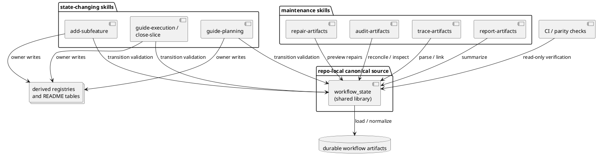
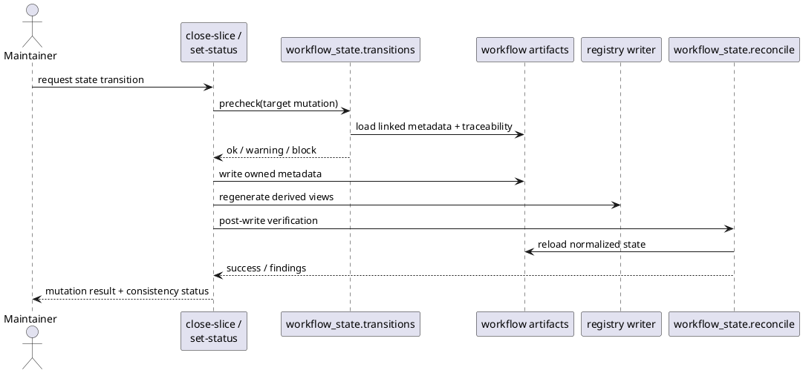

# System design: Workflow State Consistency

## Design summary

This feature hardens `sirius-skills` workflow-state handling without replacing
the current repo-native methodology. The core decision is to introduce one
shared workflow-state library inside the repository and make the affected skills
call that library for artifact loading, traceability parsing, reconciliation,
transition validation, and parity checks.

The near-term design keeps the current user-facing skills and registry writers in
place:

- `audit-artifacts`, `trace-artifacts`, `report-artifacts`, and
  `repair-artifacts` remain separate skills
- planning and execution transition scripts remain the owners of status changes
- registry and README writers remain the owners of derived artifact rendering

What changes is where cross-artifact semantics live. Instead of each skill
re-deriving workflow relationships, the shared library becomes the canonical home
for:

- artifact identity and normalization
- traceability parsing
- feature/subfeature/slice reconciliation rules
- high-confidence invariant checks
- installed-vs-repo parity inspection

## Goals and non-goals

### Goals

- Make cross-artifact workflow invariants explicit and reusable.
- Prevent or immediately surface the drift class seen in
  `host-safe-validation/subfeatures/vs-backend-abstraction/`.
- Keep state-changing commands deterministic and auditable.
- Distinguish semantic metadata drift from derived registry/readme drift.
- Improve confidence that installed skills match the checked-in repo source.

### Non-goals

- Replace the current skill-based workflow with a standalone CLI product.
- Collapse all planning and execution artifacts into one file.
- Introduce freeform agent-only state mutation.
- Take on the full shared-engine rewrite proposed separately in
  `skill-state-engine-rewrite`.

## Architecture

### Component model

- **Shared workflow-state library**
  - repo-local Python module containing canonical artifact loading,
    normalization, traceability parsing, reconciliation rules, and transition
    checks
  - canonical source of semantic workflow rules for maintenance skills

- **Maintenance skill wrappers**
  - `audit-artifacts`, `trace-artifacts`, `report-artifacts`, and
    `repair-artifacts`
  - responsible for CLI parsing, output rendering, and invoking shared logic
  - do not own duplicate reconciliation logic

- **Transition owners**
  - `guide-planning`, `add-subfeature`, `guide-execution`, `close-slice`, and
    related lifecycle scripts
  - remain the only writers for planning, subfeature, and execution status
  - call shared transition checks before and after important state mutations

- **Derived artifact writers**
  - continue to rebuild registry JSON and README tables from canonical metadata
  - remain separate from semantic metadata mutation

- **Parity and CI hooks**
  - shared parity helpers compare active installed behavior with repo-local
    source expectations
  - CI checks call shared reconciliation logic in read-only mode

### Proposed repo-local shared library layout

The canonical source should live outside any one skill so one skill does not
become the accidental semantic owner:

```text
lib/workflow_state/
  model.py
  inventory.py
  traceability.py
  reconcile.py
  transitions.py
  parity.py
  errors.py
```

Installed skills should remain self-contained. The canonical repo-local library
will therefore be synced into each consuming skill package during installation or
packaging, similar to the existing shared-reference workflow.

### PlantUML



## Interfaces and dependencies

### Shared library interfaces

- **Artifact inventory interface**
  - loads proposals, features, subfeatures, planned traceability, and execution
    slices into normalized records
  - hides file-layout details from individual skills

- **Traceability interface**
  - parses `slice-traceability.md` into normalized linkage records
  - supports both feature-level and subfeature-level ownership

- **Reconciliation interface**
  - computes high-confidence findings such as:
    - subfeature status preceding closed execution
    - `affected_slice_ids` drift
    - missing traceability-linked execution slices
    - installed-vs-repo parity drift

- **Transition-check interface**
  - validates whether a proposed state change would leave obvious semantic drift
  - supports both warning and blocking modes for high-confidence invariants

- **Parity interface**
  - compares the active installed maintenance-skill source against repo-local
    expectations
  - returns structured mismatch results instead of ad hoc string checks

### Existing dependencies reused

- current planning, proposal, subfeature, and execution owner scripts
- current registry writers
- repo-local planning layout under `docs/features/` and `docs/proposals/`
- current skill installation flow through `Makefile` and `npx skills add`

### Boundary rules

- the shared library may interpret state, but it must not take ownership of
  writing planning or execution metadata directly unless a lifecycle script calls
  it as part of a deterministic owner operation
- registry/readme rendering stays with the existing owner writers
- semantic repair remains preview-only unless the owning lifecycle command opts
  into a deliberate mutation path

## Configuration surfaces and ownership

This feature should avoid adding new configuration surfaces unless the
incremental rollout proves they are necessary.

### Existing typed owners to preserve

- `.skills/planning.json` owns planning layout and diagram mode
- `.skills/execution.json` owns execution layout behavior
- `.skills/conventions.json` owns naming and repository convention behavior

### New configuration policy

- **Default behavior**: enforce a fixed set of high-confidence workflow
  invariants with no new user-facing config
- **Optional future escape hatches**: only add configuration after design and
  review prove that a real repository needs to suppress or relax a specific
  invariant class

This follows the repo’s generic-first rule and avoids introducing a second
control plane for workflow correctness.

## Data flow, state, and lifecycle

### Source-of-truth model

- **Proposal lifecycle truth**: `.proposal-meta.json`
- **Canonical planning lifecycle truth**: `.planning-meta.json`
- **Subfeature lifecycle truth**: `.subfeature-meta.json`
- **Execution lifecycle truth**: `.slice-meta.json` plus execution registry rows
- **Story-to-slice linkage truth**: `slice-traceability.md`
- **Derived views**: registry JSON and README tables

### Effective lifecycle model

1. A lifecycle command proposes a status change or closure event.
2. The owner script loads normalized workflow state through the shared library.
3. Transition validation checks whether the operation would leave
   high-confidence drift behind.
4. The owner script performs the deterministic write for owned metadata.
5. Registry/readme views are regenerated by the owning writer.
6. A post-write consistency check verifies that the mutation and derived views
   agree.

### Key invariants

- closed execution slices referenced by traceability cannot silently leave the
  linked subfeature in a pre-finalized state without a warning or explicit
  operator choice
- finalized subfeature metadata must align with the linked execution slices
- maintenance skills must not disagree about the same feature/subfeature/slice
  linkage because they should all call the same normalization and reconciliation
  logic
- installed maintenance behavior should be inspectable against the checked-in
  repo source

### Sequence example



## Failure handling and operational constraints

### Error handling policy

- **Malformed metadata**: fail the owning command clearly; do not guess repairs
- **Missing derived registry/readme**: allow deterministic regeneration by owner
  writers
- **Semantic drift discovered during repair preview**: surface as suggestions or
  findings, not silent writes
- **Installed-vs-repo mismatch**: surface as a structured warning or CI failure,
  depending on caller context

### Concurrency and ownership model

- workflow artifact mutation remains command-scoped and file-backed
- this feature does not introduce long-lived background state or process-global
  caches
- the shared library must be pure enough that multiple commands can call it
  independently without hidden mutable state

### Operational constraints

- installation still packages skills individually, so shared logic must be
  synced into consuming skill packages
- rollout should preserve backward-compatible CLI behavior for existing skills
- high-confidence invariants should be introduced before any softer or more
  debatable heuristics

## Alternatives considered

### 1. Keep incremental fixes inside each skill

Rejected because it repeats semantic logic and recreates the same drift class in
future maintenance work.

### 2. Build a standalone CLI first

Rejected for this feature because the main need is semantic correctness inside
the current skillset, not a new user-facing product surface.

### 3. Skip hardening and go directly to a full shared-engine rewrite

Deferred. The rewrite remains a valid follow-on option, but this feature should
first capture the highest-value consistency gains without forcing a larger
architectural migration.

## Risks, assumptions, and open questions

### Risks

- shared logic may still be duplicated accidentally if installation-time sync is
  not made part of the normal managed install flow
- transition guardrails can become noisy if they expand beyond explicit,
  high-confidence invariants
- parity checks can become brittle across agent environments if they depend on
  unstable install layouts

### Assumptions

- enough of the current skill architecture is sound that consistency hardening
  can deliver meaningful value without a rewrite
- maintainers prefer deterministic owner scripts plus agent orchestration over
  agent-owned state mutation

### Review resolutions for initial rollout

- parity reporting should stay inside the existing maintenance commands and shared
  output fields for the first rollout; a dedicated parity command can remain a
  follow-on improvement if maintainers later need a narrower surface
- semantic repair should stay preview-only for the first increment; any explicit
  owner-mediated mutation path belongs to follow-on planning after the preview
  flow and transition guardrails are stable

## Validation strategy

- add regression tests for the concrete drift cases surfaced in this session
- require affected maintenance skills to use the shared traceability and
  reconciliation helpers
- add targeted tests for transition guardrails on close/finalize flows
- validate repo-local parity inspection against installed-skill scenarios
- rerun audit and repair dry-run flows against a fixture repo that reproduces
  the `vs-backend-abstraction` stale-state case

## Summary

`workflow-state-consistency` keeps the current `sirius-skills` workflow model
but moves the semantic rules that connect durable artifacts into one shared
repo-local library. Skills remain the user-facing operations, owner scripts
retain write authority, and the feature focuses on high-confidence invariants,
transition guardrails, and parity checks rather than a full architectural
rewrite.
