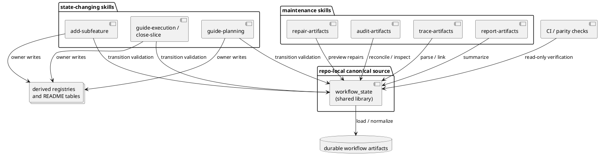
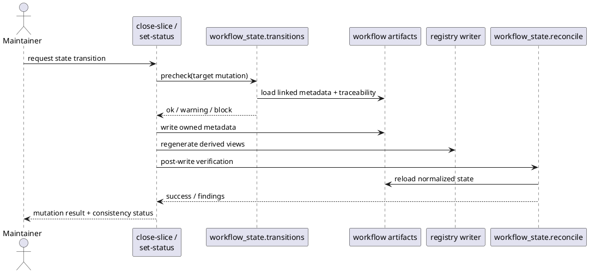
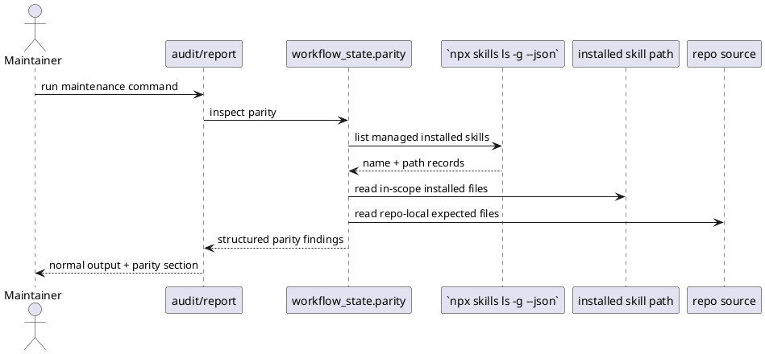
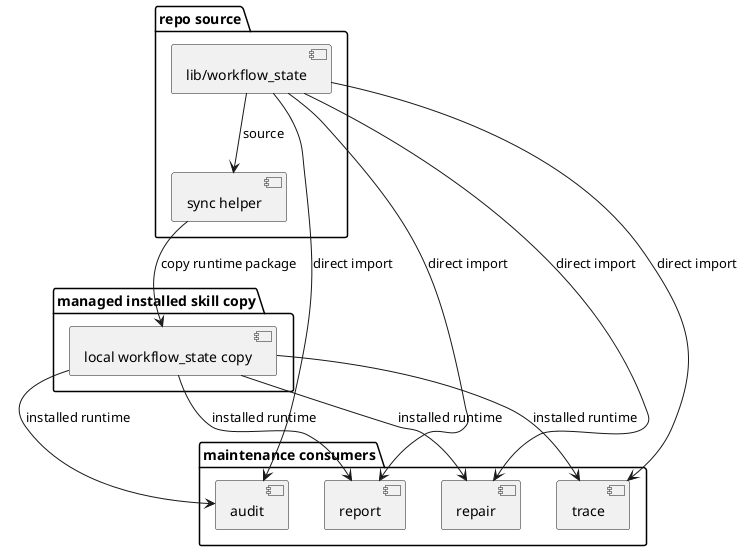
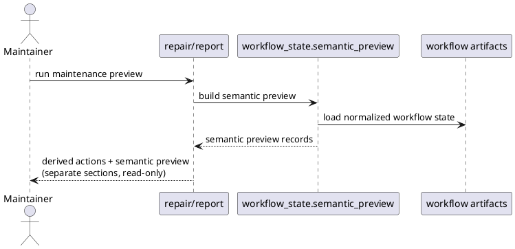
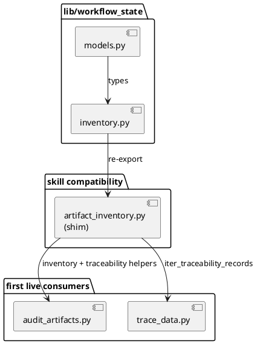
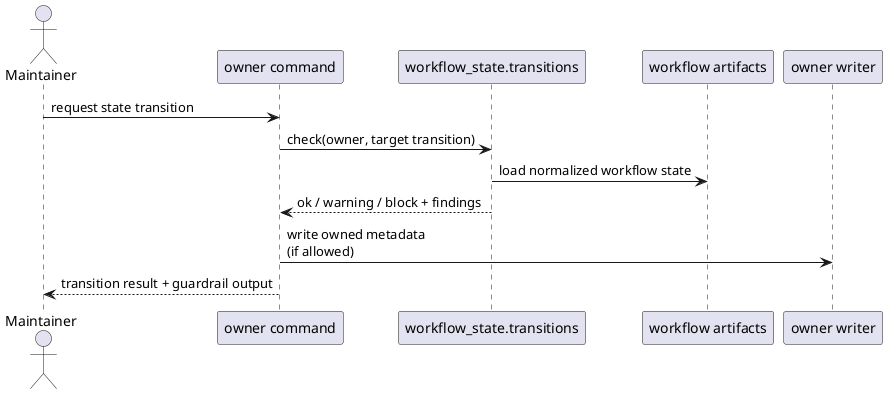
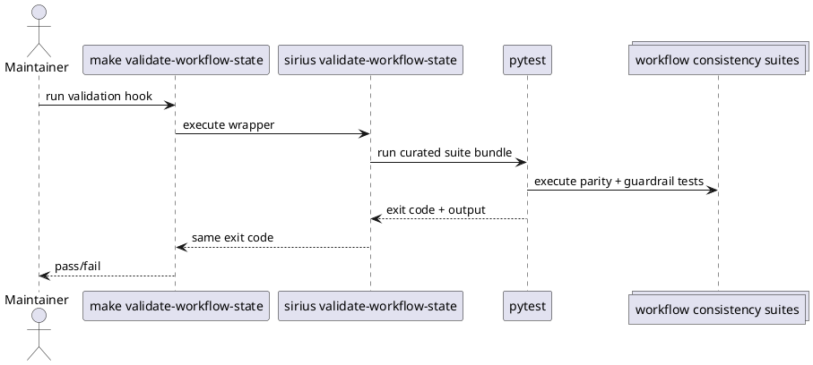

# System design: Workflow State Consistency

## Design summary

This feature hardens `sirius-skills` workflow-state handling without replacing
the current repo-native methodology. The core decision is to introduce one
shared workflow-state library inside the repository and make the affected skills
call that library for artifact loading, traceability parsing, reconciliation,
transition validation, and parity checks.

The near-term design keeps the current user-facing skills and registry writers in
place:

- `audit-artifacts`, `trace-artifacts`, `report-artifacts`, and
  `repair-artifacts` remain separate skills
- planning and execution transition scripts remain the owners of status changes
- registry and README writers remain the owners of derived artifact rendering

What changes is where cross-artifact semantics live. Instead of each skill
re-deriving workflow relationships, the shared library becomes the canonical home
for:

- artifact identity and normalization
- traceability parsing
- feature/subfeature/slice reconciliation rules
- high-confidence invariant checks
- installed-vs-repo parity inspection

## Related stories

- `WSC-01`: run narrow consistency checks after important state transitions
- `WSC-02`: share one reconciliation model across audit, trace, and repair
- `WSC-03`: keep semantic drift preview separate from derived registry repair
- `WSC-04`: surface installed-vs-repo skill parity drift before repairs are trusted
- `WSC-05`: provide repeatable validation hooks for workflow disagreement

## Goals and non-goals

### Goals

- Make cross-artifact workflow invariants explicit and reusable.
- Prevent or immediately surface the drift class seen in
  `host-safe-validation/subfeatures/vs-backend-abstraction/`.
- Keep state-changing commands deterministic and auditable.
- Distinguish semantic metadata drift from derived registry/readme drift.
- Improve confidence that installed skills match the checked-in repo source.

### Non-goals

- Replace the current skill-based workflow with a standalone CLI product.
- Collapse all planning and execution artifacts into one file.
- Introduce freeform agent-only state mutation.
- Take on the full shared-engine rewrite proposed separately in
  `skill-state-engine-rewrite`.

## Architecture

### Component model

- **Shared workflow-state library**
  - repo-local Python module containing canonical artifact loading,
    normalization, traceability parsing, reconciliation rules, and transition
    checks
  - canonical source of semantic workflow rules for maintenance skills

- **Maintenance skill wrappers**
  - `audit-artifacts`, `trace-artifacts`, `report-artifacts`, and
    `repair-artifacts`
  - responsible for CLI parsing, output rendering, and invoking shared logic
  - do not own duplicate reconciliation logic

- **Transition owners**
  - `guide-planning`, `add-subfeature`, `guide-execution`, `close-slice`, and
    related lifecycle scripts
  - remain the only writers for planning, subfeature, and execution status
  - call shared transition checks before and after important state mutations

- **Derived artifact writers**
  - continue to rebuild registry JSON and README tables from canonical metadata
  - remain separate from semantic metadata mutation

- **Parity and CI hooks**
  - shared parity helpers compare active installed behavior with repo-local
    source expectations
  - CI checks call shared reconciliation logic in read-only mode

### Proposed repo-local shared library layout

The canonical source should live outside any one skill so one skill does not
become the accidental semantic owner:

```text
lib/workflow_state/
  model.py
  inventory.py
  traceability.py
  reconcile.py
  transitions.py
  parity.py
  errors.py
```

Installed skills should remain self-contained. The canonical repo-local library
will therefore be synced into each consuming skill package during installation or
packaging, similar to the existing shared-reference workflow.

### PlantUML



## Interfaces and dependencies

### Shared library interfaces

- **Artifact inventory interface**
  - loads proposals, features, subfeatures, planned traceability, and execution
    slices into normalized records
  - hides file-layout details from individual skills

- **Traceability interface**
  - parses `slice-traceability.md` into normalized linkage records
  - supports both feature-level and subfeature-level ownership

- **Reconciliation interface**
  - computes high-confidence findings such as:
    - subfeature status preceding closed execution
    - `affected_slice_ids` drift
    - missing traceability-linked execution slices
    - installed-vs-repo parity drift

- **Transition-check interface**
  - validates whether a proposed state change would leave obvious semantic drift
  - supports both warning and blocking modes for high-confidence invariants

- **Parity interface**
  - compares the active installed maintenance-skill source against repo-local
    expectations
  - returns structured mismatch results instead of ad hoc string checks

### Existing dependencies reused

- current planning, proposal, subfeature, and execution owner scripts
- current registry writers
- repo-local planning layout under `docs/features/` and `docs/proposals/`
- current skill installation flow through `Makefile` and `npx skills add`

### Boundary rules

- the shared library may interpret state, but it must not take ownership of
  writing planning or execution metadata directly unless a lifecycle script calls
  it as part of a deterministic owner operation
- registry/readme rendering stays with the existing owner writers
- semantic repair remains preview-only unless the owning lifecycle command opts
  into a deliberate mutation path

## Configuration surfaces and ownership

This feature should avoid adding new configuration surfaces unless the
incremental rollout proves they are necessary.

### Existing typed owners to preserve

- `.skills/planning.json` owns planning layout and diagram mode
- `.skills/execution.json` owns execution layout behavior
- `.skills/conventions.json` owns naming and repository convention behavior

### New configuration policy

- **Default behavior**: enforce a fixed set of high-confidence workflow
  invariants with no new user-facing config
- **Optional future escape hatches**: only add configuration after design and
  review prove that a real repository needs to suppress or relax a specific
  invariant class

This follows the repo’s generic-first rule and avoids introducing a second
control plane for workflow correctness.

## Data flow, state, and lifecycle

### Source-of-truth model

- **Proposal lifecycle truth**: `.proposal-meta.json`
- **Canonical planning lifecycle truth**: `.planning-meta.json`
- **Subfeature lifecycle truth**: `.subfeature-meta.json`
- **Execution lifecycle truth**: `.slice-meta.json` plus execution registry rows
- **Story-to-slice linkage truth**: `slice-traceability.md`
- **Derived views**: registry JSON and README tables

### Effective lifecycle model

1. A lifecycle command proposes a status change or closure event.
2. The owner script loads normalized workflow state through the shared library.
3. Transition validation checks whether the operation would leave
   high-confidence drift behind.
4. The owner script performs the deterministic write for owned metadata.
5. Registry/readme views are regenerated by the owning writer.
6. A post-write consistency check verifies that the mutation and derived views
   agree.

### Key invariants

- closed execution slices referenced by traceability cannot silently leave the
  linked subfeature in a pre-finalized state without a warning or explicit
  operator choice
- finalized subfeature metadata must align with the linked execution slices
- maintenance skills must not disagree about the same feature/subfeature/slice
  linkage because they should all call the same normalization and reconciliation
  logic
- installed maintenance behavior should be inspectable against the checked-in
  repo source

### Sequence example



## Failure handling and operational constraints

### Error handling policy

- **Malformed metadata**: fail the owning command clearly; do not guess repairs
- **Missing derived registry/readme**: allow deterministic regeneration by owner
  writers
- **Semantic drift discovered during repair preview**: surface as suggestions or
  findings, not silent writes
- **Installed-vs-repo mismatch**: surface as a structured warning or CI failure,
  depending on caller context

### Concurrency and ownership model

- workflow artifact mutation remains command-scoped and file-backed
- this feature does not introduce long-lived background state or process-global
  caches
- the shared library must be pure enough that multiple commands can call it
  independently without hidden mutable state

### Operational constraints

- installation still packages skills individually, so shared logic must be
  synced into consuming skill packages
- rollout should preserve backward-compatible CLI behavior for existing skills
- high-confidence invariants should be introduced before any softer or more
  debatable heuristics

## Alternatives considered

### 1. Keep incremental fixes inside each skill

Rejected because it repeats semantic logic and recreates the same drift class in
future maintenance work.

### 2. Build a standalone CLI first

Rejected for this feature because the main need is semantic correctness inside
the current skillset, not a new user-facing product surface.

### 3. Skip hardening and go directly to a full shared-engine rewrite

Deferred. The rewrite remains a valid follow-on option, but this feature should
first capture the highest-value consistency gains without forcing a larger
architectural migration.

## Risks, assumptions, and open questions

### Risks

- shared logic may still be duplicated accidentally if installation-time sync is
  not made part of the normal managed install flow
- transition guardrails can become noisy if they expand beyond explicit,
  high-confidence invariants
- parity checks can become brittle across agent environments if they depend on
  unstable install layouts

### Assumptions

- enough of the current skill architecture is sound that consistency hardening
  can deliver meaningful value without a rewrite
- maintainers prefer deterministic owner scripts plus agent orchestration over
  agent-owned state mutation

### Review resolutions for initial rollout

- parity reporting should stay inside the existing maintenance commands and shared
  output fields for the first rollout; a dedicated parity command can remain a
  follow-on improvement if maintainers later need a narrower surface
- semantic repair should stay preview-only for the first increment; any explicit
  owner-mediated mutation path belongs to follow-on planning after the preview
  flow and transition guardrails are stable

## Validation strategy

- add regression tests for the concrete drift cases surfaced in this session
- require affected maintenance skills to use the shared traceability and
  reconciliation helpers
- add targeted tests for transition guardrails on close/finalize flows
- validate repo-local parity inspection against installed-skill scenarios
- rerun audit and repair dry-run flows against a fixture repo that reproduces
  the `vs-backend-abstraction` stale-state case

## Summary

`workflow-state-consistency` keeps the current `sirius-skills` workflow model
but moves the semantic rules that connect durable artifacts into one shared
repo-local library. Skills remain the user-facing operations, owner scripts
retain write authority, and the feature focuses on high-confidence invariants,
transition guardrails, and parity checks rather than a full architectural
rewrite.

<!-- archived-slice-summaries:start -->
## Archived Slice Summaries

<!-- archived-slice-summary:wsc-installed-parity:start -->
### `wsc-installed-parity`: Surface installed-vs-repo skill parity drift

#### Work Item Summary

- **Work Item**: Surface installed-vs-repo maintenance-skill parity drift through the shared workflow-state runtime and existing maintenance/reporting outputs.
- **Source Story / Increment / Slice**: `WSC-04` / `I3` / `wsc-installed-parity`
- **Requested Outcome**: As a repo owner, we want the active installed skills checked against the checked-in repo source so stale packaged behavior is visible before we trust a repair or audit result.
- **Why this matters**: The shared runtime now defines the canonical workflow-state interpretation, but maintainers still need a read-only way to tell when the installed maintenance skills no longer match the checked-in repository behavior they expect to be running.
- **Independent Test**: Targeted audit/report regression coverage and a stale-install parity fixture confirm that installed-vs-repo mismatches surface as structured parity findings while unchanged installs continue reporting clean parity.

#### Detailed Design Summary

This slice adds one shared installed-vs-repo parity inspection path to `workflow_state` and surfaces that parity through the existing audit and report maintenance outputs. The goal is to make stale installed maintenance-skill behavior visible before maintainers trust a result, without adding a new standalone parity command or mutating installed copies automatically.

#### Blueprint Figures


<!-- archived-slice-summary:wsc-installed-parity:end -->

<!-- archived-slice-summary:wsc-maintenance-adoption:start -->
### `wsc-maintenance-adoption`: Adopt shared reconciliation across maintenance skills

#### Work Item Summary

- **Work Item**: Move audit, trace, repair, and report maintenance flows onto the canonical shared workflow-state interpretation and keep managed installed skill copies aligned with that shared behavior.
- **Source Story / Increment / Slice**: `WSC-02` / `I1` / `wsc-maintenance-adoption`
- **Requested Outcome**: As an artifact-maintenance skill author, we want maintenance workflows and managed installed skill copies to consume the same shared workflow-state interpretation so they report and act on the same workflow-state findings.
- **Why this matters**: This removes the remaining semantic split between the new shared library and the maintenance skills that still interpret workflow state independently, which is required before later slices can add preview, guardrail, and validation behavior on top of one stable contract.
- **Independent Test**: Targeted audit, trace, repair, and report regression coverage plus a managed install/package check confirm that repo-local maintenance workflows and self-contained installed skill copies use the same shared workflow-state behavior.

#### Detailed Design Summary

This slice moves the audit, trace, repair, and report maintenance flows onto the canonical `workflow_state` library introduced in `wsc-shared-library`, then adds deterministic runtime syncing so the managed installed skill copies remain self-contained and preserve the same shared interpretation outside the repo working tree. The implementation should tighten maintenance-consumer ownership around the shared library, keep the compatibility shim available for unchanged callers, and add regression coverage for the packaged runtime path.

#### Blueprint Figures


<!-- archived-slice-summary:wsc-maintenance-adoption:end -->

<!-- archived-slice-summary:wsc-semantic-preview:start -->
### `wsc-semantic-preview`: Add preview-only semantic drift reporting

#### Work Item Summary

- **Work Item**: Extend repair and report maintenance output so semantic workflow-state drift is previewed separately from derived registry/readme rebuild work.
- **Source Story / Increment / Slice**: `WSC-03` / `I2` / `wsc-semantic-preview`
- **Requested Outcome**: As a maintainer, we want a safe preview path for semantic workflow drift so we can distinguish metadata reconciliation work from derived repair work before any owner-mediated write path runs.
- **Why this matters**: Later transition guardrails depend on one stable, reviewable semantic finding shape, and maintainers need to see those high-confidence semantic issues without conflating them with deterministic derived rebuild actions.
- **Independent Test**: Targeted repair and report regression coverage confirms that semantic drift is surfaced as a separate preview path while derived registry/readme rebuild output remains intact and read-only.

#### Detailed Design Summary

This slice turns the existing preview-only semantic repair suggestions into an explicit shared semantic-preview contract and surfaces that contract through both repair and report outputs. The goal is not to add a metadata write path; it is to separate high-confidence semantic drift from derived registry/readme rebuild work so maintainers can review semantic issues safely and later transition checks can reuse the same finding shape.

#### Blueprint Figures


<!-- archived-slice-summary:wsc-semantic-preview:end -->

<!-- archived-slice-summary:wsc-shared-library:start -->
### `wsc-shared-library`: Create shared workflow-state library

#### Work Item Summary

- **Work Item**: Establish the canonical repo-local workflow-state library that normalizes artifact loading, traceability parsing, and reconciliation inputs for workflow maintenance.
- **Source Story / Increment / Slice**: `WSC-02` / `I1` / `wsc-shared-library`
- **Requested Outcome**: As an artifact-maintenance skill author, we want one shared workflow-state library so maintenance workflows can interpret artifact identity and slice linkage consistently.
- **Why this matters**: This removes the duplicated semantic logic that let maintenance skills drift apart and miss or disagree on the same workflow-state problems.
- **Independent Test**: Targeted audit and trace regression tests confirm that one canonical workflow-state interpretation still resolves feature and subfeature traceability correctly after the shared library is introduced.

#### Detailed Design Summary

This slice establishes the first canonical `lib/workflow_state` package for repo-local workflow-state semantics, then routes the existing audit and trace flows through that shared package without changing write ownership or expanding the feature into broader maintenance-skill adoption. The implementation stays foundational: extract normalized models and inventory/traceability loading into the shared library, keep `artifact_inventory.py` as a compatibility shim for current callers, and preserve the existing audit/trace regression behavior.

#### Blueprint Figures


<!-- archived-slice-summary:wsc-shared-library:end -->

<!-- archived-slice-summary:wsc-transition-guardrails:start -->
### `wsc-transition-guardrails`: Add high-confidence transition consistency checks

#### Work Item Summary

- **Work Item**: Add narrow shared transition guardrails to planning, subfeature, execution, and close/finalize owners so obvious workflow-state drift is surfaced during important state changes.
- **Source Story / Increment / Slice**: `WSC-01` / `I2` / `wsc-transition-guardrails`
- **Requested Outcome**: As a maintainer, we want state-changing skills to run narrow consistency checks after important transitions so stale subfeature or planning metadata is caught immediately.
- **Why this matters**: The shared preview work in WSC-03 now exposes one stable semantic finding shape, but maintainers still need owner scripts to surface that drift at the moment a transition would otherwise leave the repository in a stale or misleading state.
- **Independent Test**: Targeted guide-planning, add-subfeature, guide-execution, and close-slice regression coverage confirms that the affected owner flows surface the same high-confidence transition findings while still allowing clean transitions to complete.

#### Detailed Design Summary

This slice adds a shared transition-check runtime to `workflow_state` and wires it into the owner scripts that perform important planning, subfeature, execution, and close/finalize state changes. The goal is to surface the same high-confidence semantic findings that WSC-03 made previewable, while preserving writer ownership and keeping clean transitions low-friction.

#### Blueprint Figures


<!-- archived-slice-summary:wsc-transition-guardrails:end -->

<!-- archived-slice-summary:wsc-validation-hooks:start -->
### `wsc-validation-hooks`: Add repeatable workflow consistency validation hooks

#### Work Item Summary

- **Work Item**: Add one repeatable validation entrypoint that reuses the stabilized workflow-state checks so maintainers and CI can rerun the same fixture-backed consistency coverage on demand.
- **Source Story / Increment / Slice**: `WSC-05` / `I3` / `wsc-validation-hooks`
- **Requested Outcome**: As a repo owner, we want one repeatable validation hook for workflow consistency so automation and manual reruns can fail fast when parity or transition guardrail behavior regresses.
- **Why this matters**: The shared runtime, semantic preview, transition guardrails, and installed parity checks now exist, but maintainers still need one stable automation surface that reruns the reviewed drift cases without rebuilding that coverage ad hoc each time.
- **Independent Test**: A single repo-level validation entrypoint runs the reviewed workflow-state regression suites and fails when a fixture-backed parity or transition consistency regression is reintroduced.

#### Detailed Design Summary

This slice adds one repeatable repo-level workflow consistency validation entrypoint for CI and maintainer reruns. The implementation will wrap the reviewed workflow-state regression suites behind a small top-level validation script plus a Makefile target, then lock that hook under test so the curated suite list does not silently drift.

#### Blueprint Figures


<!-- archived-slice-summary:wsc-validation-hooks:end -->

<!-- archived-slice-summaries:end -->
