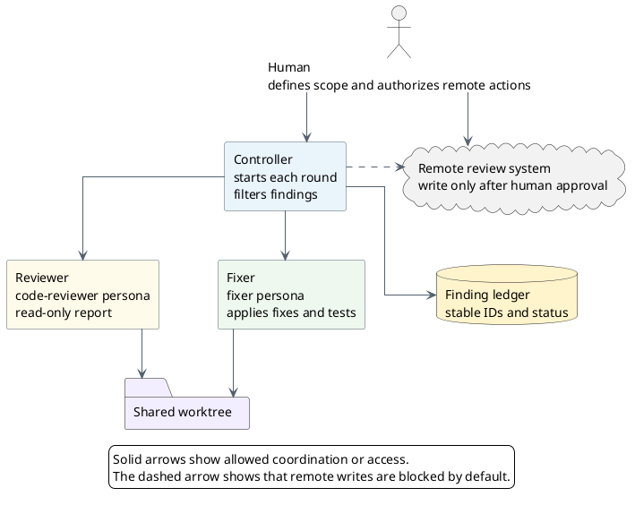
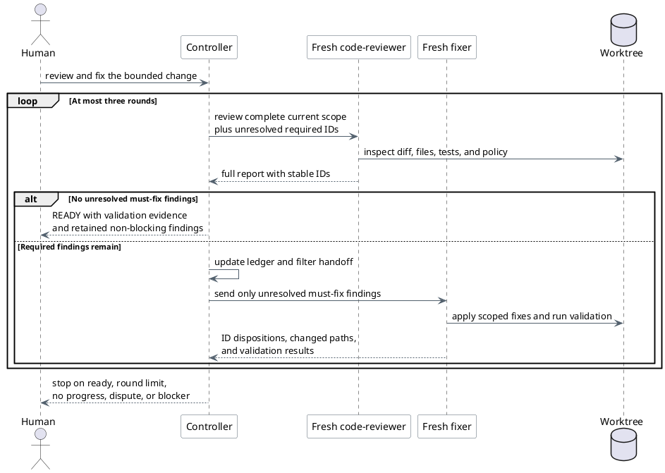

# Run a Review-Fix Subagent Loop in Pi and Antigravity CLI

Use this guide to coordinate a read-only reviewer and a write-enabled fixer in
separate subagent processes or contexts. The controller is the main agent
session (in Pi or Antigravity CLI). It owns the finding ledger, filters each
handoff, and decides when to start another review.

Both harnesses use the same specialist agent personas:

- **Reviewer**: Addy Osmani's `code-reviewer` persona (`code-reviewer.md` from
  `addyosmani/agent-skills`).
- **Fixer**: The scoped `fixer` persona provided by Sirius (`agents/fixer.md`
  from `sirius-skills`).

Pi executes subagents via its subagent extension in separate Pi subprocesses.
Antigravity CLI (`agy`) runs subagents natively in background sessions using its
built-in orchestration tools (`invoke_subagent`, `manage_subagents`,
`send_message`).

## Harness comparison

| Capability | Pi | Antigravity CLI (`agy`) |
| --- | --- | --- |
| Subagent runtime | Subprocess extension (`@earendil-works/pi-coding-agent`) | Built-in native subagent runtime |
| Controller tool | `subagent` extension tool | Built-in `invoke_subagent` and `manage_subagents` |
| Reviewer persona | Addy Osmani's `code-reviewer` (`~/.pi/agent/agents/code-reviewer.md`) | Addy Osmani's `code-reviewer` (`TypeName: "code-reviewer"`) |
| Fixer persona | Sirius `fixer` (`~/.pi/agent/agents/fixer.md`) | Sirius `fixer` (`TypeName: "fixer"`) |
| Execution model | Synchronous call or static `chain` | Reactive background execution with automatic wakeup |
| Workspace scope | Shared working directory (`cwd`) | `Workspace: "inherit"` (shared worktree), `"branch"`, or `"share"` |
| Standalone CLI run | Interactive `pi` session | Interactive `agy` or non-interactive `agy --agent <name> -p "<prompt>"` |

## Roles and boundaries

| Role | Responsibility | Allowed effects | Pi agent | Antigravity CLI agent |
| --- | --- | --- | --- | --- |
| Human | Defines the review scope and approves publication or merge actions | Explicitly authorizes remote writes and final decisions | Terminal user | Terminal user |
| Controller | Starts subagents, filters findings, tracks rounds, and enforces stop conditions | Does not infer permission to commit, push, publish, or merge | Main Pi agent | Main `agy` agent |
| Reviewer | Reviews the complete current change and verifies previous findings | Reads files and Git state only | `code-reviewer` | `code-reviewer` |
| Fixer | Applies selected required fixes and runs relevant validation | Changes only the authorized worktree scope | `fixer` | `fixer` |

All subagents use isolated model context. In a shared worktree setup, subagents
operate in the same working directory (or use `Workspace: "inherit"` in
Antigravity CLI). Run reviewer and fixer steps sequentially. Do not let two
write-enabled agents edit the same worktree at the same time. If isolated
worktrees are required, Antigravity CLI supports `Workspace: "branch"` or
`Workspace: "share"`, while Pi can point subagents to a separate Git worktree
directory via `cwd`.



### Fixer engineering skills

The `fixer` persona applies specialized engineering skills from
`addyosmani/agent-skills` during remediation:

| Skill | Remediation phase | Key responsibility |
| --- | --- | --- |
| `debugging-and-error-recovery` | Triage & diagnosis | Isolate root causes systematically and apply the Stop-the-Line rule instead of guessing |
| `test-driven-development` | Defect reproduction | Write a failing test proving the defect before editing (Prove-It pattern) |
| `code-simplification` | Implementation | Implement minimal, readable fixes without accidental complexity |
| `incremental-implementation` | Multi-file changes | Partition complex fixes into verifiable vertical slices |
| `security-and-hardening` | Vulnerability fixes | Enforce input sanitization, query parameterization, and least privilege |
| `doubt-driven-development` | Pre-handoff verification | Adversarially probe the fix for regressions, boundary conditions, and edge cases |

## Setup and prerequisites

### Pi setup

1. **Install Pi**: Install Pi globally through npm:

   ```bash
   npm install -g @earendil-works/pi-coding-agent
   ```

2. **Install the subagent extension**: Copy the extension TypeScript files into
   the user-level extension directory:

   ```bash
   PI_PACKAGE="$(npm root -g)/@earendil-works/pi-coding-agent"

   mkdir -p \
     ~/.pi/agent/extensions/subagent \
     ~/.pi/agent/agents

   cp "$PI_PACKAGE/examples/extensions/subagent/index.ts" \
      "$PI_PACKAGE/examples/extensions/subagent/agents.ts" \
      ~/.pi/agent/extensions/subagent/
   ```

3. **Install the aligned personas**: Link or copy Addy Osmani's `code-reviewer`
   and the Sirius `fixer` into `~/.pi/agent/agents/`:

   ```bash
   # Addy Osmani's code-reviewer
   ln -sf /path/to/addyosmani-agent-skills/agents/code-reviewer.md ~/.pi/agent/agents/code-reviewer.md

   # Sirius fixer
   ln -sf /path/to/sirius-skills/agents/fixer.md ~/.pi/agent/agents/fixer.md

   # Remove obsolete sample agents if present
   rm -f ~/.pi/agent/agents/planner.md ~/.pi/agent/agents/reviewer.md ~/.pi/agent/agents/scout.md ~/.pi/agent/agents/worker.md
   ```

4. **Reload**: Run `/reload` in an active Pi session.

### Antigravity CLI setup

Antigravity CLI (`agy`) requires no external extension installation. Subagent
orchestration tools (`invoke_subagent`, `manage_subagents`, and `send_message`)
are built directly into the runtime.

1. **Install the aligned personas**:
   - **`code-reviewer`**: Discovered automatically when `addyosmani/agent-skills`
     is installed as a plugin (e.g. `~/.gemini/config/plugins/agent-skills/agents/code-reviewer.md`)
     or configured in project `.agents/agents/`.
   - **`fixer`**: Link the Sirius fixer persona into Antigravity's global agent
     directory:

     ```bash
     mkdir -p ~/.gemini/config/agents
     ln -sf /path/to/sirius-skills/agents/fixer.md ~/.gemini/config/agents/fixer.md
     ```

2. **Verify available agents**: Run `agy agents` from your shell:

   ```bash
   agy agents
   ```

   Confirm that both `code-reviewer` and `fixer` appear in the output list.

3. **Choose workspace mode**: By default, `invoke_subagent` uses
   `Workspace: "inherit"`, which operates directly in the shared worktree. Set
   `Workspace: "branch"` or `"share"` if file changes must remain in an
   isolated Git branch or worktree until reviewed.

4. **Choose model tier**: Set `Model: "inherit"` to match the controller, or
   select `"flash"` for fast targeted fixes and `"pro"` for complex reviews.

## Define the review contract

Define merge disposition separately from severity. Severity describes impact.
Disposition controls the fixer handoff.

| Disposition | Examples | Handoff to fixer |
| --- | --- | --- |
| Must fix before merge | Critical, blocker, required correction | Yes, while unresolved |
| Non-blocking | Optional, consideration, nit, FYI | No |
| Disputed or deferred | Requires human authority or approved follow-up | No automatic fix; stop or request a decision |

If a comment should not be resolved before merge, do not hand it to the fixer.
Hand off only comments that must be resolved before merge. Keep non-blocking
comments in the final report so that they are not lost.

Require the reviewer to use stable IDs and this output shape:

```markdown
## Must fix before merge

R1 [critical] path/to/file.rs:42
Problem: ...
Impact: ...
Required fix: ...

## Non-blocking

N1 [optional] path/to/file.rs:90
Suggestion: ...

## Verdict

BLOCKED
```

The controller keeps each ID until a later reviewer verifies it. A fixer claim
does not resolve a finding. The next reviewer must mark it verified, still
open, or disputed.

## Run the controlled loop

Use separate subagent calls instead of one static chain when the workflow must
filter findings or stop conditionally.



Give the controller this prompt:

```text
Run a review-fix loop on the current change.

1. Define and preserve the exact review scope and baseline.
2. Start a fresh `code-reviewer` subagent. The reviewer is read-only.
3. Require stable finding IDs and separate "Must fix before merge" from
   "Non-blocking" findings.
4. If no must-fix findings remain, stop and report ready.
5. Pass only unresolved must-fix findings to a fresh `fixer` subagent.
6. The fixer may change only the authorized scope. It must follow
   test-driven development (reproduce reported defects with a failing test
   before fixing), run relevant validation, and report each required ID as
   fixed, not fixed, or disputed.
7. Start a fresh `code-reviewer` after every fix. It must verify previous
   required IDs and review the complete updated change for regressions and
   new findings.
8. Repeat for at most three rounds.
9. Stop on no progress, an unresolved dispute, failed required validation,
   ambiguous scope, or the round limit.
10. Do not commit, push, publish comments, resolve remote threads, approve,
    request changes, or merge without separate authorization.
```

## Tool invocations by harness

### Pi subagent invocations

The Pi controller calls the `subagent` tool sequentially.

Starting `code-reviewer`:

```json
{
  "agent": "code-reviewer",
  "task": "Review the complete bounded change in git diff HEAD~1. Separate 'Must fix before merge' from 'Non-blocking' findings using stable IDs (R1, R2, ...)."
}
```

Starting `fixer`:

```json
{
  "agent": "fixer",
  "task": "Act as the fixer. Apply only the must-fix findings below. Preserve each finding ID and run relevant validation.\n\nMust-fix findings:\n- R1 [critical] path/to/file.rs:42: ..."
}
```

### Antigravity CLI subagent invocations

The Antigravity CLI controller calls `invoke_subagent` to start subagents in
the background. Execution is reactive: the controller automatically wakes when
the subagent completes and receives the full response.

Starting `code-reviewer`:

```json
{
  "Subagents": [
    {
      "TypeName": "code-reviewer",
      "Role": "Code Reviewer",
      "Prompt": "Review the complete bounded change in git diff HEAD~1. Separate 'Must fix before merge' from 'Non-blocking' findings using stable IDs (R1, R2, ...). Verify prior IDs if provided.",
      "Model": "inherit",
      "Workspace": "inherit"
    }
  ]
}
```

Starting `fixer`:

```json
{
  "Subagents": [
    {
      "TypeName": "fixer",
      "Role": "Fixer",
      "Prompt": "Act as the fixer. Apply only the following unresolved must-fix findings:\n\n- R1 [critical] path/to/file.rs:42: ...\n\nPreserve each finding ID, apply scoped fixes, and run relevant validation. Do not address non-blocking findings.",
      "Workspace": "inherit"
    }
  ]
}
```

Monitoring and managing subagents:

The controller can check subagent status using `manage_subagents`:

```json
{
  "Action": "list"
}
```

The controller can send clarifying instructions by conversation ID using
`send_message`, or cancel a stuck task with `Action: "kill"`.

## Preserve the review scope

Record the baseline before the first reviewer starts. State whether the scope
is a pull-request diff, a commit range, staged changes, unstaged changes, or
selected untracked files. Do not silently combine these sources.

Each later reviewer must inspect:

1. The complete updated scope.
2. Every unresolved required finding ID.
3. The fixer's changed paths and validation evidence.
4. New regressions or findings introduced by the fixes.
5. Repository instructions and acceptance criteria that still apply.

The fixer receives only the required-finding subset. It can inspect the shared
worktree for implementation context. Its final response must preserve each
finding ID so that the controller can reconcile the next review.

Worktree synchronization depends on the harness:

- In Pi, subagents share the controller process working directory.
- In Antigravity CLI, `Workspace: "inherit"` shares the controller's active
  workspace. When using `Workspace: "branch"`, the controller must reconcile or
  merge the branch before launching the next review round.

## Understand static chains vs reactive loops

The Pi example extension supports a sequential `chain` and replaces
`{previous}` with the immediately preceding subagent's final output. A fixed
`code-reviewer -> fixer -> code-reviewer` chain can work for one predetermined
round. It has two limits:

- It cannot stop before the fixer step when the first review is clean.
- It passes only the immediately previous output, not a durable finding ledger.

Use the main controller for conditional loops. If one fixed round in Pi is
sufficient, the controller can call the subagent tool with this shape:

```json
{
  "chain": [
    {
      "agent": "code-reviewer",
      "task": "Review the complete bounded change. Separate must-fix and non-blocking findings using stable IDs."
    },
    {
      "agent": "fixer",
      "task": "Apply only the must-fix findings below using test-driven development: write a failing test reproducing each bug first, implement the fix, preserve each finding ID, and run full test validation.\n\n{previous}"
    },
    {
      "agent": "code-reviewer",
      "task": "Start a fresh review of the complete updated change. Verify the fixer dispositions below and report any remaining or new must-fix findings.\n\n{previous}"
    }
  ]
}
```

The fixed chain passes the full first review to the fixer. It can restrict
which findings the fixer acts on, but it does not strictly restrict which
findings the fixer receives. Use separate controller-managed calls when the
handoff itself must contain only required findings.

The final reviewer receives only the fixer's output through `{previous}`. The
fixer must therefore preserve the required finding IDs and dispositions. The
shared worktree contains the implementation changes.

In Antigravity CLI, orchestration is naturally turn-based and reactive. The
controller receives the subagent response, updates the finding ledger, and
decides whether to stop or dispatch the next subagent.

For non-interactive single-round reviews in Antigravity CLI using the
`code-reviewer` persona:

```bash
agy --agent code-reviewer -p "Review git diff HEAD~1 and report blocker findings."
```

## Completion and stop conditions

Report the change as review-ready only when all these conditions are true:

- A fresh reviewer reports no unresolved must-fix findings.
- A fresh reviewer verifies all earlier required IDs.
- Required tests and checks pass after the last edit.
- Non-blocking findings remain visible in the final report.
- No human decision, permission, or scope question remains open.

Stop and ask for human input when:

- A required finding is disputed or requires product or architecture authority.
- The fixer cannot make progress without expanding scope.
- The same finding reappears without new evidence.
- Required validation fails and the cause is not resolved.
- Three review-fix rounds complete without a merge-ready result.

Review analysis, GitHub publication, thread resolution, approval, commit, push,
and merge are separate actions. One action does not authorize another.
