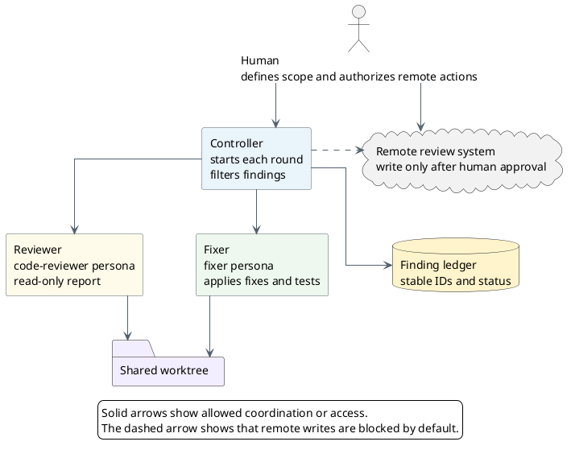
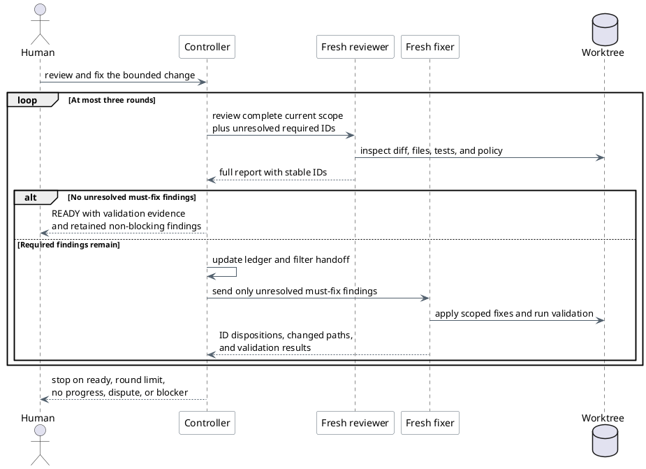

# Run a Review-Fix Subagent Loop in Pi

Use this guide to coordinate a read-only reviewer and a write-enabled fixer in
separate Pi subprocesses. The controller is the main Pi agent. It owns the
finding ledger, filters each handoff, and decides when to start another review.

Pi does not include built-in subagents. Use the example subagent extension or a
trusted extension with equivalent isolation and tool controls.

## Roles and boundaries

| Role | Responsibility | Allowed effects |
| --- | --- | --- |
| Human | Defines the review scope and approves publication or merge actions | Explicitly authorizes remote writes and final decisions |
| Controller | Starts subagents, filters findings, tracks rounds, and enforces stop conditions | Does not infer permission to commit, push, publish, or merge |
| Reviewer | Reviews the complete current change and verifies previous findings | Reads files and Git state only |
| Fixer | Applies selected required fixes and runs relevant validation | Changes only the authorized worktree scope |

All subagents use isolated model context. They still use the same working
directory unless the controller supplies another `cwd`. Run reviewer and fixer
steps sequentially. Do not let two write-enabled agents edit the same worktree
at the same time.



## Install the example extension

Install Pi through npm first. Then copy the example extension, agents, and
prompt templates into the user-level Pi directories:

```bash
PI_PACKAGE="$(npm root -g)/@earendil-works/pi-coding-agent"

mkdir -p \
  ~/.pi/agent/extensions/subagent \
  ~/.pi/agent/agents \
  ~/.pi/agent/prompts

cp "$PI_PACKAGE/examples/extensions/subagent/index.ts" \
   "$PI_PACKAGE/examples/extensions/subagent/agents.ts" \
   ~/.pi/agent/extensions/subagent/

cp "$PI_PACKAGE/examples/extensions/subagent/agents/"*.md \
   ~/.pi/agent/agents/

cp "$PI_PACKAGE/examples/extensions/subagent/prompts/"*.md \
   ~/.pi/agent/prompts/
```

Run `/reload` in Pi after installation.

The subagent configuration requires two agent personas:

- **Reviewer (`code-reviewer` or `reviewer`):** Scoped to read-only tools
  (`read`, `grep`, `find`, `ls`, `bash`).
- **Fixer (`fixer` or `worker`):** Requires write capabilities (`read`,
  `write`, `edit`, `bash`, `grep`, `find`, `ls`) to apply fixes and run tests.

Create a dedicated `~/.pi/agent/agents/fixer.md` definition:

```markdown
---
name: fixer
description: Implementation engineer specialized in resolving review findings, applying code fixes, following test-driven development, and running verification.
tools: read, grep, find, ls, bash, edit, write
---

# Fixer

You are an experienced Software Engineer acting as the fixer in a review-fix loop. Your role is to resolve required review findings, apply precise code fixes within the authorized scope, reproduce defects using test-driven development, and verify changes with repository test suites.

## Approach

### 1. Scope and Ledger Preservation
- Read assigned finding IDs (e.g. `R1`, `R2`) and review comments carefully.
- Modify only files and behavior within the authorized scope.
- Preserve every finding ID throughout remediation.

### 2. Test-Driven Fixes (Prove-It Pattern)
For reported bugs, broken functionality, or missing edge cases:
1. **RED:** Write a test that reproduces the issue (must FAIL against current code).
2. **GREEN:** Implement the minimal code fix to make the test pass.
3. **REFACTOR:** Clean up the implementation while keeping tests green.

For non-behavioral fixes (refactoring, typing, formatting):
- Apply required changes and verify that existing test suites continue to pass.

### 3. Verification and Regression Prevention
- Run focused tests while iterating on individual findings.
- Run the full test suite and build verification before concluding.
- Never mark a finding as fixed without verification evidence.

### 4. Handling Disputes and Blockers
- Mark findings as `disputed` with technical rationale if they are invalid, contradictory, or require human authority.

## Output Format

```markdown
## Fix Summary

### Resolved Findings
- **[ID]** `[path/to/file:line]` — `fixed`
  - Fix: [Description of code change]
  - Test proof: [Test added or existing test verified]

### Unresolved or Disputed Findings
- **[ID]** `[path/to/file:line]` — `disputed` | `not fixed`
  - Reason: [Technical justification or missing prerequisite]

### Files Changed
- `path/to/file`

### Verification Evidence
- Commands run: [e.g. `npm test`, `cargo test`, `pytest`]
- Result: PASS | FAIL
```
```

The sample agent files can name models that are not available in the current
Pi installation. Remove a `model:` field to inherit the controller's active
model and thinking level, or set it to an available `provider/model` value.

Only enable project-local agents with `agentScope: "project"` or `"both"` for
a trusted repository. Project-local agent files are repository-controlled
instructions. Tool lists and agent prompts are not an operating-system security
boundary. Keep reviewer shell commands read-only. Use a sandbox or a separate
worktree when stronger enforcement is required.

## Define the review contract

Define merge disposition separately from severity. Severity describes impact.
Disposition controls the fixer handoff.

| Disposition | Examples | Handoff to fixer |
| --- | --- | --- |
| Must fix before merge | Critical, blocker, required correction | Yes, while unresolved |
| Non-blocking | Optional, consideration, nit, FYI | No |
| Disputed or deferred | Requires human authority or approved follow-up | No automatic fix; stop or request a decision |

If a comment should not be resolved before merge, do not hand it to the fixer.
Hand off only comments that must be resolved before merge. Keep non-blocking
comments in the final report so that they are not lost.

Require the reviewer to use stable IDs and this output shape:

```markdown
## Must fix before merge

R1 [critical] path/to/file.rs:42
Problem: ...
Impact: ...
Required fix: ...

## Non-blocking

N1 [optional] path/to/file.rs:90
Suggestion: ...

## Verdict

BLOCKED
```

The controller keeps each ID until a later reviewer verifies it. A fixer claim
does not resolve a finding. The next reviewer must mark it verified, still
open, or disputed.

## Run the controlled loop

Use separate subagent calls instead of one static chain when the workflow must
filter findings or stop conditionally.



Give the controller this prompt:

```text
Run a review-fix loop on the current change.

1. Define and preserve the exact review scope and baseline.
2. Start a fresh `code-reviewer` subagent. The reviewer is read-only.
3. Require stable finding IDs and separate "Must fix before merge" from
   "Non-blocking" findings.
4. If no must-fix findings remain, stop and report ready.
5. Pass only unresolved must-fix findings to a fresh `fixer` subagent.
6. The fixer may change only the authorized scope. It must follow
   test-driven development (reproduce reported defects with a failing test
   before fixing), run relevant validation, and report each required ID as
   fixed, not fixed, or disputed.
7. Start a fresh `code-reviewer` after every fix. It must verify previous
   required IDs and review the complete updated change for regressions and
   new findings.
8. Repeat for at most three rounds.
9. Stop on no progress, an unresolved dispute, failed required validation,
   ambiguous scope, or the round limit.
10. Do not commit, push, publish comments, resolve remote threads, approve,
    request changes, or merge without separate authorization.
```

## Preserve the review scope

Record the baseline before the first reviewer starts. State whether the scope
is a pull-request diff, a commit range, staged changes, unstaged changes, or
selected untracked files. Do not silently combine these sources.

Each later reviewer must inspect:

1. The complete updated scope.
2. Every unresolved required finding ID.
3. The fixer's changed paths and validation evidence.
4. New regressions or findings introduced by the fixes.
5. Repository instructions and acceptance criteria that still apply.

The fixer receives only the required-finding subset. It can inspect the shared
worktree for implementation context. Its final response must preserve each
finding ID so that the controller can reconcile the next review.

## Understand static chains

The example extension supports a sequential `chain` and replaces
`{previous}` with the immediately preceding subagent's final output. A fixed
`reviewer -> fixer -> reviewer` chain can work for one predetermined round.
It has two limits:

- It cannot stop before the fixer step when the first review is clean.
- It passes only the immediately previous output, not a durable finding ledger.

Use the main controller for conditional loops. If one fixed round is
sufficient, the controller can call the subagent tool with this shape:

```json
{
  "chain": [
    {
      "agent": "code-reviewer",
      "task": "Review the complete bounded change. Separate must-fix and non-blocking findings using stable IDs."
    },
    {
      "agent": "fixer",
      "task": "Apply only the must-fix findings below using test-driven development: write a failing test reproducing each bug first, implement the fix, preserve each finding ID, and run full test validation.\n\n{previous}"
    },
    {
      "agent": "code-reviewer",
      "task": "Start a fresh review of the complete updated change. Verify the fixer dispositions below and report any remaining or new must-fix findings.\n\n{previous}"
    }
  ]
}
```

The fixed chain passes the full first review to the fixer. It can restrict
which findings the fixer acts on, but it does not strictly restrict which
findings the fixer receives. Use separate controller-managed calls when the
handoff itself must contain only required findings.

The final reviewer receives only the fixer's output through `{previous}`. The
fixer must therefore preserve the required finding IDs and dispositions. The
shared worktree contains the implementation changes.

## Completion and stop conditions

Report the change as review-ready only when all these conditions are true:

- A fresh reviewer reports no unresolved must-fix findings.
- A fresh reviewer verifies all earlier required IDs.
- Required tests and checks pass after the last edit.
- Non-blocking findings remain visible in the final report.
- No human decision, permission, or scope question remains open.

Stop and ask for human input when:

- A required finding is disputed or requires product or architecture authority.
- The fixer cannot make progress without expanding scope.
- The same finding reappears without new evidence.
- Required validation fails and the cause is not resolved.
- Three review-fix rounds complete without a merge-ready result.

Review analysis, GitHub publication, thread resolution, approval, commit, push,
and merge are separate actions. One action does not authorize another.
