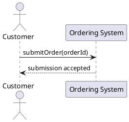

# Order Submission

## At a Glance

A customer submits a draft order so fulfillment can begin. Submission changes
several related domain facts, so object design needs a precise statement of the
guaranteed effects before responsibilities are assigned.

## Representative Scenario

The customer has a draft order with two order lines. The customer submits it,
the system accepts the request, and the order becomes ready for payment and
inventory processing. Shipment has not begun.

## Use Case: Submit Order

- ID: `UC-SUBMIT-ORDER`
- Primary actor: Customer
- Goal: Submit a complete draft order for fulfillment.
- Success guarantee: The order is submitted and its approved downstream facts
  are recorded consistently.

## Domain Vocabulary

- **Order** has an `orderId`, an `OrderStatus`, and one or more `OrderLine`
  entries.
- **OrderStatus** includes `DRAFT` and `SUBMITTED`.
- **PaymentAuthorization** records permission to collect payment for an order.
- **InventoryReservation** holds inventory for one order line.
- **Shipment** represents dispatch of an order and does not exist at submission
  time.
- **OrderSubmitted** records the accepted business event.

## System Sequence Diagram

## Open Design Work

The exact state effects of `submitOrder(orderId)` have not yet been specified
as an operation contract.
