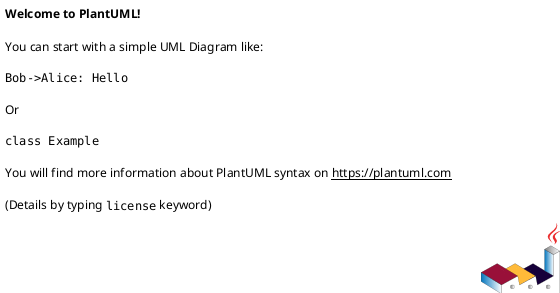

# Implementation Plan: [WORK ITEM NAME]

**Slice**: `[ID-work-item-name]`  
**Date**: [DATE]  
**Status**: Draft
**Spec**: [link to brief.md]

## 1. Summary

[Short summary of the implementation approach for this slice. Do not restate the full brief; build on it.]

## 2. Technical Context

- Current system context:
- Target modules / files:
- Constraints:
- Assumptions:
- Out of scope:

## 3. Planning Gates

### Architecture / Constraints

- Decision:
- Result: PASS / WAIVED / FAIL
- Notes:

### Risk / Compliance

- Decision:
- Result: PASS / WAIVED / FAIL
- Notes:

### Testability

- Decision:
- Result: PASS / WAIVED / FAIL
- Notes:

## 4. Requirement Traceability

Map each brief requirement once into concrete implementation and validation.

| Requirement | Implementation Steps | Validation |
| --- | --- | --- |
| FR-001 | [step IDs] | [check IDs] |
| FR-002 | [step IDs] | [check IDs] |

## 5. Execution Plan

### Packet P01: [Name]

- Scope:
- Target files:
- Dependencies:
- Steps:
  - [ ] S001 [concrete change]
  - [ ] S002 [concrete change]
- Validation:
  - [ ] V001 [test or manual check]
- Definition of Done:
- Rollback / Mitigation:

### Packet P02: [Name]

- Scope:
- Target files:
- Dependencies:
- Steps:
  - [ ] S003 [concrete change]
- Validation:
  - [ ] V002 [test or manual check]
- Definition of Done:
- Rollback / Mitigation:

## 6. Supporting Notes

### Detailed Design Diagrams (PlantUML)

- [Include when the work benefits from detailed structure or interaction diagrams]
- Diagram purpose:
- Diagram type:

### Research Decisions

- [Only include if needed]
- Decision:
- Rationale:
- Alternative considered:

### Data Model Notes

- [Only include if needed]
- Entity:
- Fields / relationships:
- Validation rules:

### Interface Notes

- [Only include if needed]
- Interface:
- Inputs / outputs:
- Error states / compatibility notes:

### Verification Scenarios

- [Only include if needed]
- Happy path:
- Edge case:
- Regression checks:

## 7. Delivery Notes

- Sequencing rationale:
- Risks to monitor:
- Handoff notes for implementation:
