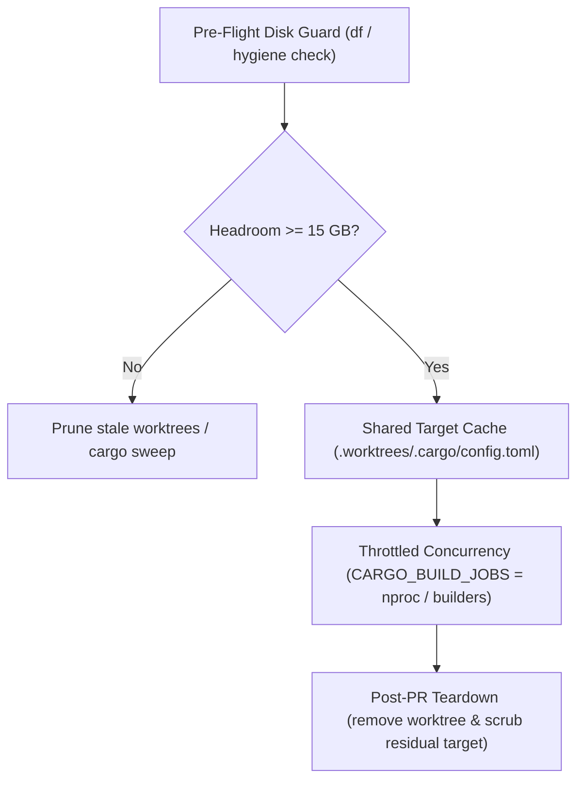

# Cargo Worktree Hygiene

## Overview

When running autonomous agents in parallel across multiple git worktrees (e.g., during Playbook 4: Fleet Batch or multi-slice pipelines), compiling Rust crates naively leads to two critical system failure modes:
1. **CPU Thrashing & Starvation**: By default, `cargo` and `rustc` saturate all available CPU threads (`nproc`). When 3 or 4 builders run tests concurrently, 24–32 compilation threads compete aggressively for 8 physical cores, causing extreme scheduling latency, WebSocket timeouts, and build slowdowns.
2. **Disk Starvation (Storage Explosion)**: A full Cargo debug build target directory frequently consumes 7–12 GB. Four independent worktrees compiling separately will consume 30–50 GB, quickly filling developer and CI disks and causing hard filesystem write failures.

`cargo-worktree-hygiene` eliminates both failure modes through four systematic practices enforced by tooling and fleet coordination.

---

## When to Use

- When dispatching 2 or more autonomous builders in parallel across git worktrees on a Rust repository.
- When working on machines or VMs with constrained storage (less than 30 GB free headroom).
- When configuring worktree provisioning in lead coordination scripts (`worktree.ts`).
- When diagnosing slow multi-agent compilation or unexpected test timeouts.

---

## Workflow: The 4 Hygiene Pillars



### 1. Pre-Flight Disk Guard
Before spawning fleet builders or creating new worktrees, check filesystem headroom:
- **CLI Inspection**: Run `bun scripts/worktree.ts hygiene` to see active worktrees, available disk space, and cargo pool configuration.
- **Critical Floor (5 GB)**: Never allow builders to proceed if available disk space is under 5 GB. `worktree create` will halt with an error unless overridden.
- **Warning Margin (15 GB)**: If disk space is under 15 GB, trigger maintenance:
  - Sweep old build artifacts: `cargo sweep -t 3d` (or `cargo sweep -i` for installed binaries).
  - Prune merged worktrees: `bun scripts/worktree.ts remove <branch> -d`.

### 2. Automatic Target Sharing via Worktree Pool
Never allow each worktree to compile into an isolated `target/` directory:
- Worktrees should live in a unified sibling pool (e.g., `<repoRoot>/.worktrees/<branch>`).
- The worktree pool root contains `.worktrees/.cargo/config.toml`:
  ```toml
  [build]
  target-dir = "/path/to/repo/target"
  jobs = 4
  ```
- **How it works**: Cargo automatically traverses parent directories searching for `.cargo/config.toml`. Placing this file in `.worktrees/` ensures every worktree created inside it automatically routes all compilation artifacts to the shared repository target cache without modifying any tracked files in the branch.
- **Dependency Reuse**: When multiple slices build against the same dependency tree, intermediate `.rlib` and `proc-macro` crates are compiled once and shared across all worktrees.

### 3. Concurrency Throttling (`CARGO_BUILD_JOBS`)
Calculate CPU core budgets before dispatching parallel builders:
- **Formula**:
  $$\text{CARGO\_BUILD\_JOBS} = \max\left(1, \left\lfloor \frac{\text{nproc}}{\text{active\_builders}} \right\rfloor\right)$$
- **Helper**: Use `bun scripts/worktree.ts env <active_builders>` to generate exact shell export commands.
  - Example (8 physical cores, 2 active builders):
    `export CARGO_BUILD_JOBS=4`
  - Example (8 physical cores, 4 active builders):
    `export CARGO_BUILD_JOBS=2`
- Pass `CARGO_BUILD_JOBS` explicitly in the builder dispatch prompt or environment.
- When running integration tests that bind TCP/WebSocket ports or shared hardware mocks, enforce serialized test execution: `cargo test -- --test-threads=1`.

### 4. Post-PR Cleanup & Scrubbing
- When a PR is approved and merged, immediately remove the worktree:
  `bun scripts/worktree.ts remove <branch> -d`
- If an agent created a local `target/` directory (bypassing the pool config), `worktree.ts remove` automatically purges `<worktree>/target` before git pruning to prevent disk bloat.
