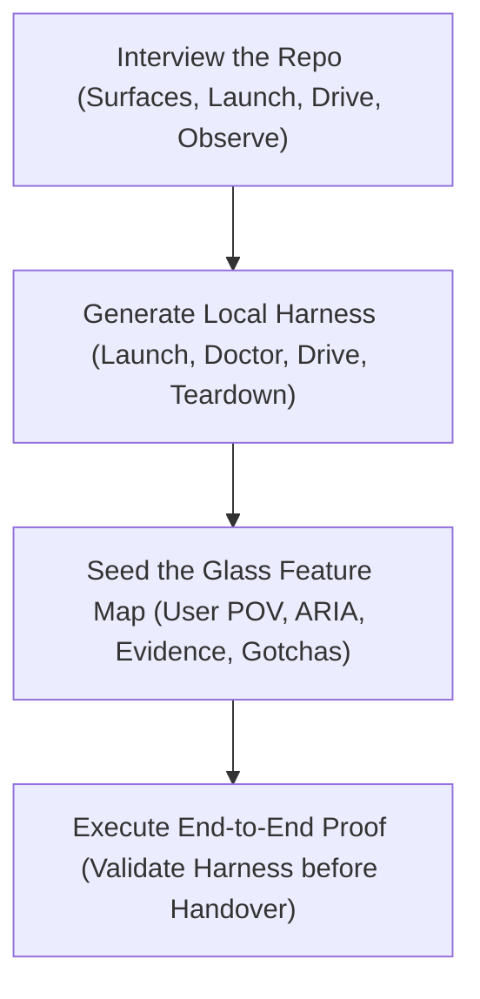

# Create Verification Harness

## Overview

Autonomous agents frequently suffer from the "blind coder" anti-pattern: they edit source files, run unit tests with synthetic mocks, observe green test runners, and declare victory—while the real application in a browser or terminal is visually clipped, failing to mount, or stuck in an infinite state loop.

`create-verification-harness` bridges this gap by establishing an automated **Glass Feature Map**:
1. **The Glass (Runtime Eyes)**: A programmatic driver (Playwright / Chrome DevTools Protocol, PTY terminal harness, or live HTTP client) that gives agents "eyes" into the live application to click, inspect ARIA accessibility trees, capture screenshots, and trace network/IPC telemetry.
2. **The Feature Map (Agent GPS)**: A maintained, user-centric map of the application surface that tells agents how to navigate to every screen, how to drive features, and what observable state constitutes proof of success.

---

## When to Use

- When onboarding or initializing a repository that lacks an automated way for agents to drive and prove UI, CLI, or service behavior.
- When an application's unit tests rely on heavy synthetic mocks that diverge from real browser/terminal runtime behavior.
- When establishing the verification boundary for a web HMI, Electron app, CLI tool, or background daemon.

## When NOT to Use

- For static unit test authoring (use TDD or unit test practices).
- For pure mathematical libraries with no external I/O, user interface, or runtime daemon surface.

---

## The 4-Step Harness Workflow

### Step 1: Interview the Repo, Not the Human
Discover the project's runtime mechanics from code, configs, and package manifests rather than asking open-ended questions:
- **Surface**: What does the operator touch? (Web HMI, CLI/TUI, REST/WebSocket API, Electron desktop).
- **Run**: What exact command starts the app locally? (e.g., `npm start`, `cargo run`, dev server with mock ports). Note environment variables and test credentials.
- **Drive**: How can an agent interact programmatically? (Existing Playwright/Cypress configs, headless Chromium debug ports `--remote-debugging-port`, PTY helpers).
- **Observe**: What hard evidence can be captured? (Screenshots, ARIA tree snapshots, terminal transcripts, WebSocket frames, DB records).
- **Isolate**: Can two instances run concurrently without port collisions or data directory corruption?

### Step 2: Generate the Verification Harness
Create the project-local harness script or configuration (e.g., `hmi/tests/hmi-fixture.ts` or `scripts/verify-app.js`) with:
- **Launch & Teardown**: Clean startup with readiness polling (port answering, log marker) and reliable process termination.
- **Doctor Check**: A fast read-only sanity check confirming the instance is healthy and owned by the harness before driving.
- **Harness Drive API**: Standardized primitives using stable accessible handles (ARIA roles, accessible names) rather than fragile CSS selectors or coordinate clicks.
- **Evidence Storage**: Configured artifact directory (e.g., `target/verification/artifacts/<feature-id>/`). Proof artifacts must survive test teardown.

### Step 3: Seed the Glass Feature Map
Create the feature map directory (`docs/ui/feature-map/` or `.agents/skills/verify-<app>/features/`) containing an `index/README.md` and one recipe per core user journey.

Every feature file MUST adhere to the **4-part entry contract**:
1. `## Sub-features`: Short alphanumeric IDs and one-line descriptions for each testable capability.
2. `## How to get to it (user POV)`: Exact navigation steps, button clicks, URLs, or hotkeys from the user's perspective.
3. `## Driving it with <harness>`: Step-by-step recipe pairing each user action with an exact harness command and the observable proof.
4. `## Gotchas`: Known race conditions, async debounce delays, disabled button states, and layout edge cases.

### Step 4: Prove the Harness End-to-End
Run the newly created harness against at least one mapped feature from start to finish:
1. Launch the application.
2. Execute the Doctor check.
3. Drive the mapped feature using the harness.
4. Capture visual screenshot and ARIA snapshot.
5. Clean up instances.
6. Verify that proof artifacts exist on disk and were not deleted by cleanup.

---

## Evidence Standards

A feature is verified only when supported by hard runtime evidence:
- **UI Proof**: ARIA tree snapshot (`snapshot --aria`) plus visual screenshot (`.png`) showing component state.
- **CLI Proof**: Exact command, exit code, stdout, and stderr.
- **State Proof**: Verification of side-effects (files written, database records updated, WebSocket JSON-RPC frames dispatched). Mocks are permitted only where production architectural boundaries already isolate external systems.
