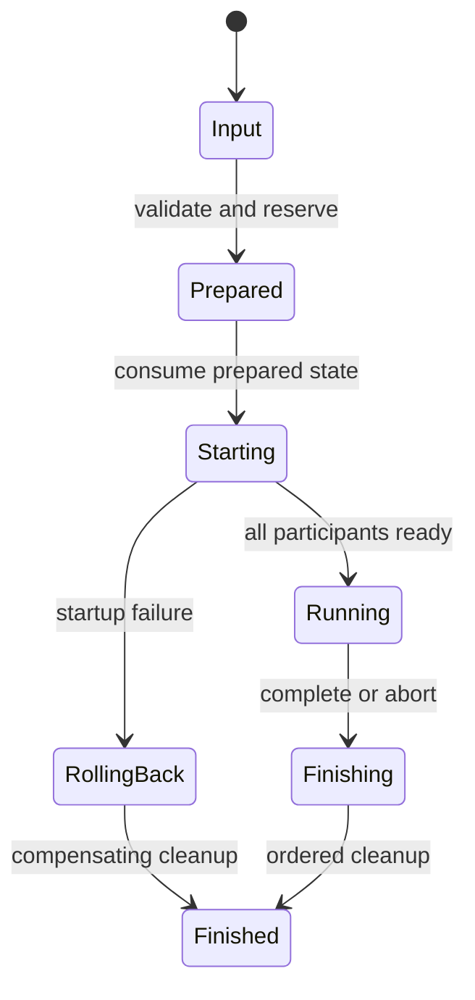

# Rust Lifecycle Design: [Scope]

## At a Glance

[State the consequential lifecycle design, strongest guarantee, and main
residual risk before implementation detail.]

## Design Context and Responsibility Inputs

- System boundary: [system under discussion and external participants]
- Representative vertical scenario: [initiating actor, system operation, and observable outcome]
- Verification oracle: [integration or end-to-end evidence that must remain]
- Compatibility obligations: [preserved behavior]

| Native responsibility | Selected owner | Lifecycle consequence |
|---|---|---|
| [prepare, coordinate, supervise, release, or report] | [module, type, function, task, handle, adapter, or composition root] | [owned capability or transition] |

## Design Forces

- [Approved behavior or compatibility obligation]
- [Resource, failure, concurrency, or performance pressure]
- [Repository fact or demonstrated source of variation]

## Ownership and Capability Model

| Resource or capability | Created by | Owner while prepared | Transfer | Owner while running | Explicit release | `Drop` fallback |
|---|---|---|---|---|---|---|
| [resource] | [operation] | [type] | [consuming operation] | [type] | [operation] | [bounded behavior] |

## Lifecycle States



[Explain whether consuming methods, a private enum, separate state types, or
typestate represents these states and why.]

## Preparation and Startup

1. [Validate complete input.]
2. [Acquire or reserve every required capability.]
3. [Cross the externally visible commit boundary.]
4. [Start participants and establish readiness.]

## Failure, Rollback, and Cancellation

| Failure or cancellation point | Resources acquired or started | Required compensation | Primary result | Cleanup evidence |
|---|---|---|---|---|
| [point] | [items] | [ordered actions] | [preserved result] | [report or observation] |

## Cleanup Ordering

[State normal completion, abort, startup rollback, cancellation, and emergency
`Drop` behavior.]

## Rust Type and API Sketch

```rust
// Proposed API shape; not an as-built declaration.
pub struct PreparedRun {
    // Owned reservations and prepared resources.
}

pub struct ValidationRun {
    // Running handles and cleanup obligations.
}

impl PreparedRun {
    pub async fn start(self) -> Result<ValidationRun, StartError>;
}

impl ValidationRun {
    pub async fn complete(self, outcome: Outcome) -> CompletionReport;
    pub async fn abort(self, reason: AbortReason) -> AbortReport;
}
```

## Concurrency Model

| Participant | Supervising owner | Communication or shared state | Readiness | Cancellation | Join or reap |
|---|---|---|---|---|---|
| [participant] | [owner] | [mechanism] | [proof] | [policy] | [operation] |

## Error Model

[Describe boundary-specific error types, source preservation, redaction, and
the relationship between primary and cleanup failures.]

## Invariants

- [One owner exists for every resource at every lifecycle point.]
- [No externally visible participant starts before preparation succeeds.]
- [A terminal operation cannot execute twice.]

## Verification Obligations

- Focused lifecycle: [invalid input, transitions, cancellation, and cleanup]
- Integration: [collaboration and readiness across owned participants]
- End-to-end: [representative vertical scenario and observable outcome]
- Human-owned: [system, hardware, privileged, or unavailable validation]
- Compatibility: [preserved behavior and secret-safe reporting]

## Completion Boundary

- Result: [parent outcome closed / enabling result / deferred]
- Evidence: [what this lifecycle proves]
- Remaining vertical gap: [none, or the scenario still needed]

## Deferred Abstractions

| Candidate | Why deferred | Trigger to reconsider |
|---|---|---|
| [trait/type/module] | [current evidence] | [concrete variation or pressure] |

## Traceability

- [Requirement, scenario, contract, responsibility decision, repository symbol,
  test, or decision record]
